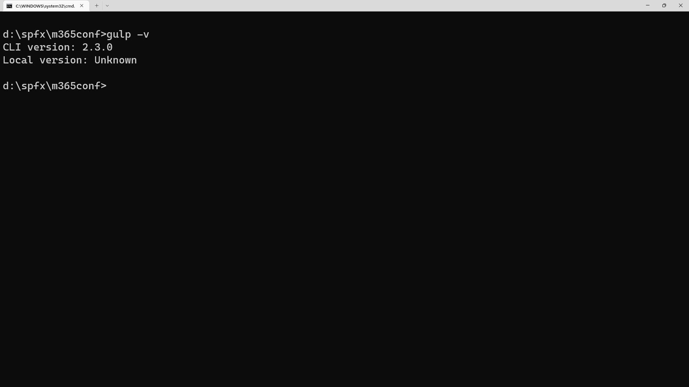
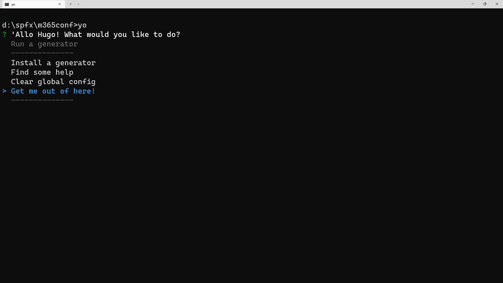
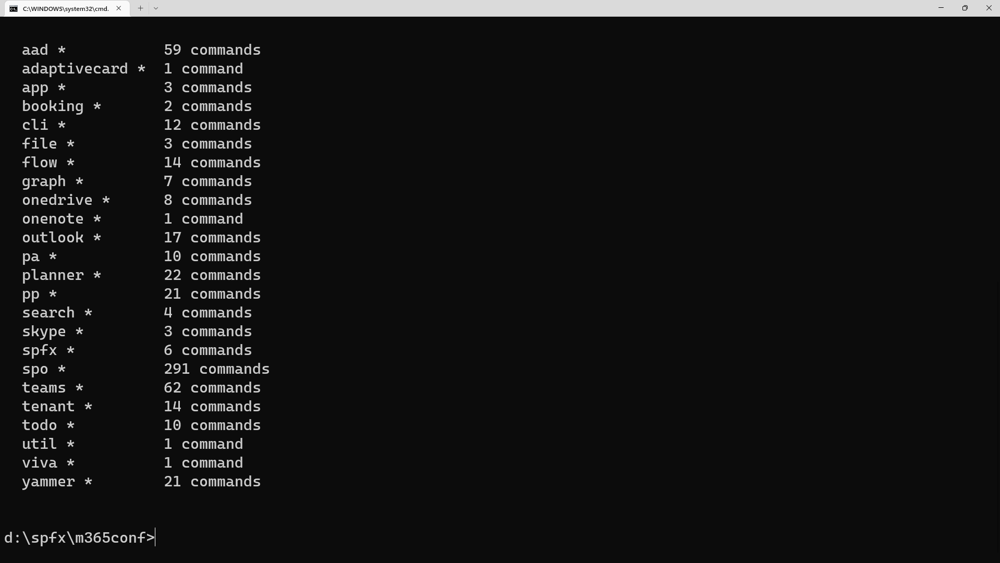

# Lab 1: Getting Your Environment Ready (M365 Conference)

## Exercise 1: Configure Windows workstation for development purpose

This step will configure your workstation as a development workstation by configuring the least privileges required to be able to work well with SPFx development.

1. From your Windows desktop, use the **Start menu** and search for `Use developer features`
1. On the **Privacy & Security > For developers** page, under **Developer Mode**, look for **Install apps from any source, including loose files**
1. If the setting is not already **on**, toggle the setting to **on**
1. Scroll to the **PowerShell** section
1. Under **Change execution policy to allow local PowerShell scripts to run without signing...**, select **Apply**.
   

## Exercise 2: Install Node.js

1. Using your browser, go to https://nodejs.org/dist/latest-v16.x/
1. Pick and download the latest version of Node in that page which is compatible with your workstation. For Windows, make sure to use the **.msi** version - This is most likely going to be **node-v16.18.1-x64.msi**. On Mac, use the **.pkg** version - This is most likely going to be **node-v16.18.1.pkg**.
1. Install using all the default options

## Exercise 3:  Install Gulp

[Gulp](https://gulpjs.com) is a JavaScript-based task runner used to automate repetitive tasks. The SharePoint Framework build toolchain uses Gulp tasks to build projects, create JavaScript bundles, and the resulting packages used to deploy solutions.

1. Enter the following command to install the Gulp CLI: `npm install gulp-cli -g`, followed by <kbd>Enter</kbd>.
> Note: Mac users should use the `sudo` prefix if encountering an `EACCES` error. I.e.: `sudo npm install gulp-cli -g``
2. This will take a little bit of time. Now is a good time to stretch your legs.
3. Once completed, you can verify that Gulp is installed by entering `gulp -v`, followed by <kbd>Enter</kbd>. It should display:

   ```console
    CLI version: 2.3.0
    Local version: Unknown
    ```

    

> Note: You may not see a `Local version` if you're not currently in a project folder. That's OK!


## Exercise 4: Install Yeoman

[Yeoman](https://yeoman.io/) helps you kick-start new projects, and prescribes best practices and tools to help you stay productive. SharePoint client-side development tools include a Yeoman generator for creating new web parts. The generator provides common build tools, common boilerplate code, and a common playground website to host web parts for testing.

1. From the command prompt, enter the following command to install Yeoman: `npm install yo -g`, followed by <kbd>Enter</kbd>.
1. To verify your installation, type `yo`, followed by <kbd>Enter</kbd>.
1. If you see **Allo! What would you like to do?**, use your arrow keys to select **Get me out of here!** and hit <kbd>Enter</kbd>.
   

## Exercise 5: Install Yeoman SharePoint generator

The Yeoman SharePoint web part generator helps you quickly create a SharePoint client-side solution project with the right toolchain and project structure.

To install the SharePoint Framework Yeoman generator globally:

1. From the command prompt, enter the following command: `npm install @microsoft/generator-sharepoint@1.15.2 -g`, followed by <kbd>Enter</kbd>.

2. A bazillion years later, when the installation is complete, enter `yo`, followed by <kbd>Enter</kbd>.
3. When prompted **Allo! What would you like to do?**, verify that **@microsoft/sharepoint** is listed under **Run a generator**.
     
4. Using your arrow keys, select **Get me out of here!**. We still have a few things to install to make sure you have all the best SPFx development tools at your disposal.

## Exercise 6: Install TypeScript

> Not needed for SPFx development, but used for this lab.

1. From the command prompt, enter the following command: `npm install -g typescript`, followed by <kbd>Enter</kbd>.
1. Don't panic, the installation is very quick. You might even believe that there was an error, but if you see **Updated 1 package in x.xxxs**, you were successful.
1. When the installation is complete, enter `tsc --version`, followed by <kbd>Enter</kbd>. You should see **Version 4.9.3**.
     

## Exercise 8: Install CLI for Microsoft 365

1. From the command prompt, enter the following command: `npm i -g @pnp/cli-microsoft365`, followed by <kbd>Enter</kbd>.
1. When the installation is complete, enter `m365`, followed by <kbd>Enter</kbd>.
1. If it doesn't scream at you, you are good!
     

## Exercise 9: Install essential Visual Studio Code extensions

1. Launch **Visual Studio Code**.
1. Open the **Extensions** activity bar (or by hitting <kbd>CTRL</kbd>+<kbd>SHIFT</kbd>+<kbd>X</kbd>)
1. From the search box, type `SPFx Essentials` and wait for search results to appear.
1. From the list of search results, select **SPFx Essentials** by **Elio Struyf**.
1. From the **SPFx Essentials** page, select **Install**.
     
2. Repeat the steps 3-5 with the following extensions:
    1. **GitHub Repositories**
    2. **Live Server**
    3. **Live Share**
    4. **GitHub Copilot**
    5. Extra credits: **Sharing is Caring**

## Exercise 10: Experiment with TypeScript

Let's start with a simple Hello World Node.js example. Create a new folder `hellotypescript` and launch **VS Code**.

1. From the command prompt, choose a folder where you want to place your exercise files by entering `cd c:\yourfolder` (where `yourfolder` is the path for your lab files)
1. Enter the following commands, with <kbd>Enter</kbd> after every line.

    ```bash
    mkdir HelloTypeScript
    cd HelloTypeScript
    code .
    ```

1. This will launch **Visual Studio Code**
1. From the **File Explorer** in Visual Studio Code, create a new file called **hellotypescript.ts**.
     
1. Add the following TypeScript code. You'll notice the TypeScript keyword `let` and the `string` type declaration.

    ```typescript
    let message : string = "Hello TypeScript";
    console.log(message);
    ```

1. To compile your TypeScript code, you can open the Integrated Terminal in Visual Studio Code by selecting <kbd>CTRL</kbd>+<kbd>SHIFT</kbd>+<kbd>\`</kbd> and typing `tsc hellotypescript.ts`.
     
2. This will compile and create a new `hellotypescript.js` JavaScript file.
3. Type `node hellotypescript.js` to run your newly created file.
4. If you open `hellotypescript.js`, you'll see that it doesn't look very different from `hellotypescript.ts`. The type information has been removed and `let` is now `var`.

    ```javascript
    var message = "Hello TypeScript";
    console.log(message);
    ```
      

## Exercise 12: Understand tsconfig.json

So far in this tutorial, you have been relying on the TypeScript compiler's default behavior to compile your TypeScript source code. You can modify the TypeScript compiler options by adding a `tsconfig.json` file that defines the TypeScript [project settings](https://www.typescriptlang.org/docs/handbook/tsconfig-json.html) such as the [compiler options](https://www.typescriptlang.org/docs/handbook/compiler-options.html) and the files that should be included.

**Important**: To use `tsconfig.json` for the rest of this tutorial, invoke `tsc` without input files. The TypeScript compiler knows to look at your `tsconfig.json` for project settings and compiler options.

1. From within VS Code, add a new file (using **File** > **New file...***) called `tsconfig.json` which set the options to compile to ES5 and use **CommonJS** [modules](http://www.commonjs.org/specs/modules/1.0).

    ```json
    {
        "compilerOptions": {
            "target": "es5",
            "module": "commonjs"
        }
    }
    ```

1. When editing `tsconfig.json`, IntelliSense (`kb(editor.action.triggerSuggest)`) will help you along the way.
1. By default, TypeScript includes all the `.ts` files in the current folder and sub-folders if the `files` attribute isn't included, so we don't need to list `hellotypescript.ts` explicitly.
     

## Exercise 12: Change the build output

Having the generated JavaScript file in the same folder as the TypeScript source will quickly get cluttered on larger projects, so you can specify a different output directory.

1. In `tsconfig.json`, change the output directory for the compiler using the `outDir` attribute.

    ```json
    {
        "compilerOptions": {
            "target": "es5",
            "module": "commonjs",
            "outDir": "out"
        }
    }
    ```

1. Delete `hellotypescript.js` and run the command `tsc` with no options. You will see that `hellotypescript.js` is now placed in the `out` directory.
     

## Exercise 13: Error checking

TypeScript helps you avoid common programming mistakes through strong type-checking.

1. In the `hellotypescript.ts`, change this line:

    ```typescript
    let message : string = "Hello World";
    ```

    to this:
    
    ```typescript
    let message : string = 17;
    ```

2. The TypeScript compiler will complain with **'error TS2322: Type 'number' is not assignable to type 'string'**.  You can see type checking errors in VS Code both in the editor (red squiggles with hover information) and the Problems panel (<kbd>CTRL</kbd>+<kbd>SHIFT</kbd>+<kbd>M</kbd>). The `[ts]` prefix lets you know this error is coming from the TypeScript language service.
     
3. Undo your changes. We'll have plenty of opportunities to create real bugs later.


## Exercise 14: Create your own Dev Tenant

Go to <http://aka.ms/m365devprogram> and follow the steps to create your own tenant. Use a name for yourself -- not your company name. For example, I used **Tahoe Ninja**, not **Microsoft**.

  

Follow the steps to create your tenant. We'll use the tenant in later labs.

In our next lab, we'll apply everything we've done so far to create a web part.
