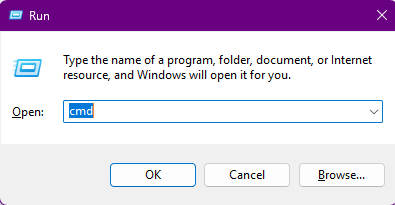
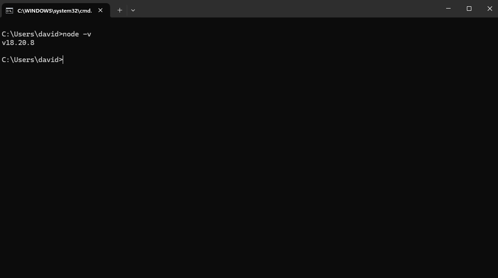
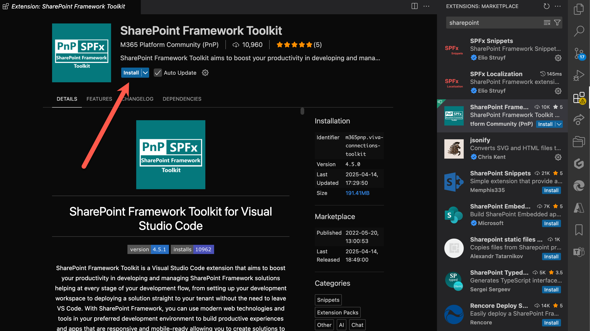

# Lab 1: Getting Your Environment Ready

Welcome to your first lab! This lab is all about getting your **development environment** ready, adding some **extra tools** that will make your life easier, briefly introducing key **TypeScript** concepts, connecting to a **tenant**, and configuring your **browser** to keep things organized.

> :bulb: Even if you already have your development environment setup, please review each step as there are some extra items specific to the rest of the labs!

<details>
<summary><b>Legend</b></summary>

|Icon|Meaning|
|---|---|
|:rocket:|Exercise|
|:apple:|Mac specific instructions|
|:shield:|Admin mode required|
|:bulb:|Hot tip!|
|:hedgehog:|Code catch-up|
|:warning:|Caution!|
|:books:|Resources|

</details>

<details>
<summary><b>Exercises</b></summary>

  1. [Configure your Windows workstation for development](#rocket-exercise-1-configure-your-windows-workstation-for-development)
  1. [Insall Node Version Switcher (Optional)](#rocket-exercise-2a-optional-install-node-version-switcher)
  1. [Install Node.js](#rocket-exercise-2-install-nodejs)
  1. [Install VS Code](#rocket-exercise-3-install-vs-code)
  1. [Install the Gulp CLI](#rocket-exercise-4--install-the-gulp-cli)
  1. [Install Yeoman](#rocket-exercise-5-install-yeoman)
  1. [Install Yeoman SharePoint Generator](#rocket-exercise-6-install-yeoman-sharepoint-generator)
  1. [Install TypeScript](#rocket-exercise-7-install-typescript)
  1. [Install CLI for Microsoft 365](#rocket-exercise-8-install-cli-for-microsoft-365-optional)
  1. [Install Essential Visual Studio Code extensions](#rocket-exercise-9-install-essential-visual-studio-code-extensions)
  1. [Create your own Dev tenant](#rocket-exercise-10-create-your-own-dev-tenant)
  1. [Using browser profiles](#rocket-exercise-11-using-browser-profiles)

</details>

## :rocket: Exercise 1: Configure your Windows workstation for development

This step will configure a **Windows** workstation as a development workstation by configuring the least privileges required to be able to work well with SPFx development.

> The instructions assume the use of a Windows machine. However, this is **not required** for SPFx development. You can [skip](#rocket-exercise-2-install-nodejs) this excercise if using a Mac :apple:. In later exercises, steps for Mac users are called out when they differ.

1. From your Windows machine, use the **Start menu** and search for **Use developer features**
1. On the **Privacy & Security > For developers** page, under **Developer Mode**, look for **Install apps from any source, including loose files**:

    

1. :shield: If the setting is not already **on**, toggle the setting to **on**. If prompted, choose **Yes** in the confirmation dialog:

    

1. Scroll to the **PowerShell** section
1. :shield: Under **Change execution policy to allow local PowerShell scripts to run without signing...**, select **Apply**:

    

#### :books: Resources

- [Enable your device for development](https://learn.microsoft.com/windows/apps/get-started/enable-your-device-for-development)
- [PowerShell execution policies](https://learn.microsoft.com/powershell/module/microsoft.powershell.core/about/about_execution_policies)

## :rocket: Exercise 1a (optional): Install Node Version Switcher

Note: While we recommend using NVS, if you prefer to install Node directly without the ability to switch between versions of Node, skip to [Exercise 2: Install Node.js](#rocket-exercise-2-install-nodejs)

:: Windows Installation

1. Download the [NVS Windows Installer](https://github.com/jasongin/nvs/releases/download/v1.7.1/nvs-1.7.1.msi).
1. Install NVS by double clicking on the downloaded installer.
1. Open the Command Prompt with the keyboard shortcut Ctrl-R and type "cmd" in the textbox and select the "OK" button.
    
    

1. In the Command Prompt Dialog type the follwing to install Node Version 18:
   
   ```console
    nvs add 18
    ```

1. In the Command Prompt Dialog type the following to use Node Version 18:
   
   ```console
    nvs use 18
    ```

1. In the Command Prompt Dialog type the following to confirm what version of Node is currently installed:
   
   ```console
    node -v
    ```

If installed successfully you should see the following in your command prompt:


#### :books: Resources
> [NVS Homepage](https://github.com/jasongin/nvs)

> :bulb: Command Console Prompt to see all versions of Node installed and available to NVS:
    ```
    nvs ls
    ```

## :rocket: Exercise 2: Install Node.js

Node.js provides a runtime environment to execute JavaScript outside a browser and lets us use tools like Gulp, Yeoman, and npm - which are all needed to scaffold, develop, and build SPFx projects.

Node.js maintains two different releases at all times: LTS & Current version. SPFx is only supported on **LTS (Long Term Support) versions**. The specific version to use [depends on the version of SPFx you're using](https://learn.microsoft.com/en-us/sharepoint/dev/spfx/compatibility#spfx-development-environment-compatibility). We are targeting [**SPFx 1.20.0**](https://learn.microsoft.com/en-us/sharepoint/dev/spfx/release-1.21) which uses [**LTS Node.js v18**](https://nodejs.org/dist/latest-v18.x/).

> :bulb: Admin privileges are required to install Node.js directly using the .msi. You can get around this by using [Node Version Switcher (NVS)](https://github.com/jasongin/nvs?tab=readme-ov-file#nvs-node-version-switcher). Once installed, you can open a command prompt and enter `nvs` and it will ask you to choose a version of Node.js and will get it setup to be used locally (choose the latest).

1. Using your browser, go to <https://nodejs.org/dist/latest-v18.x/>
1. Pick and download the latest version of Node in that page (highest number) which is compatible with your workstation. For Windows, use the correct **.msi** version and on Mac :apple:, use the **.pkg** version:

    

1. :shield: Install using all the default options. When asked about tools for Native Modules you can leave this unchecked (not needed for SPFx development)

> :bulb: The use of a Node version manager is highly recommended but beyond the scope of these labs. You're welcome to follow the instructions to get these configured and using the latest version of LTS Node.js v18 using some of the links below but it is an advanced configuration and NOT required.

#### :books: Resources

- [SPFx Node.js instructions](https://learn.microsoft.com/en-us/sharepoint/dev/spfx/set-up-your-development-environment#install-nodejs)
- [SPFx development environment compatibility](https://learn.microsoft.com/en-us/sharepoint/dev/spfx/compatibility#spfx-development-environment-compatibility)
- :bulb: [Node Version Switcher (NVS)](https://github.com/jasongin/nvs)
- :apple: [Node Version Manager (for Linux/Mac)](https://github.com/nvm-sh/nvm)
- :shield: [NVM for Windows](https://github.com/coreybutler/nvm-windows)

## :rocket: Exercise 2a (optional): Install Node Version Switcher

## :rocket: Exercise 3: Install VS Code

You can technically use any code editor or IDE that supports client-side development and if you've already got one you prefer, you're welcome to use it. However, we'll be using [Visual Studio Code](https://code.visualstudio.com/) and we highly recommend it.

> Even if you plan to use a different editor, we suggest using VS Code for these labs to make it easier to follow along and to take advantage of optional extensions we'll reference

1. Go to <https://code.visualstudio.com> and using the big button download the installer (use the arrow to choose a specific version for Mac or Linux)
1. Install using all the default options

#### :books: Resources

- [SPFx code editor instructions](https://learn.microsoft.com/en-us/sharepoint/dev/spfx/set-up-your-development-environment#install-a-code-editor)
- [Getting started with VS Code](https://code.visualstudio.com/docs/)

## :rocket: Exercise 4:  Install the Gulp CLI

[Gulp](https://gulpjs.com) is a JavaScript-based task runner used to automate repetitive tasks. The SharePoint Framework build toolchain uses Gulp tasks to build projects, create JavaScript bundles, and the resulting packages used to deploy solutions.

1. From a command prompt, enter the following command to install the Gulp CLI: `npm install gulp-cli -g`, followed by <kbd>Enter</kbd>.
    > Note: :apple: Mac users should use the `sudo` prefix if encountering an `EACCES` error. I.e.: `sudo npm install gulp-cli -g`
1. This might take a little bit of time. Now is a good time to stretch your legs. Feel free to stand up and dance!
1. Once completed, you can verify that Gulp is installed by entering `gulp -v`, followed by <kbd>Enter</kbd>. It should display:

   ```console
    CLI version: 3.0.0
    Local version: Unknown
    ```

    

> Note: You may not see a `Local version` if you're not currently in a project folder (we installed globally by using `-g`). That's OK!

> :bulb: npm stands for Node Package Manager and it was installed as part of Node.js. npm is used to manage and install libraries, frameworks, and tools (like Gulp). You will use it relatively often so it's a good tool to get comfortable with!

#### :books: Resources

- [SPFx Gulp instructions](https://learn.microsoft.com/en-us/sharepoint/dev/spfx/set-up-your-development-environment#install-gulp)
- [NPM Install](https://docs.npmjs.com/cli/v9/commands/npm-install)

## :rocket: Exercise 5: Install Yeoman

[Yeoman](https://yeoman.io/) helps you kick-start new projects, and prescribes best practices and tools to help you stay productive. We will use this for project scaffolding.

1. From the command prompt, enter the following command to install Yeoman: `npm install yo -g`, followed by <kbd>Enter</kbd>.
1. Do another dance!
1. To verify the installation, type `yo`, followed by <kbd>Enter</kbd>.
1. If you see **Allo! What would you like to do?**, use your arrow keys to select **Get me out of here!** and hit <kbd>Enter</kbd>.
   

#### :books: Resources

- [SPFx Yeoman instructions](https://learn.microsoft.com/sharepoint/dev/spfx/set-up-your-development-environment#install-yeoman)
- [NPM Install](https://docs.npmjs.com/cli/v9/commands/npm-install)

## :rocket: Exercise 6: Install Yeoman SharePoint generator

The Yeoman SharePoint generator helps you quickly create a SharePoint client-side solution project with the right toolchain and project structure. The generator provides common build tools and common boilerplate code (starter project).

1. From the command prompt, enter the following command: `npm install @microsoft/generator-sharepoint@1.20.0 -g`, followed by <kbd>Enter</kbd>.

   > :bulb: We are specifying an exact version of the generator by tacking `@1.20.0` to the end of the package name.
   >
   > :warning: If the latest version of SPFx has a minor version of 0, unless you specifically need something that was added in that version, use the one before it. In this case, the latest version is 1.21.0 released in April (see that zero, that's evil) which is, unfortunately, providing a perfect case-in-point for this tip as it is broken and a version 1.21.1 is imminent.

2. A bazillion years later, when the installation is complete and your latest dance finished, enter `yo`, followed by <kbd>Enter</kbd>.
3. When prompted **Allo! What would you like to do?**, verify that **@microsoft/sharepoint** is listed under **Run a generator**.
   

   > :bulb: In the screenshot above you can see the command `npm info @microsoft/generator-sharepoint` which shows details about the latest version of a given package. You can also add any npm package name to the end of https://www.npmjs.org/ (including the slashes) and you can see more details online. For instance, you can see the registry page for the generator here: [https://www.npmjs.org/@microsoft/generator-sharepoint]

4. Using your arrow keys, select **Get me out of here!**. We still have a few things to install to make sure you have all the best SPFx development tools at your disposal.

#### :books: Resources

- [SPFx Yeoman Generator instructions](https://learn.microsoft.com/sharepoint/dev/spfx/set-up-your-development-environment#install-yeoman-sharepoint-generator)
- [Yeoman generator for the SharePoint Framework](https://learn.microsoft.com/sharepoint/dev/spfx/yeoman-generator-for-spfx-intro)

## :rocket: Exercise 7: Install TypeScript

[TypeScript](https://www.typescriptlang.org/) is a strongly typed programming language that builds on JavaScript and is what SPFx uses.

> You don't typically need to install Typescript as an independent installation for SPFx development, but we will be using it in later steps to demonstrate how SPFx code (written in TypeScript) becomes JavaScript

1. From the command prompt, enter the following command: `npm install typescript -g`, followed by <kbd>Enter</kbd>.
1. Don't panic, the installation is very quick!
1. When the installation is complete, enter `tsc --version`, followed by <kbd>Enter</kbd>. You should see the version number listed.

   

#### :books: Resources

- [TypeScript Documentation](https://www.typescriptlang.org/docs/)
- [TypeScript Cheat Sheets](https://www.typescriptlang.org/cheatsheets)

## :rocket: Exercise 8: Install CLI for Microsoft 365 (Optional)

The [CLI for Microsoft 365](https://pnp.github.io/cli-microsoft365) is a command line interface for managing your Microsoft 365 tenant and SharePoint Framework projects on any platform.

1. From the command prompt, enter the following command: `npm install @pnp/cli-microsoft365 -g`, followed by <kbd>Enter</kbd>.
1. When the installation is complete, enter `m365`, followed by <kbd>Enter</kbd>.
1. If it doesn't scream at you, you are good!
   

> Wowee, that's a lotta command groups beyond spfx! Turns out this CLI thing is super powerful in all sorts of ways. We won't be touching on it much in these labs, but we highly recommend getting familiar with what it can do!

#### :books: Resources

- [Getting started with CLI for Microsoft 365](https://pnp.github.io/cli-microsoft365/#getting-started)
- [NPM Install](https://docs.npmjs.com/cli/v9/commands/npm-install)

## :rocket: Exercise 9: Install essential Visual Studio Code extensions

Visual Studio Code extensions are plugins for VS Code that provide extra functionality. None of these are required, but will certainly make your life easier!

1. Launch **Visual Studio Code**.
1. Open the **Extensions** panel from the activity bar (or by hitting <kbd>CTRL</kbd>+<kbd>SHIFT</kbd>+<kbd>X</kbd>)
1. From the search box, type `SharePoint Framework` and wait for search results to appear.
1. From the list of search results, select [SharePoint Framework Toolkit](https://marketplace.visualstudio.com/items?itemName=m365pnp.viva-connections-toolkit).
1. From the **SharePoint Framework Toolkit** page, select **Install**.
    
1. Repeat steps 3-5 with the following extensions:
    - [**SPFx Essentials**](https://marketplace.visualstudio.com/items?itemName=eliostruyf.spfx-essentials)
    - [**GitHub Repositories**](https://marketplace.visualstudio.com/items?itemName=GitHub.remotehub)
    - [**Live Server**](https://marketplace.visualstudio.com/items?itemName=ritwickdey.LiveServer)
    - [**Live Share**](https://marketplace.visualstudio.com/items?itemName=MS-vsliveshare.vsliveshare)
    - [**Peacock**](https://marketplace.visualstudio.com/items?itemName=johnpapa.vscode-peacock)
    - [**GitHub Copilot**](https://marketplace.visualstudio.com/items?itemName=GitHub.copilot) - Subscription required! Feel free to skip.
    - [**vscode-pets**](https://marketplace.visualstudio.com/items/?itemName=tonybaloney.vscode-pets)
    - Extra credit: [**Sharing is Caring**](https://marketplace.visualstudio.com/items?itemName=PnP-SharingisCaring.sharing-is-caring)

#### :books: Resources

- [Extensions for Visual Studio Code](https://marketplace.visualstudio.com/VSCode)

## :rocket: Exercise 10: Create your own Dev Tenant

Working in production is generally not a good idea. Besides, you're rarely going to be a global admin in your primary tenant. This can make trying out features, creating app registrations, provisioning assets, etc. challenging or plain impossible.

Thanks to [Midnight Blizzard](https://www.microsoft.com/en-us/security/blog/tag/midnight-blizzard-nobelium/?sort-by=newest-oldest&date=any) (a large scale security incident that led to the pause of the dev program), you are not currently able to get a developer tenant for free.

If you already have a developer tenant, you can use that for these labs or you can use a company tenant (You will need permission to deploy to an app catalog). We also have a number of temporary accounts available with the required permissions if you're in the room.

[Exciting updates coming to the Microsoft 365 Developer Program - April 23, 2025](https://devblogs.microsoft.com/microsoft365dev/exciting-updates-coming-to-the-microsoft-365-developer-program/)

~~Good news! Microsoft will provide you a FREE tenant to do development work in!~~

~~If you don't already have one, Go to <http://aka.ms/m365devprogram> and follow the steps to create your own tenant. Use a name for yourself -- not your company name. For example, **Tahoe Ninja** instead of **Microsoft**.~~

  

~~Follow the steps to create your tenant. We'll use the tenant in later labs.~~

#### :books: Resources

- [Microsoft 365 Developer Program](http://aka.ms/m365devprogram)

## :rocket: Exercise 11: Using browser profiles

> :bulb: This exercise is optional, but will help dealing with authentication issues when switching between your work Microsoft 365 tenant and your dev tenant. Plus, if you don't follow these steps, we can't be friends anymore.

Browser profiles allow you to create a different instance of your browser, using different credentials, bookmarks, favorites, history, etc. This means you don't have to login repeatedly (as much) or accidentally end up logged into the wrong tenant while testing and pull out all your hair (see David and Hugo for relevant examples).

These instructions are for Microsoft Edge. You can also use **User profiles** in Chrome if you wish (instructions not provided but pretty similar)

1. Using Edge, reveal the profile menu by selecting your profile picture in the upper left corner.

   
1. Find the **Add profile** menu (it may be located under **Other profiles** )

   

1. In the **Welcome to Microsoft Edge** dialog, select **Sign in to sync data**

   

1. In the **Let's get you signed in** dialog, select **Add an account** followed by **Continue**

   

1. When prompted to **Enter email including Gmail or phone or skype**, enter the email address from your Microsoft 365 Dev tenant (**not** your work or personal email address), followed by **Sign In**

   

1. Follow the screen instructions to log in. If prompted to remember your password or keep signed in, feel free to say **Yes**. If you love things being difficult, feel free to say **No**.

1. Rename your new browser profile by using the profile menu and selecting the **Settings** icon

   

1. In the **Your profile**, select the **...** menu, followed by **Edit**

   

1. In the **Edit profile** dialog, change the profile name and select **Update**

   

1. When you need to switch between user profiles, select the profiles menu and pick the profile you just created.

**For the rest of this workshop, we will use your developer tenant profile.**

#### :books: Resources

- [Sign in and create multiple profiles in Microsoft Edge](https://support.microsoft.com/topic/sign-in-and-create-multiple-profiles-in-microsoft-edge-df94e622-2061-49ae-ad1d-6f0e43ce6435)
- [Use Chrome with multiple profiles](https://support.google.com/chrome/answer/2364824)
- [Profile Manager - Create, remove or switch Firefox profiles](https://support.mozilla.org/en-US/kb/profile-manager-create-remove-switch-firefox-profiles)

## :tada: All Done


In our next lab, we'll apply everything we've done so far to create a web part! Aw yeah!!

# [Next](../Lab02/README.md)
