# Lab 1: Getting Your Environment Ready

Welcome to your first lab! This lab is all about getting your development environment ready, adding some extra tools that will make your life easier, briefly introducing key TypeScript concepts, and setting up a tenant and your browser to keep things organized.

> Even if you already have your development environment setup, please review each step as there are some extra items specific to the rest of the labs!

<details>
<summary><b>Legend</b></summary>

|Icon|Meaning|
|---|---|
|:rocket:|Exercise|
|:apple:|Mac specific instructions|
|:shield:|Admin mode required|
|:books:|Resources|

</details>

<details>
<summary><b>Exercises</b></summary>

  1. [Configure your Windows workstation for development](#rocket-exercise-1-configure-your-windows-workstation-for-development)
  1. [Install Node.js](#rocket-exercise-2-install-nodejs)
  1. [Install VS Code](#rocket-exercise-3-install-vs-code)
  1. [Install the Gulp CLI](#rocket-exercise-4--install-the-gulp-cli)
  1. [Install Yeoman](#rocket-exercise-5-install-yeoman)
  1. [Install Yeoman SharePoint Generator](#rocket-exercise-6-install-yeoman-sharepoint-generator)
  1. [Install TypeScript](#rocket-exercise-7-install-typescript)
  1. [Install CLI for Microsoft 365](#rocket-exercise-8-install-cli-for-microsoft-365)
  1. [Install Essential Visual Studio Code extensions](#rocket-exercise-9-install-essential-visual-studio-code-extensions)
  1. [Experiments with TypeScript - Compilation](#rocket-exercise-10-experiments-with-typescript---compilation)
  1. [Experiments with TypeScript - tsconfig.json](#rocket-exercise-11-experiments-with-typescript---tsconfigjson)
  1. [Experiments with TypeScript - Error checking](#rocket-exercise-12-experiments-in-typescript---error-checking)
  1. [Create your own Dev tenant](#rocket-exercise-13-create-your-own-dev-tenant)
  1. [Using browser profiles](#rocket-exercise-14-using-browser-profiles)
</details>

## :rocket: Exercise 1: Configure your Windows workstation for development

This step will configure your workstation as a development workstation by configuring the least privileges required to be able to work well with SPFx development.

> The instructions assume the use of a Windows machine. However, this is not required for SPFx development. You can skip this excercise if using a Mac :apple:. In later exercises, steps for Mac users are called out when they differ.

1. From your Windows machine, use the **Start menu** and search for **Use developer features**
1. On the **Privacy & Security > For developers** page, under **Developer Mode**, look for **Install apps from any source, including loose files**:

    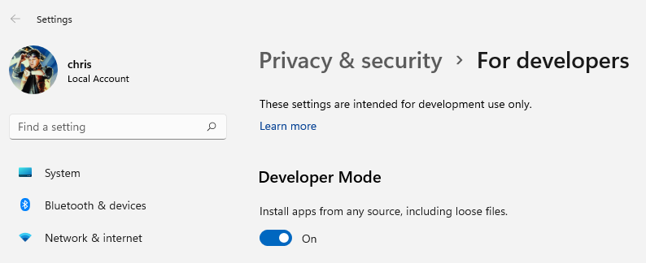

1. :shield: If the setting is not already **on**, toggle the setting to **on**. If prompted, choose **Yes** in the confirmation dialog:

    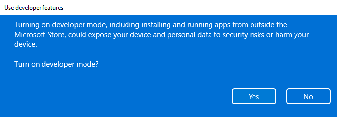

1. Scroll to the **PowerShell** section
1. :shield: Under **Change execution policy to allow local PowerShell scripts to run without signing...**, select **Apply**:

    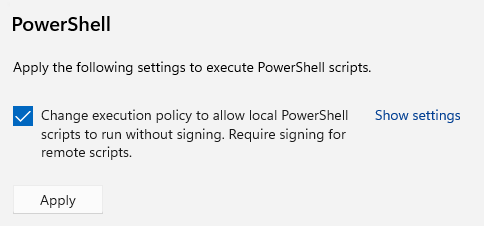

#### :books: Resources
 - [Enable your device for development](https://learn.microsoft.com/windows/apps/get-started/enable-your-device-for-development)
 - [PowerShell execution policies](https://learn.microsoft.com/powershell/module/microsoft.powershell.core/about/about_execution_policies)

## :rocket: Exercise 2: Install Node.js

> Node.js maintains two different releases at all times: LTS & Current version. SPFx is only supported on **LTS (Long Term Support) versions**. The specific version to use [depends on the version of SPFx you're using](https://learn.microsoft.com/en-us/sharepoint/dev/spfx/compatibility#spfx-development-environment-compatibility). We are targeting **SPFx 16.1** which uses **LTS Node.js v16**

> Admin privileges are required to install Node.js directly using the .msi. You can get around this by using [Node Version Switcher (NVS)](https://github.com/jasongin/nvs). Once installed, you can open a command prompt and enter `nvs` and it will ask you to choose a version of Node.js and will get it setup to be used locally.

1. Using your browser, go to https://nodejs.org/dist/latest-v16.x
1. Pick and download the latest version of Node in that page (highest number) which is compatible with your workstation. For Windows, use the correct **.msi** version and on Mac :apple:, use the **.pkg** version:

    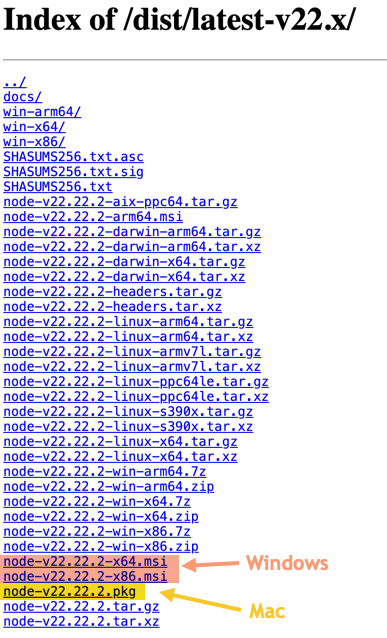

1. :shield: Install using all the default options. When asked about tools for Native Modules you can leave this unchecked (not needed for SPFx development)

> The use of a Node version manager is highly recommended but beyond the scope of these labs. You're welcome to follow the instructions to get these configured and using the latest version of LTS Node.js v16 using some of the links below but it is an advanced configuration and NOT required

#### :books: Resources
- [SPFx Node.js instructions](https://learn.microsoft.com/powershell/module/microsoft.powershell.core/about/about_execution_policies)
- [SPFx development environment compatibility](https://learn.microsoft.com/en-us/sharepoint/dev/spfx/compatibility#spfx-development-environment-compatibility)
- :apple: [Node Version Manager (for Linux/Mac)](https://github.com/nvm-sh/nvm)
- :shield: [NVM for Windows](https://github.com/coreybutler/nvm-windows)
- [Node Version Switcher (NVS)](https://github.com/jasongin/nvs)

## :rocket: Exercise 3: Install VS Code

You can technically use any code editor or IDE that supports client-side development and if you've already got one you prefer, you're welcome to use it. However, we'll be using [Visual Studio Code](https://code.visualstudio.com/) and we highly recommend it.

1. Go to https://code.visualstudio.com and using the big button download the installer (use the arrow to choose a specific version for Mac or Linux)
1. Install using all the default options

#### :books: Resources
- [SPFx code editor instructions](https://learn.microsoft.com/en-us/sharepoint/dev/spfx/set-up-your-development-environment#install-a-code-editor)
- [Getting started with VS Code](https://code.visualstudio.com/docs/)

## :rocket: Exercise 4:  Install the Gulp CLI

[Gulp](https://gulpjs.com) is a JavaScript-based task runner used to automate repetitive tasks. The SharePoint Framework build toolchain uses Gulp tasks to build projects, create JavaScript bundles, and the resulting packages used to deploy solutions.

1. From a command prompt, enter the following command to install the Gulp CLI: `npm install gulp-cli -g`, followed by <kbd>Enter</kbd>.
    > Note: :apple: Mac users should use the `sudo` prefix if encountering an `EACCES` error. I.e.: `sudo npm install gulp-cli -g`
1. This might take a little bit of time. Now is a good time to stretch your legs. Feel free to stand up and dance!
1. Once completed, you can verify that Gulp is installed by entering `gulp -v`, followed by <kbd>Enter</kbd>. It should display:

   ```console
    CLI version: 2.3.0
    Local version: Unknown
    ```

    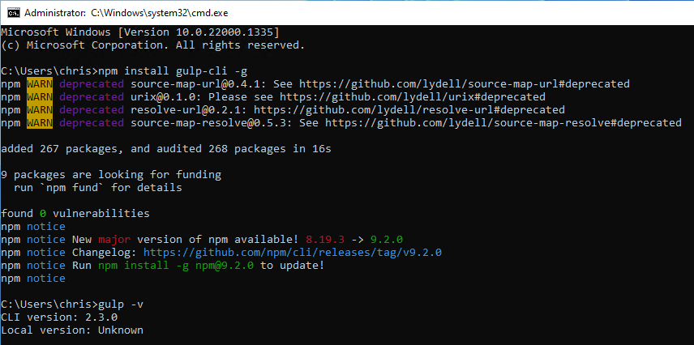

> Note: You may not see a `Local version` if you're not currently in a project folder (we installed globally by using `-g`). That's OK!

#### :books: Resources
- [SPFx Gulp instructions](https://learn.microsoft.com/en-us/sharepoint/dev/spfx/set-up-your-development-environment#install-gulp)
- [NPM Install](https://docs.npmjs.com/cli/v9/commands/npm-install)

## :rocket: Exercise 5: Install Yeoman

[Yeoman](https://yeoman.io/) helps you kick-start new projects, and prescribes best practices and tools to help you stay productive. We will use this for project scaffolding.

1. From the command prompt, enter the following command to install Yeoman: `npm install yo -g`, followed by <kbd>Enter</kbd>.
1. Do another dance!
1. To verify the installation, type `yo`, followed by <kbd>Enter</kbd>.
1. If you see **Allo! What would you like to do?**, use your arrow keys to select **Get me out of here!** and hit <kbd>Enter</kbd>.
   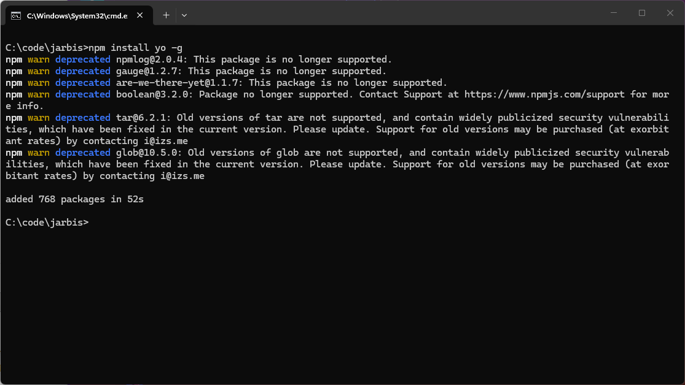

#### :books: Resources
- [SPFx Yeoman instructions](https://learn.microsoft.com/sharepoint/dev/spfx/set-up-your-development-environment#install-yeoman)
- [NPM Install](https://docs.npmjs.com/cli/v9/commands/npm-install)

## :rocket: Exercise 6: Install Yeoman SharePoint generator

The Yeoman SharePoint generator helps you quickly create a SharePoint client-side solution project with the right toolchain and project structure. The generator provides common build tools and common boilerplate code.

1. From the command prompt, enter the following command: `npm install @microsoft/generator-sharepoint -g`, followed by <kbd>Enter</kbd>.

2. A bazillion years later, when the installation is complete and your latest dance finished, enter `yo`, followed by <kbd>Enter</kbd>.
3. When prompted **Allo! What would you like to do?**, verify that **@microsoft/sharepoint** is listed under **Run a generator**.
   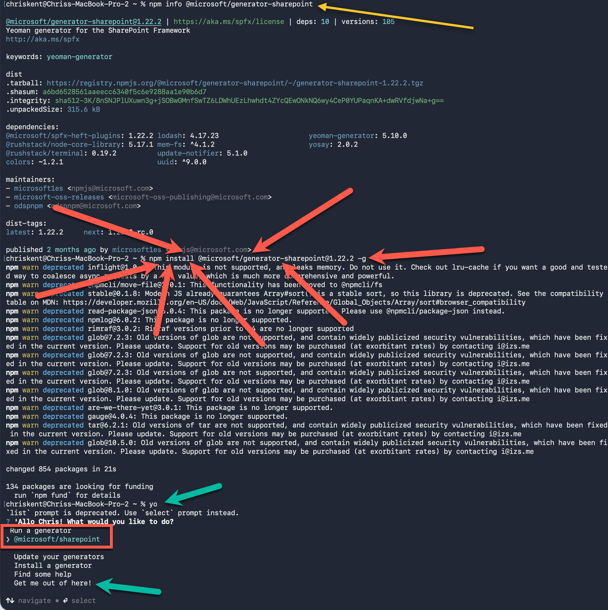  
4. Using your arrow keys, select **Get me out of here!**. We still have a few things to install to make sure you have all the best SPFx development tools at your disposal.

#### :books: Resources
- [SPFx Yeoman Generator instructions](https://learn.microsoft.com/sharepoint/dev/spfx/set-up-your-development-environment#install-yeoman-sharepoint-generator)
- [Yeoman generator for the SharePoint Framework](https://learn.microsoft.com/sharepoint/dev/spfx/yeoman-generator-for-spfx-intro)
- [PnP SPFx Yeoman generator](https://pnp.github.io/generator-spfx/)

## :rocket: Exercise 7: Install TypeScript

[TypeScript](https://www.typescriptlang.org/) is a strongly typed programming language that builds on JavaScript and is what SPFx uses.

> Not needed as an independent installation for SPFx development, but we will be using it in later steps

1. From the command prompt, enter the following command: `npm install typescript -g`, followed by <kbd>Enter</kbd>.
1. Don't panic, the installation is very quick!
1. When the installation is complete, enter `tsc --version`, followed by <kbd>Enter</kbd>. You should see the version number listed.

   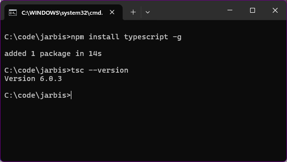

#### :books: Resources
- [TypeScript Documentation](https://www.typescriptlang.org/docs/)
- [TypeScript Cheat Sheets](https://www.typescriptlang.org/cheatsheets)

## :rocket: Exercise 8: Install CLI for Microsoft 365

The [CLI for Microsoft 365](https://pnp.github.io/cli-microsoft365) is a command line interface for managing your Microsoft 365 tenant and SharePoint Framework projects on any platform.

1. From the command prompt, enter the following command: `npm install @pnp/cli-microsoft365 -g`, followed by <kbd>Enter</kbd>.
1. When the installation is complete, enter `m365`, followed by <kbd>Enter</kbd>.
1. If it doesn't scream at you, you are good!
   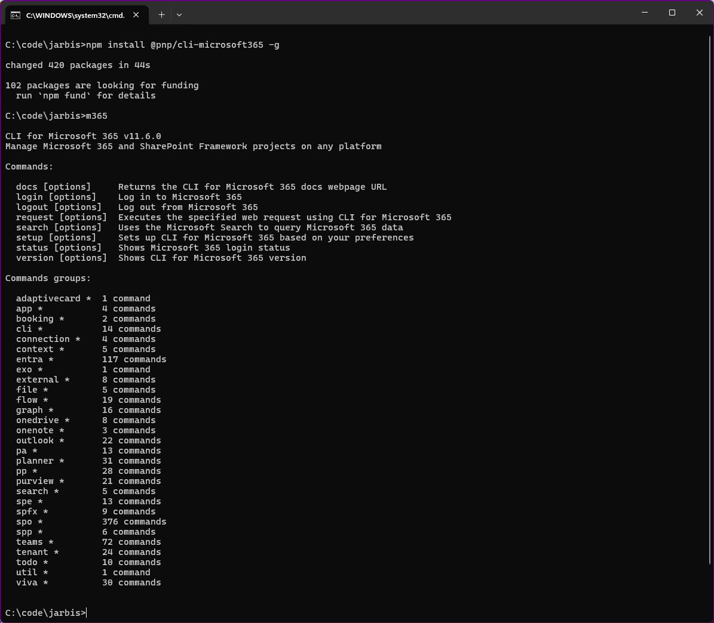

#### :books: Resources
- [Getting started with CLI for Microsoft 365](https://pnp.github.io/cli-microsoft365/#getting-started)
- [NPM Install](https://docs.npmjs.com/cli/v9/commands/npm-install)

## :rocket: Exercise 9: Install essential Visual Studio Code extensions

Visual Studio Code extensions are plugins for VS Code that provide extra functionality. None of these are required, but will certainly make your life easier!

1. Launch **Visual Studio Code**.
1. Open the **Extensions** panel from the activity bar (or by hitting <kbd>CTRL</kbd>+<kbd>SHIFT</kbd>+<kbd>X</kbd>)
1. From the search box, type `SPFx Essentials` and wait for search results to appear.
1. From the list of search results, select [**SPFx Essentials** by **Elio Struyf**](https://marketplace.visualstudio.com/items?itemName=eliostruyf.spfx-essentials).
1. From the **SPFx Essentials** page, select **Install**.
   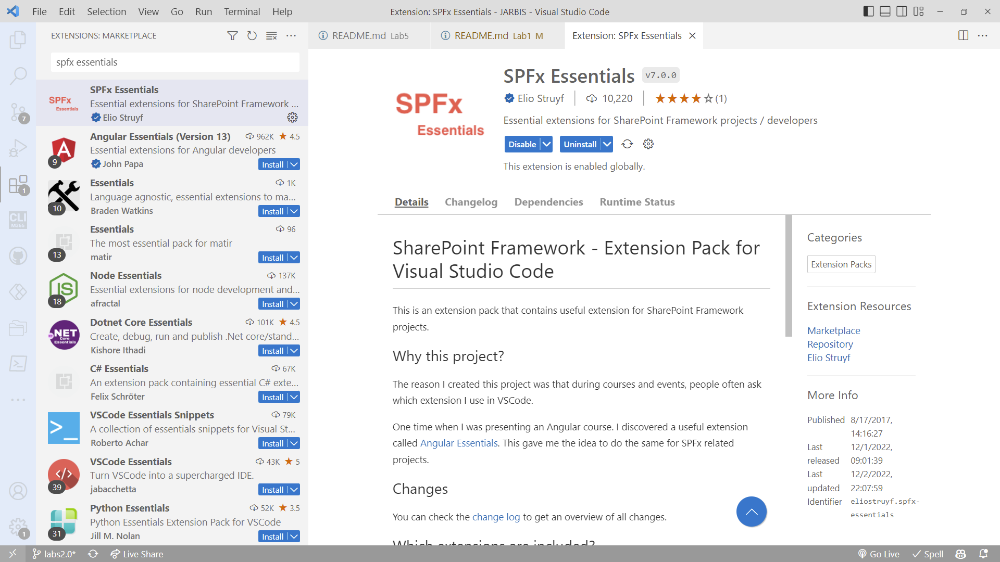  
1. Repeat steps 3-5 with the following extensions:
    - [**GitHub Repositories**](https://marketplace.visualstudio.com/items?itemName=GitHub.remotehub)
    - [**Live Server**](https://marketplace.visualstudio.com/items?itemName=ritwickdey.LiveServer)
    - [**Live Share**](https://marketplace.visualstudio.com/items?itemName=MS-vsliveshare.vsliveshare)
    - [**Peacock**](https://marketplace.visualstudio.com/items?itemName=johnpapa.vscode-peacock)
    - [**GitHub Copilot**](https://marketplace.visualstudio.com/items?itemName=GitHub.copilot) - Subscription required!
    - Extra credit: [**Sharing is Caring**](https://marketplace.visualstudio.com/items?itemName=PnP-SharingisCaring.sharing-is-caring)

#### :books: Resources
- [Extensions for Visual Studio Code](https://marketplace.visualstudio.com/VSCode)

## :rocket: Exercise 10: Experiments with TypeScript - Compilation

One of the most important things to understand and one of the first things to come up when starting SPFx development is TypeScript. TypeScript builds on JavaScript by adding strong types and fancy syntax that reduces bugs and makes development easier (though it can seem like the opposite at first).

Understanding the relationship between TypeScript (what you type) and JavaScript (what it gets compiled into to be run) will clear up a lot of the confusion about what the build process is and why it exists in a client-side project.

1. Create a folder where you want to place all the exercise files. This folder should NOT be in your OneDrive/Dropbox/etc. Since you'll be accessing it from the command prompt, it's often easiest to put things in a root folder on your drive. You can use the C drive, but an additional harddrive/partition is recommended (and an SSD is even better).
1. Either navigate to your folder using the command prompt or open a new command prompt in that folder by typing `cmd` in the path directly within file explorer:

   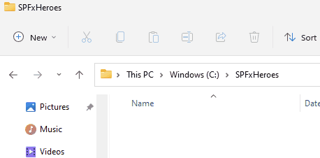

1. Enter the following commands, with <kbd>Enter</kbd> after every line.

    ```bash
    mkdir HelloTypeScript
    cd HelloTypeScript
    code .
    ```
   This will create a folder called `HelloTypeScript`, navigate to that folder, and then launch that folder in **Visual Studio Code**
1. If you are prompted to trust the authors of the files in the folder, check the box for trusting the parent folder (unless you want to be prompted all day) and click **Yes, I trust the authors**:

   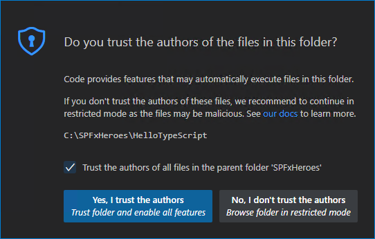

1. From the **File Explorer** in Visual Studio Code, create a new file called **hellotypescript.ts**.

   

1. Add the following TypeScript code, notice the TypeScript keyword `let` and the `string` type declaration.

    ```typescript
    let message : string = "Hello TypeScript";
    console.log(message);
    ```

1. To compile your TypeScript code, open the Integrated Terminal in Visual Studio Code by using the **Terminal** menu and choosing **New Terminal** (or press <kbd>CTRL</kbd>+<kbd>SHIFT</kbd>+<kbd>\`</kbd>)
1. Type `tsc hellotypescript.ts`, followed by <kbd>Enter</kbd>:

   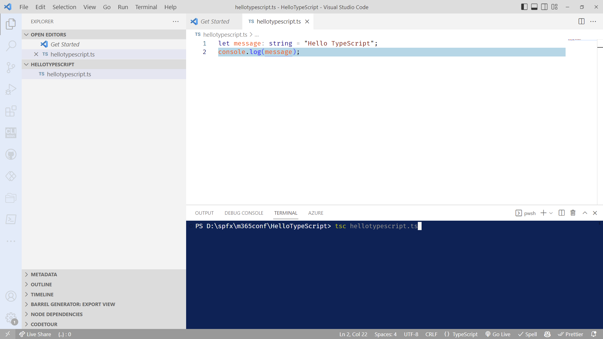

   This will compile your typescript file _(.ts)_ and create a new `hellotypescript.js` JavaScript file _(.js)_ which you can see in the explorer pane.
1. Type `node hellotypescript.js` to run your newly created file. You should then see `Hello TypeScript` output in the terminal. Magic! 
   > If nothing happens, make sure you saved your .ts file before running the `tsc` command
1. If you open `hellotypescript.js`, you'll see that it doesn't look very different from `hellotypescript.ts`. The type information has been removed and `let` is now `var`.

    ```javascript
    var message = "Hello TypeScript";
    console.log(message);
    ```

    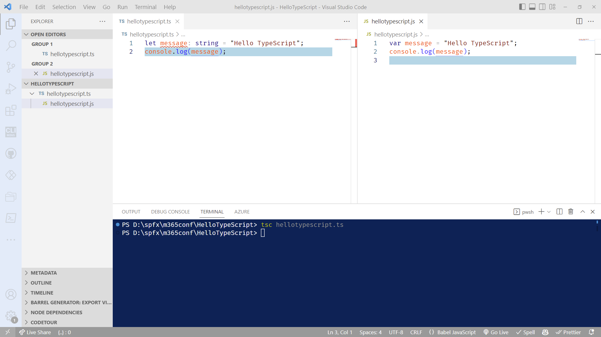  

## :rocket: Exercise 11: Experiments with TypeScript - tsconfig.json

In the exercise above, we were relying on the TypeScript compiler's default behavior to compile your TypeScript source code. You can modify the TypeScript compiler options by adding a `tsconfig.json` file that defines the TypeScript [project settings](https://www.typescriptlang.org/docs/handbook/tsconfig-json.html) such as the [compiler options](https://www.typescriptlang.org/docs/handbook/compiler-options.html) and the files that should be included.

> Projects scaffolded for SPFx (using Yeoman) will automatically have a tsconfig and it isn't often (if at all) that you'll need to edit it, but it's good to understand how it's used by the compiler should you need to tweak things later

**Important**: To use `tsconfig.json` for the rest of this tutorial, invoke `tsc` without specifying input files. The TypeScript compiler will know to look at your `tsconfig.json` for project settings and compiler options.

1. In VS Code, add a new file (using **File** > **New file...***) called `tsconfig.json` and paste the following:

    ```json
    {
        "compilerOptions": {
            "target": "ES5",
            "module": "CommonJS"
        }
    }
    ```
   
    

   The above sets the options to compile to ES5 and use **CommonJS** [modules](http://www.commonjs.org/specs/modules/1.0).
   
   When editing `tsconfig.json`, IntelliSense (`kb(editor.action.triggerSuggest)`) will help you along the way. Wowee!

   By default, TypeScript includes all the `.ts` files in the current folder and sub-folders if the `files` attribute isn't included, so we don't need to list `hellotypescript.ts` explicitly.

1. Having the generated JavaScript file in the same folder as the TypeScript source will quickly get cluttered on larger projects, so you can specify a different output directory. In your `tsconfig.json`, change the output directory for the compiler using the `outDir` attribute (be sure to save):

    ```json
    {
        "compilerOptions": {
            "target": "ES5",
            "module": "CommonJS",
            "outDir": "out"
        }
    }
    ```

1. Delete `hellotypescript.js` and run the command `tsc` with no options. You will see that `hellotypescript.js` is now generated in the new `out` directory:

   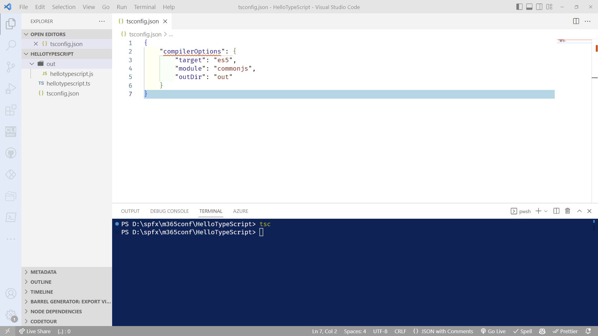

#### :books: Resources
- [TypeScript TSConfig Reference](https://www.typescriptlang.org/tsconfig)
- [TSConfig target](https://www.typescriptlang.org/tsconfig#target)
- [TSConfig module](https://www.typescriptlang.org/tsconfig#module)
- [TSConfig outDir](https://www.typescriptlang.org/tsconfig#outDir)

## :rocket: Exercise 12: Experiments in TypeScript - Error checking

TypeScript helps you avoid common programming mistakes through strong type-checking.

1. In the `hellotypescript.ts`, change this line:

    ```typescript
    let message : string = "Hello World";
    ```

    to this:

    ```typescript
    let message : string = 17;
    ```

2. If you run `tsc`, the TypeScript compiler will complain with **'error TS2322: Type 'number' is not assignable to type 'string'**.

   You can see type checking errors in VS Code both in the editor (red squiggles with hover information) and the Problems panel (<kbd>CTRL</kbd>+<kbd>SHIFT</kbd>+<kbd>M</kbd>). The `[ts]` prefix lets you know this error is coming from the TypeScript language service.

   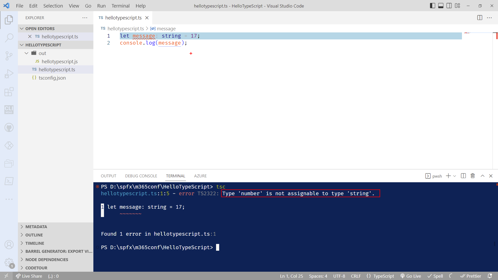

3. Undo your changes. We'll have plenty of opportunities to create real bugs later.

#### :books: Resources
- [TypeScript Everyday Types](https://www.typescriptlang.org/docs/handbook/2/everyday-types.html)
- [TypeScript Object Types](https://www.typescriptlang.org/docs/handbook/2/objects.html)

## :rocket: Exercise 13: Create your own Dev Tenant

Working in production is generally not a good idea. Besides, you're rarely going to be a global admin in your primary tenant. This can make trying out features, creating app registrations, provisioning assets, etc. challenging or plain impossible.

Good news! Microsoft will provide you a FREE tenant to do development work in!

If you don't already have one, Go to http://aka.ms/m365devprogram and follow the steps to create your own tenant. Use a name for yourself -- not your company name. For example, **Tahoe Ninja** instead of **Microsoft**.

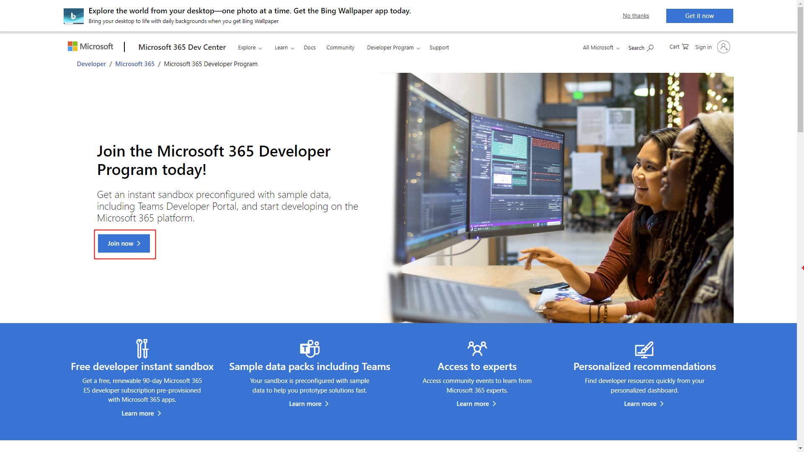  

Follow the steps to create your tenant. We'll use the tenant in later labs.

#### :books: Resources
- [Microsoft 365 Developer Program](http://aka.ms/m365devprogram)

## :rocket: Exercise 14: Using browser profiles

> This exercise is optional, but will help dealing with authentication issues when switching between your work Microsoft 365 tenant and your dev tenant. Plus, if you don't follow these steps, we can't be friends anymore.

Browser profiles allow you to create a different instance of your browser, using different credentials, bookmarks, favorites, history, etc. This means you don't have to login repeatedly (as much) or accidentally end up logged into the wrong tenant while testing and pull out all your hair (see David and Hugo for relevant examples).

These instructions are for Microsoft Edge. You can also use **User profiles** in Chrome if you wish (instructions not provided but pretty similar)

1. Using Edge, reveal the profile menu by selecting your profile picture in the upper right corner.

   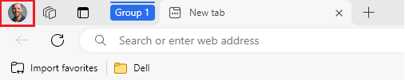
1. Find the **Add profile** menu (it may be located under **Other profiles** )

   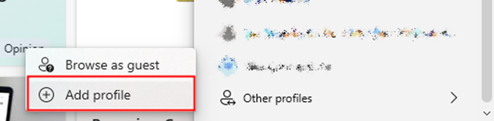

1. When prompted to **Add a profile**, select **Add**

   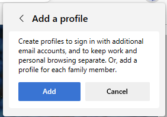

1. In the **Welcome to Microsoft Edge** dialog, select **Sign in to sync data**

   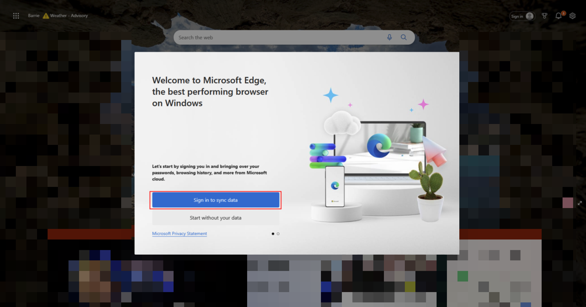

1. In the **Let's get you signed in** dialog, select **Add an account** followed by **Continue**

   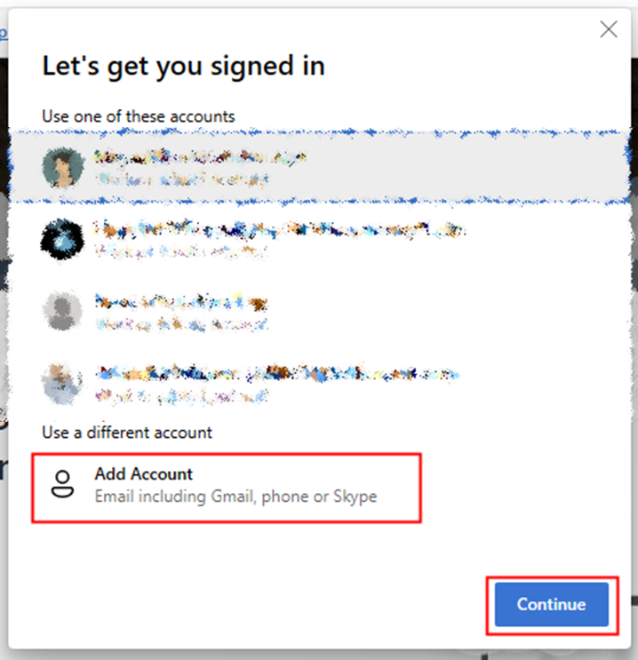

1. When prompted to **Enter email including Gmail or phone or skype**, enter the email address from your Microsoft 365 Dev tenant (**not** your work or personal email address), followed by **Sign In**

   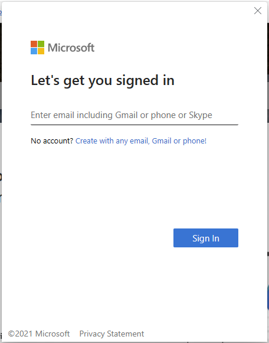

1. Follow the screen instructions to log in. If prompted to remember your password or keep signed in, feel free to say **Yes**. If you love things being difficult, feel free to say **No**.

1. Rename your new browser profile by using the profile menu and selecting the **Settings** icon

   

1. In the **Your profile**, select the **...** menu, followed by **Edit**

   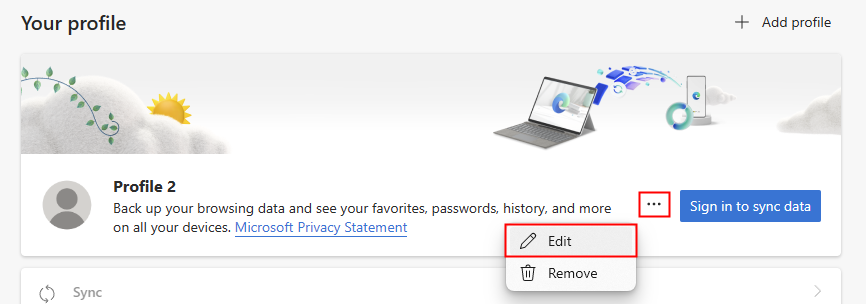

1. In the **Edit profile** dialog, change the profile name and select **Update**

   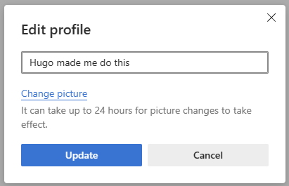

1. When you need to switch between user profiles, select the profiles menu and pick the profile you just created.

**For the rest of this workshop, we will use your developer tenant profile.**

#### :books: Resources
- [Sign in and create multiple profiles in Microsoft Edge](https://support.microsoft.com/topic/sign-in-and-create-multiple-profiles-in-microsoft-edge-df94e622-2061-49ae-ad1d-6f0e43ce6435)
- [Use Chrome with multiple profiles](https://support.google.com/chrome/answer/2364824)
- [Profile Manager - Create, remove or switch Firefox profiles](https://support.mozilla.org/en-US/kb/profile-manager-create-remove-switch-firefox-profiles)

## :tada: All Done!


In our next lab, we'll apply everything we've done so far to create a web part! Aw yeah!!
