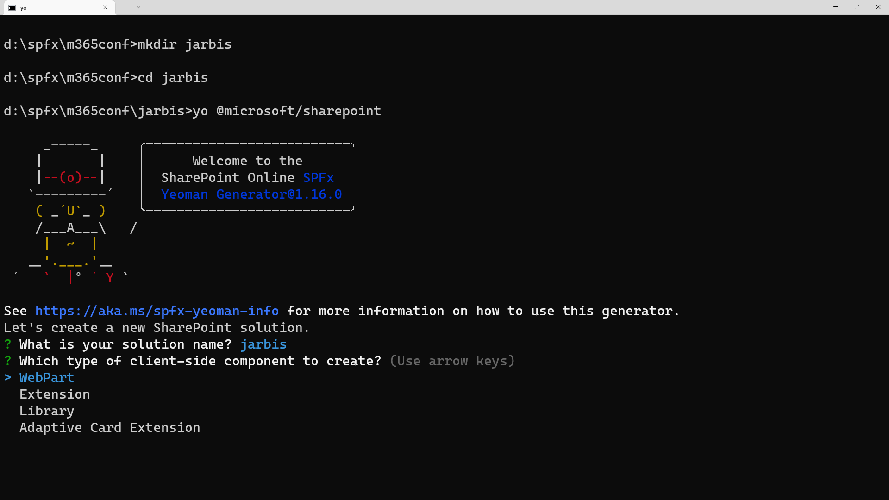
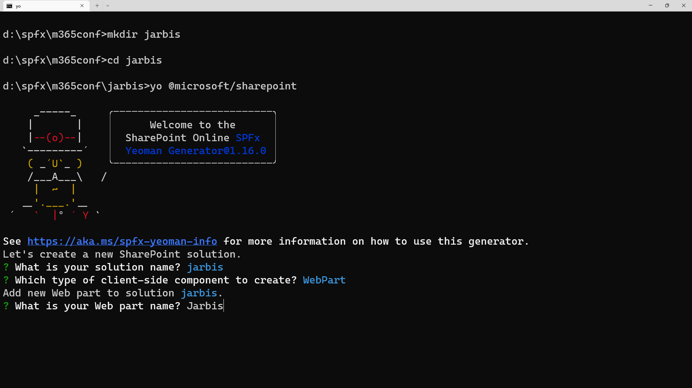
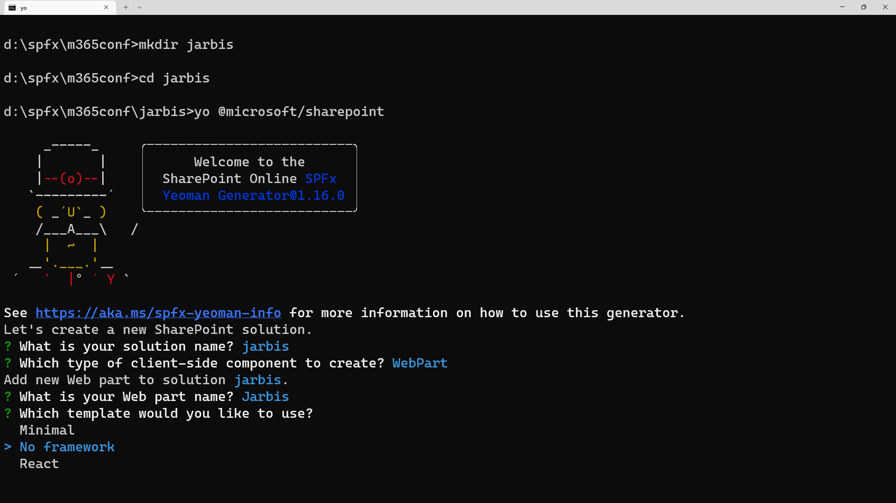
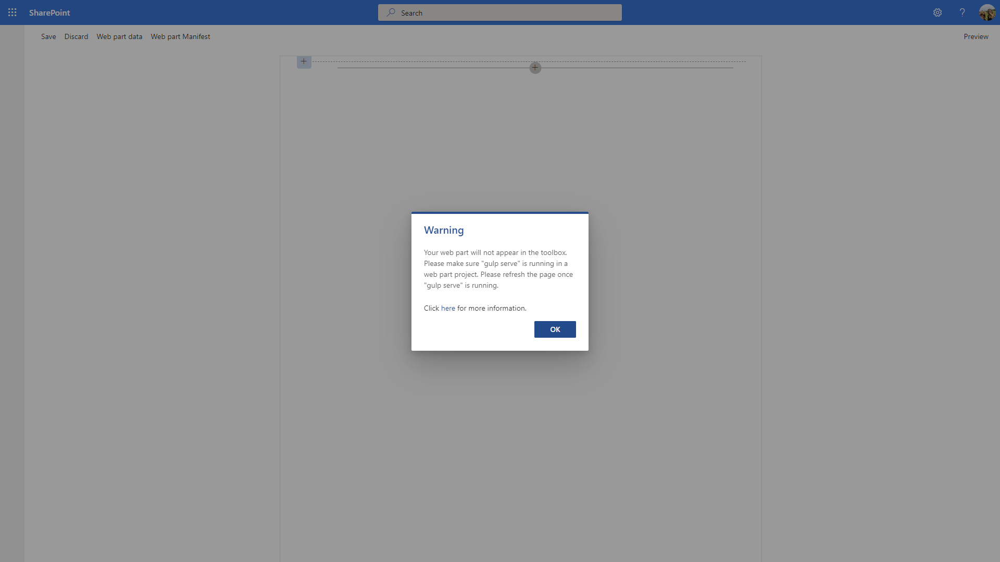
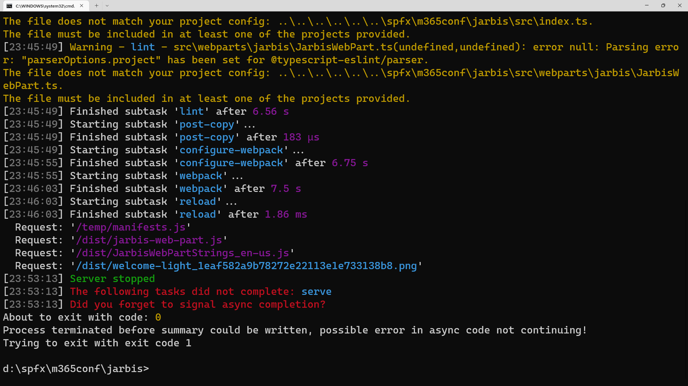
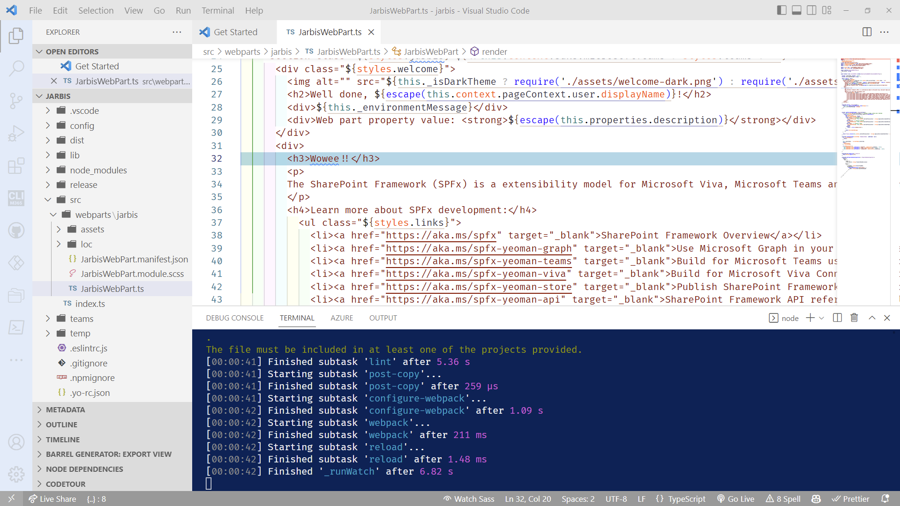

# Lab 2: Building a web part 

Let's build a web part!!!!!

## Exercise 1: Scaffold your web part

1. From your command prompt, go to your working folder.
    - If you closed your command prompt, open the folder in file explorer and type `cmd` in the path to automatically open a command prompt here!
1. Create a new folder called `jarbis`. You can use the File Explorer or type `mkdir jarbis`

  > **Pro Tip:** Make sure to keep your path as short as possible; Node projects can end up with very long file paths, and Windows can sometimes report unpredictable issues due to file paths being too long.

1. Change your current folder by using `cd jarbis`
1. Once in your new fancy folder, launch the yeoman generator by typing `yo @microsoft/sharepoint`
1. When prompted for a solution name, leave the default (**jarbis**), followed by <kbd>Enter</kbd>
     
1. When prompted what type of client you'd like to build, select **WebPart**
     
1. When prompted for a Web Part name, enter **Jarbis**.
     
1. When prompted for a framework, select **No Framework**
     
1. Wait for the solution to be scaffolded.
   > (This may take a moment or 75 depending on the wifi quality)

     
1. Go to your web browser, and navigate to your Microsoft 365 Dev Tenant (e.g.: <https://yourdevtenant.sharepoint.com>, where _youdevtenant_ is the name of the Development tenant you created in the first lab.
1. To view the workbench, navigate to `[YOUR_ROOT_SITE_HERE]/_layouts/15/workbench.aspx`
1. You should get an error saying that your web part isn't running... let's fix that!
     
1. Back in your command prompt, type `gulp serve --nobrowser`.
1. If you get a **Windows Security Alert**, select **Allow access**.

     
2. You should get a warning saying:

    ```
    Warning - [spfx-serve] When serving in HTTPS mode, a PFX cert path or a cert path and a key path must be provided, or a dev certificate must be generated and trusted. If a SSL certificate isn't provided, a default, self-signed certificate will be used. Expect browser security warnings.
    ```

## Exercise 2: Install the self-signed certificate

1. Run `gulp trust-dev-cert`
1. When prompted, accept the certificate by selecting **Yes**
1. Launch your web part by typing `gulp serve --nobrowser`
   > The `--nobrowser` part keeps it from launching yet another window
1. Wait for a message saying `Finished subtask 'reload'`
     
1. Using your browser, refresh the workbench page. Your web part should be available to add to your browser.
     
1. Test the web part by adding it to the page
     
1. When you're done, go back to your command prompt and hit <kbd>CTRL</kbd>+<kbd>C</kbd> to stop the code from running.
     

## Exercise 3: Customize the web part

1. From the command prompt, type `code .` to open Visual Studio Code (code) in the current folder (.)
1. Launch the terminal window by hitting <kbd>CTRL</kbd>+<kbd>SHIFT</kbd>+<kbd>`</kbd>.
1. Explore the code under the **src** folder, and open the **JarbisWebPart.ts** file to try to find in the code where it says "Welcome to SharePoint Framework!" and replace the text for "Wowee!!".
2. From the terminal, type `gulp serve --nobrowser`
     
3. Refresh the browser to see if your web part changed.
     

## Exercise 4: Update the manifest

Generic icons are not cool! Nor are generic descriptions. In this exercise, we'll update web part manifest, which is used to control the various web part attributes like the title, description, icon, and much more.

1. From Visual Studio Code, open the **JarbisWebPart.manifest.json** (located under **src\webparts\jarbis**)
1. Look for the `officeFabricIconFontName` and replace the `Page` value to `Robot`
   > You can find additional icons at <https://flicon.io>

     
1. Change the `description` to `Just A Rather Basic Instructional Solution`
     
1. Save your file
1. If you closed the terminal before, launch the terminal window by hitting <kbd>CTRL</kbd>+<kbd>SHIFT</kbd>+<kbd>`</kbd>.
   > You can also go to the Terminal menu and choose New Terminal
1. If you stopped serving the web part before, type `gulp serve --nobrowser` in the terminal.
1. Refresh the browser, remove the web part and look for your new icon in your list of web parts available to add.
     
1. Post a GIF in the meeting chat to entertain Chris
