# Lab 2: Scaffold a Web Part

For our second lab, we'll utilize the tooling we made you install and we'll begin working on a web part together. The web part we will be making over the next several labs will be called Wordle and will be a fun word-guessing game that pulls words from a SharePoint list. Aw Yeah!!

> Is this a silly web part? You betcha! Has it been designed to show off as many features/techniques as possible to serve as a reference point for your future projects while covering the full lifecycle of development and integration? Probably!

For now, we're going to look at how to scaffold a basic web part and do some quick tweaks (while taking care of a couple minor final configurations along the way).

<details>
<summary><b>Legend</b></summary>

|Icon|Meaning|
|---|---|
|:rocket:|Exercise|
|:apple:|Mac specific instructions|
|:shield:|Admin mode required|
|:bulb:|Hot tip!|
|:hedgehog:|Code catch-up|
|:warning:|Caution!|
|:books:|Resources|

</details>

<details>
<summary><b>Exercises</b></summary>

  1. [Scaffold your web part](#rocket-exercise-1-scaffold-your-web-part)
  1. [Add a .nvmrc file](#rocket-exercise-2-add-a-nvmrc-file-optional)
  1. [Install the self-signed certificate](#rocket-exercise-3-install-the-self-signed-certificate)
  1. [Load your web part](#rocket-exercise-4-load-your-web-part)
  1. [Customize the web part](#rocket-exercise-5-customize-the-web-part)
  1. [Update the manifest](#rocket-exercise-6-update-the-manifest)
  1. [Add a project color](#rocket-exercise-7-add-a-project-color-optional)
  1. [Add a pet friend](#rocket-exercise-8-add-a-pet-friend-optional)
</details>

## :rocket: Exercise 1: Scaffold your web part

We've gotten everything installed and we're ready to start working on something! Well, time to use those tools to generate our starter files (also called scaffolding if you're cool).

> :bulb: It's generally a good idea to pick a consistent folder for code. There will be thousands of files during development. Having all of these in your documents folder syncing to OneDrive may destroy the internet. We recommend creating a folder at the root of your drive (or within userhome on a mac :apple:) and using a secondary drive like an SSD isn't too bad an idea either.

> :warning: Pay attention when launching command windows to ensure you are in the correct location. You really don't want to generate project files in your windows directory!

1. From your command prompt, go to your code directory.
    > :bulb: As shown in the previous lab, if you closed your command prompt, open the folder in file explorer and type `cmd` in the path to automatically open a command prompt in that directory

1. Create a new folder called `wordle`. You can use File Explorer or type `mkdir wordle`

    > :bulb: It's best to keep your path as short as possible; Node projects can end up with very long file paths, and Windows can sometimes report unpredictable issues due to file paths being too long. Plus it makes your command prompt annoyingly long.

1. Change your current folder in the command prompt to the new one by typing `cd wordle`

1. Once in your fancy new folder, launch the yeoman generator by typing `yo @microsoft/sharepoint`

   > :bulb: There are a few extra parameters you can apply when running the generator. You won't typically use them, but you can always find out what's available by typing `yo @microsoft/sharepoint --help`

1. When prompted for a solution name, leave the default (**wordle**), followed by <kbd>Enter</kbd>
   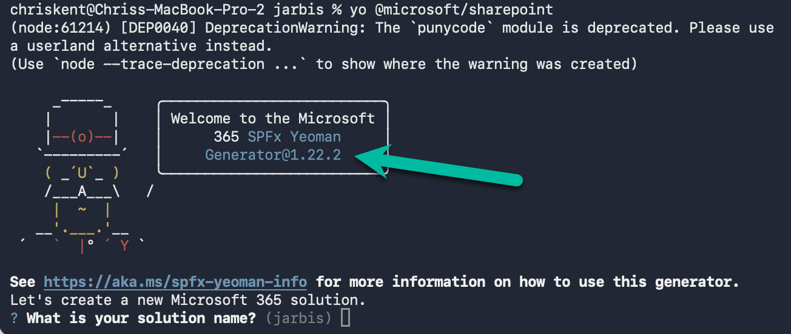  
   > :warning: Verify the SPFx Yeoman Generator version number matches 1.22.2 as shown above. If it doesn't, or you get an error like "yo not found" then a step was missed in the last lab. Either check your work or reach out for help.

1. When prompted what type of client you'd like to build, select **WebPart**:
   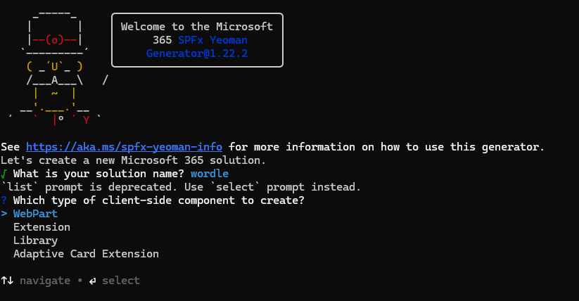
   > :bulb: You can just hit <kbd>Enter</kbd> since it's the default for new projects. In the future, you might be creating a different project type (or rerunning the generator to add a new component to an existing project). In those cases, you will use the up/down arrows to select the correct component type before pressing <kbd>Enter</kbd>. Same will be true for the other "menus"

1. When prompted for a Web Part name, enter **Wordle**.

1. When prompted for a template, select **No Framework**:
   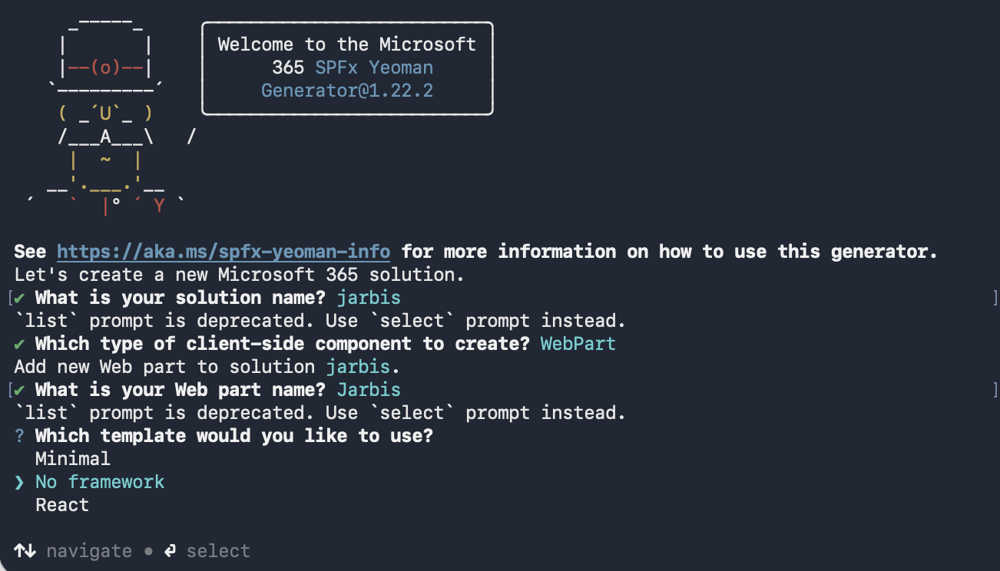

   > :bulb: There are 3 [template options](https://learn.microsoft.com/sharepoint/dev/spfx/yeoman-generator-for-spfx-intro#project-template-options) for web parts. Here's a quick breakdown: 
   
   - **Minimal** - This is a barebones web part with nothing in it. Great for experienced devs who want full control over what's included.
   - **No framework** - Barebones template that includes sample theming and context code. Use this when you want to work with the DOM directly or use frameworks besides React (like jQuery).
   - **React** - same theming and context stuff as the previous, but includes React and wires up an initial component. This is the most common template once you get comfortable with React.

      > :bulb: We are choosing No framework today to keep things "simple" without adding the extra layer of React. However, if you are not currently using a framework, we highly recommend using React for future projects. It is the most common framework used in SPFx samples, there are open-source controls from PnP and Fluent UI, and it's [pretty neat](https://www.youtube.com/watch?v=OXZt4-LTtHw).

1. Wait for the solution to be scaffolded (This may take a moment or 75 depending on the network quality).

   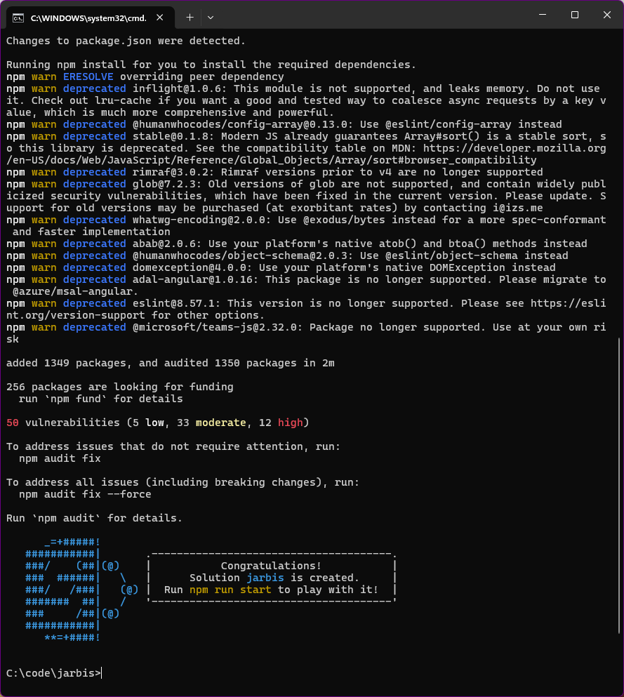

   > :warning: NPM may display warnings and error messages during the installation of dependencies while it runs the `npm install` command. You can safely ignore these log warnings & error messages.
   >
   > NPM may display a message about running `npm audit` at the end of the process. **Don't** run this command as it will upgrade packages and nested dependencies that may not have been tested by the SharePoint Framework

#### :books: Resources
- [Build your first SharePoint client-side web part](https://learn.microsoft.com/sharepoint/dev/spfx/web-parts/get-started/build-a-hello-world-web-part)
- [Yeoman Generator for SPFx](https://learn.microsoft.com/sharepoint/dev/spfx/yeoman-generator-for-spfx-intro)
- [SPFx Yeoman Generator project template options](https://learn.microsoft.com/sharepoint/dev/spfx/yeoman-generator-for-spfx-intro#project-template-options)
- [PnP SPFx Yeoman Generator](https://pnp.github.io/generator-spfx/)


## :rocket: Exercise 2: Add a .nvmrc file (optional)

In our previous lab we discussed Node version requirements and strongly recommended installing a version manager like NVS. As mentioned, this is because different versions of SPFx require different versions of Node. This can be a source of frustration as you move between projects or attempt to run samples. So let's make it easier to know exactly what version of node is used in a project.

This is NOT required but we recommend doing this step immediately after scaffolding a project. It makes collaboration much easier when you know everyone has the same version of Node.

The standard way to declare which version of Node a project uses is to include a `.nvmrc` file in the root of the project with the version of Node in it.

1. From a command prompt in your root jarbis directory you can create the file easily using this command:

   ```console
   node -v > .nvmrc
   ```

1. You will now have a `.nvmrc` file in your project directory. This is just a text file with the version of node in it.

1. If using a node version manager like NVS, you can use `nvs auto` to have it automatically switch.

#### :books: Resources
- [NVS Auto Switching](https://github.com/jasongin/nvs?tab=readme-ov-file#manual-switching-using-node-version)
- [Configuring nvmrc (NVM)](https://www.nvmnode.com/extend/nvmrc.html)


## :rocket: Exercise 3: Install the self-signed certificate

When you serve an SPFx project locally, the local server uses HTTPS by default which requires a development self-signed SSL certificate. As you might guess, self-signed SSL certificates are not automatically trusted.

Trusting the developer certificate is required. This is a one-time process and is only required when you run your first SharePoint Framework project on a new workstation. You don't need to do this for every SharePoint Framework project. Yay!

1. In your command prompt, type `heft trust-dev-cert` and press <kbd>Enter</kbd>

   > :bulb: There is also a `heft untrust-dev-cert` command to undo these changes at anytime

1. On Windows, when prompted, accept the certificate by selecting **Yes**:

   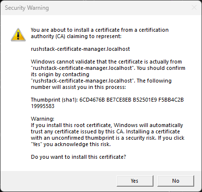

   If at any point you get a **Windows Security Alert**, select **Allow access**. (though this may not occur until a later step)

   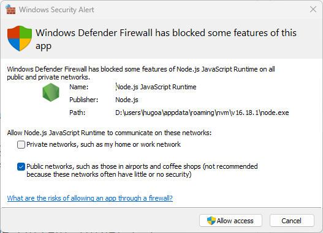  

1. On Mac :apple:, a sudo-runner terminal will be launched. Enter your password and press <kbd>Enter</kbd>. You may also be prompted with an additional security dialog for adding to your keychain:

   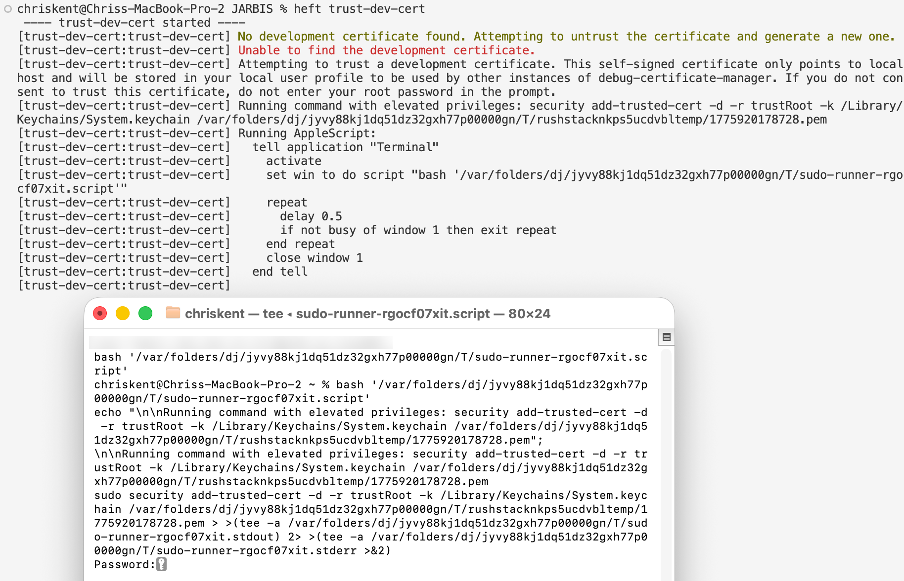

#### :books: Resources
- [SPFx developer certificate instructions](https://learn.microsoft.com/sharepoint/dev/spfx/set-up-your-development-environment#trusting-the-self-signed-developer-certificate)


## :rocket: Exercise 4: Load your web part
We've got some files and we haven't broken them yet, so let's take a look at it! Now it's time to decide if you're using a tenant with an online workbench or if you are working locally with the SPFx Local Workbench. You can also change your mind later, in fact, you can actually use both approaches together. Wowee!

Having trouble deciding? Here's a quick comparison:
||Online Workbench|Local Workbench|Comments|
|---|:---:|:---:|---|
|Can work without a tenant|❌|✅|*<sup>Both approaches can work with a tenant, but it's not required for the SPFx Local Workbench</sup>*|
|Test web parts|✅|✅|
|Test extensions|❌|☑️|*<sup>The SPFx Local Workbench supports App Customizers with plans to extend support to additional extensions. Extensions can also be tested online outside of the workbench</sup>*|
|Quick theme switching|❌|✅||
|Quick locale switching|❌|✅||
|Storybook integration|❌|✅|*<sup>The SPFx Local Workbench provides automatic story generation, storybook hosting in VS Code, and support for custom stories</sup>*|
|Work with deployed assets|✅|❌|*<sup>Assets can be mocked with the SPFx Local Workbench API Proxy, authenticated passthrough calls are planned but not yet available</sup>*|
|Work with mocked assets|❌|✅|
|Integrates with Dev Proxy|❌|☑️|*<sup>The SPFx Local Workbench API Proxy supports passthrough mode to route calls through Dev Proxy</sup>*|
|Call M365 APIs|✅|☑️|*<sup>The SPFx Local Workbench supports proxy endpoints for mocking responses, authenticated passthrough calls are planned but not yet available</sup>*|
|Can be used Offline|❌|✅||
|Supported by Microsoft|✅|❌||

Bottom line: The SPFx Local Workbench extension eliminates the need for a tenant during development and adds some additional features - *but* it is in the very early stages and you may discover exciting new bugs along the way! There are also a couple of spots in the labs (deployment for instance), where it isn't going to help. Regardless, the Online workbench works great if one is available to you and it won't hurt our feelings if you go that route.

### Using the online workbench

1. Go to your web browser (using the profile you setup earlier), and navigate to the root site of your Microsoft 365 Dev Tenant (e.g.: <https://yourdevtenant.sharepoint.com>, where _yourdevtenant_ is the name of the Development tenant you created in the first lab.

1. To view the workbench, navigate to `[YOUR_ROOT_SITE_HERE]/_layouts/workbench.aspx`

   > :bulb: The online workbench is actually available on every site in your tenant simply by adding `/_layouts/workbench.aspx` to the site address.

1. You will get an error saying that your web part isn't running... let's fix that!

   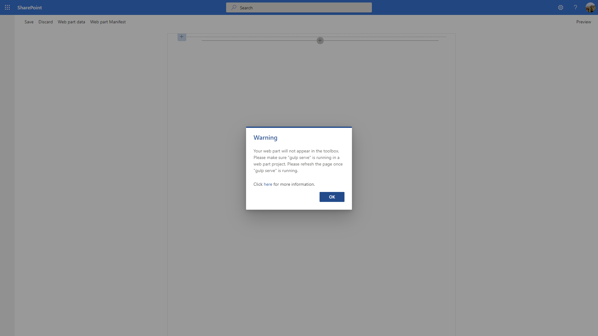

### Using the SPFx Local Workbench

1. Click the **SPFx Workbench** button in the VS Code task bar:

   

1. Alternatively, you can open the command bar (<kbd>F1</kbd>) and use the `SPFx Local Workbench: Open Local Workbench` command:

   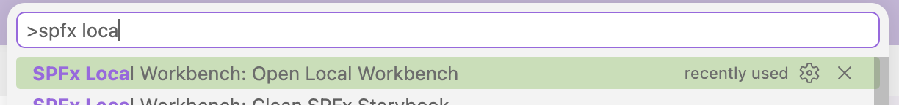

1. You will get an error saying that no SPFx components were found... let's fix that!

   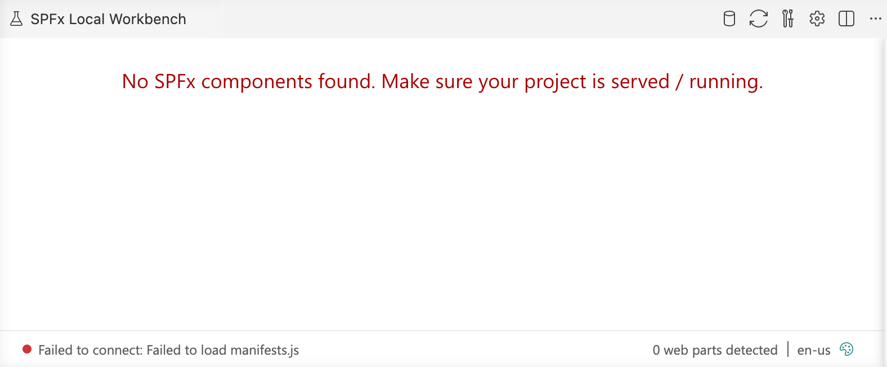

### Serving your project

1. Back in the command prompt, type `heft start --nobrowser`.

   > :bulb: The `--nobrowser` parameter is optional and keeps it from launching yet another window. By default, `heft start` will open a browser window (more details about that in later exercises). Slapping this parameter on there prevents that since we already opened the workbench and we've probably got too many tabs open as it is.
   > "Wait", you may say "all the examples I have seen say to use `npm start`... are you teaching me the wrong thing?"
   >
   > `npm start` is an alias to `heft start --clean` and looks at your **config/serve.json** and launches your default browser to the URL found in `initialPage`.
   >
   > ```json
   > "initialPage": "https://{tenantDomain}/_layouts/workbench.aspx"
   > ```
   >
   > You're welcome to update your dev tenant URL where it says `{tenantDomain}`, but if you're using different credentials (or a different browser profile) for your dev tenant, you'll almost invariably get an "Access denied" error, which will cause you to have to close the browser/tab every time.
   >
   > Alternatively, you can configure the [SPFX_SERVE_TENANT_DOMAIN OS environment variable](https://learn.microsoft.com/sharepoint/dev/spfx/set-up-your-development-environment#set-the-spfx_serve_tenant_domain-environment-variable-optional) as part of your setup to have the `{tenantDomain}` always resolve but that's outside the scope of this lab.
   >
   > By using `heft start --nobrowser`, you can connect to an existing browser/tab instance without launching a new session every single time.
   >
   > For the rest of this workshop, feel free to use `npm start` where we use `heft start --nobrowser` if that is what you prefer.

1. Remember, if you get the Firewall access message mentioned previously, click **Allow Access**.

1. A successful start in the terminal looks similar to this:

   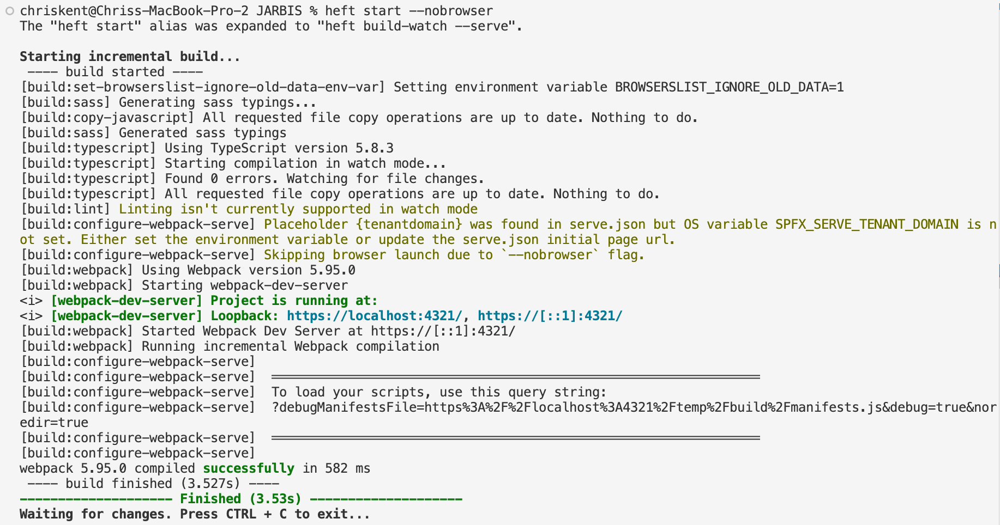

1. Back in the workbench, refresh the workbench page/panel as needed. Your web part should be available to add to your workbench (the warning from before won't show up).

### Adding the webpart to the Online Workbench
1. Test the web part by adding it to the page (click the plus icon and select Jarbis)

   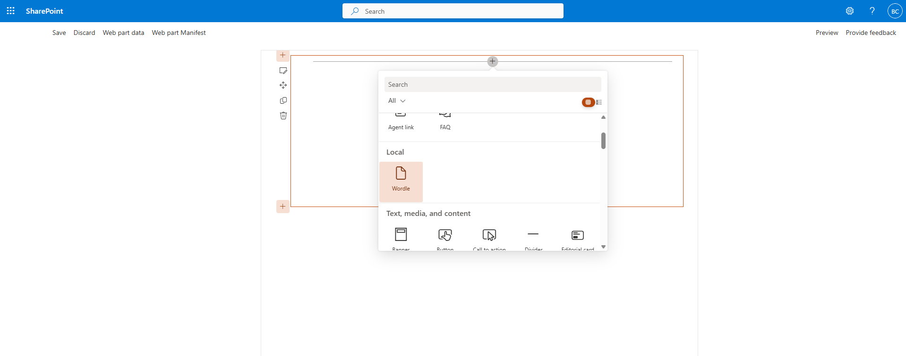

1. Look at your glorious web part! Fortunately, your's won't say Hugo Bernier!

   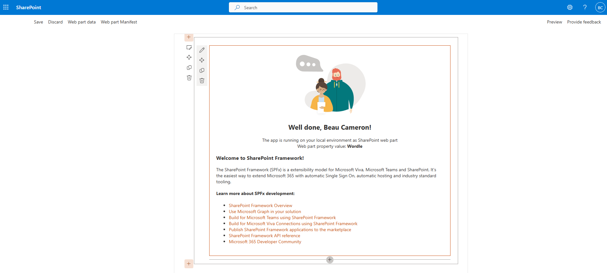

1. Head back to the command prompt and hit <kbd>CTRL</kbd>+<kbd>C</kbd> to stop the code from running

> :bulb: You'll be using this workbench page _a lot_ in this workshop -- and throughout your SPFx development career; we recommend that you bookmark your workbench page within your dev tenant browser profile, or mark it as your start page.

### Adding the webpart to the SPFx Local Workbench

1. If you are still seeing a No SPFx components found message, click the Refresh button in the panel title bar (or close and reload the panel).

1. Test the web part by adding it to the workbench (click the plus icon and select Jarbis)

   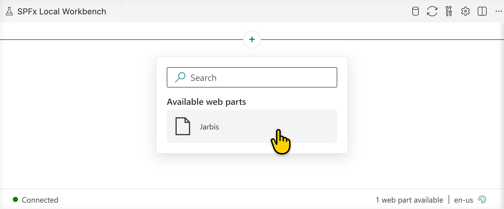

1. Look at your glorious web part!

   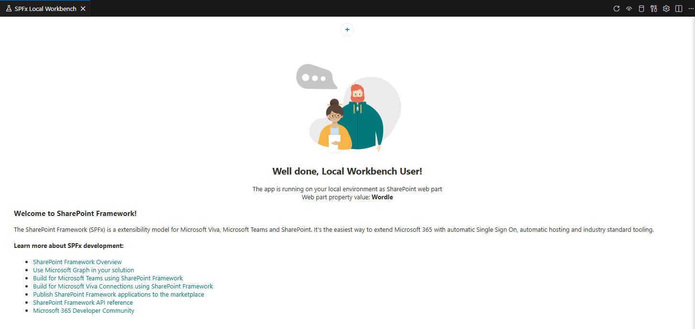

   > :bulb: The name "Local Workbench User" comes from the default page context. You can customize this value (and any other) using VS Code settings for the extension. That is NOT necessary for these labs, we just wanted you to be aware.

1. Head back to the command prompt and hit <kbd>CTRL</kbd>+<kbd>C</kbd> to stop the code from running

#### :books: Resources
- [Set the SPFX_SERVE_TENANT_DOMAIN environment variable](https://learn.microsoft.com/sharepoint/dev/spfx/set-up-your-development-environment#set-the-spfx_serve_tenant_domain-environment-variable-optional)
 - [An endless horse](http://endless.horse/)


## :rocket: Exercise 5: Customize the web part

If all you wanted was a web part that welcomes you to the SharePoint Framework and provides some links then I guess you're all done! For everybody else, let's start tweaking this thing!

1. From the command prompt, type `code .` to open Visual Studio Code (code) in the current folder (.)

1. Once in VS Code, launch the terminal window by hitting <kbd>CTRL</kbd>+<kbd>SHIFT</kbd>+<kbd>`</kbd>.

1. Once in VS Code, launch the terminal window by hitting <kbd>CTRL</kbd>+<kbd>SHIFT</kbd>+<kbd>`</kbd> (<kbd>CTRL</kbd>+). Or choose _New Terminal_ in the _Terminal_ menu.

   > :bulb: Some people like to use a terminal outside of VS Code (as we've been doing) and there's nothing wrong with that. We often find it easier to use the integrated terminal (and that's what you'll be seeing in these labs) but it's up to you.

1. Using the explorer pane, expand the **src** folder, followed by the **webparts** folder, and open the **JarbisWebPart.ts** file. On line 32, change `Welcome to SharePoint Framework!` to `Wowee!!`. Save the file.

1. In the terminal, type `heft start --nobrowser`

   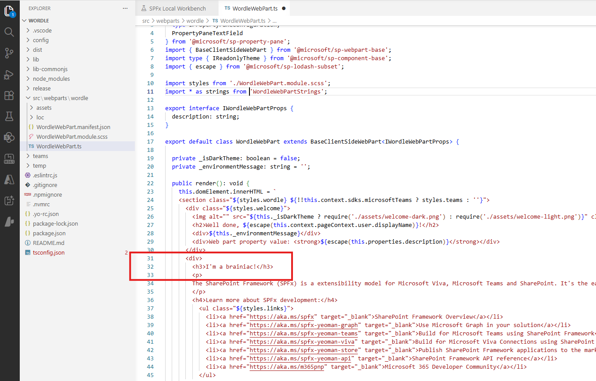

   > :bulb: Now that we're in VS Code, we can use the integrated terminal rather than the command prompt from before. It's doing the same thing, but it's far easier to keep an eye on this way. You can feel free to close the command prompt from before.

1. Refresh the browser to see if your web part changed. If it hasn't, make sure the terminal shows the `Waiting for changes.` as it can take a few more seconds than you might expect on initial serve.
   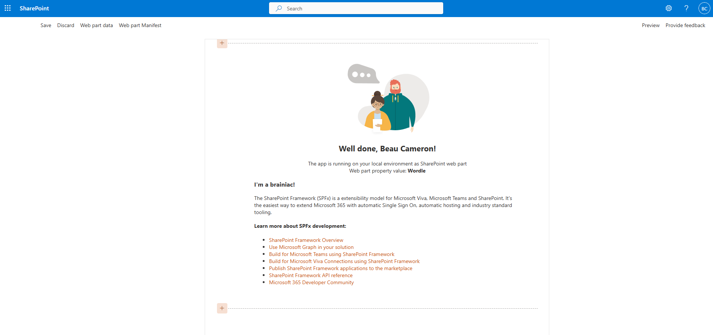  

#### :books: Resources
 - [VS Code Terminal Basics](https://code.visualstudio.com/docs/terminal/basics)
 - [Inspiration](https://www.nytimes.com/games/wordle/index.html)

## :rocket: Exercise 6: Update the manifest

Generic icons are not cool! Nor are generic descriptions. In this exercise, we'll update the web part manifest, which is used to control the various web part attributes like the title, description, icon, and much more.

> :warning: ALWAYS DO THIS. You can change the info later should you need to, but get something in there from the beginning. There are far too many web parts out there with the generic icon and it makes Vesa cry himself to sleep. Why you wanna make Vesa cry?!?


1. In Visual Studio Code, open the **WordleWebPart.manifest.json** (located under **src\webparts\wordle**)

   > :warning: This file (like most of the .json files included in SPFx) contains comments and this angers VS Code since those aren't technically allowed. The good news is that it won't hurt a thing and you can just let VS Code underline the comments to its heart's content while secretly giggling to yourself about how silly it's being
   >
   > :bulb: Even better, however, is to update your VS Code settings to allow comments even in regular json files. You can do this by pressing <kbd>F1</kbd> to launch the command browser and type settings to open the settings UI. Search for the `files: associations` setting. Now click **Add Item** and use `*.json` as the Key and `jsonc` as the value. This doesn't change anything other than VS Code's angry response to those comments.

   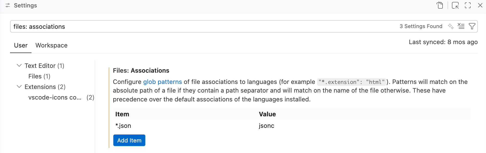

1. Look for the `officeFabricIconFontName` and replace the `Page` value to `Game`

   > :bulb: There are actually 2,000+ icons out there and you can use whatever one you want. You can find additional icons at https://flicon.io

   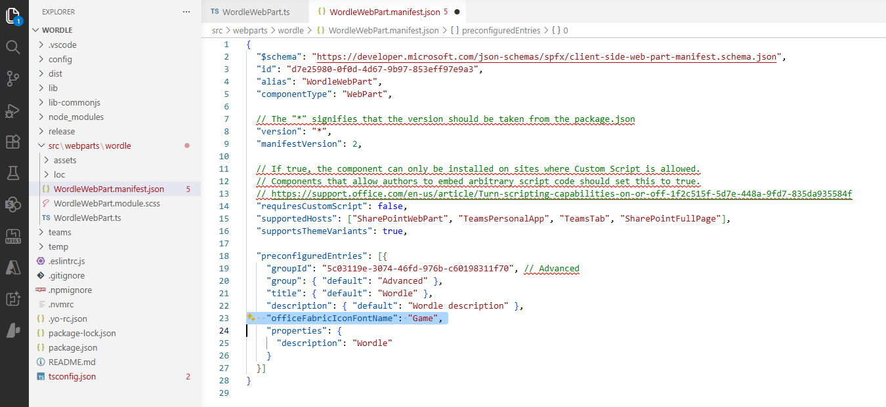

   > :bulb: The Fluent UI icons are what you'll probably use most of the time, SPFx does allow you to specify your own images as either an external URL (no thanks) or as a base-64 encoded image (choose this)

1. Change the `description` to `A fun word-guessing game for your SharePoint site`

   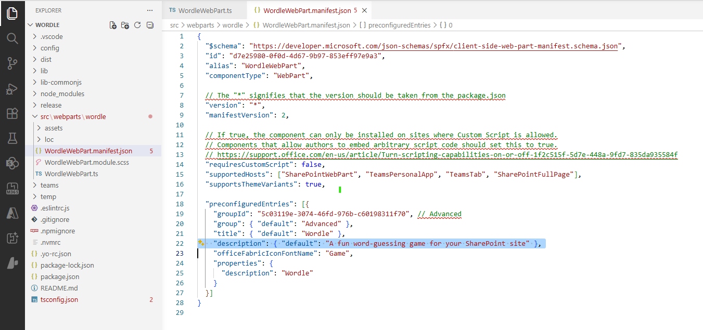

   > :bulb: The weird `: { "default": "blah blah" }` syntax can be used for localization of these properties. For now, we're setting the default value that will be used for any languages not specified (which is all of them in our case).

1. Change the `title` to `Wordle Game` because that's cooler and it would have made some of the automatic file naming weird had we done it in the generator from the start.

1. Save your file. If the terminal is still open and still running the last `heft start` you'll see magic things happening as the project rebuilds automatically. Unfortunately, changes to the manifest don't get automatically updated like changes to code and we will have to stop (<kbd>CTRL</kbd>+<kbd>C</kbd>) and re-serve (`heft start --nobrowser`) - but that magic will be awesome later! You can skip to step 8 and see if the changes are there, but if not come back here.

1. If you closed the terminal before, launch the terminal window by hitting <kbd>CTRL</kbd>+<kbd>SHIFT</kbd>+<kbd>`</kbd>.
   > You can also go to the Terminal menu and choose New Terminal

1. If you didn't stop serving the web part before, hit <kbd>CTRL</kbd>+<kbd>C</kbd> to do so. Then type `heft start --nobrowser` in the terminal.

1. Back in the browser, click Discard in the upper left to reset the workbench. Refresh the page. In the SPFx Local Workbench, just hit the Refresh button in the panel title.

1. Add your webpart again and look for your new icon in your list of web parts available to add (the description will show up as a tooltip).

   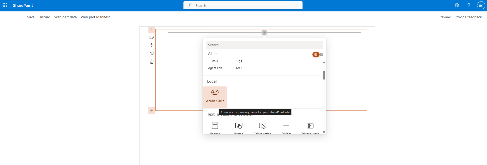

#### :books: Resources
- [Flicon](https://flicon.io)
- [SPFx Configure web part icon](https://learn.microsoft.com/sharepoint/dev/spfx/web-parts/basics/configure-web-part-icon)
- [Example of using animated Christopher Walken with Googly Eyes](https://thechriskent.com/2017/06/01/setting-your-spfx-webpart-icon/)

## :rocket: Exercise 7: Add a project color (optional)

Earlier we installed the [Peacock](https://marketplace.visualstudio.com/items?itemName=johnpapa.vscode-peacock) VS Code extension. This extension allows you to customize Visual Studio Code's interface colors based on the open project (themes, on the other hand, apply to all instances of the editor). This might seem a little silly at first, but having a dedicated color per project is a nice visual indicator of what project you're working on when switching between windows.

1. Open the Command Palette by pressing **F1** or choosing **View** > **Command Palette** from the menu.

1. Type peacock to see the available commands.

   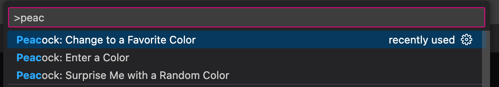

1. Choose either `Peacock: Enter a Color`, `Peacock: Change to a Favorite Color`, or `Peacock: Surprise Me with a Random Color` and answer any follow-up prompts.

1. Your VS Code instance will now use the selected color whenever you open this project. You can set different colors for every project.

   > :bulb: The configuration is stored in `.vscode/settings.json` under `workbench.colorCustomizations` which means if you include this file in your source control (will be by default) the color settings will be applied for everyone.

   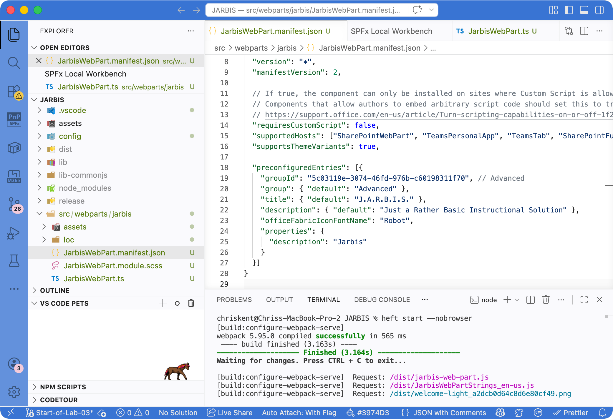

   > We used `#3974D3` with the `Peacock: Enter a Color` option in the screenshot above. Notice the color is only applied to the edges. The main editor still uses your selected theme.

## :rocket: Exercise 8: Add a pet friend (optional)

Previously, we installed another **super important** VS Code extension, [vscode pets](https://marketplace.visualstudio.com/items/?itemName=tonybaloney.vscode-pets). This extension adds 1 or more pets to your editor. This is absolutely critical for proper development!!

1. Open the Command Palette by pressing **F1** or choosing **View** > **Command Palette** from the menu.

1. Type pet then choose `Pet Coding: Start pet coding session`.

   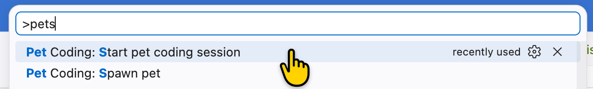

1. You should now see a little cat added to the `VS CODE PETS` pane under Explorer:

   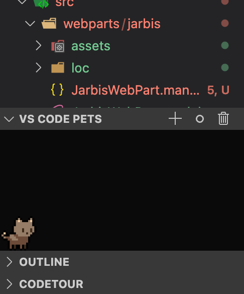

1. If you're happy with that cat, great! However, there are lots of pets to choose from! You can even add multiple!

1. To remove the cat, click the trash can icon in the VS CODE PETS pane or run the `Delete pet` command from the command palette (F1). Then choose the cat from the list of pets.

1. To add a new pet, click the plus icon in the VS CODE PETS pane or run the `Spawn pet` command from the command palette (F1).

1. Choose a pet type (we recommend horse):

   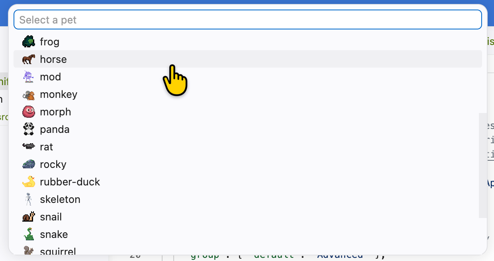

1. Choose from one of the available colors:

   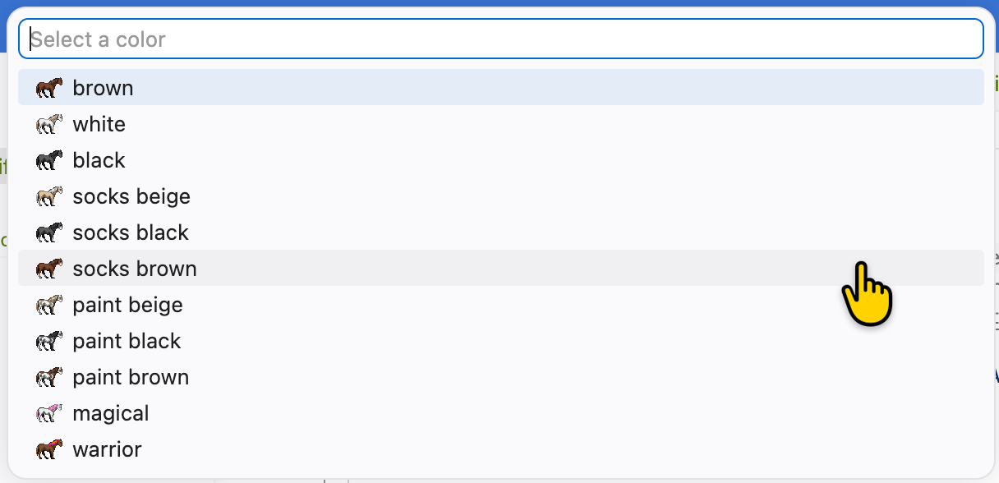

1. Name your pet:

   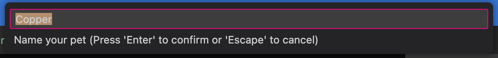

1. Repeat until you have as many pets as needed to help you code:

   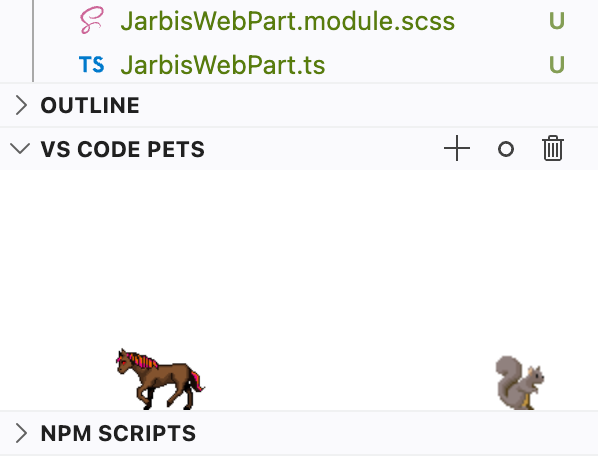

## :tada: All Done!


In our next lab, we'll take a look at how styling is done in SPFx and make our stuff a little prettier!

# [Previous](../Lab01/README.md) | [Next](../Lab03/README.md)