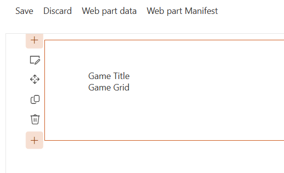
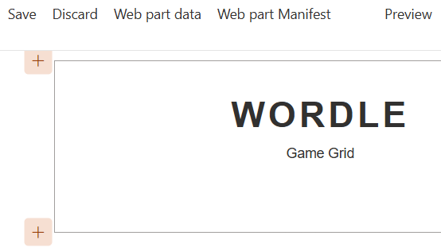

# Lab 3: Introduction to SCSS in SPFx

Now it's time to talk about what we're actually drawing (HTML) and how it gets all pretty (CSS)!

<details>
<summary><b>Legend</b></summary>

|Icon|Meaning|
|---|---|
|:rocket:|Exercise|
|:apple:|Mac specific instructions|
|:shield:|Admin mode required|
|:bulb:|Hot tip!|
|:books:|Resources|

</details>

<details>
<summary><b>Exercises</b></summary>

  1. [Anatomy of a basic web part](#rocket-exercise-1-anatomy-of-a-basic-web-part)
  1. [Cleanup](#rocket-exercise-2-cleanup)
  1. [Style setup](#rocket-exercise-3-style-setup)
  1. [Basic styles](#rocket-exercise-4-basic-styles)
</details>

<details>
<summary><b>Starter Code</b></summary>

If you skipped the previous step, or just want to start here, you can find the code ready to go in the [Lab 03 Starter](https://github.com/SPFxHeroes/J.A.R.B.I.S./tree/Start-of-Lab-03) branch.

</details>

## :rocket: Exercise 1: Anatomy of a basic web part

In the previous lab, we generated a default, no-framework SPFx web part. We customized the icon, name, and description using the **JarbisWebPart.manifest.json** file.

Now we're going to take a brief tour of our web part's code so we can see what was scaffolded for us and to begin to see where we stick our own logic.

> You think you know this stuff?!? FINE! Go ahead and skip to Exercise 2. We're not actually changing anything here.

1. From Visual Studio Code, open **src** > **webparts** > **jarbis** > **JarbisWebPart.ts**
   > :bulb: This is the primary starting place for your web part. You'll likely have additional code files later, but it all starts here and is the first place you should troubleshoot when having issues.
1. The first section is a bunch of `import` statements. This is how you reference other files/packages. If you don't import it, your code can't see it.
1. Starting on line 13, there's a basic interface that describes the properties that will be stored per web part instance and automatically loaded for you. We've just got `description` for now but we'll be adding more soon.
1. Line 17 is the declaration of your web part class. This object inherits from the `BaseClientSideWebPart` which gives it several methods and properties universal to all SPFx web parts.
1. The `render` method starting on line 22 is what determines what HTML gets output to your special box (the div the SharePoint page gives you). We'll be throwing all this starter junk away in just a minute.
1. The `onInit` method starting on line 50 is a method that gets called just once when your web part is loaded. This is a great place to do initial configuration or start some data loading.
1. The `_getEnvironmentMessage` method starting on line 58 is an example method showing how to determine where your code is running is used by the sample render. You could safely delete it and all references to it.
1. The `onThemeChanged` method starting on line 84 ensures you've always got the latest information about the theme as well as ensure your web part responds to section background colors. We'll be leaving this one alone.
1. The `dataVersion` method on line 102 returns the version of the stored properties structure for your web part instance. This value is used when deserializing your web part instance's properties. If you make changes to this structure and want existing web parts to be able to understand, you'll change the return value of this method and then handle things in the `onAfterDeserialize` method .
    > :bulb: This is an advanced scenario and not one to worry about at this time, we just wanted you to have it for reference.
1. Finally, the `getPropertyPaneConfiguration` method starting on line 106 is where you define what goes in the property pane when a user edit's your web part. There are a lot of options available, and PnP even provides an open source library of property pane controls. The goal of the method is to return a JSON configuration object that the property pane will use to map controls to values.  We'll be customizing this soon.

#### :books: Resources
- [SPFx Web part project structure](https://learn.microsoft.com/en-us/sharepoint/dev/spfx/web-parts/get-started/build-a-hello-world-web-part#web-part-project-structure)
- [SharePoint Framework Web Part and Property Pane Lifecycles](https://www.vrdmn.com/2019/12/sharepoint-framework-web-part-and.html)

## :rocket: Exercise 2: Cleanup

The default, no-framework web part comes with some extra junk. It's a combination of making their sample work and some extra stuff we just don't need right now. So, let's get rid of it and simplify things!

1. From Visual Studio Code, open **JarbisWebPart.ts**
1. Delete line 8:

    ```TypeScript
    import {escape} from '@microsoft/sp-lodash-subset';
    ```
    > We aren't *currently* using this import. We'll add it back when we need it.

1. Delete lines 18 & 19:

   ```TypeScript
   private _isDarkTheme: boolean = false;
   private _environmentMessage: string = '';
   ```
   > We aren't using these members and leaving them will throw unused-vars errors

1. Delete and replace the `render` method with the following:

    ```typescript   
      public render(): void {
        this.domElement.innerHTML = `
          <div class="${styles.jarbis}">
            <div>
              Logo
            </div>
            <div>
              The Something Hero
            </div>
            <div>
              (Primary + Secondary)
            </div>
          </div>`;
      }
    ```

1. Delete the entire `onInit` method
   > The `onInit` method is always optional and we don't *currently* need it

1. Delete the entire `_getEnvironmentMessage` method
   > This is just a sample method to determine where our web part is running. It might be helpful on your next part, but it's unneeded here

1. Delete the assignment of `_isDarkTheme` on line 38:
   
   ```TypeScript
   this._isDarkTheme = !!currentTheme.isInverted;
   ```

1. If you aren't already doing so, run `gulp serve --nobrowser` and refresh the page to see your changes.
    > :bulb: If you keep gulp serve running, your code will rebuild on every save and you can just refresh the page after every step in this lab so you can understand the impact of every change.

Your web part should look something like this:


If you run into any trouble or don't really want to do the steps above, you can just replace the entire contents of the **JarbisWebPart.ts** file with the following:

<details>
<summary>JarbisWebPart.ts</summary>

```TypeScript
import { Version } from '@microsoft/sp-core-library';
import {
  IPropertyPaneConfiguration,
  PropertyPaneTextField
} from '@microsoft/sp-property-pane';
import { BaseClientSideWebPart } from '@microsoft/sp-webpart-base';
import { IReadonlyTheme } from '@microsoft/sp-component-base';

import styles from './JarbisWebPart.module.scss';
import * as strings from 'JarbisWebPartStrings';

export interface IJarbisWebPartProps {
  description: string;
}

export default class JarbisWebPart extends BaseClientSideWebPart<IJarbisWebPartProps> {

  public render(): void {
    this.domElement.innerHTML = `
      <div class="${styles.jarbis}">
        <div>
          Logo
        </div>
        <div>
          The Something Hero
        </div>
        <div>
          (Primary + Secondary)
        </div>
      </div>`;
  }

  protected onThemeChanged(currentTheme: IReadonlyTheme | undefined): void {
    if (!currentTheme) {
      return;
    }

    const {
      semanticColors
    } = currentTheme;

    if (semanticColors) {
      this.domElement.style.setProperty('--bodyText', semanticColors.bodyText || null);
      this.domElement.style.setProperty('--link', semanticColors.link || null);
      this.domElement.style.setProperty('--linkHovered', semanticColors.linkHovered || null);
    }

  }

  protected get dataVersion(): Version {
    return Version.parse('1.0');
  }

  protected getPropertyPaneConfiguration(): IPropertyPaneConfiguration {
    return {
      pages: [
        {
          header: {
            description: strings.PropertyPaneDescription
          },
          groups: [
            {
              groupName: strings.BasicGroupName,
              groupFields: [
                PropertyPaneTextField('description', {
                  label: strings.DescriptionFieldLabel
                })
              ]
            }
          ]
        }
      ]
    };
  }
}
```

</details>

#### :books: Resources
- [SPFx Web part project structure](https://learn.microsoft.com/en-us/sharepoint/dev/spfx/web-parts/get-started/build-a-hello-world-web-part#web-part-project-structure)

## :rocket: Exercise 3: Style setup

We've now got some *very* basic HTML that's just some placeholder text that we'll make dynamic in an upcoming step. We're using text to keep things easy to troubleshoot as we play with our styles. Speaking of styles...

SPFx uses SCSS (Sassy CSS) for style modules. These allow you to write fancy CSS!

SCSS lets you write your styles with enhanced CSS syntax. In fact, any valid CSS is valid SCSS. But there's a whole lot of extra power included!

1. Open the **JarvisWebPart.module.scss** and replace the content with:

    ```scss
    @import '~@microsoft/sp-office-ui-fabric-core/dist/sass/SPFabricCore.scss';

    .jarbis {
      .logo {
        color: inherit;
      }
    
      .name {
        color: inherit;
      }
    
      .powers {
        color: inherit;
      }
    }
    ```

   The **JarvisWebPart.module.scss** generates a Cascading Style Sheet for your web part; it controls the look and feel of your web part.
   
   > :bulb: It is always a good idea to separate the _content_ of your web part from the _look and feel_ (or _style_) of your web part.
   
   `.scss` files are _Sassy Cascading Style Sheets_ -- a kind of CSS _pre-processor_.
   
   CSS pre-processors generate `.css` files at build time, and ensure that you only write valid `.css` files, thus saving you time.
   
   SCSS also allows you to write concise SCSS code that will build into longer CSS code.
   
   `.module.scss` files generate TypeScript classes that you can use within your TypeScript code; because TypeScript is strongly-typed, it makes it practically impossible for you to apply the wrong CSS class in your HTML because of a typo -- among other benefits.
   
   To use the CSS classes from your generated CSS, your web part imports a reference, as follows (it's already in there, you don't have to do anything):
   
    ```typescript
   import styles from './JarbisWebPart.module.scss';
   ```
   
   This allows you to simply use the CSS class by using `styles.`, followed by your CSS class name.

   > :bulb: Your web part will likely live on the page with not only all the standard SharePoint stuff, but also other web parts! In fact, it's completely possible that you could have multiple instances of the same web part on the page.
   >
   > To avoid conflicts, never reference things by id. Use specific classes or selectors instead.
   >
   > SPFx helps you out even further by using CSS modules. This means that at build, SPFx appends a unique hash to your classes to ensure they don't conflict with other web parts using those same class names or even other instances of your web part! It's not something you have to worry about during development, but it might throw you for a loop if you inspect the page and don't know what's happening.

1. Within the `render` method, look for `<div>` elements and add a CSS class by adding the following attribute `class="${ styles.CLASSNAME }"` using the correct class name that we created earlier. The render method should look as follows:

   ```typescript
   public render(): void {
    this.domElement.innerHTML = `
          <div class="${styles.jarbis}">
            <div class="${ styles.logo }">
              Logo
            </div>
            <div class="${ styles.name }">
              The Something Hero
            </div>
            <div class="${ styles.powers }">
              (Primary + Secondary)
            </div>
          </div>`;
   }
   ```

   > :bulb: You might not be familiar with that weird syntax we're using. It's called [Template literals](https://developer.mozilla.org/en-US/docs/Web/JavaScript/Reference/Template_literals) and makes it a lot easier to build complex strings.
   >
   > Basically, you wrap everything in a backtick (<kbd>\`</kbd>) instead of quotes. Then whenever you need to break out into an expression (code, variable, etc.), you start the expression with `${` and then end it with `}`.

#### :books: Resources
- [SPFx CSS Recommendations](https://learn.microsoft.com/en-us/sharepoint/dev/spfx/css-recommendations)
- [Template Literals](https://developer.mozilla.org/en-US/docs/Web/JavaScript/Reference/Template_literals)

## Exercise 4: Basic styles

Although we wired up the classes into our rendered HTML, the classes themselves don't really apply any styles. So, let's make it perty!

1. For the next few steps, make the changes to the **JarvisWebPart.module.scss**, save your changes and monitor how it affects your web part by refreshing your page.

1. To the `.jarbis` class, add the following CSS code:

    ```scss
      color: "[theme:bodyText, default: #323130]";
      color: var(--bodyText);
      display: flex;
      flex-direction: column;
      align-items: center;
    ```
    > The strange `[theme:bodyText...` code above is a theme token. SPFx process CSS files as it loads on the page to replace any theme tokens like above with the corresponding color from the site's theme. The `default` is only used if a value for the specified token is not available (unlikely, but should always be included).

1. To the `.name` class, replace the existing style with:

   ```scss
    font-weight: bold;
    font-size: 18px;
   ```

1. To the `.powers` class, replace the existing style with:

   ```scss
    color: "[theme:neutralSecondary, default: #666666]";
    font-size: 14px;
   ```

1. Refresh the workbench. Your web part should start looking better!




If you run into any trouble or don't really want to do the steps above, you can just replace the entire contents of the **JarbisWebPart.module.scss** file with the following:

<details>
<summary>JarbisWebPart.module.scss</summary>

```SCSS
@import '~@microsoft/sp-office-ui-fabric-core/dist/sass/SPFabricCore.scss';

.jarbis {
  color: "[theme:bodyText, default: #323130]";
  color: var(--bodyText);
  display: flex;
  flex-direction: column;
  align-items: center;

  .logo {
    color: inherit;
  }

  .name {
    font-weight: bold;
    font-size: 18px;
  }

  .powers {
    color: "[theme:neutralSecondary, default: #666666]";
    font-size: 14px;
  }
}
```

</details>

#### :books: Resources
- [Use theme colors in your SPFx customizations](https://learn.microsoft.com/en-us/sharepoint/dev/spfx/use-theme-colors-in-your-customizations)
- [Available theme tokens and Default values](https://learn.microsoft.com/en-us/sharepoint/dev/spfx/use-theme-colors-in-your-customizations#available-theme-tokens-and-their-occurrences)
- [SharePoint themes and colors](https://learn.microsoft.com/en-us/sharepoint/dev/design/themes-colors)
- [The definitive guide to SCSS](https://blog.logrocket.com/the-definitive-guide-to-scss/)


## :tada: All Done!


In our next lab, we'll replace the word Logo with some actual icons!

# [Previous](../Lab02/README.md) | [Next](../Lab04/README.md)