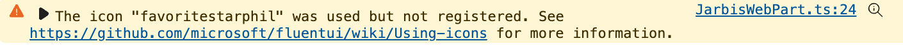

# Lab 4: Working with Icons

<details>
<summary><b>Legend</b></summary>

|Icon|Meaning|
|---|---|
|:rocket:|Exercise|
|:apple:|Mac specific instructions|
|:shield:|Admin mode required|
|:bulb:|Hot tip!|
|:hedgehog:|Code catch-up|
|:warning:|Caution!|
|:books:|Resources|

</details>

<details>
<summary><b>Exercises</b></summary>

  1. [Using FluentUI Icons](#rocket-exercise-1-using-fluentui-icons)
  1. [Making icons pretty](#rocket-exercise-2-making-icons-pretty)
  1. [Making icons even prettier](#rocket-exercise-3-making-icons-even-prettier)
</details>

<details>
<summary><b>Starter Code</b></summary>

If you skipped the previous step, or just want to start here, you can find the code ready to go in the [Lab 04 Starter](https://github.com/SPFxHeroes/JARBIS/tree/Start-of-Lab-04) branch.

</details>

## :rocket: Exercise 1: Using FluentUI icons

FluentUI is a design language provided by Microsoft and is used all over M365. There are React controls, themes, icons, and more. It's a big topic and something we recommend looking into further.

For our purposes, we're just going to be using some of the icons. We've already seen where we could use the icons for the web part icon shown in the authoring canvas. Now let's take a look at adding them in our rendered web part!

The FluentUI Icons can be accessed in multiple ways. The traditional way is to use predefined icon classes that will use an icon font. You can reference that font via CDN, by using utility classes (that's what we'll be doing), or even generating your own subset of icons into a custom icon font using https://uifabricicons.azurewebsites.net/.

There are also libraries specific to react to provide icon components and to easily integrate with other react controls. Additionally, there is an SVG package that makes using the icons as raw SVG files easy.

Like we said, big topic. But when it comes to the icons, in general, use the approach we show you for non-react apps and use the @fluentui/react-icons and related packages/tooling when building react framework apps.

1. In **JarbisWebPart.ts**, replace the word `Logo` inside `<div class="${styles.logo}">` with the following code:

    ```typescript
    <i class=""></i>
    <i class=""></i>
    ```

  > :bulb: We're using the `<i>` element for our icons. This is the [Idiomatic Text](https://developer.mozilla.org/en-US/docs/Web/HTML/Reference/Elements/i) element and was originally used to indicate italic text similar to how the `<b>` element can be used for bold. However, this usage has evolved and it's common practice to use these for icons (`span` elements are the other common option). We're following that convention here, but know it isn't doing anything special and could easily be a `span` or other inline element.

1. To display a fluent icon, we just need to apply the correct class. There are some predefined classes you'll find out there (start with `ms-Icon--*`) but we're going to use a utility method that provides us with just a little more power.

1. Let's add an import for the `getIconClassName` utility function to our imports (right after the `import * as strings...` line):

  ```TypeScript
  import { getIconClassName } from '@fluentui/style-utilities';
  ```

1. Let's adjust our `<i>` elements within our logo to use the utility class to load 2 icons (ShieldSolid & FavoriteStarFill). In the first element, set the `class` attribute to `${getIconClassName('ShieldSolid')}` and the second element, the `class` attribute should be `${getIconClassName('FavoriteStarFill')}`. Your `render` method should now look like this::

  ```TypeScript
  public render(): void {
    this.domElement.innerHTML = `
      <div class="${styles.jarbis}">
        <div class="${styles.logo}">
          <i class="${getIconClassName('ShieldSolid')}"></i>
          <i class="${getIconClassName('FavoriteStarFill')}"></i>
        </div>
        <div class="${styles.name}">
          The Something Hero
        </div>
        <div class="${styles.powers}">
          (Primary + Secondary)
        </div>
      </div>`;
  }
  ```

1. Save and refresh your browser and you should have a couple of icons! Fancy!

   

   > :bulb: We could have technically used `ms-Icon ms-Icon--ShieldSolid` and `ms-Icon ms-Icon--FavoriteStarFill` as our class values. However, there have been occassions in the past where those classes were inadvertantly undefined on certain pages (bug). Using the `getIconClassName` generates a class and applies the styles for us ensuring it's defined.
   >
   > Additionally, while you won't get a compile error if you pass an invalid icon name, you will get a warning in the console telling you that icon isn't available. It isn't much, but it can help when you're desperately trying to understand why an icon doesn't display.

   

#### :books: Resources
- [Flicon Icon Search](https://flicon.io)
- [FluentUI Icon Font Generator](https://uifabricicons.azurewebsites.net)


## :rocket: Exercise 2: Making icons pretty

One of the nice things about working with our icons as an icon font, is that we can apply styles to them just as we would text. This makes it easy to control the size, placement, and color. So let's make these things pretty!

1. Working with the same `<i>` elements as before, add a `style` element to the first one, and set the style to: `style="color:skyblue;"`

1. Set the style of the second element `style="color:orange;"`

1. Save and refresh the browser to witness the glory of color!

   

1. Your `render` method should now look like this:

  ```TypeScript
  public render(): void {
    this.domElement.innerHTML = `
      <div class="${styles.jarbis}">
        <div class="${styles.logo}">
          <i class="${getIconClassName('ShieldSolid')}" style="color:skyblue;"></i>
          <i class="${getIconClassName('FavoriteStarFill')}" style="color:orange;"></i>
        </div>
        <div class="${styles.name}">
          The Something Hero
        </div>
        <div class="${styles.powers}">
          (Primary + Secondary)
        </div>
      </div>`;
  }
  ```

#### :books: Resources
- [CSS Named Colors](https://developer.mozilla.org/en-US/docs/Web/CSS/named-color)


## :rocket: Exercise 3: Making icons even prettier

Now we see that we can use some basic inline styles and our icons will be affected just as if they were text (which technically, they are). Inline styles aren't normally recommended as things are easier to maintain as a separation of concern (code here, styles there).

Having the colors be inline and setable in code will make more sense once we start making this thing dynamic. For now, let's switch back to applying other styles through classes.

1. Open the **JarvisWebPart.module.scss** and replace the styles for the `.logo` class with:

    ```scss
    .logo {
      position: relative;
      
      .background {
        font-size: 96px;
        -webkit-text-stroke: "[theme:neutralPrimary, default: #333333]" 1.4px;
      }
      
      .foreground {
        font-size: 48px;
        -webkit-text-stroke: "[theme:neutralPrimary, default: #333333]" 1.4px;
        position: absolute;
        top: 24px;
        left: 24px;
      }
    }
    ```
    > :bulb: By now you may have noticed that unlike traditional CSS, we're nesting child styles rather than having each style have a specific selector. This is one of the benefits of SCSS. In the end, it will generate all the specific selectors for us but lets us write the styles in a far less tedious and more understandable way. It'll handle composing it all back together and we get to just use our classes.

1. Back in the **JarbisWebPart.ts** file, add another import below the `getIconClassName` import we did previously:

  ```TypeScript
  import { css } from '@fluentui/utilities';
  ```

1. In the first element, set the `class` attribute to `${css(styles.background, getIconClassName('ShieldSolid'))}`

1. In the second element, set the `class` attribute to `${css(styles.foreground, getIconClassName('FavoriteStarFill'))}`. Your render method should now look like this:

  ```TypeScript
  public render(): void {
    this.domElement.innerHTML = `
      <div class="${styles.jarbis}">
        <div class="${styles.logo}">
          <i class="${css(styles.background, getIconClassName('ShieldSolid'))}" style="color:skyblue;"></i>
          <i class="${css(styles.foreground, getIconClassName('FavoriteStarFill'))}" style="color:orange;"></i>
        </div>
        <div class="${styles.name}">
          The Something Hero
        </div>
        <div class="${styles.powers}">
          (Primary + Secondary)
        </div>
      </div>`;
  }
  ```

1. Save and refresh the browser and your web part should look something like this:


  > :bulb: The `css` utility is a css class concatenation helper which can merge class names together (dedupe) and skips over falsey values. It isn't strictly needed here as we could have just put the 2 classes with a space between to have both applied. However, using this whenever you've got 2 or more classes to apply will give you a lot more flexibility in the future. For instance, you could do something like `css(styles.someclass, isVisible && styles.visible)` where the `visible` class will only be applied when `isVisible` is true. As the complexity of your styles grow, it can be nice not to be in the space adding business.
  >
  > :bulb: You might have noticed something different about our style imports compared to all the other imports. Most imports do **not** contain the file extension. At first glance, it looks like these do. However, what's actually happening is that we aren't importing the stylesheet directly. Rather we're importing a file SPFx has built for us called `JarbisWebPart.module.scss.ts`. These files are excluded from VS Code but can be seen in the file system:

   

   >What we're importing is the mapping of CSS classes to TypeScript which is what allows us to select our classes in code (rather than using a string) and takes care of the hashing to avoid conflicts. Wowee!

If things don't look quite right, review the `render` code above and ensure your **JarbisWebPart.module.scss** file looks like this:

<details>
<summary>:hedgehog: JarbisWebPart.module.scss</summary>

```SCSS
@import '~@microsoft/sp-office-ui-fabric-core/dist/sass/SPFabricCore.scss';

.jarbis {
  color: "[theme:bodyText, default: #323130]";
  color: var(--bodyText);
  display: flex;
  flex-direction: column;
  align-items: center;

  .logo {
    position: relative;
    
    .background {
      font-size: 96px;
      -webkit-text-stroke: "[theme:neutralPrimary, default: #333333]" 1.4px;
    }
    
    .foreground {
      font-size: 48px;
      -webkit-text-stroke: "[theme:neutralPrimary, default: #333333]" 1.4px;
      position: absolute;
      top: 24px;
      left: 24px;
    }
  }

  .name {
    font-weight: bold;
    font-size: 18px;
  }

  .powers {
    color: "[theme:neutralSecondary, default: #666666]";
    font-size: 14px;
  }
}
```

</details>

#### :books: Resources
- [CSS Modules](https://github.com/css-modules/css-modules)
- [SPFx CSS Recommendations](https://learn.microsoft.com/en-us/sharepoint/dev/spfx/css-recommendations)
- [Use theme colors in your SPFx customizations](https://learn.microsoft.com/en-us/sharepoint/dev/spfx/use-theme-colors-in-your-customizations)
- [Available theme tokens and Default values](https://learn.microsoft.com/en-us/sharepoint/dev/spfx/use-theme-colors-in-your-customizations#available-theme-tokens-and-their-occurrences)


## :tada: All Done!


In our next lab, we'll look at using properties stored with the instance of your web part and use them to replace some of these hardcoded values!

# [Previous](../Lab03/README.md) | [Next](../Lab05/README.md)
