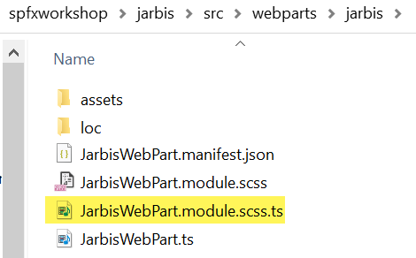
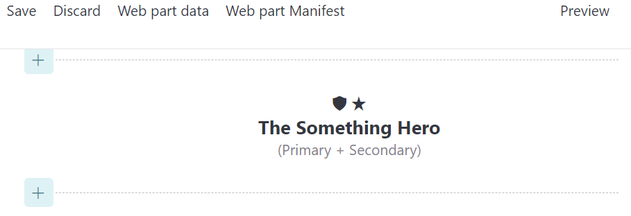
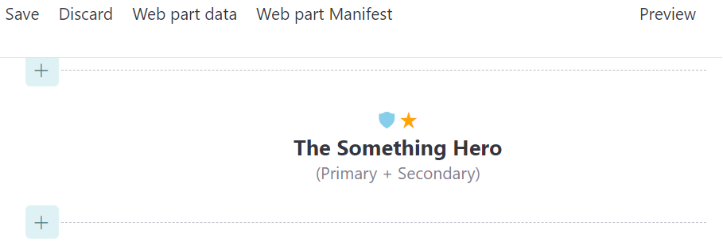
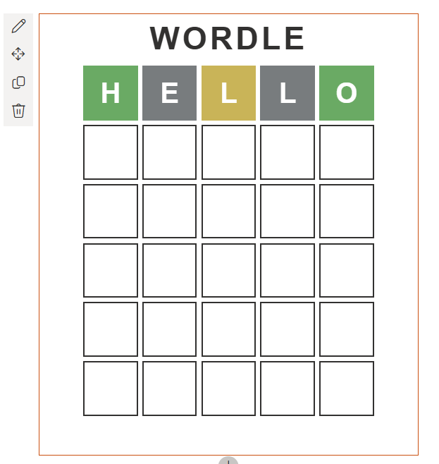

# Lab 4: Working with Icons

<details>
<summary><b>Legend</b></summary>

|Icon|Meaning|
|---|---|
|:rocket:|Exercise|
|:apple:|Mac specific instructions|
|:shield:|Admin mode required|
|:bulb:|Hot tip!|
|:books:|Resources|

</details>

<details>
<summary><b>Exercises</b></summary>

  1. [Using FluentUI Icons](#rocket-exercise-1-using-fluentui-icons)
  1. [Making icons pretty](#rocket-exercise-2-making-icons-pretty)
  1. [Making icons even prettier](#rocket-exercise-3-making-icons-even-prettier)
</details>

<details>
<summary><b>Starter Code</b></summary>

If you skipped the previous step, or just want to start here, you can find the code ready to go in the [Lab 04 Starter](https://github.com/SPFxHeroes/J.A.R.B.I.S./tree/Start-of-Lab-04) branch.

</details>

## :rocket: Exercise 1: Using FluentUI icons

FluentUI is a design language provided by Microsoft and is used all over M365. There are React controls, themes, icons, and more. It's a big topic and something we recommend looking into further.

For our purposes, we're just going to be using some of the icons. We've already seen where we could use the icons for the web part icon shown in the authoring canvas. Now let's take a look at adding them in our rendered web part!

> :warning: There is currently an issue with the referenced versions of the Fluent UI packages included in SPFx starting with SPFx v1.16. It appears that there is an unintended dependency on React that will prevent our code from running as planned. Fun!
>
> Normally you would be able to use a couple of utility classes (`initializeIcons` and `getIconClassName`) to easily reference icons. Instead, we're going to take a slightly different approach to account for the issue that affects our version of SPFx. In the end it's about the same amount of code, but it isn't particularly repeatable in your own code without building a custom icon font at https://uifabricicons.azurewebsites.net/. That's beyond the scope of this lab, but we're happy to go into details if you're curious. Just ask.

1. In **JarbisWebPart.ts**, replace the word `Logo` inside `<div class="${styles.logo}">` with the following code:

    ```typescript
    <i class=""></i>
    <i class=""></i>
    ```

1. Create a new file called **HeroIcons.module.scss** in the **src** > **webparts** > **jarbis** directory (same spot as the other files we've been working with).

1. Copy all the code below and paste it in the new **HeroIcons.module.scss** file:

   ```SCSS
   .heroIcons {
  
      .iconAirplaneSolid:before { content: "\EB4C"; }
      .iconArrivals:before { content: "\EB34"; }
      .iconAsteriskSolid:before { content: "\F34D"; }
      .iconAutoEnhanceOn:before { content: "\E78D"; }
      .iconBalloons:before { content: "\ED7E"; }
      .iconBlowingSnow:before { content: "\E9C9"; }
      .iconBugSolid:before { content: "\F335"; }
      .iconBuildDefinition:before { content: "\F6E9"; }
      .iconBullseye:before { content: "\F272"; }
      .iconBullseyeTarget:before { content: "\F5F0"; }
      .iconCake:before { content: "\ECA4"; }
      .iconCalories:before { content: "\ECAD"; }
      .iconCat:before { content: "\ED7F"; }
      .iconCircleShapeSolid:before { content: "\F63C"; }
      .iconCityNext:before { content: "\EC06"; }
      .iconCityNext2:before { content: "\EC07"; }
      .iconClassroomLogo:before { content: "\EF75"; }
      .iconConstructionConeSolid:before { content: "\F339"; }
      .iconDefectSolid:before { content: "\F449"; }
      .iconDefenderTVM:before { content: "\F6B3"; }
      .iconDeveloperTools:before { content: "\EC7A"; }
      .iconDiamond:before { content: "\ED02"; }
      .iconDrop:before { content: "\EB42"; }
      .iconExerciseTracker:before { content: "\EACC"; }
      .iconFangBody:before { content: "\ECEB"; }
      .iconFavoriteStarFill:before { content: "\E735"; }
      .iconFitWidth:before { content: "\E9A7"; }
      .iconFlameSolid:before { content: "\F1F3"; }
      .iconFlashlight:before { content: "\E754"; }
      .iconFreezing:before { content: "\E9EF"; }
      .iconGlasses:before { content: "\EA16"; }
      .iconHealthSolid:before { content: "\F33F"; }
      .iconHeartFill:before { content: "\EB52"; }
      .iconHomeGroup:before { content: "\EC26"; }
      .iconLadybugSolid:before { content: "\F44A"; }
      .iconLamp:before { content: "\EB19"; }
      .iconLightningBolt:before { content: "\E945"; }
      .iconManufacturing:before { content: "\E99C"; }
      .iconMedical:before { content: "\EAD4"; }
      .iconMegaphoneSolid:before { content: "\F332"; }
      .iconMessageFill:before { content: "\EC70"; }
      .iconMicrophone:before { content: "\E720"; }
      .iconNetworkTower:before { content: "\EC05"; }
      .iconPermissionsSolid:before { content: "\F349"; }
      .iconPinnedSolid:before { content: "\F676"; }
      .iconPinSolid12:before { content: "\E352"; }
      .iconPlugSolid:before { content: "\F301"; }
      .iconRainSnow:before { content: "\E9C7"; }
      .iconRibbonSolid:before { content: "\F345"; }
      .iconRobot:before { content: "\E99A"; }
      .iconRocket:before { content: "\F3B3"; }
      .iconRunning:before { content: "\EADA"; }
      .iconSearchNearby:before { content: "\E820"; }
      .iconSetAction:before { content: "\F071"; }
      .iconShieldSolid:before { content: "\F340"; }
      .iconSnowflake:before { content: "\EB46"; }
      .iconSplit:before { content: "\EDBC"; }
      .iconSqualls:before { content: "\E9CC"; }
      .iconSquareShapeSolid:before { content: "\F63D"; }
      .iconStarburstSolid:before { content: "\F33C"; }
      .iconStreetsideSplitMinimize:before { content: "\E802"; }
      .iconTestBeakerSolid:before { content: "\F3A6"; }
      .iconThunderstorms:before { content: "\E9C6"; }
      .iconUmbrella:before { content: "\EC04"; }
      .iconWeights:before { content: "\EADB"; }
      .iconWifiWarning4:before { content: "\EB63"; }
      .iconWindDirection:before { content: "\EBE6"; }

      i {
        -moz-osx-font-smoothing: grayscale;
        -webkit-font-smoothing: antialiased;
        display: inline-block;
        font-family: 'FabricMDL2HeroIcons';
        font-style: normal;
        font-weight: normal;
        speak: none;
      }
    }

    @font-face {
      font-family: 'FabricMDL2HeroIcons';
      src: url('data:application/octet-stream;base64,d09GRgABAAAAAC/QAA4AAAAAT2wABHXDAAAAAAAAAAAAAAAAAAAAAAAAAABPUy8yAAABRAAAAEgAAABgLZh+GGNtYXAAAAGMAAABRQAAAxr2o9itY3Z0IAAAAtQAAAAgAAAAKgnZCa9mcGdtAAAC9AAAAPAAAAFZ/J7mjmdhc3AAAAPkAAAADAAAAAwACAAbZ2x5ZgAAA/AAACXxAAA87CXl+19oZWFkAAAp5AAAADIAAAA2BIPT4mhoZWEAACoYAAAAGwAAACQQIgfjaG10eAAAKjQAAABVAAAAjBgWDnVsb2NhAAAqjAAAAIoAAACKLD4drG1heHAAACsYAAAAHQAAACAAZwI+bmFtZQAAKzgAAAP3AAAJ+pCX8lNwb3N0AAAvMAAAABQAAAAg/1EAu3ByZXAAAC9EAAAAiQAAANN4vfIOeJxjYGH/yjiBgZWBgXUWqzEDA6M0hGa+yJDGJMTBysrFyMQIBgxAIMCAAL7BCgoMDo+Dvr3kAPMhJANYHQuEp8DAAAAS/wlVeJxjYGBgZoBgGQZGIMnAJALkMYL5LIw/gHQVgwMDK4PV46DnCs9Nn4c8733B9ELhpevLWS/nvFz+8vjLky/PvHz/SuzVmVdXXt1+Lfna5LXTa7fXPq+DXie/fvaG/Y3am4I3VW+WvFn75vVbprd1b+vf7nlf+qHw4+dPRZ8ZPxt9Nv1s+dnms/1nh8+unz0/+35e9nnzF6+vH77Zfiv7tvnby///GRhw2H0Mxe5bGHazkGW3J9BuG5jdMh8lHktclNggUSH+X/yR2GGxfLE8sRQxNzFXMWcxTTFmURdRW1ELUUaRByKXRS6InBbZKrJDxExEUvi38CbhlcKNwuXC1sKqQquFVgrlCWzj381nxbuHV4+XhZeB5zcQfuH5wfOW5wXPY57JPO3cn7h8uZg4T3H2cUZC4mKgACPbQNo+OAAAuaXQigAAAHicY9BiCGUoYGhgWMXIwNjA7MB4gMEBiwgQAACqHAeVeJxdj79Ow0AMxnMktIQnQDohnXUqQ5WInemGSyTUJSUM56WA1Eqk74CUhcUDz+JuGfNiCMwR/i62v8/6fL9zp/nJfHacpUcqKVacN+Gg1AsO6u2Z/fkhT+82ZWFM1XlW92XBagmia04X9U2waMjQ9ZZMbR4ftpwtYpfFjvDScNKGTuptAHaov8cd4lU8ksUjhBLfT/F9jEv6tSxWhtOLJqwD916z86gBTMVjE3j0GhB/yKQ/dWcT42w5ZdvATnOCRJ/KAvdEmoT7S49/9aCS/4b7bci/q0H1Tdz0FvSHYcGCsKGXZ9tQCRpg+Q6E/GTGAAEAAgAIAAr//wAPeJytewl8U9eV973vSXqSd22WLdmyJVmSFyzbkmXhBUu2wdghYIxtFps1GLMnbAYSCDwIWwIOW0rbSb6GQMiU0GTa7C3TRm0CSX/TLA1tZn6lQ5JfSqaTJt830/naBlvv+TvnPkkWJp35zfw+jN677+7vnnPP+Z9z7iMceYYQ1QH1dsITgZCQ3qF3O/SOZ/gbsVe4V6S7iHr76COPqeYQ+KfDixb+4H8JKSc+EiCNJELaySJCqEVHQ1Qf0PN+lZ0zmE1cFqdyOUt8HBesNTRzJdROLQ4vFRzeMkyq/SGvQ7BTdzMNOdjFQuuCtT5ok6Uymyzqnn65R+7pp6Y94RGq/t3lQ52dhy7/Th4bGZHHEk9ULfnT8rP4X1jk8+X03TzpS/mBxm/20xf3PaCX/o9l9ll6deNrM+Sl9Mus/DTphTxuni4y/PRbN3ftuvnW08MRnUY7IPfQ5wbkL7l06U98+teNMBIffYw4wkV7x8nevb0P+zeXLG4vLOz2/83KfUVhx15KwhGlS6X7SBiXSkVEAosK69VJlpBz5BKskl1tNmVxQhbvcvo4r48P1jarQkG462ubuUbqgWcu4LdzZpPAbnqsTU12yGyGhfRxsDyc0Q+Nmik+en3Uy3rU+3MhR1/rcTmcGmhmp3UBvY+fRrMojGY25Vrsaj6g1zhd5dSrJp61WzYtDIW6l3ojI6dOtk0/cWok4l3aHQot3LRlraewymmw17aXOp2l7UuCwSVKqtZucFYVyhGTy2ez+VymxF2s2PLg/p2rXGlWq6skLXK83TmlXGuo9Fo9VpnAxVtp0JZPcbYfj6SVuKzWNOfQzv0PbjGLOcU58J9bqzY7fOEuv39OY3lmrt2g1RrsuZnljXP8/q6wz2HSnEsrqa63cwRn0DQdZ4Ozmt6EM5SJvb66JI3/U+qE4H5rlTrTXFxRqLVlZRXkG9X2kvTvZhgytJTbStNsBRzMC2dXYEuj0gjVQtF300vsamN+QVaWTVtYUWzOVPNE2kcpITz8iEYEOlqIl8wCKgLtGMECjgSNXG5TLjzVJSlAMbeCmh1mR9ARdLEWAT0S0oGU1HNRfB18BeXFMCVFPdbEzKweFYnc+1jv55RIIiWf9z52b0ScMmuonuutH5o1hSPYQCUmmo6xVBTbqkS8xqLyGdYG/mE/dJ18BhtiF3QdURPCAWdqRGDQdKInZuKA99I7KGx+HV5oQO8S9NSlD1B/rtmkcTmBN+u0RHaPk9HrajclowMqcUxUX3e7r3NEFGNscPhpIJcSDn4SoaIk8uJ1uY67EBM5wsrhlypLsokR1tVGiogLVreChEAK1YaAe3FYgeLAbC7ekIWHpcQ0tQheWNlgFQ1ZUmdHjKqoEbo3jkXwpoZXf++VgZePjhMKf6JIu+CJwmNN/8sDcmN8vhErNoMkNvMIvxknR18eeEX+gSiL0BDTtEsUh/tfGZA/TL4ATc4f3oQaddRIHTbqUB/5SoJX/ko6wuf827/xObw19hn9QjbxVvoZsBNh7fZqiSCSQpQGnAm2p476uFqQgM0U3rkofhdWBGe6XDODsSdjTyqpOVc3brw6Z9kydtd8EtxzZOTwnmDsLL88uOfwyJE9wdnz5s1evhyuBIn7FcieAS0KoGwYyaH86eIJ1VvcY2NEvkFFOcyJ3HtjN1REugZPXTKhP5VFNRkDhaAmX4kquMdw5gQemTwTokxXzCdDZB30HDC73PCjbCe4kgLIpewPxvnTkI2CyrOPTog4jWDGDVSINDUr24VO3kZAcg7oiBxGf+1qrrKJ+YbRDw35os0XdtG+PlfYZxPjD4WuhARwFdI+Vlm0VTW7+iSSb+DLDfn5hhg0BWYQ8RWhW5lguVxBf42FeGetsLs+SlgXv9Q3ORPCxdmk/yXrcJwoA9MKbEefxatUAcujSfJFDWkmd5N5ZCnZAqtkdgW9IWBTrwCpkJcHFWjWB4CHA7hOIYo0t3MWzIZlAUUaF/VmPSpLphnhWVADuxhDRligWo9XsPNuto4gflC+QEdaIm7kS2umuDeIJ/kxeQ3HizEiTl3x0N3c8pLlta6ZYX82FXXa9HTt2OmEbKcHmoecnKEE3zDkppWGoOXKcE6h06gd1mQY8scWTJKt3PXrF+7lcw0bL1w/IXB+eSCnKCcWFUU+cvfh1RE1t9VTavYGHbFnTOXmvCqzVjLykYTUjkVVFy299ZzTE8DevF8U1uTJM/3jxGMzufX+7GJrjjhZvyi6FLaOFiEK8l4OySfECFLKDXiFomgQQM6qQ8AsmIaKX8EWu0XopflffDG/jz4rz+fH++T59Nk+yBDIKGEczlXM/8Mf5veJffAfUjgOr9APxukmm8gO3KM8W2BHyJHQwD4eKSP4KCMQE+mCQoBQgrtzLc08IyiQqJkPTWoBpUBuI3UZA7xD80l47ezyprXHumRgcYILVdaxrC5jzvYzvbOPbukxTlnX0Dq8wO9fMNxKSSS65Pz9M/NmdjetPTo33Zxu61u7q6X3mzu60nu/tXd5LMM5sHFXa3pDz9r65vv66tT2Vhd2WFEWjm686xVKPo5+LNII/3/1M+/Z2Tr36NomEYkSWjLDO29kdYN/4e5OTxkOhAOKM+8/v2TWjLqz/V3H1jZR2rSsraRx9aM9upbVR1z1y2b6tFOXz/BWdq1v1puwl7p7ShatHIOdSkFuKmsp4lqqRRImXeQErCXK6mxqUSQ2gBdTbhYsiQ/YGwERiPAw9aIgZ0tX62GbgmrMzTzNneDykDFOEyGoYKCvIYjAkBUQIk4H9b9Y3cXt7cUea6bNlp/G6Wx2e4GOT8+z2TKtHixxWzMLoITXFdjtNh2Xlm8rkL7Kyp/S4HA0TMnPOsU/hWRyty2rb5zxV+kzrefR1Y24bHd1etfvPXH3kksnNnAwaImxrMxYYnOnZ+s1Rn9lUVGl36jRZ6e7bUqJ1ZOekzNRkpOTLv/YXoQD4wSK7NRFFZJN27y0w3TUNTzj60n2QPqcHWd6kUPyW9Z0ehvWnozvHcbTIuj4FeQp8ilQgrF00JECKs2uuFymcZlSkbLogVQE6giW0ckN6X+fpgGFG+h/WUcDLMPk4h39awjumzFRJSbkC95F3BuMZ0ki+1wSyIJ0qbJaqxTpMiqqRSomnhiWhXqxy0CyjIIUPkFuyIjziY1xUAqfQAbwltT/18utXkN2e3u2wXtnr2oxuQsTc8WZw2vJP0hkNrQnipSZVlnZTBMJnDpWiC1gLDaJkRIs9leYT/Xxf1bBUKArK9MVGO7kT8IwRkImI1/9/+ep/xl1J3SHQt3bLBWo999b8dtap3aOFRR9QcEyALXfTx4nPwCt5GdvpWJQDlQ3A3MAZCeSGuH2bDtfiEsnaFQVaFi4nBoBONyRsDFo3MoTFJALYGHiIUxvT2NbV9y29HgBxPsVZWSnuNAhB6iegFjud5fYqu8KN07vDpVML6T6In2GzWBzZxZHinNK8q2eTK1zhivHlWf1ZIT3RZydjZ5Q76rKk/LPHxfL2xqmOmxVeZ7ZFTIzYGApBJvNU5Y55/HZQwx7WwvTXNOdS1m6tThctI6lFuUFHAWg8ko7u5aFi2srPHqNCvSw6Ag1tIJN4nW1eBa88cZrs29t91jVYml1qae+td5jMXEZ+RkZsHFMBpPboHd4rDmmDH1xdg7sUHOOdUpeZtnU9rLiqf0za/WhClOeKTPDaGJGVRQJJZ3NKbKZ1fa64lUA8LOLCq1pOQ79Ugb22wwe01qWWmT05plK724qMRSX52l5mY4T6Mlk1KfpbIGKCJoryOtxXLeArEdNpvCzABcVLLdqGkUb3sHoW0H1CdbWK4ZJwKFXKivZrDJQ0pjK8VCmibZuWxDwTF86dUr31uPPDAw8c3xr95Rdr++fTiNod0Qbt/zthlXPDEeYqUUj0/e/vmv2w5fvu+/yw7OnLp3uQTWQMAjjd7UYWLCttX5NT0PG0KKLZ3b3+/39u89cXHQzffkT7+7kfGjMyPPWfe+B1uZtF4boG/gsfbDz3SeWp99cf+VMf/+ZK+uHMhp61tTj1GSS0jW7K3o+QkQhCvoF/RzPTKwOMHEVFUDd6+N7fhrjVkccrAYciJcUOyFpE8AyWfiEGo+vD0W866NZ1OMF0xR42N9MQUk00vhyK3YimgtoPYRAjRRRHBQqgiXhZZuDZQpJU1uOWo2nh64ZE+8hnjZa5UiilLrnBpmbA21zRSRYq1pKR64ndn+eryTX4KimK62ekqntrfU58inpusfqtqm0KpubkUc0jhPoUyHVhedhFxiZlen50mhEK9X4vDq5msZTq65B3aQ1f1M8lZxZl2V5gyLFEjKpfHakOvMYRxLiyOioyC/wu80S2NfFBVo1L+TQjbJo9VR1zOuowiHhZWEymHqODT7OnAx01f9WZmV8Dmw7DdEIo8IoqSIBsMEbAbOhT0/lFbxxPQ4CxBvy6lSWkCWumJFWOipQN9iwXEjHCVQYEOWbclQaoGH5M/FsNM1ssWVbPdnmPN3rT4rURiPcBfmn1DqpaLRCvj4Dujkk/WYV5+auU/cM+TpVS9eHOLTi5c9oWBqQo/JN8cnXdXnmbNjLNos5LXpWpFb5p9wFGqG2SUWjH7NODnKeIem6xs36ly5z7lXSb+I4nyr+DwPzOsS1F++wwI+iVap2MCvL5fBwXleuweIAUetCr4MgImluRUG3FFNyFsaOcIxzbg2qf4vrKm2e81T37NKuMukrbY52p7B4FEwjrABGLCdK2HwN0uIcnfbUU/LPngK5K4EtSigV434mI8wnNyFaAPFSTXuDr2f40acXLnz60eEe31Sujd+yRVQelIK9W1THCb5UDjEKm4QvSTXST0BPiR4uYCMxQwnMI138TvVwAWtJT0Osno6GhC7H28HdYenGc/2nT/c/J90I7w6+7fiSc0o3vmQlnFMp4ZxKiXSDc37Jq3YHf+74kjZKDz/Xf+oUlO6Qr3zp+DnUhz3aGGal8hVuh1IqPUwblVL5inwlrPhERCZb81NlBzoqBJeRD1gwKSQ3p/SxLMp/pkRa1/bjDRt+3MadGSc0jYoT20lC0wPpIjKfi+KHxXW1AWfPAQlOmJ2dMCjqQvqE+FEwCKjOpPmdRVESGeNWYFxyhfQBmi4IZFpb+wPnlyw5/0B72zSGwVFGMiGueCcVjyWU7E94VBNeVFEm4vxHHp23ZKXIfRV+aiH2gX0tfCrMv40doNi+FcVOe3YGVUm5FSPBnT0I9emfmFc0kc+8oPQosBfhVNJu7lvyGvqB9DxPbsMofWQdrgX1W6jZqWGwQ3kljwuFZ0JIw2MQBaYF3xrRhRc2g13FYI3DjfBbEQd1lEE31lNcWscXENbUAcvH8tUkJ5P71OpBuwhNE2T9iTT3aWaO1ZhWaDV4rPkuvVxA/90TqnAWOc1muFSEPPTf5QK9C2CJAZCFUe5H2CuDOkysN8fWm1NrpT8hPIZsDRHk40dAAuMIOBJuykQaxOIRulkwpuUX2HOsHof+j8YCZ4GRXf7IAIa9ID/NKDGrAPpImHYyo0Wu319jxhlEMJ/hgn+BPftt4C0TySPEzdy9esa7ytJNoy43iBQVkCAGEkNaTSv4xbRCXo3LIErfVs35tbQYdr+K8FCBaYsoSAkFbhDkW5BRHMhnHckEnF1J6kkHITrqcOs4dJslXG8p3EnrpnABszODagRjM1cCSRW6jUBomzG24uJAXo2J/D/Iw/IwnYUOYlV0EmyIrdxItbSUtvztWfkd+fdfDe6b+6tbNPf0iPyX3/+07dvFI1f/eECRPpnoBN7E58Y+53LkaARecTJE4O7b8+aRmeLMQ2/ulsd3vXGkQ7zr6JVd8jviPz4+X1SEF7Ak7YN1vKRl1qpOpSLcJalP6uMuoSsH01pca9jWwoOAM9aTw8jFKgvIZVPcovAgSFYgMIY8KIBpyOK9+gkmT9iVSXSWxScrTrRlRGtWA7iw+LgSF1s8BtctiSsffZV2H3r4MT3V6XMzNHqNNkNTtrxl2oYSXaags5vqTHZdtqPUX1zWvqS2dkl7GYYcMNRgdvms+VUuc7G/1JEdryhk6ko2TGtdWp5u0YOd1bXv0rufc+Pl3R7347+Sx48dk+Vf/Y3b012+4mJd3cUV7CqIBx8U5Ss/4nguw2JI5zmVTqgOhmoy8jP1ZrO+wOe26qQOHBgngJEYjMFYfS4zToB7TWd1+wqwZmZ+Rk0oWJ2R6bWqHvzsylNbmqWIwXD4k3P9/ec+OWwwDHR3D+APeREElma/8DxwYRFwYZjMJ/eQVWQt0AG9MB5vSHFdxiWl4FVyKXrE6kIWFKO5ljjuTT5CferiHbyLTriFvQqMY8o3nQaMUKx6urKmpnJRZMaMyAv+rrqCgrou/6KeRYt6pErMW4Sl8p9uK+Hmg7IeOTRfemH+ITri8iaYMRGksD44Ks6XX5iv+qxiUzi8qWJx85OLFj3ZzJdUb9lzpL39yJ4t1Yvnvrd163tzpalK0WKlovzFHTXoqcou29gCSsaJ6qKtqzLO/HmJYIH8Z/kRWcRiQtIVXSRcJ5ZkxGMCcbXhzta79BhHdcAdJElQuQeMeEFvZzBg5if90LtshB8fv6sJB6Ap/h9kDgHpIgLwEFEGJf/xJJ4Qrkvi6AW1m4rywFjCNz4qamDCYHyTGMvCHsYn/XhRudP4M7xfVlLX8iyypER3lLebSWaRLtLD9C/Glb7ul4gi+DiwouKvjsvA7jQQdGFAgCoZKGNv++Pic8GfnJKm4rrLR+eK6E3AfPiPIQAokdgLICbjSSyeiX/jt/1UKU+SOJGm4tyjl9ch2EAHwpiIy6SJt8c/mI6M/StrmlzulBiBEei/mGwlx8n5FOQTF+OTrUN1KgYJJRycuZaUmDHsO7YLqcmCjgWaGjRGVcwkmIXtzCrYclXUw0omDUQjCQCSUH6TtIOmxNfptyWgT9rCk2vqB574YIehxKBNaGVn8/xAbdApn3O7Wu2aDE1qD5JYOW/LjOZ398xstRXMnqFyzSinnXNQQSu6vLZ/5/TI5t4a6EsxXxPT+HoTdI593vL1oQSA8k8p3HDie0t2fPDEAAfYJPEmwZXdTdmdF/tnHuG7mmuyS/MoTelHWthxeHNv7sYHzTUbpi77XoQWlhuoFeDC2Kc4bvtwX3Vw0dZwXOcjXnUzf6pGiZkCL2rJ6HUMjQqwcWQ3va6GbaBO4vk8Ukg8pBUkJnJ+goh6F2xuLzQWoA9LKOgyuuI2K42HxyaqKvIRdDgL+psFbxCD+kDReAuNmNS7yNgUGV8WIxj+ZSZ95OtAaUGV02h0VBdEIoVVDqPRWVWAdXlRSmJtDrCIW6QD8gVRus5db2m5ECMS80UIEVzWWYcrR8cTldW08vAsRiNtTklFncs+FTDpS5HIS4BUp9pddRUlOaOvYVvETbiIghInw9MjJgPo8gmLB3SEnbfEtYByTIJrpAqjcl6wyOJHGpIo3qvgdDU5sHv3gdDgsUtvrlv35qVjg6GS6YNhIc9Rnm8qtrkFTUGFPQd5NTJODv7r84Ob1u3/RmbPyJoGX6XRXATv4GuvqzD4Kgef/1ch+qL8wd698gcvKh0pnfae+8aBkKe7q9Oe77GlG3Rlc3v7/chsX4nQ5uA3qWrdQ7TptfSuHd/snbO32VrvKG0P2l31HSWdF+fjiCyOqvjj3wHp6ID3DwKmIzSOqRnkpkzQx7d1IRjGDJarwQrC94XSfM6hV4EuyzGbNRqzOcfDe74iKjHbbBYEszkbaB/Fu2RWvyKf+mfIHvuhQG7BgnusGZ5yT3o6XDKALUT0rlLxLOAWngckMtwHggrui27Re+86gLnjRBYV6CqLCT8Y6C+RtJPvsOhYIU36c8xJv00dO54Cl1CdAewJJF7cDYnvwxzBwLhGJubjh18CeIBlGrwpukGZ6aD4eUC/MRoDhQUNnotxsFYor4IYLgiAYgA+0Dznmz21eJTMPbamCT3ECWdJfrXBYOx0rWoZvh8fo83LfdaQC90myLKR3HWI5itMRbkZ6E5BrFTZ6i8r8xVFFQMAYRvbWtUVxbsWD9/v5J1YkfmPmzcv7TDnik3T6W6tr63PJzatOcZc00nvstFgqM5/8+WF35y+i1Y9y/zY5aUWS7wHEIWR1ofkKzhSzeIlK4KK1xLRosgMEpxbVDlBw7ak5aGPVuySf/ns9KaEP0h0ty1t4Ih0w7V9BiNNMtaTS6zEDvxVkvBvsLMUXjxixMLNDiAIzaVgm4AxYdSp8OZ1UJeWZMcihqIiQyySrQO70a5XiXq7loq62DfkD3/B/Sz2kPwOHfyF9Htuo3yDfkFXSg1cJaRfpnRQfkdSRS2GMdFiUYkGiyGbE7P0+ixJzOZ8MjAP/iRRyuU+j23mj+Nd5MhE3JVq0Y/+HfKs4o9hTMKM0NyER5wxSlxdBZMKM9VdaJhgOUVEoJTgmXpjkiSF12rjuN+r8BvH+EvDGIwFMnItfMiIrW87AaPwjQXZDSk1Gln3o6MsHJuII6VGKxL5Rw8P349p0Zgz7f5pNfUsemMu1Bmsem2C8VhRZUgVXNpehvWNer4EqyHW0GZrl+zeUeKNxPGrOqpo0taHwoz1sH330R+tQ+5LRohSYxwY9MCCq3TB8d208pKINTfri7X2pqL8xaHRLpyl2eBcuGSxhxMTbBivYOkJlM5YUidekb97fLd87ZKzpRCrixylW4tld8nSgCblbI86iW/MwHlHyBPkpbh8Y0SIx/lQzCk3V2oR2ASKmEgtQOkHZMqicRd6nT0ZEWQ1KhQBmcBEcaCjcIdb0ZlJcAN6JZGjUdCSBrYYEhXnjyreMzbEbtZkNv8bjOelZuLqH/2n1tbvr8Wn4NL5c8t81YlC5jQY/snBDtQ0s0/t3+CZ+84mVBIdB38y9g+rLwyHE/6P8PAFrid/7uoHZyZyB1+IpKeXq2E5cQjsERGI1cMR5T6RP2Yx1focqbk49oLWD48ufaxmAT7T7NJS39aWRDFWXRB69tp/7Me5lM5a3zanB2e4/z+uPfta1clXrm1OOEk2X3vlJM2569CWxY5kft9sz9zSla8rOoC7piXq54DEerBYOC87eOHAMxgWQUc1p+lG+fTANWmYO3pt7MQ17qg0fG1Ahlz1c/Jp+XT/NfEa/O+nG+lG5VxRFHBSFPilBLRhA+kA25KhYQs7LUlVAtgBnhIGgVShZrDZ1Qz6GPFkBfXq/UpMDIx5PVLWgyk+muPzlWdMP3Fox6LaoR/Ksf8lfkeWfjhUu2jHoeMzMsp9lVXhQ+KWBf55Z379kFi9on+u467nBzvOHHugwjq91D0wtLHuoV+fmZed7t938tudWmIqsKcFj5178fKP+8/KL64SZInywqoX5bP9P7784rljwTR7gSlaufvkuYvPdh9872S3wP+AL/Q1u1a81BHbWdiwqKl1V4N3Rm2xKvY9ofvEe4dcoeL67qCVkiQeKE7aTEZiwxNDjiAVHEE9LKt70uktjXhL5P/SFrub+0ObtFD9e27q2C/kcVotf4uzcIOxo7xXnkpnyJfle+ky+X1t3BrCXwyMHRUZhYHQUyihz3klKI1CGLuSydw4/qoDHBKI+0LjNnsuIjShsHbZofOXh4Yunz+0rDYQNFeH5wZ9c5tceblWrzWzbfu5ZdnPfuMBkftnpYZSe+VPe8vntZS6mub6vM3F7vbOOVXLnn94IOND+fFvPSj/NnFWVmTxhzKyguwm+1FipIp1byDVZatYPmaPOsVLjjFXi2Bmp0BU0JD5K/EFAm49O9ko5N7egYUGQq6goCIoGxNR5dxDWi0KUhDqc+fCvThSHOGd9tRjw5j+3e5tm1dBWSo2VNIatVbmwZB8QBblTz5SpcaMDdl02RXxiqhmpmhi1EgE+wEdEh+2W6s9lPv45m2pgylp+yqtWpM6lpKG5tdpEQC0Q7L4UbYhNWStoioYD20WVLNq5QwrYWdTcVOhOgwwAzugV4sNq0fmiT3HVjegxSxqRDnSe2Z7V0ZsjFdndG0/00ujlPkTEAhS0gl88yr0hxKACgyxetkRcEhY1IR7VZQ6x4nUKXKvsgvFLBWR77tBT8Zu8E6WoCdvyPfxzhgkb6TEWJ2kjllWzAHCjnvE6WtXoYJ2TzJY0TmFBvdd53pXvPTEvsV+/+J9T7y0QknnZMeenGS/UjDV0Ex/z1uaWlNJBwar37ozyqmi++K2nI64Aa/PxggNTKgkpNdxt00vSzU5fMknOU7RSBxZTzXHj1PNepkBooVPP7oNwzjbkvEdxSvafXxdc/O6492JeyqugDvfsHRwcGnsKrobeJIaHkpNq7SpXeBd2pmKC+LnGDhYjr3CODuXWpHwRQAU8uo4V/JQGzubanQoR1apNxDSUfXHm6+e7svLk2uiclSOyNH38vL6Tl/dvPGt2cuWzX4rk8pClhbPsGqzBDkKHBQRRCxv2BJ8G5/l14JbGrAL5ehqTNTqtXikFW6vyREaIczeFuM2RzYY3uhgN4K2UX6UHfPLWs47iyV7hLunWLrxMR2kUVFUbGCRh3L2fkofz4FsPQpd1mIETPHnhiwCO5Wh+H99lDIbxcUMbYYPzArWUFya3vjxCnRSWgTm3QwDkESRmcWzZog860J49D6AXNDIIilK2J+ZMkKuhYvaj/bvqdzQ1LShck//UTvPzXqyu/vJWRzPi2hAi5byeqcxjfLTIi1N/eWVhcU7z/5s7dqfnb2/qLCyvL+pJTKNp2lGZ325RWRhidL6ls29NcxOuXjw1KmDF5kjoKZ3c0t9qSbSET7Wv8dbXu7d038s3JGZn1HsdBZn5Muz0YSPRp3hgEvTvDdS0lGiaj0x0Pc4DHlvY9u0wQvbW1q2Xxic1tZ4Lwz6eN/AiVYVVIrsbda4AmFnlHlrZjRytfO3tkQZII1EcArRaMvW+bVc4wzljFBESzStpBTsXMLOueYG9E4NfobgVtYSDBI3W3yX3o8mfwjt/JCb+ekFUWPKyKvNyvLn6a1aSZ1W37uWHbfTyNu0xvTcSn1WjSXdqOGuuiJ+p0Y+xKN/KkIpNyZS7kj9Pe2luEAFhTMhiyMAWGPRvIoGV5tBzzb2xDnuHJRjRjewtFFHebWOunkwR2RxuVyMskUuXo6ybzn9mLkIP15OQZh9bXa8ieIn4pkv1JXAM3xAb+Ky+GywOlRckCEXDCcEFi/oreg48dgTPZ37vv/uzW1FRdtuvvv9fZ09Tzx2oqPvWS3JtJXZfA3FGTI5JY/+4f1Xv9NmMLR959X3/0A1pziSUdzgCwVhrc8Bjy+D8QrB5kvGOB3xICetYx4ns0tvsrjBGnSAKQjooi0rC2k2+gauR2YWV5+Grso0ebtNfpn/hfyyDcwPp6XalpCHtmoL/3GWiVssitLTxhxX0Ce9zrX4gtzi278RyiUF7CuhRtJFVpJt5CBiGlMa1Qi8I6gRYIu49O5mOoUGgClCajNe8WMVPOJshjw+xKIzAuR7JwnQO8+HJGLG+kl+00IgYcuBtw+9Ln/wyIi8dFb3p1zT/ePUSpteGb23sLFY/g3dFxgKyMcK6wv5OVP6ffNo/srTg0H1sb989O7gyqc76LntHz4ySfAGJ52HHruZKBgnk4u1JPKK/Kb82fj90pufds+i50Yeob6fHH77QEtM9PVPuWeeNARD022Bodr+4sbC57mNK9/56C/H1MHB0/es+Mft8tKOCzsmi2t6xwnpWNLUUw7FybfVEBP+Nqa/nOxkAHMz4fI6mAWsqK9ci46zAPM7JvhG9d31z+9uu29wZm+6tCW9Z+bgJv9i8YmX7kk3p8sHQHzf2kx3ypFfckz0jLMwtfCh+6Hn3t984i9DnU8PDT3dsfrPJ1e8/IS42M9T+QCoiFtb6P00OkaSMUfmt6DFZKrmY5DPRSRAZjKe2UFOs32jUgJKLDLnVU72qib7rCc7yymIkXTYAcZJn07d4ev+TxSBigz9/fnDy4ItOy6unhLa0dy8IzRlzXd3tASXHT7/9/Jnk7jg8UnP1FZ7T+Ubb1Te89JkalEyqao08NfUgTrKBhva9P4Lx8oPFBYVFR4oP/bC+5uUicXu+BTrTtaQxEIr1ym9ai3k7xj25uTKqr+mKti3HyLTwXiGYhZZRrYmaZPE30YGuBOf8NlVxv8iojG5XEV233zrPGLe82/d3J2avhNmx9OXEaVfTt7jJzmT2HrSGwvinV0r6Vvi13TO0mqSOgDeY8kjqImhJs5ipX6zMKFbbCxa/bWfRarICNV8qnxt+Kk8OjIijyaeqEZLvi53JN4igY0UuvAKYkY8xH7x8YWrwlXigQfUtd64TgD8JgB4Y8e4LMpHhyHhqiM8vavGWSQfzMyw1rRPkfdIbx+p5OrlPVP6lqxvKZ3robs0Zk/IoTY5Qh6zRj7omVvasn5J3xS6X3qr8gg3le6f0l5jzciku4qcNV3Tww6MgTC5I3xC8uLfeFXh10hxmwPgvRntD6rGW9BBzSEjaCj2ZYdD7zKzAGDQpcHo4hiG0ih+CnROuoHoThJvnIuJ7ETVOFElAp6cqHisKUI+uHwif/T5h9Cce/Iny25FRRbgYxESUN4gGDOTNEJdVUdmkHlkiKwhG8gm0Fk7wRKFSu6v+VAneeqAfcpDjSE+i1LloxyAMOyjnfjXCU5QtcnzRJM/2LEEKLwwdZjLMLCLL+9IBHbFiU93XEsDJR2RQDYV9YWB9tL6ZRb2bQ/949Xh3xqDdKtBu13IMOSbbK6xI+xbHoPB5PRZp3piiydOMN4hdmwRPoKrp6wgLl0iOpz8kqek3OSpc8aecfswjNFcG//ah2uXO/z0y0K/dJ59tVNk1XvoQ+y7HqPPavU5Td5b3omPfu78YlRS8LnilFCCtIxf2TeJlwA5EPwmDFbXkcVjINgbAnbBdXc0U+FSX9/q58PyG+7Nx87N75PJpUsc6Zt/bmSTm05r/jsNiV1a1D1nz6JqzOVIdf+eOd39QOX/Bzo+NGcAAAB4nGNgZGBgYCk9PK/pT0E8v81XBm4OBhDY//dgA4i+6+K/EERzKIDFORmYQBQActEKxQAAeJxjYGRg4GAAARD5/wGHAgMjAypgAgAtdAIcAHicY9ViWMbBAAQNjAxw8IOhAcpqgIs5MLAxMDA2MAhARZ8DeaEMzAz/gDywKkZkE0DgAFAsmaGBiYHBE8hqZGCEqQSCRUARBkYFML8BxAYBANP8DaUAAAAAAAAWAK4BkgH8AjwCnAK4AuwDFgOoBFQEiAUuBfIHHgegCJQJIgoECnwKxgroC0ILcgvyDKAMzg1EDVYOFA64DygPuhCaEK4RPBG6EhgS6BNEFCoVGhVCFcIWABZEFvQXHBdGF5QYBBhSGHQZMBmAGa4Z5hooGvQbRBwUHK4c4BzuHTAdgB5GHnYAAHicY2BkYGBwYXjCwMcAAoxgkguEGSNBTAAheQGnAAAAeJy1VD+LHDcUf3u79l1wfARDwKWKEM7HMmtfDpvY1WHHla85mwM3Ae1IOyM8OxKSxsMYFyld5GOkMeRThARSps4nSJ0qZd57o9m9827MJZAdRvPT0/v7e08LALdHX8II+t9X+PZ4BLdw1+Md2IVvEh6j/FnCE8TfJnwNPgWX8HX4DN4mvAtfw/cJ78Hn8EvCN+AQfk/45ujn0SThfTjc+RWjjCaf4E7t/JnwCL4Ynye8A/vjNwmPUf4u4QniHxO+BrfHvyV8HcT4j4R3wU/2Et6Dw8ng5wa8mPyQ8M3xu8lfCe/Di73vfnovju7eeyBOTe5tsIsoHlvvrJfR2DoTJ1UlzkxRxiDOdND+tVbZUzn3JhenT54diZMQdAxnumgq6TcPNiXn2gf0LI6z4/v9KR32Z891YbUwQUgRvVR6Kf0rYRcilvpCfoW3jSNxbpdO1kaHbGvyZYzu4WzWtm22HM4ztJnFztnCS1d2s4WtY5itzUPjXGW0EnSQiZe2EUvZiSZoTAITI7GIVuRey6inQpngKtlNhayVcN7gaY4qGr8yCKf90sSI7uYdF1GZXNfkCw+CsH4AC4ow3SzVeauaPE4FMY+2U7IZAphatKXJywuZtRjU1HnVKGzTKntbV504MHeEXs4xl7U6evhYtqyuTF0Ir0PEThGr6wBkvvL1iBk4MBgl6iW1wBuMqmxbV1aqy+zJnirtqRyLoXBtomuiUJrKJJ1SV+4yoziMdZfUqSHoEPkpzdxgztnVuw3vQcAR3IV78ADRKRjIwYOFgO8CIsoeI/J452mVKDGIasjw5AQqfAScoayAEs8C7zR+NWq/xlWh5lO0m+OefFOMJ/jPcsT2gTXJjqwKaNCfRM2rWFxF55zzCClnAceYzTHcv2Q7WF60e87ZWFwF6lBVEt/IDCiULjnLVygjluikZN1t/BW8b5DBQTvH7xL3EnMyzFb2L5gnniNKH8IMn5afDP19aJ+lODPEHXsp2I9DDx1KF+yNqp1tjR44Z4cdMdxHsbKg3r/kmgQz0eG3Ye56JnrGBm2SWa7aowbVoWGKe8V6jjvesYT4oDiOO9Pb5smLTnvJvh33lWqOfEZWc85j6ETFFZHVkFdvEbgLfkOyWNUwvVJXHe8V2uS4nzJf/cz3caerOB9WYHgSW+Ypx3U7Z22qlLRzrKbhuVNbuSebitEB6t/BL03oPPGyzXufw3/ldu1dsacCZZ7nOKY7NczqtgqG6Jt5PbowA1RJX0vkeMMtIP99rQolLVdu+VZ+bPbkpanS3Beb1r6qHjd8sxq2pGyHbg5+SLPim/zPM9r/M9apM2vvww0xiWWaH8p3zkz3vf0f7vbfbDU4lgB4nGNgZgCD/34M5QyYwAUAKW4CDHic28CgzbCJkZNJm3ETF4jcztWaG2qrysChvZ07NdhBTwbE4onwsNCQBLF4nc215YVBLD4dFRkRHhCLX05CmI8DxBLg4+FkZwGxBMEAxBLaMKEgwADIYtjOCDeaCW40M9xoFrjRrHCj2eQkoUazw43mgBvNCTd6kzAju/YGBgXX2kwJFwDEASgaAAAA') format('truetype');
    }

    /*
      Your use of the content in the files referenced here is subject to the terms of the license at https://aka.ms/fabric-assets-license
    */
   ```
   > :bulb: The scss file above was adapted from the inline-css file generated at https://uifabricicons.azurewebsites.net/ and includes only the 67 icons we're using in this project. You could always generate a different set if you'd like to repeat this workaround in your own projects.

1. Now we've got an extra stylesheet we can reference. The HeroIcons style sheet defines an icon font using base-64 encoding (so we don't have to load a separate web font file). There is a base style (`heroIcons`) that uses the font which we'll apply to the parent element in a moment. Then there are 67 styles that simply define the unicode value of a corresponding character in our font (`icon*`).

1. Head back to **JarbisWebPart.ts** and let's add an import statement so our web part is aware of these new styles. Under the `import styles from './JarbisWebPart.module.scss` let's add this import:
   ```TypeScript
   import icons from './HeroIcons.module.scss';
   ```
   > :bulb: You might have noticed something different about our style imports compared to all the other imports. Most imports do **not** contain the file extension. At first glance, it looks like these do. However, what's actually happening is that we aren't importing the stylesheet directly. Rather we're importing a file SPFx has built for us called `HeroIcons.module.scss.ts`. These files are excluded from VS Code but can be seen in the file system:

   
   >What we're importing is the mapping of CSS classes to TypeScript which is what allows us to select our classes in code (rather than using a string) and takes care of the hashing to avoid conflicts. Wowee!

1. Let's adjust our HTML in our render method to include these classes. Change the `<div class="${styles.logo}">` line to:
   ```TypeScript
   <div class="${styles.logo} ${icons.heroIcons}">
   ```
   > :bulb: Be sure to leave a space between the two classes!

1. Now let's fill in those `<i>` element class values with some icon classes. In the first element, set the `class` attribute to `${icons.iconShieldSolid}` and the second element, the `class` attribute should be `${icons.iconFavoriteStarFill}`. Your `render` method should now look like this:
   ```TypeScript
   public render(): void {
     this.domElement.innerHTML = `
      <div class="${styles.jarbis}">
        <div class="${styles.logo} ${icons.heroIcons}">
          <i class="${icons.iconShieldSolid}"></i>
          <i class="${icons.iconFavoriteStarFill}"></i>
        </div>
        <div class="${styles.name}">
          The Something Hero
        </div>
        <div class="${styles.powers}">
          (Primary + Secondary)
        </div>
      </div>`;
   }
   ```

1. Save and refresh your browser and you should have a couple of icons! Fancy!

   

#### :books: Resources
- [CSS Modules](https://github.com/css-modules/css-modules)
- [SPFx CSS Recommendations](https://learn.microsoft.com/en-us/sharepoint/dev/spfx/css-recommendations)
- [Flicon Icon Search](https://flicon.io)
- [FluentUI Icon Font Generator](https://uifabricicons.azurewebsites.net)


## :rocket: Exercise 2: Making icons pretty

One of the nice things about working with our icons as an icon font, is that we can apply styles to them just as we would text. This makes it easy to control the size, placement, and color. So let's make these things pretty!

1. Working with the same `<i>` elements as before, add a `style` element to the first one, and set the style to: `style="color:skyblue;"`

1. Set the style of the second element `style="color:orange;"`

1. Save and refresh the browser to witness the glory of color!

   

#### :books: Resources
- [CSS Named Colors](https://developer.mozilla.org/en-US/docs/Web/CSS/named-color)


## :rocket: Exercise 3: Making icons even prettier

Now we can see that we use some basic inline styles and our icons will be affected just as if they were text (which technically, they are). Inline styles aren't normally recommended as things are easier to maintain as a separation of concern (code here, styles there).

Having the colors be inline and setable in code will make more sense once we start making this thing dynamic. For now, let's switch back to applying our styles through classes.

1. Open the **JarvisWebPart.module.scss** and replace the styles for the `.logo` class with:

    ```scss
    .logo {
      position: relative;
      
      .background {
        font-size: 96px;
        -webkit-text-stroke: "[theme:neutralPrimary, default: #333333]" 1.4px;
      }
      
      .foreground {
        font-size: 48px;
        -webkit-text-stroke: "[theme:neutralPrimary, default: #333333]" 1.4px;
        position: absolute;
        top: 21px;
        left: 21px;
      }
    }
    ```
    > :bulb: By now you may have noticed that unlike traditional CSS, we're nesting child styles rather than having each style have a specific selector. This is one of the benefits of SCSS. In the end, it will generate all the specific selectors for us but lets us write the styles in a far less tedious and more understandable way. It'll handle composing it all back together and we get to just use our classes.

1. Back in the **JarbisWebPart.ts** file, working with the same two `<i>` elements -- again. In the first element, adjust the `class` attribute to `${icons.iconShieldSolid} ${styles.background}`. And in the second element, set the `class` attribute to `${icons.iconFavoriteStarFill} ${styles.foreground}`. Your render method should now look like this:
   ```TypeScript
   public render(): void {
    this.domElement.innerHTML = `
      <div class="${styles.jarbis}">
        <div class="${styles.logo} ${icons.heroIcons}">
          <i class="${icons.iconShieldSolid} ${styles.background}" style="color:skyblue;"></i>
          <i class="${icons.iconFavoriteStarFill} ${styles.foreground}" style="color:orange;"></i>
        </div>
        <div class="${styles.name}">
          The Something Hero
        </div>
        <div class="${styles.powers}">
          (Primary + Secondary)
        </div>
      </div>`;
   }
   ```

6. Refresh the browser and your web part should look like this:



If things don't look quite right, review the `render` code above and ensure your **JarbisWebPart.module.scss** file looks like this:

<details>
<summary>JarbisWebPart.module.scss</summary>

```SCSS
@import '~@microsoft/sp-office-ui-fabric-core/dist/sass/SPFabricCore.scss';

.jarbis {
  color: "[theme:bodyText, default: #323130]";
  color: var(--bodyText);
  display: flex;
  flex-direction: column;
  align-items: center;

  .logo {
    position: relative;
    
    .background {
      font-size: 96px;
      -webkit-text-stroke: "[theme:neutralPrimary, default: #333333]" 1.4px;
    }
    
    .foreground {
      font-size: 48px;
      -webkit-text-stroke: "[theme:neutralPrimary, default: #333333]" 1.4px;
      position: absolute;
      top: 21px;
      left: 21px;
    }
  }

  .name {
    font-weight: bold;
    font-size: 18px;
  }

  .powers {
    color: "[theme:neutralSecondary, default: #666666]";
    font-size: 14px;
  }
}
```

</details>

#### :books: Resources
- [Use theme colors in your SPFx customizations](https://learn.microsoft.com/en-us/sharepoint/dev/spfx/use-theme-colors-in-your-customizations)
- [Available theme tokens and Default values](https://learn.microsoft.com/en-us/sharepoint/dev/spfx/use-theme-colors-in-your-customizations#available-theme-tokens-and-their-occurrences)


## :tada: All Done!


In our next lab, we'll look at using properties stored with the instance of your web part and use them to replace some of these hardcoded values!

# [Previous](../Lab03/README.md) | [Next](../Lab05/README.md)


<!-- 2. add the following `import` statements below `import * as strings from 'JarbisWebPartStrings';`, and above `export interface IJarbisWebPartProps`:

    ```typescript
    import { initializeIcons } from '@uifabric/icons';
    import { getIconClassName } from '@uifabric/styling';
    ```

3. Below the `import` statements you just inserted, add the following code:

    ```typescript
    initializeIcons();
    ```

4. In the first element you just inserted, set the `class` attribute to `${getIconClassName('ShieldSolid')}`
5. In the second element, set the `class` attribute to `${getIconClassName('FavoriteStarFill')}`. Your `render` method should look as follows:

   ```typescript
   public render(): void {
    this.domElement.innerHTML = `
              <div class="${styles.jarbis}">
                <div class="${styles.logo}">
                  <i class="${getIconClassName('ShieldSolid')}"></i>
                  <i class="${getIconClassName('FavoriteStarFill')}"></i>
                </div>
                <div class="${styles.name}">
                  The Something Hero
                </div>
                <div class="${styles.powers}">
                  (Primary + Secondary)
                </div>
              </div>`;
      }
   ```

6. Refresh the browser

## Exercise 2

1. Working with the same elements as before, add a `style` element to the first one, and set the style to: `style="color:skyblue;"`
1. Set the style of the second element `style="color:orange;"`
1. Refresh the browser

## Exercise 3

1. Open the **JarvisWebPart.module.scss** and replace the styles for `.logo` class with:

    ```scss
    position: relative;
    
    .background {
      font-size: 96px;
      -webkit-text-stroke: $ms-color-neutralPrimary 1.4px;
    }
    
    .foreground {
      font-size: 48px;
      -webkit-text-stroke: $ms-color-neutralPrimary 1.4px;
      position: absolute;
      top: 24px;
      left: 24px;
    }
    ```

1. Back in the **JarbisWebPart.ts** file, working the same two `i` elements -- again
2. Add the top, add the following `import` statement:

   ```typescript
   import { css } from '@uifabric/utilities';
   ```
4. In the first element, set the `class` attribute to `${css(styles.background, getIconClassName('ShieldSolid'))}`
5. In the second element, set the `class` attribute to `${css(styles.foreground, getIconClassName('FavoriteStarFill'))}`
6. Refresh the browser

## Exercise 4

Let's make sure that your code is up to date with our lab!

Your **JarbisWebPart.ts** class should look like this (feel free to copy and paste over your existing code):

```typescript
import { Version } from '@microsoft/sp-core-library';
import {
  IPropertyPaneConfiguration,
  PropertyPaneTextField
} from '@microsoft/sp-property-pane';
import { BaseClientSideWebPart } from '@microsoft/sp-webpart-base';
import { escape } from '@microsoft/sp-lodash-subset';

import styles from './JarbisWebPart.module.scss';
import * as strings from 'JarbisWebPartStrings';
import { initializeIcons } from '@uifabric/icons';
import { getIconClassName } from '@uifabric/styling';
import { css } from '@uifabric/utilities';

initializeIcons();

export interface IJarbisWebPartProps {
  description: string;
}

export default class JarbisWebPart extends BaseClientSideWebPart<IJarbisWebPartProps> {

  public render(): void {
    this.domElement.innerHTML = `
      <div class="${styles.jarbis}">
        <div class="${styles.logo}">
          <i class="${css(styles.background, getIconClassName('ShieldSolid'))}" style="color:skyblue;"></i>
          <i class="${css(styles.foreground, getIconClassName('FavoriteStarFill'))}" style="color:orange;"></i>
        </div>
        <div class="${styles.name}">
          The Something Hero
        </div>
        <div class="${styles.powers}">
          (Primary + Secondary)
        </div>
      </div>`;
  }

  protected get dataVersion(): Version {
    return Version.parse('1.0');
  }

  protected getPropertyPaneConfiguration(): IPropertyPaneConfiguration {
    return {
      pages: [
        {
          header: {
            description: strings.PropertyPaneDescription
          },
          groups: [
            {
              groupName: strings.BasicGroupName,
              groupFields: [
                PropertyPaneTextField('description', {
                  label: strings.DescriptionFieldLabel
                })
              ]
            }
          ]
        }
      ]
    };
  }
}
```

And your **JarbisWebPart.module.scss** should match the following code:

```css
@import '~@microsoft/sp-office-ui-fabric-core/dist/sass/SPFabricCore.scss';

.jarbis {
  color: "[theme:bodyText, default: #323130]";
  color: var(--bodyText);
  display: flex;
  flex-direction: column;
  align-items: center;

  .logo {
    position: relative;
    
    .background {
      font-size: 96px;
      -webkit-text-stroke: $ms-color-neutralPrimary 1.4px;
    }
    
    .foreground {
      font-size: 48px;
      -webkit-text-stroke: $ms-color-neutralPrimary 1.4px;
      position: absolute;
      top: 24px;
      left: 24px;
    }
  }
  
  .name {
    font-weight: bold;
    font-size: 18px;
  }
  
  .powers {
    color: ms-color-neutralSecondary;
    font-size: 14px;
  }
}
```
-->