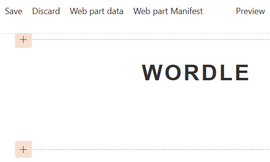
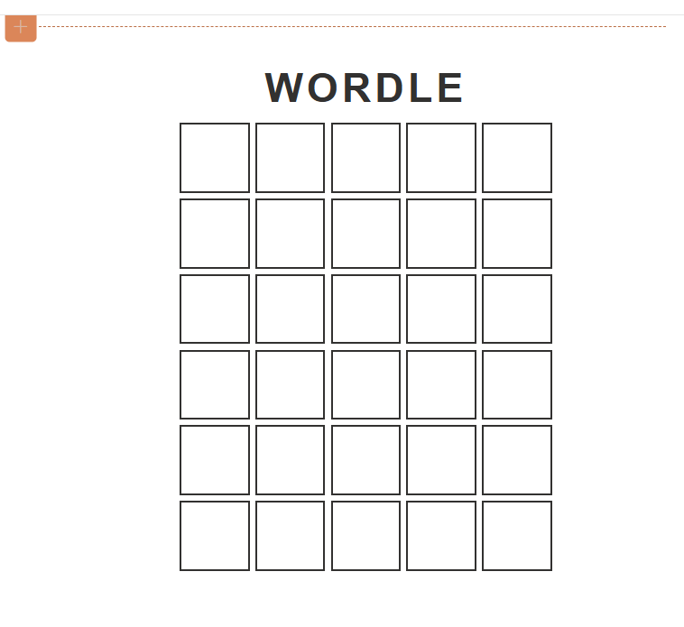
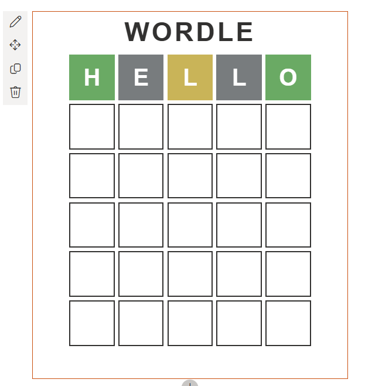
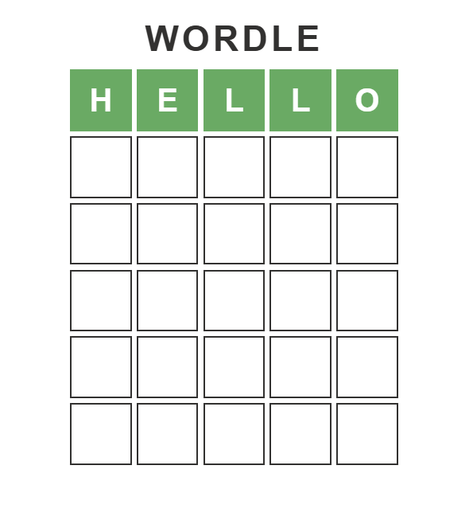

# Lab 4: Working with the Game Grid

<details>
<summary><b>Legend</b></summary>

|Icon|Meaning|
|---|---|
|:rocket:|Exercise|
|:apple:|Mac specific instructions|
|:shield:|Admin mode required|
|:bulb:|Hot tip!|
|:hedgehog:|Code catch-up|
|:warning:|Caution!|
|:books:|Resources|

</details>

<details>
<summary><b>Exercises</b></summary>

  1. [Creating the game grid](#rocket-exercise-1-creating-the-game-grid)
  1. [Styling the tiles](#rocket-exercise-2-styling-the-tiles)
  1. [Adding tile states](#rocket-exercise-3-adding-tile-states)
  1. [Creating a render helper](#rocket-exercise-4-creating-a-render-helper)
</details>

<details>
<summary><b>Starter Code</b></summary>

If you skipped the previous step, or just want to start here, you can find the code ready to go in the [Lab 04 Starter](https://github.com/nicochuck/Wordle/tree/Start-of-Lab-04) branch.

</details>

## :rocket: Exercise 1: Creating the game grid

Wordle uses a 6x5 grid - 6 rows for guesses and 5 columns for the letters in each word. Let's build it!

1. In **WordleWebPart.ts**, replace the `Game Grid` text inside `<div class="${styles.grid}">` with the following code:

    ```typescript
    <div class="">
      <div class=""></div>
      <div class=""></div>
      <div class=""></div>
      <div class=""></div>
      <div class=""></div>
    </div>
    <div class="">
      <div class=""></div>
      <div class=""></div>
      <div class=""></div>
      <div class=""></div>
      <div class=""></div>
    </div>
    <div class="">
      <div class=""></div>
      <div class=""></div>
      <div class=""></div>
      <div class=""></div>
      <div class=""></div>
    </div>
    <div class="">
      <div class=""></div>
      <div class=""></div>
      <div class=""></div>
      <div class=""></div>
      <div class=""></div>
    </div>
    <div class="">
      <div class=""></div>
      <div class=""></div>
      <div class=""></div>
      <div class=""></div>
      <div class=""></div>
    </div>
    <div class="">
      <div class=""></div>
      <div class=""></div>
      <div class=""></div>
      <div class=""></div>
      <div class=""></div>
    </div>
    ```

1. Your `render` method should now look like this:
   ```TypeScript
   public render(): void {
     this.domElement.innerHTML = `
      <div class="${styles.wordle}">
        <div class="${styles.title}">
          Wordle
        </div>
        <div class="${styles.grid}">
          <div class="">
            <div class=""></div>
            <div class=""></div>
            <div class=""></div>
            <div class=""></div>
            <div class=""></div>
          </div>
          <!-- ... more rows ... -->
        </div>
      </div>`;
   }
   ```

1. Save and refresh your browser. Oh no! We can't see our tiles. That's okay, that's because we haven't styled them yet!

   

#### :books: Resources
- [CSS Grid Layout](https://developer.mozilla.org/en-US/docs/Web/CSS/CSS_Grid_Layout)
- [Flexbox](https://developer.mozilla.org/en-US/docs/Web/CSS/CSS_Flexible_Box_Layout)


## :rocket: Exercise 2: Styling the tiles

Now we need to make those tiles look like proper Wordle tiles. Let's add some styles!

1. Open the **WordleWebPart.module.scss** and add the following styles inside the `.wordle` block, after the `.grid` styles:    

```scss
    .row {
      display: flex;
      gap: 5px;
    }
    
    .tile {
      width: 62px;
      height: 62px;
      border: 2px solid "[theme:neutralTertiaryAlt, default: #c8c6c4]";
      display: flex;
      justify-content: center;
      align-items: center;
      font-size: 32px;
      font-weight: bold;
      text-transform: uppercase;
      box-sizing: border-box;
    }
```

2. Now we need to apply these styles to our HTML! Go back to **WordleWebPart.ts** and update the grid divs to use the `row` and `tile` classes:

   - Add `${styles.row}` to each row div (the outer divs)
   - Add `${styles.tile}` to each tile div (the inner divs)

   Here's what the first row should look like:
   ```TypeScript
   <div class="${styles.row}">
     <div class="${styles.tile}"></div>
     <div class="${styles.tile}"></div>
     <div class="${styles.tile}"></div>
     <div class="${styles.tile}"></div>
     <div class="${styles.tile}"></div>
   </div>
   ```

   <details>
   <summary>:hedgehog: Full grid HTML with all classes applied</summary>

   ```TypeScript
    <div class="${ styles.grid }">
      <div class="${styles.row}">
        <div class="${styles.tile}"></div>
        <div class="${styles.tile}"></div>
        <div class="${styles.tile}"></div>
        <div class="${styles.tile}"></div>
        <div class="${styles.tile}"></div>
      </div>
      <div class="${styles.row}">
        <div class="${styles.tile}"></div>
        <div class="${styles.tile}"></div>
        <div class="${styles.tile}"></div>
        <div class="${styles.tile}"></div>
        <div class="${styles.tile}"></div>
      </div>
      <div class="${styles.row}">
        <div class="${styles.tile}"></div>
        <div class="${styles.tile}"></div>
        <div class="${styles.tile}"></div>
        <div class="${styles.tile}"></div>
        <div class="${styles.tile}"></div>
      </div>
      <div class="${styles.row}">
        <div class="${styles.tile}"></div>
        <div class="${styles.tile}"></div>
        <div class="${styles.tile}"></div>
        <div class="${styles.tile}"></div>
        <div class="${styles.tile}"></div>
      </div>
      <div class="${styles.row}">
        <div class="${styles.tile}"></div>
        <div class="${styles.tile}"></div>
        <div class="${styles.tile}"></div>
        <div class="${styles.tile}"></div>
        <div class="${styles.tile}"></div>
      </div>
      <div class="${styles.row}">
        <div class="${styles.tile}"></div>
        <div class="${styles.tile}"></div>
        <div class="${styles.tile}"></div>
        <div class="${styles.tile}"></div>
        <div class="${styles.tile}"></div>
      </div>
      </div>
   ```

   </details>

1. Save and refresh the browser to see your styled grid!

   

#### :books: Resources
- [CSS Box Model](https://developer.mozilla.org/en-US/docs/Web/CSS/CSS_Box_Model)
- [CSS Named Colors](https://developer.mozilla.org/en-US/docs/Web/CSS/named-color)


## :rocket: Exercise 3: Adding tile states

In Wordle, tiles change color based on how correct the guess is:
- **Correct** (green): Letter is in the right spot
- **Present** (yellow): Letter is in the word but wrong spot  
- **Absent** (gray): Letter is not in the word

Let's add these state styles and see them in action!

1. Add the following styles to your **WordleWebPart.module.scss** file, inside the `.wordle` block after the `.tile` styles:

    ```scss
    .correct {
      background-color: #6aaa64;
      border-color: #6aaa64;
      color: white;
    }
    
    .present {
      background-color: #c9b458;
      border-color: #c9b458;
      color: white;
    }
    
    .absent {
      background-color: #787c7e;
      border-color: #787c7e;
      color: white;
    }
    
    .filled {
      border-color: "[theme:neutralPrimary, default: #333333]";
    }
    ```
    > :bulb: The `filled` class is for tiles that have a letter but haven't been evaluated yet. It gives visual feedback that a letter has been typed.

1. Back in the **WordleWebPart.ts** file, let's add some sample letters to see how it looks. Update a few tiles in the first row to include letters and states:
   ```TypeScript
   <div class="${styles.row}">
     <div class="${styles.tile} ${styles.correct}">H</div>
     <div class="${styles.tile} ${styles.absent}">E</div>
     <div class="${styles.tile} ${styles.present}">L</div>
     <div class="${styles.tile} ${styles.absent}">L</div>
     <div class="${styles.tile} ${styles.correct}">O</div>
   </div>
   ```

1. Refresh the browser and your web part should look like this:



If things don't look quite right, review the code above and ensure your **WordleWebPart.module.scss** file looks like this:

<details>
<summary>:hedgehog: WordleWebPart.module.scss</summary>

```SCSS
@import '~@microsoft/sp-office-ui-fabric-core/dist/sass/SPFabricCore.scss';

.wordle {
  color: "[theme:bodyText, default: #323130]";
  color: var(--bodyText);
  display: flex;
  flex-direction: column;
  align-items: center;
  font-family: 'Clear Sans', 'Helvetica Neue', Arial, sans-serif;

  .title {
    font-weight: bold;
    font-size: 36px;
    letter-spacing: 0.2rem;
    text-transform: uppercase;
    margin-bottom: 10px;
  }

  .grid {
    display: flex;
    flex-direction: column;
    gap: 5px;
    margin-bottom: 20px;
  }

  .row {
    display: flex;
    gap: 5px;
  }

  .tile {
    width: 62px;
    height: 62px;
    border: 2px solid "[theme:neutralTertiaryAlt, default: #c8c6c4]";
    display: flex;
    justify-content: center;
    align-items: center;
    font-size: 32px;
    font-weight: bold;
    text-transform: uppercase;
    box-sizing: border-box;
  }

  .correct {
    background-color: #6aaa64;
    border-color: #6aaa64;
    color: white;
  }

  .present {
    background-color: #c9b458;
    border-color: #c9b458;
    color: white;
  }

  .absent {
    background-color: #787c7e;
    border-color: #787c7e;
    color: white;
  }

  .filled {
    border-color: "[theme:neutralPrimary, default: #333333]";
  }
}
```

</details>

#### :books: Resources
- [Use theme colors in your SPFx customizations](https://learn.microsoft.com/en-us/sharepoint/dev/spfx/use-theme-colors-in-your-customizations)
- [Available theme tokens and Default values](https://learn.microsoft.com/en-us/sharepoint/dev/spfx/use-theme-colors-in-your-customizations#available-theme-tokens-and-their-occurrences)

## :rocket: Exercise 4: Creating a render helper

That's a lot of HTML we wrote by hand! Imagine if we had to change something - we'd have to update 30 tiles. Let's make our code cleaner by creating a helper function that generates the grid for us.

> :bulb: This is a common pattern in web development - start with static HTML to get the layout right, then replace it with dynamic code once you understand the structure.

1. In **WordleWebPart.ts**, add the following helper methods right **above** your `render` method (but still inside the `WordleWebPart` class):

   ```TypeScript
   private renderGrid(): string {
     const targetWord = 'HELLO';
     const guesses = ['HELLO'];
     let gridHtml = '';
     
     for (let row = 0; row < 6; row++) {
       gridHtml += `<div class="${styles.row}">`;
       
       const guess = guesses[row] || '';
       
       for (let col = 0; col < 5; col++) {
         const letter = guess[col] || '';
         const stateClass = guess ? this.getTileState(guess, col, targetWord) : '';
         gridHtml += `<div class="${styles.tile} ${stateClass}">${letter}</div>`;
       }
       
       gridHtml += '</div>';
     }
     
     return gridHtml;
   }

   private getTileState(guess: string, index: number, targetWord: string): string {
     const letter = guess[index];
     
     if (letter === targetWord[index]) {
       return styles.correct;
     } else if (targetWord.indexOf(letter) >= 0) {
       return styles.present;
     } else {
       return styles.absent;
     }
   }
   ```

   > :bulb: Let's break down what these functions do:
   > - `renderGrid()` loops through each row (6 rows) and column (5 tiles), building the same HTML we wrote by hand
   > - `getTileState()` checks each letter against the target word and returns the appropriate CSS class (`correct`, `present`, or `absent`)
   > - For now, we're hardcoding `targetWord` and `guesses` - we'll make these dynamic with properties in the next lab!

1. Now let's use our new helper! In your `render` method, find the `<div class="${styles.grid}">` section and **delete all the hardcoded rows and tiles inside it**. Replace them with a single function call:

   ```typescript
   <div class="${styles.grid}">
     ${this.renderGrid()}
   </div>
   ```

   That's it! One line replaces all 36 tiles we created manually. 🎉

1. Your complete `render` method should now look like this:

   ```typescript
   public render(): void {
     this.domElement.innerHTML = `
       <div class="${styles.wordle}">
         <div class="${styles.title}">
           Wordle
         </div>
         <div class="${styles.grid}">
           ${this.renderGrid()}
         </div>
       </div>`;
   }
   ```

1. Save and refresh the browser. It should look very similar to what you before, except this time you guessed the word correctly the first time! GO YOU!

   

1. **Bonus:** Try changing the hardcoded values in `renderGrid()` to see different results:
   - Change `guesses` to `['WORLD', 'HELPS', 'HELLO']` to see multiple guesses

<details>
<summary>:hedgehog: Full WordleWebPart.ts</summary>

```TypeScript
import { Version } from '@microsoft/sp-core-library';
import {
  type IPropertyPaneConfiguration,
  PropertyPaneTextField
} from '@microsoft/sp-property-pane';
import { BaseClientSideWebPart } from '@microsoft/sp-webpart-base';
import type { IReadonlyTheme } from '@microsoft/sp-component-base';

import styles from './WordleWebPart.module.scss';
import * as strings from 'WordleWebPartStrings';

export interface IWordleWebPartProps {
  description: string;
}

export default class WordleWebPart extends BaseClientSideWebPart<IWordleWebPartProps> {
  private renderGrid(): string {
    const targetWord = 'HELLO';
    const guesses = ['HELLO'];
    let gridHtml = '';
    
    for (let row = 0; row < 6; row++) {
      gridHtml += `<div class="${styles.row}">`;
      
      const guess = guesses[row] || '';
      
      for (let col = 0; col < 5; col++) {
        const letter = guess[col] || '';
        const stateClass = guess ? this.getTileState(guess, col, targetWord) : '';
        gridHtml += `<div class="${styles.tile} ${stateClass}">${letter}</div>`;
      }
      
      gridHtml += '</div>';
    }
    
    return gridHtml;
  }

  private getTileState(guess: string, index: number, targetWord: string): string {
    const letter = guess[index];
    
    if (letter === targetWord[index]) {
      return styles.correct;
    } else if (targetWord.indexOf(letter) >= 0) {
      return styles.present;
    } else {
      return styles.absent;
    }
  }

  public render(): void {
     this.domElement.innerHTML = `
       <div class="${styles.wordle}">
         <div class="${ styles.title }">
           Wordle
         </div>
         <div class="${ styles.grid }">
            ${ this.renderGrid() }
         </div>
       </div>`;
}
  protected onThemeChanged(currentTheme: IReadonlyTheme | undefined): void {
    if (!currentTheme) {
      return;
    }
    const {
      semanticColors
    } = currentTheme;

    if (semanticColors) {
      this.domElement.style.setProperty('--bodyText', semanticColors.bodyText || null);
      this.domElement.style.setProperty('--link', semanticColors.link || null);
      this.domElement.style.setProperty('--linkHovered', semanticColors.linkHovered || null);
    }

  }

  protected get dataVersion(): Version {
    return Version.parse('1.0');
  }

  protected getPropertyPaneConfiguration(): IPropertyPaneConfiguration {
    return {
      pages: [
        {
          header: {
            description: strings.PropertyPaneDescription
          },
          groups: [
            {
              groupName: strings.BasicGroupName,
              groupFields: [
                PropertyPaneTextField('description', {
                  label: strings.DescriptionFieldLabel
                })
              ]
            }
          ]
        }
      ]
    };
  }
}

```

</details>


## :tada: All Done!


In our next lab, we'll look at using properties stored with the instance of your web part to manage the game!

# [Previous](../Lab03/README.md) | [Next](../Lab05/README.md)