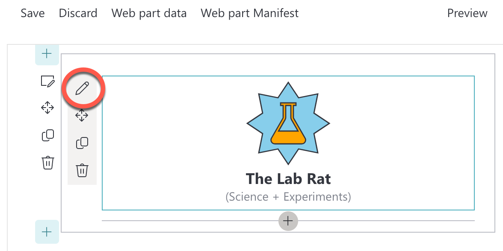

# Lab 5: Property Integration

In this lab, we will look at storing values in our web part instance's properties. This allows us to have unique values _per instance_. This lets users add our web part to different pages (or even the same page) and each can have their own set of values.

SharePoint handles the serialization and rehydration of those values for us automatically. We can set default values using the manifest and provide updates by directly setting the values or passing them off to property pane controls.

We'll eventually be pulling in data from a list. But to keep things performant, we'll only pull that list data when the web part is being edited and store the user's selections in instance properties. When the web part is in view mode, we'll use the values from our properties rather than having to make an extra call to the list every time the page is refreshed!

We'll also look at how to customize the property pane and some important considerations when letting end users change your properties.

<details>
<summary><b>Legend</b></summary>

|Icon|Meaning|
|---|---|
|:rocket:|Exercise|
|:apple:|Mac specific instructions|
|:shield:|Admin mode required|
|:bulb:|Hot tip!|
|:hedgehog:|Code catch-up|
|:warning:|Caution!|
|:books:|Resources|

</details>

<details>
<summary><b>Exercises</b></summary>

  1. [Property plumbing](#rocket-exercise-1-property-plumbing)
  1. [Working with the property pane](#rocket-exercise-2-working-with-the-property-pane)
  1. [Escaping properties](#rocket-exercise-3-escaping-properties)
</details>

<details>
<summary><b>Starter Code</b></summary>

If you skipped the previous step, or just want to start here, you can find the code ready to go in the [Lab 05 Starter](https://github.com/SPFxHeroes/JARBIS/tree/Start-of-Lab-05) branch.

</details>

## :rocket: Exercise 1: Property plumbing

The SharePoint Framework provides a web part property bag that will persist a JSON object server side for your web part's instance. These are referred to as **Client-side properties** and the loading/saving of these are all handled for you. In code, we can just use `this.properties` to work with them and the magic happens!

There are some lifecycle events (`onBeforeSerialize`, `onAfterDeserialize`) that you could use in advanced scenarios, but generally you define an interface for what the properties should look like and you just use them.

> :bulb: A common misconception is that you can use these for personalization. All users will see the same configuration for a particular web part (properties are per instance, not per user). There are many ways to provide personalization, but it's generally not with your properties.

We'll be sticking with barebones configuration for our properties (that's all we need anyway), but you can actually tell SharePoint a few things about your properties that can enable things like searchability, link fixing, and more by using `propertiesMetadata`. That's beyond the scope of this lab, but see the links below if you're interested.

Let's change the `IJarbisWebPartProps` interface to cache all the values we retrieve from the list; that way, we will not need to reload the data every time the web part is displayed -- only when we generate a new logo during page edit.

1. In **JarbisWebPart.ts**, change the `IJarbisWebPartProps` (right below the import statements) and rename the sample property `description` to `name`, so that your interface looks like this:

    ```typescript
    export interface IJarbisWebPartProps {
      name: string;
    }
    ```

1. Using the example of the `name` property, add the following properties to the `IJarbisWebPartProps` interface. All properties will be `string` typed.
  
    - `primaryPower`
    - `secondaryPower`
    - `foregroundColor`
    - `backgroundColor`
    - `foregroundIcon`
    - `backgroundIcon`

    Your final `IJarbisWebPartProps` should look like this:

    ```typescript
    export interface IJarbisWebPartProps {
      name: string;
      primaryPower: string;
      secondaryPower: string;
      foregroundColor: string;
      backgroundColor: string;
      foregroundIcon: string;
      backgroundIcon: string;
    }
    ```

1. The **.manifest.json** file for a web part defines the settings that a web part should use on a page - including the default values for your properties (they'll be `undefined` otherwise). Let's set some default values so that our users don't get an error when they first use our web part. In the **JarbisWebPart.manifest.json**, find the `properties` node, located under `preConfiguredEntries` and replace the `description` property (which is no longer used) with the following default values:

    ```json
    "name": "Lab Rat",
    "primaryPower": "Science",
    "secondaryPower": "Experiments",
    "foregroundColor": "orange",
    "backgroundColor": "skyblue",
    "foregroundIcon": "TestBeakerSolid",
    "backgroundIcon": "StarburstSolid"
    ```

    > :bulb: We are setting defaults for all of our properties, but there are plenty of use cases where `undefined` is the right choice for the default value. If that's what you're going for, just leave it out of the manifest. You only need to define properties here where you want a set default value.
    >
    > :warning: Be sure to test scenarios where the values are `undefined`. Even when providing defaults, there are legitimate cases where the properties may come back as `undefined`. One such case is when you have already deployed instances of a web part prior to adding a default value. Default values are only evaluated when the web part is first added. Another possibility is overriding property values using PowerShell either through direct calls or using provisioning (admittedly less likely, but defensive coding is good practice anyway - especially when dealing with user editable values).

1. Your manifest's `preconfiguredEntries` should now look like this:

  ```json
  "preconfiguredEntries": [{
    "groupId": "5c03119e-3074-46fd-976b-c60198311f70", // Advanced
    "group": { "default": "Advanced" },
    "title": { "default": "J.A.R.B.I.S." },
    "description": { "default": "Just A Rather Basic Instructional Solution" },
    "officeFabricIconFontName": "Robot",
    "properties": {
      "name": "Lab Rat",
      "primaryPower": "Science",
      "secondaryPower": "Experiments",
      "foregroundColor": "orange",
      "backgroundColor": "skyblue",
      "foregroundIcon": "TestBeakerSolid",
      "backgroundIcon": "StarburstSolid"
    }
  }]
  ```

1. Back in the **JarbisWebPart.ts** file, let's change the `render` method to use our properties. Replace the static value of `The Something Hero` with `The ${this.properties.name}`

1. Replace the word `Primary` with `${this.properties.primaryPower}` (don't overwrite the opening parenthesis)

1. Replace the `Secondary` power with `${this.properties.secondaryPower}` (don't overwrite the closing parenthesis)

1. The full line should now look as follows:

    ```typescript
    (${this.properties.primaryPower} + ${this.properties.secondaryPower})
    ```

1. Replace the hard-coded `skyblue` with `${this.properties.backgroundColor}`

1. Replace the `orange` with `${this.properties.foregroundColor}`

1. Replace `'ShieldSolid'` with `this.properties.backgroundIcon`

  > :bulb: Notice we don't need the `${}` wrapper because we're using the property directly in the `getIconClassName` function call

1. Replace `'FavoriteStarFill'` with `this.properties.foregroundIcon`

1. Your render method should now look like this:
  ```TypeScript
  public render(): void {
    this.domElement.innerHTML = `
      <div class="${styles.jarbis}">
        <div class="${styles.logo}">
          <i class="${css(styles.background, getIconClassName(this.properties.backgroundIcon))}" style="color:${this.properties.backgroundColor};"></i>
          <i class="${css(styles.foreground, getIconClassName(this.properties.foregroundIcon))}" style="color:${this.properties.foregroundColor};"></i>
        </div>
        <div class="${styles.name}">
          The ${this.properties.name}
        </div>
        <div class="${styles.powers}">
          (${this.properties.primaryPower} + ${this.properties.secondaryPower})
        </div>
      </div>`;
  }
  ```

If you had `gulp serve` running and simply refresh the page, you may see that some of the values return as `undefined`. This is because the web part was added to the page before the **.manifest.json** was updated with the defaults and the defaults are only applied when the web part is added.


  > :bulb: See? Reading these tips is great because you could've already guessed that would happen if you read the one above! Wowee!

You'll need to stop and start `gulp serve --nobrowser` to get the manifest updates included. Then in the workbench, remove the current instance of the web part, and add a new instance to the page. The default values should now appear -- instead of `undefined`.

BEHOLD THE BEAUTY!!


#### :books: Resources
- [Integrate web part properties with SharePoint](https://learn.microsoft.com/en-us/sharepoint/dev/spfx/web-parts/guidance/integrate-web-part-properties-with-sharepoint)

## :rocket: Exercise 2: Working with the property pane

Wow! Now our hardcoded values are hardcoded in a different spot!

Just kidding, that's only because we haven't implemented any logic to change them. Remember, the values in the manifest are only the _default values_. Let's demonstrate how the values are dynamically bound by using the property pane. Exciting!

1. In the **JarbisWebPart.ts** file, find the `getPropertyPaneConfiguration` method (**line 63**) -- this is the method that every web part uses when asked to display the configuration property pane (that side panel of options when editing a web part).

1. The `PropertyPaneTextField` is currently bound to the `description` property, which isn't a thing anymore. Change it to bind to the `foregroundIcon` instead and change the `label` property to `"Foreground icon"`

1. Add another `PropertyPaneTextField` to bind to the `primaryPower` and set the label to `"Primary power"`.

1. The full `getPropertyPaneConfiguration` should now look as follows:

   ```typescript
   
      protected getPropertyPaneConfiguration(): IPropertyPaneConfiguration {
        return {
          pages: [
            {
              header: {
                description: strings.PropertyPaneDescription
              },
              groups: [
                {
                  groupName: strings.BasicGroupName,
                  groupFields: [
                    PropertyPaneTextField('foregroundIcon', {
                      label: "Foreground icon"
                    }),
                    PropertyPaneTextField('primaryPower', {
                      label: "Primary power"
                    })
                  ]
                }
              ]
            }
          ]
        };
      }
   ```

1. Run `gulp serve --nobrowser` (if not still running) and try changing some of the web part properties. Click the pencil icon next to the web part to show the property pane:

  

1. For example, try entering `AirplaneSolid` or `Robot` in the **Foreground icon** field. You should see the web part refresh every time you change the icon (though it only works when you hit an actual icon name - notice `Airplane` before adding `Solid`). The responsiveness of the updates can be seen even clearer when you update the **Primary power** and the text updates as soon as you type.

1. Try adding another instance of the web part on the page and change the settings for that web part. You'll notice that the settings of each web part are independent from each other.


#### :books: Resources
- [Make your SharePoint client-side web part configurable](https://learn.microsoft.com/en-us/sharepoint/dev/spfx/web-parts/basics/integrate-with-property-pane)
- [Reactive and nonreactive SharePoint web parts](https://learn.microsoft.com/en-us/sharepoint/dev/design/reactive-and-nonreactive-web-parts)
- [PnP Property Pane Controls](https://pnp.github.io/sp-dev-fx-property-controls/)

## :rocket: Exercise 3: Escaping properties

You can validate property pane inputs by providing a callback to the `onGetErrorMessage` property when you configure your PropertyPane controls. This lets you do things like ensure it's not empty, min values, max values, length, etc. You can also call out to an external service to validate things if required.

Since we plan to work with these values from lists rather than end users, we're less concerned about it now but there's a link below explaining how to do this.

However, as a general rule, you should always verify input provided by users to ensure that malicious code is not executed by your web parts. Frameworks such as React are going to do this for you, but when you're building your HTML through string concatenation like we are, it's our job. This is something we want to do before using a value since it's possible (although uncommon) to set property values outside of the property pane.

In this exercise, we'll demonstrate why you should always escape values that can be stored or entered by users before you display them on the screen.

1. While still running `gulp serve`, change the **Primary power** of any of your currently added web parts to `<span style='color:red'>Science</span>` and observe what happens in the page.
   
   > :bulb: Injecting custom HTML is arguably tame, but the same technique could be used to inject custom JavaScript for malicious intent.
   >
   > If you dare, paste this **MaStEr hAcK** into **Primary power** to see what we mean:
   ```html
   `
   ```

1. At the top of **JarbisWebPart.ts**, insert the following import:

   ```typescript
   import { escape } from '@microsoft/sp-lodash-subset';
   ```

1. Replace the code where you display the value of the `primaryPower` (`${this.properties.primaryPower}`) to call the `escape` function before rendering the value with the following code:

   ```typescript
   ${escape(this.properties.primaryPower)}
   ```

1. Refresh the web part. You'll notice that the "malicious HTML" is now escaped and rendered as harmless text instead of HTML.
   

1. Add `escape` to all displayed properties. The final `render` method should look as follows:

    ```typescript
    public render(): void {
      this.domElement.innerHTML = `
        <div class="${styles.jarbis}">
          <div class="${styles.logo}">
            <i class="${css(styles.background, getIconClassName(escape(this.properties.backgroundIcon)))}" style="color:${escape(this.properties.backgroundColor)};"></i>
            <i class="${css(styles.foreground, getIconClassName(escape(this.properties.foregroundIcon)))}" style="color:${escape(this.properties.foregroundColor)};"></i>
          </div>
          <div class="${styles.name}">
            The ${escape(this.properties.name)}
          </div>
          <div class="${styles.powers}">
            (${escape(this.properties.primaryPower)} + ${escape(this.properties.secondaryPower)})
          </div>
        </div>`;
    }
   ```

> :bulb: Pro-tip, you can quickly reset your property values by pressing **Discard** and then adding the web part again. So much time saved!

#### :books: Resources
- [Validate web part property values](https://learn.microsoft.com/en-us/sharepoint/dev/spfx/web-parts/guidance/validate-web-part-property-values)


## :tada: All Done!


In our next lab, we'll look at how we can make our rendering conditional based on the state of the page!

# [Previous](../Lab04/README.md) | [Next](../Lab06/README.md)