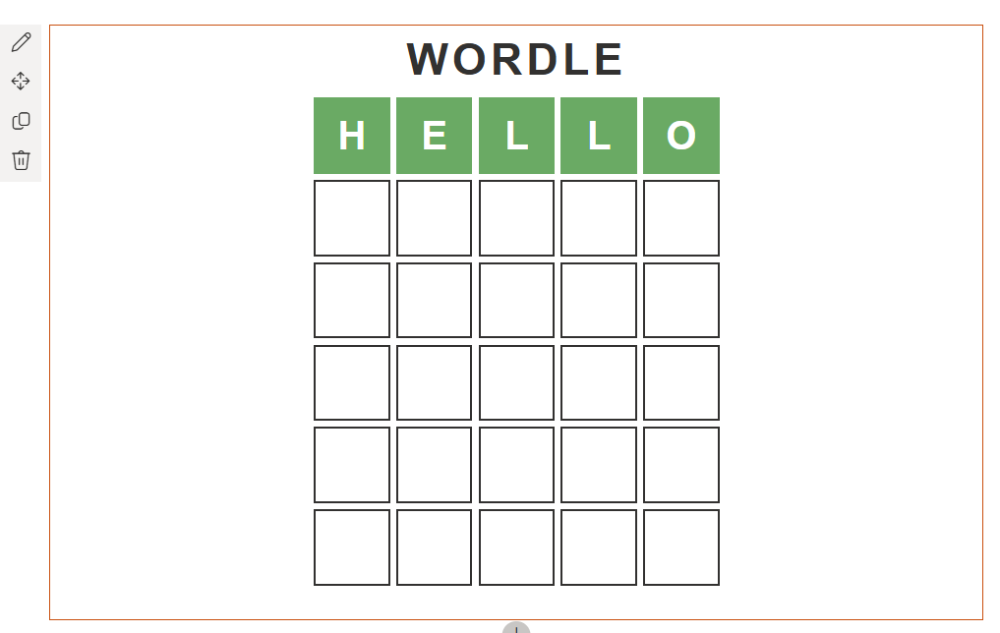
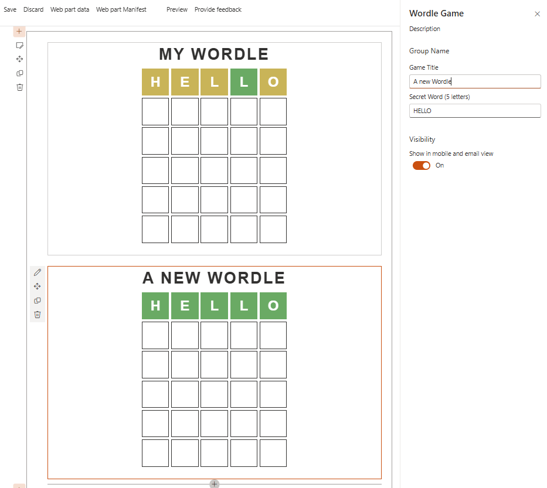
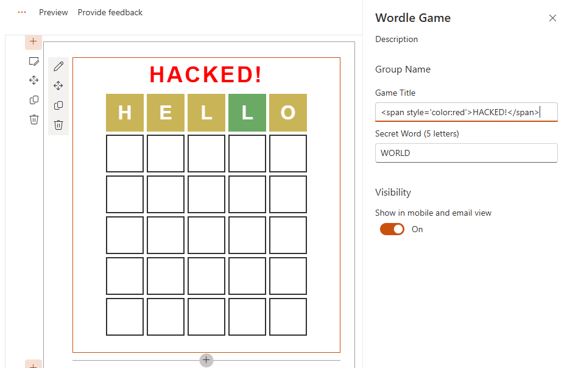
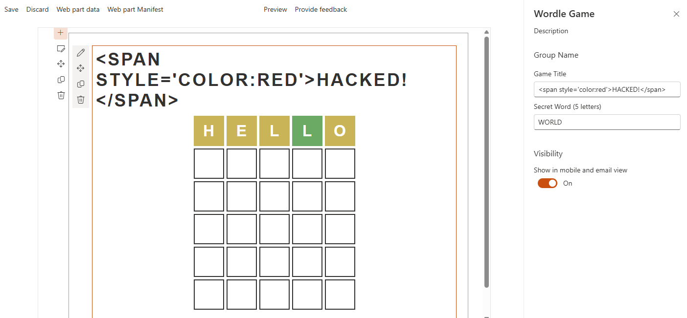
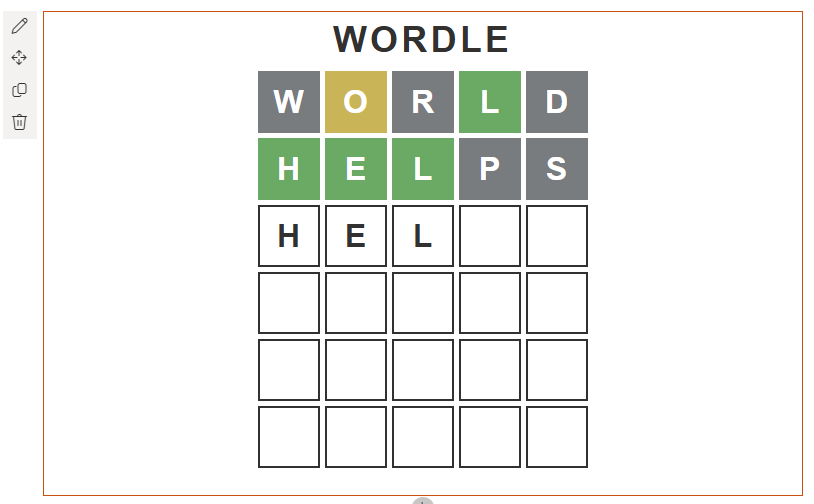

# Lab 5: Property Integration

In this lab, we will look at storing configuration values in our web part's properties. Properties are perfect for settings that should persist and be configurable by the page editor - things like the game title and the secret word to guess.

<details>
<summary><b>Legend</b></summary>

|Icon|Meaning|
|---|---|
|:rocket:|Exercise|
|:apple:|Mac specific instructions|
|:shield:|Admin mode required|
|:bulb:|Hot tip!|
|:hedgehog:|Code catch-up|
|:warning:|Caution!|
|:books:|Resources|

</details>

<details>
<summary><b>Exercises</b></summary>

  1. [Property plumbing](#rocket-exercise-1-property-plumbing)
  1. [Using properties in render](#rocket-exercise-2-using-properties-in-render)
  1. [Working with the property pane](#rocket-exercise-3-working-with-the-property-pane)
  1. [Escaping properties](#rocket-exercise-4-escaping-properties)
  1. [Adding game state variables](#rocket-exercise-5-adding-game-state-variables)
</details>

<details>
<summary><b>Starter Code</b></summary>

If you skipped the previous step, or just want to start here, you can find the code ready to go in the [Lab 05 Starter](https://github.com/nicochuck/Wordle/tree/Start-of-Lab-05) branch.

</details>

## :rocket: Exercise 1: Property plumbing

The SharePoint Framework provides a web part property bag that persists configuration for your web part instance. These are called **Client-side properties** and the loading/saving is handled for you automatically. In code, we just use `this.properties` to access them.

> :bulb: Properties are great for configuration that page editors should control - like titles, colors, or in our case, the secret word!

Let's set up two simple properties:
- `title` - The heading displayed at the top (defaults to "Wordle")
- `targetWord` - The secret 5-letter word to guess

1. In **WordleWebPart.ts**, find the `IWordleWebPartProps` interface (right below the import statements) and replace it with:

    ```typescript
    export interface IWordleWebPartProps {
      title: string;
      targetWord: string;
    }
    ```

1. In the **WordleWebPart.manifest.json** file, find the `properties` node under `preConfiguredEntries` and replace the `description` property with our new defaults:

    ```json
    "title": "Wordle",
    "targetWord": "HELLO"
    ```

    > :bulb: These default values are used when someone first adds the web part to a page. Without defaults, your properties would be `undefined`!

#### :books: Resources
- [Integrate web part properties with SharePoint](https://learn.microsoft.com/en-us/sharepoint/dev/spfx/web-parts/guidance/integrate-web-part-properties-with-sharepoint)


## :rocket: Exercise 2: Using properties in render

Now let's use our new properties in the web part! We'll update the title to use `this.properties.title` and update `getTileState()` to use `this.properties.targetWord`.

1. In **WordleWebPart.ts**, update your `render` method to use the `title` property:

    ```typescript
    public render(): void {
      this.domElement.innerHTML = `
        <div class="${styles.wordle}">
          <div class="${styles.title}">
            ${this.properties.title}
          </div>
          <div class="${styles.grid}">
            ${this.renderGrid()}
          </div>
        </div>`;
    }
    ```

1. Update your `getTileState()` method to use the `targetWord` property instead of the hardcoded value:

   ```TypeScript
   private getTileState(guess: string, index: number, targetWord: string): string {
     const letter = guess[index];
     const target = this.properties.targetWord.toUpperCase();
     
     if (letter === target[index]) {
       return styles.correct;
     } else if (target.includes(letter)) {
       return styles.present;
     } else {
       return styles.absent;
     }
   }
   ```

   > :bulb: We're using `this.properties.targetWord` now instead of the `targetWord` parameter. We can remove that parameter, but let's leave it for now - we'll clean it up later.

1. If you had `gulp serve` running, you'll need to **stop and restart it** to pick up the manifest changes. Then **remove the old web part** and **add a new instance** to the workbench.

1. You should see the title "Wordle" displayed (from our default property value). The grid should still work as before.

   

## :rocket: Exercise 3: Working with the property pane

Now let's set up the property pane so page editors can configure the title and target word. This is the side panel that appears when you edit a web part.

1. In the **WordleWebPart.ts** file, find the `getPropertyPaneConfiguration` method. It currently has a `PropertyPaneTextField` bound to `description` which doesn't exist anymore.

1. Update it to bind to our new properties:

   ```typescript
   protected getPropertyPaneConfiguration(): IPropertyPaneConfiguration {
     return {
       pages: [
         {
           header: {
             description: strings.PropertyPaneDescription
           },
           groups: [
             {
               groupName: strings.BasicGroupName,
               groupFields: [
                 PropertyPaneTextField('title', {
                   label: "Game Title"
                 }),
                 PropertyPaneTextField('targetWord', {
                   label: "Secret Word (5 letters)"
                 })
               ]
             }
           ]
         }
       ]
     };
   }
   ```

1. Run `gulp serve` (restart if already running), remove the old web part, and add a new one.

1. Click **Edit** on the page, then click on your web part and select **Edit web part** (the pencil icon) to open the property pane.

1. Try changing the **Game Title** to something fun like "My Wordle". You should see the title update immediately in the web part!

1. Now change the **Secret Word** to "WORLD". You may notice the grid color change that's because we've hard coded our guess in the code. We'll fix that later.

1. Try adding another instance of the web part on the page and give it different settings. You'll notice each web part maintains its own independent properties!



#### :books: Resources
- [Make your SharePoint client-side web part configurable](https://learn.microsoft.com/en-us/sharepoint/dev/spfx/web-parts/basics/integrate-with-property-pane)
- [Reactive and nonreactive SharePoint web parts](https://learn.microsoft.com/en-us/sharepoint/dev/design/reactive-and-nonreactive-web-parts)


## :rocket: Exercise 4: Escaping properties

Since users can type anything into the property pane, we need to make sure they can't inject malicious code. Let's see why this matters and how to fix it.

1. While running `gulp serve`, open the property pane and change the **Game Title** to `<span style='color:red'>HACKED!</span>` and observe what happens.

   

   > :bulb: Injecting custom HTML is arguably tame, but the same technique could be used to inject malicious JavaScript!

1. At the top of **WordleWebPart.ts**, add this import:

   ```typescript
   import { escape } from '@microsoft/sp-lodash-subset';
   ```

1. Update the `render` method to escape the title:

    ```typescript
    <div class="${styles.title}">
      ${escape(this.properties.title)}
    </div>
    ```

1. Refresh and try the malicious title again - now it's rendered as harmless text!

   

#### :books: Resources
- [Validate web part property values](https://learn.microsoft.com/en-us/sharepoint/dev/spfx/web-parts/guidance/validate-web-part-property-values)


## :rocket: Exercise 5: Adding game state variables

Now that we understand properties, let's talk about what they're **NOT** good for: runtime game state.

Think about it - if we stored guesses in properties, they would be permanently saved to SharePoint. Every user would see the same guesses, and they'd persist forever! That's not how Wordle works.

Instead, we'll use simple class variables for game state. These live in memory and reset when the page refreshes - perfect for a game!

1. In **WordleWebPart.ts**, add the following class variables right inside the `WordleWebPart` class, before the `renderGrid` method:

    ```typescript
    export default class WordleWebPart extends BaseClientSideWebPart<IWordleWebPartProps> {
    
      // Game state - stored in memory (resets on page refresh)
      private guesses: string[] = [];
      private currentGuess: string = '';
      private maxGuesses: number = 6;
    
      private renderGrid(): string {
    ```

    > :bulb: We're keeping it simple! The `guesses` array holds submitted guesses, `currentGuess` is what's being typed, and `maxGuesses` is how many attempts are allowed.

1. Now update the `renderGrid()` method to use these class variables instead of hardcoded values:

   ```TypeScript
   private renderGrid(): string {
     let gridHtml = '';
     
     for (let row = 0; row < this.maxGuesses; row++) {
       gridHtml += `<div class="${styles.row}">`;
       
       const guess = this.guesses[row] || '';
       const isCurrentRow = row === this.guesses.length;
       const displayGuess = isCurrentRow ? this.currentGuess : guess;
       
       for (let col = 0; col < 5; col++) {
         const letter = displayGuess[col] || '';
         const stateClass = guess ? this.getTileState(guess, col, this.properties.targetWord) : (letter ? styles.filled : '');
         gridHtml += `<div class="${styles.tile} ${stateClass}">${escape(letter)}</div>`;
       }
       
       gridHtml += '</div>';
     }
     
     return gridHtml;
   }
   ```

1. To test that everything is working, temporarily add some test data. Add these lines at the very beginning of the `render` method:

    ```typescript
    public render(): void {
      // Temporary test data - remove later!
      this.guesses = ['WORLD', 'HELPS'];
      this.currentGuess = 'HEL';
      
      this.domElement.innerHTML = `
    ```

1. Refresh the workbench and you should see the grid with your test guesses! Try changing the **Secret Word** in the property pane to "WORLD" and watch how the colors change to show a winning guess!

   

1. **Remove the test data** once you've confirmed it works - we'll wire up real input later!

<details>
<summary>:hedgehog: Full WordleWebPart.ts</summary>

```TypeScript
import { Version } from '@microsoft/sp-core-library';
import {
  type IPropertyPaneConfiguration,
  PropertyPaneTextField
} from '@microsoft/sp-property-pane';
import { BaseClientSideWebPart } from '@microsoft/sp-webpart-base';
import type { IReadonlyTheme } from '@microsoft/sp-component-base';

import styles from './WordleWebPart.module.scss';
import * as strings from 'WordleWebPartStrings';
import { escape } from '@microsoft/sp-lodash-subset';

export interface IWordleWebPartProps {
  title: string;
  targetWord: string;
}

export default class WordleWebPart extends BaseClientSideWebPart<IWordleWebPartProps> {
   // Game state - stored in memory (resets on page refresh)
  private guesses: string[] = [];
  private currentGuess: string = '';
  private maxGuesses: number = 6;

  private renderGrid(): string {
  let gridHtml = '';
  
  for (let row = 0; row < this.maxGuesses; row++) {
    gridHtml += `<div class="${styles.row}">`;
    
    const guess = this.guesses[row] || '';
    const isCurrentRow = row === this.guesses.length;
    const displayGuess = isCurrentRow ? this.currentGuess : guess;
    
    for (let col = 0; col < 5; col++) {
      const letter = displayGuess[col] || '';
      const stateClass = guess ? this.getTileState(guess, col, this.properties.targetWord) : (letter ? styles.filled : '');
      gridHtml += `<div class="${styles.tile} ${stateClass}">${escape(letter)}</div>`;
    }
    
    gridHtml += '</div>';
  }
  
  return gridHtml;
}

  private getTileState(guess: string, index: number, targetWord: string): string {
    const letter = guess[index];
    const target = this.properties.targetWord.toUpperCase();
    
    if (letter === target[index]) {
      return styles.correct;
    } else if (targetWord.indexOf(letter) >= 0) {
      return styles.present;
    } else {
      return styles.absent;
    }
  }

  public render(): void {
    
     this.domElement.innerHTML = `
       <div class="${styles.wordle}">
         <div class="${ styles.title }">
            ${escape(this.properties.title)}
         </div>
         <div class="${ styles.grid }">
            ${ this.renderGrid() }
         </div>
       </div>`;
}
  protected onThemeChanged(currentTheme: IReadonlyTheme | undefined): void {
    if (!currentTheme) {
      return;
    }
    const {
      semanticColors
    } = currentTheme;

    if (semanticColors) {
      this.domElement.style.setProperty('--bodyText', semanticColors.bodyText || null);
      this.domElement.style.setProperty('--link', semanticColors.link || null);
      this.domElement.style.setProperty('--linkHovered', semanticColors.linkHovered || null);
    }

  }

  protected get dataVersion(): Version {
    return Version.parse('1.0');
  }

  protected getPropertyPaneConfiguration(): IPropertyPaneConfiguration {
    return {
      pages: [
        {
          header: {
            description: strings.PropertyPaneDescription
          },
          groups: [
          {
            groupName: strings.BasicGroupName,
            groupFields: [
              PropertyPaneTextField('title', {
                label: "Game Title"
              }),
              PropertyPaneTextField('targetWord', {
                label: "Secret Word (5 letters)"
              })
            ]
          }
        ]
        }
      ]
    };
  }
}

```
</details>

#### :books: Resources
- [TypeScript Classes](https://www.typescriptlang.org/docs/handbook/2/classes.html)


## :tada: All Done!


In our next lab, we'll look at how we can make our rendering conditional based on the state of the page!

# [Previous](../Lab04/README.md) | [Next](../Lab06/README.md)