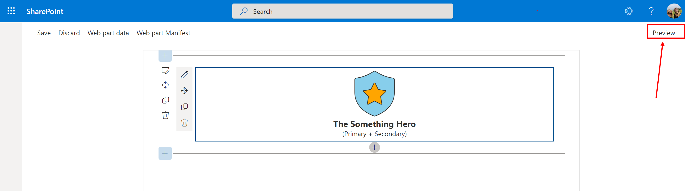

# Lab 6: Conditional Rendering

In this lab, we will add a button that will only render when the web part is editable.

## Exercise 1

As you may have already guessed, the `render` method of the web part is responsible for setting and changing the content inside of the web part. Let's change the `render` method to render differently depending on whether the web part is hosted on a page in Edit mode, versus in Read-Only mode.

1. In the `render` method of your web part, add the following code after the existing code (but before the `}`)
   
   ```typescript
    const generateButton = `<button>Generate</button>`;
   ```
1. Add the top of the `render` method, find `this.domElement.innerHTML = ` and replace it for `const hero = `. We are creating a variable called `hero` that will contain most of the rendered HTML.
1. Below the `const generateButton` (but before the closing `}` of the `render` function), paste the following code:
   
   ```typescript
    this.domElement.innerHTML = `
      <div class="${styles.jarbis}">
        ${hero}
        ${this.displayMode == DisplayMode.Edit ? generateButton : ""}
      </div>`;
   ```
1. In the HTML located inside the `const hero` code block, find and remove this text `<div class="${styles.jarbis}">`.
1. Within the same code block, find the last closing `<\div>` and remove it.
1. Your `render` method should look as follows:

   ```typescript
       public render(): void {
        const hero = `
          <div class="${styles.logo}">
            <i class="${css(styles.background, getIconClassName(escape(this.properties.backgroundIcon)))}" style="color:${escape(this.properties.backgroundColor)};"></i>
            <i class="${css(styles.foreground, getIconClassName(escape(this.properties.foregroundIcon)))}" style="color:${escape(this.properties.foregroundColor)};"></i>
          </div>
          <div class="${styles.name}">
            The ${escape(this.properties.name)}
          </div>
          <div class="${styles.powers}">
            (${escape(this.properties.primaryPower)} + ${escape(this.properties.secondaryPower)})
          </div>`;
        
        const generateButton = `<button>Generate</button>`;
        
        this.domElement.innerHTML = `
          <div class="${styles.jarbis}">
            ${hero}
            ${this.displayMode == DisplayMode.Edit ? generateButton : ""}
          </div>`;
      }
   ``` 

1. If you try to refresh the web part, you'll notice that the terminal will scream at you for a missing `DisplayMode`! It must be because we forgot an import! Add the following code just below the other `import` statements:
   
   ```typescript
   import { DisplayMode, Version } from '@microsoft/sp-core-library';
   ```
1. At this point, if you're getting yellow `lint` errors, try to fix them by going to the line number where the error is indicated and see what you can do about it.
1. You entire **JarbisWebPart.ts** code should look as follows:

   ```typescript
   import { DisplayMode, Version } from '@microsoft/sp-core-library';
    
    import {
      IPropertyPaneConfiguration,
      PropertyPaneTextField
    } from '@microsoft/sp-property-pane';
    import { BaseClientSideWebPart } from '@microsoft/sp-webpart-base';
    import { escape } from '@microsoft/sp-lodash-subset';
    
    import styles from './JarbisWebPart.module.scss';
    import * as strings from 'JarbisWebPartStrings';
    import { initializeIcons } from '@uifabric/icons';
    import { getIconClassName } from '@uifabric/styling';
    import { css } from '@uifabric/utilities';
    
    initializeIcons();
    
    export interface IJarbisWebPartProps {
      name: string;
      primaryPower: string;
      secondaryPower: string;
      foregroundColor: string;
      backgroundColor: string;
      foregroundIcon: string;
      backgroundIcon: string;
    }
    
    export default class JarbisWebPart extends BaseClientSideWebPart<IJarbisWebPartProps> {
    
      public render(): void {
        const hero = `
          <div class="${styles.logo}">
            <i class="${css(styles.background, getIconClassName(escape(this.properties.backgroundIcon)))}" style="color:${escape(this.properties.backgroundColor)};"></i>
            <i class="${css(styles.foreground, getIconClassName(escape(this.properties.foregroundIcon)))}" style="color:${escape(this.properties.foregroundColor)};"></i>
          </div>
          <div class="${styles.name}">
            The ${escape(this.properties.name)}
          </div>
          <div class="${styles.powers}">
            (${escape(this.properties.primaryPower)} + ${escape(this.properties.secondaryPower)})
          </div>`;
    
        const generateButton = `<button>Generate</button>`;
    
        this.domElement.innerHTML = `
          <div class="${styles.jarbis}">
            ${hero}
            ${this.displayMode === DisplayMode.Edit ? generateButton : ""}
          </div>`;
      }
    
      protected getPropertyPaneConfiguration(): IPropertyPaneConfiguration {
        return {
          pages: [
            {
              header: {
                description: strings.PropertyPaneDescription
              },
              groups: [
                {
                  groupName: strings.BasicGroupName,
                  groupFields: [
                    PropertyPaneTextField('foregroundIcon', {
                      label: strings.DescriptionFieldLabel
                    }),
                    PropertyPaneTextField('primaryPower', {
                      label: strings.DescriptionFieldLabel
                    })
                  ]
                }
              ]
            }
          ]
        };
      }
    }
   ``` 
1. Refresh your workbench page and try toggling the page display mode between **Preview** and **Edit** and see how the web part renders differently between each mode.
   
