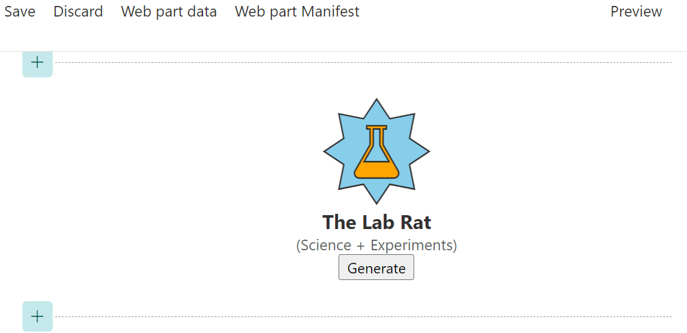
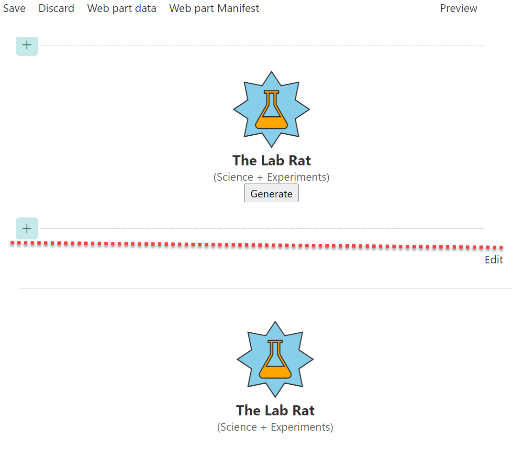

# Lab 6: Conditional Rendering

In this lab, we will add a button that will only render when the web part is editable. Later we'll make it do something! Wowee!

<details>
<summary><b>Legend</b></summary>

|Icon|Meaning|
|---|---|
|:rocket:|Exercise|
|:apple:|Mac specific instructions|
|:shield:|Admin mode required|
|:bulb:|Hot tip!|
|:hedgehog:|Code catch-up|
|:warning:|Caution!|
|:books:|Resources|

</details>

<details>
<summary><b>Exercises</b></summary>

  1. [Chunk it up](#rocket-exercise-1-chunk-it-up)
  1. [Utilizing DisplayMode](#rocket-exercise-2-utilizing-displaymode)
</details>

<details>
<summary><b>Starter Code</b></summary>

If you skipped the previous step, or just want to start here, you can find the code ready to go in the [Lab 06 Starter](https://github.com/SPFxHeroes/J.A.R.B.I.S./tree/Start-of-Lab-06) branch.

</details>

## :rocket: Exercise 1: Chunk it up

We've got a relatively small amount of HTML we are rendering. Doing this all as single string combined with [template literals](https://developer.mozilla.org/en-US/docs/Web/JavaScript/Reference/Template_literals) is ok, but it can quickly get hard to read. Especially, if you want to do something dynamic.

We're going to start "chunking" our code into some individual strings and then we can put them all back together at the end. This will give us more control over what renders when and it makes it easier to add comments and read.

1. At the top of your `render` method (before the `this.domElement...`) add:
   ```TypeScript
   const hero = `
   ```

1. Cut all the HTML inbetween the primary div and paste it on the line below the one we just added. Throw another backtick (<kbd>\`</kbd>) and a semicolon (<kbd>;</kbd>) on there. We are creating a variable called `hero` that will contain most of the rendered HTML.

1. Place `${hero}` back in the primary div. Your render method will now look like this:
   ```TypeScript
   public render(): void {
    const hero = `
      <div class="${styles.logo} ${icons.heroIcons}">
        <i class="${this.getIconClass(escape(this.properties.backgroundIcon))} ${styles.background}" style="color:${escape(this.properties.backgroundColor)};"></i>
        <i class="${this.getIconClass(escape(this.properties.foregroundIcon))} ${styles.foreground}" style="color:${escape(this.properties.foregroundColor)};"></i>
      </div>
      <div class="${styles.name}">
        The ${escape(this.properties.name)}
      </div>
      <div class="${styles.powers}">
        (${escape(this.properties.primaryPower)} + ${escape(this.properties.secondaryPower)})
      </div>`;

    this.domElement.innerHTML = `
      <div class="${styles.jarbis}">
        ${hero}
      </div>`;
   }
   ```

1. Now, let's add another line before `this.domElement...`:
   ```TypeScript
   const generateButton = `<button>Generate</button>`;
   ```

1. Finally, add `${generateButton}` underneath `${hero}` in the primary div. `render` should now look like this:
   ```TypeScript
   public render(): void {
    const hero = `
      <div class="${styles.logo} ${icons.heroIcons}">
        <i class="${this.getIconClass(escape(this.properties.backgroundIcon))} ${styles.background}" style="color:${escape(this.properties.backgroundColor)};"></i>
        <i class="${this.getIconClass(escape(this.properties.foregroundIcon))} ${styles.foreground}" style="color:${escape(this.properties.foregroundColor)};"></i>
      </div>
      <div class="${styles.name}">
        The ${escape(this.properties.name)}
      </div>
      <div class="${styles.powers}">
        (${escape(this.properties.primaryPower)} + ${escape(this.properties.secondaryPower)})
      </div>`;
    
    const generateButton = `<button>Generate</button>`;

    this.domElement.innerHTML = `
      <div class="${styles.jarbis}">
        ${hero}
        ${generateButton}
      </div>`;
   }
   ```

If you refresh the workbench, you'll see we've now got a button showing up!



#### :books: Resources
- [Template Literals](https://developer.mozilla.org/en-US/docs/Web/JavaScript/Reference/Template_literals)

## :rocket: Exercise 2: Utilizing DisplayMode

As you may have already guessed, the `render` method of the web part is responsible for setting and changing the content inside of the web part. Let's change the `render` method to render differently depending on whether the web part is hosted on a page in Edit mode, versus in Read-Only mode.

Specifically, we only want that button showing up when editing the page.

1. SPFx will tell us what mode the page is in by looking at `this.displayMode` which is an enum value of type `DisplayMode`. In order to evaluate against the enum, we need to import it. So, change this import:
   ```TypeScript
   import { Version } from '@microsoft/sp-core-library';
   ```
   To this:
   ```TypeScript
   import { Version, DisplayMode } from '@microsoft/sp-core-library';
   ```

1. Now we change our `${generateButton}` code to only be included when the page is in Edit mode using this code:
   ```TypeScript
    this.domElement.innerHTML = `
      <div class="${styles.jarbis}">
        ${hero}
        ${this.displayMode === DisplayMode.Edit ? generateButton : ""}
      </div>`;
   ```

If you run into any trouble or don't really want to do the steps above, you can just replace the entire contents of the **JarbisWebPart.ts** file with the following:

<details>
<summary>:hedgehog: JarbisWebPart.ts</summary>

```TypeScript
import { escape } from '@microsoft/sp-lodash-subset';
import { Version, DisplayMode } from '@microsoft/sp-core-library';
import {
  IPropertyPaneConfiguration,
  PropertyPaneTextField
} from '@microsoft/sp-property-pane';
import { BaseClientSideWebPart } from '@microsoft/sp-webpart-base';
import { IReadonlyTheme } from '@microsoft/sp-component-base';

import styles from './JarbisWebPart.module.scss';
import icons from './HeroIcons.module.scss';
import * as strings from 'JarbisWebPartStrings';

export interface IJarbisWebPartProps {
  name: string;
  primaryPower: string;
  secondaryPower: string;
  foregroundColor: string;
  backgroundColor: string;
  foregroundIcon: string;
  backgroundIcon: string;
}

export default class JarbisWebPart extends BaseClientSideWebPart<IJarbisWebPartProps> {

  public render(): void {
    const hero = `
      <div class="${styles.logo} ${icons.heroIcons}">
        <i class="${this.getIconClass(escape(this.properties.backgroundIcon))} ${styles.background}" style="color:${escape(this.properties.backgroundColor)};"></i>
        <i class="${this.getIconClass(escape(this.properties.foregroundIcon))} ${styles.foreground}" style="color:${escape(this.properties.foregroundColor)};"></i>
      </div>
      <div class="${styles.name}">
        The ${escape(this.properties.name)}
      </div>
      <div class="${styles.powers}">
        (${escape(this.properties.primaryPower)} + ${escape(this.properties.secondaryPower)})
      </div>`;
    
    const generateButton = `<button>Generate</button>`;

    this.domElement.innerHTML = `
      <div class="${styles.jarbis}">
        ${hero}
        ${this.displayMode === DisplayMode.Edit ? generateButton : ""}
      </div>`;
  }

  private getIconClass(iconName: string): string {
    const iconKey: string = "icon" + iconName;
    if(this.hasKey(icons, iconKey)) {
      return icons[iconKey];
    }
  }

  private hasKey<O extends object>(obj: O, key: PropertyKey): key is keyof O {
    return key in obj;
  }

  protected onThemeChanged(currentTheme: IReadonlyTheme | undefined): void {
    if (!currentTheme) {
      return;
    }

    const {
      semanticColors
    } = currentTheme;

    if (semanticColors) {
      this.domElement.style.setProperty('--bodyText', semanticColors.bodyText || null);
      this.domElement.style.setProperty('--link', semanticColors.link || null);
      this.domElement.style.setProperty('--linkHovered', semanticColors.linkHovered || null);
    }

  }

  protected get dataVersion(): Version {
    return Version.parse('1.0');
  }

  protected getPropertyPaneConfiguration(): IPropertyPaneConfiguration {
    return {
      pages: [
        {
          header: {
            description: strings.PropertyPaneDescription
          },
          groups: [
            {
              groupName: strings.BasicGroupName,
              groupFields: [
                PropertyPaneTextField('foregroundIcon', {
                  label: "Foreground Icon"
                }),
                PropertyPaneTextField('primaryPower', {
                  label: "Primary Power"
                })
              ]
            }
          ]
        }
      ]
    };
  }
}
```

</details>

1. Refresh your workbench page and try toggling the page display mode between **Preview** and **Edit** and see how the web part renders differently between each mode.
   
   > :bulb: Unlike normal SharePoint pages, the workbench defaults to Edit mode

#### :books: Resources
- [DisplayMode enum](https://learn.microsoft.com/en-us/javascript/api/sp-core-library/displaymode?view=sp-typescript-latest)

## :tada: All Done!


In our next lab, we'll attach an event handler to the button to make it do stuff!

# [Previous](../Lab05/README.md) | [Next](../Lab07/README.md)