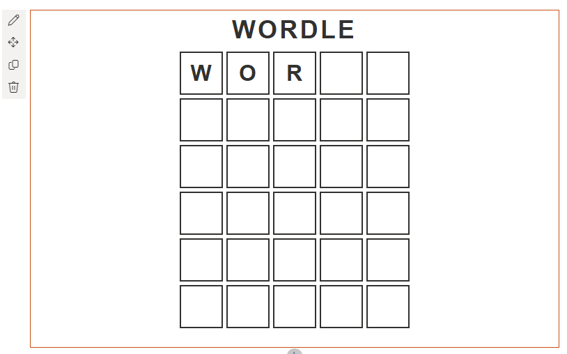
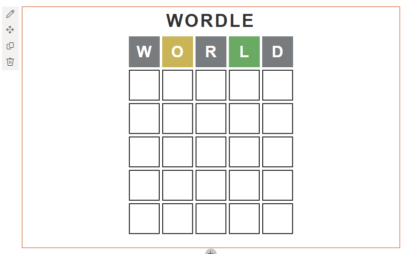
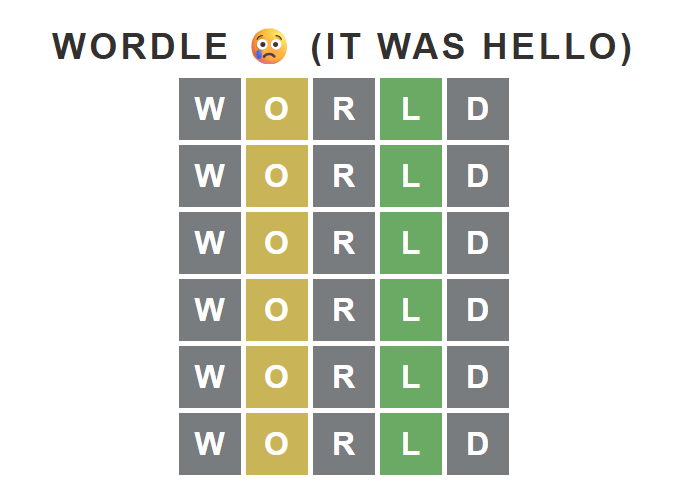

# Lab 6: Making the Game Playable

In this lab, we'll make our Wordle game actually playable! We'll add keyboard input so users can type letters, submit guesses, and see if they won or lost. This is where it gets fun!

<details>
<summary><b>Legend</b></summary>

|Icon|Meaning|
|---|---|
|:rocket:|Exercise|
|:apple:|Mac specific instructions|
|:shield:|Admin mode required|
|:bulb:|Hot tip!|
|:hedgehog:|Code catch-up|
|:warning:|Caution!|
|:books:|Resources|

</details>

<details>
<summary><b>Exercises</b></summary>

  1. [Adding game status](#rocket-exercise-1-adding-game-status)
  1. [Handling keyboard input](#rocket-exercise-2-handling-keyboard-input)
  1. [Submitting guesses](#rocket-exercise-3-submitting-guesses)
  1. [Showing game results](#rocket-exercise-4-showing-game-results)
</details>

<details>
<summary><b>Starter Code</b></summary>

If you skipped the previous step, or just want to start here, you can find the code ready to go in the [Lab 06 Starter](https://github.com/nicochuck/Wordle/tree/Start-of-Lab-06) branch.

</details>

## :rocket: Exercise 1: Adding game status

Before we can play, we need a way to track whether the game is still in progress, won, or lost. Let's add a `gameStatus` variable.

1. In **WordleWebPart.ts**, add a `gameStatus` variable alongside your other game state variables:

    ```typescript
    // Game state - stored in memory (resets on page refresh)
    private guesses: string[] = [];
    private currentGuess: string = '';
    private maxGuesses: number = 6;
    private gameStatus: string = 'playing'; // 'playing', 'won', or 'lost'
    ```

    > :bulb: The game status can be: `'playing'` (still guessing), `'won'` (guessed correctly), or `'lost'` (ran out of guesses).


## :rocket: Exercise 2: Handling keyboard input

Now let's make the game respond to keyboard input! When a user types a letter, it should appear in the current row. Backspace should delete, and Enter should submit.

1. First, we need to add an event listener for keyboard input. In **WordleWebPart.ts**, add this method below `getTileState`:

   ```typescript
   private handleKeyDown = (event: KeyboardEvent): void => {
     // Don't do anything if game is over
     if (this.gameStatus !== 'playing') {
       return;
     }

     const key = event.key.toUpperCase();

     if (key === 'BACKSPACE') {
       // Remove last letter from current guess
       this.currentGuess = this.currentGuess.slice(0, -1);
       this.render();
     } else if (key === 'ENTER') {
       // Submit the guess (we'll implement this next)
       this.submitGuess();
     } else if (key.length === 1 && key >= 'A' && key <= 'Z') {
       // Add letter if we haven't reached 5 letters yet
       if (this.currentGuess.length < 5) {
         this.currentGuess += key;
         this.render();
       }
     }
   }
   ```

   > :bulb: We check if the key is a single letter A-Z, and only add it if we haven't typed 5 letters yet.

1. Now we need to attach this event listener when the web part loads, and remove it when it's disposed. Add this method:

   ```typescript
   protected onInit(): Promise<void> {
     document.addEventListener('keydown', this.handleKeyDown);
     return Promise.resolve();
   }

   protected onDispose(): void {
     document.removeEventListener('keydown', this.handleKeyDown);
   }
   ```

   > :bulb: `onInit` runs when the web part first loads. We add the keyboard listener here. `onDispose` runs when the web part is removed, so we clean up the listener.

1. Add an empty `submitGuess` method for now (we'll fill it in next):

   ```typescript
   private submitGuess(): void {
     // Coming soon!
   }
   ```

1. Run `gulp serve` and try typing some letters! You should see them appear in the first row. Backspace should delete them.

 

## :rocket: Exercise 3: Submitting guesses

Now let's make Enter actually submit the guess and check if it's correct!

1. Replace the empty `submitGuess` method with this:

   ```typescript
   private submitGuess(): void {
     // Must be exactly 5 letters
     if (this.currentGuess.length !== 5) {
       return;
     }

     // Add to guesses array
     this.guesses.push(this.currentGuess);

     // Check if they won
     if (this.currentGuess === this.properties.targetWord.toUpperCase()) {
       this.gameStatus = 'won';
     } 
     // Check if they lost (used all guesses)
     else if (this.guesses.length >= this.maxGuesses) {
       this.gameStatus = 'lost';
     }

     // Clear current guess for next round
     this.currentGuess = '';
     
     // Re-render to show the results
     this.render();
   }
   ```

   > :bulb: When you submit a guess, it gets added to the `guesses` array. The `renderGrid` method we wrote earlier already handles coloring submitted guesses!

1. Refresh the workbench and try playing! Type a 5-letter word and press Enter. You should see:
   - The guess gets colored (green, yellow, gray)
   - You can start typing the next guess
   - If you guess correctly, the game stops accepting input



## :rocket: Exercise 4: Showing game results

Let's add some visual feedback when the game ends - showing whether you won or lost!

1. Update the `render` method to show the game status in the title:

   ```typescript
   public render(): void {
     // Build the title with status emoji
     let titleText = escape(this.properties.title);
     if (this.gameStatus === 'won') {
       titleText += ' 🎉';
     } else if (this.gameStatus === 'lost') {
       titleText += ' 😢 (It was ' + escape(this.properties.targetWord.toUpperCase()) + ')';
     }

     this.domElement.innerHTML = `
       <div class="${styles.wordle}">
         <div class="${styles.title}">
           ${titleText}
         </div>
         <div class="${styles.grid}">
           ${this.renderGrid()}
         </div>
       </div>`;
   }
   ```

   > :bulb: When you lose, we reveal what the word was. That's only fair!

1. Try it out! Play a game and win (the default word is HELLO). Then try losing by making 6 wrong guesses.



If you run into any trouble, you can replace the entire contents of **WordleWebPart.ts** with the following:

<details>
<summary>:hedgehog: WordleWebPart.ts</summary>

```TypeScript
import { Version } from '@microsoft/sp-core-library';
import {
  type IPropertyPaneConfiguration,
  PropertyPaneTextField
} from '@microsoft/sp-property-pane';
import { BaseClientSideWebPart } from '@microsoft/sp-webpart-base';
import type { IReadonlyTheme } from '@microsoft/sp-component-base';

import styles from './WordleWebPart.module.scss';
import * as strings from 'WordleWebPartStrings';
import { escape } from '@microsoft/sp-lodash-subset';

export interface IWordleWebPartProps {
  title: string;
  targetWord: string;
}

export default class WordleWebPart extends BaseClientSideWebPart<IWordleWebPartProps> {
   // Game state - stored in memory (resets on page refresh)
  private guesses: string[] = [];
  private currentGuess: string = '';
  private maxGuesses: number = 6;
  private gameStatus: string = 'playing'; // 'playing', 'won', or 'lost'
  
  private renderGrid(): string {
  let gridHtml = '';
  
  for (let row = 0; row < this.maxGuesses; row++) {
    gridHtml += `<div class="${styles.row}">`;
    
    const guess = this.guesses[row] || '';
    const isCurrentRow = row === this.guesses.length;
    const displayGuess = isCurrentRow ? this.currentGuess : guess;
    
    for (let col = 0; col < 5; col++) {
      const letter = displayGuess[col] || '';
      const stateClass = guess ? this.getTileState(guess, col, this.properties.targetWord) : (letter ? styles.filled : '');
      gridHtml += `<div class="${styles.tile} ${stateClass}">${escape(letter)}</div>`;
    }
    
    gridHtml += '</div>';
  }
  
  return gridHtml;
}

  private getTileState(guess: string, index: number, targetWord: string): string {
    const letter = guess[index];
    const target = this.properties.targetWord.toUpperCase();
    
    if (letter === target[index]) {
      return styles.correct;
    } else if (targetWord.indexOf(letter) >= 0) {
      return styles.present;
    } else {
      return styles.absent;
    }
  }

  private handleKeyDown = (event: KeyboardEvent): void => {
    // Don't do anything if game is over
    if (this.gameStatus !== 'playing') {
      return;
    }

    const key = event.key.toUpperCase();

    if (key === 'BACKSPACE') {
      // Remove last letter from current guess
      this.currentGuess = this.currentGuess.slice(0, -1);
      this.render();
    } else if (key === 'ENTER') {
      // Submit the guess (we'll implement this next)
      this.submitGuess();
    } else if (key.length === 1 && key >= 'A' && key <= 'Z') {
      // Add letter if we haven't reached 5 letters yet
      if (this.currentGuess.length < 5) {
        this.currentGuess += key;
        this.render();
      }
    }
  }

  private submitGuess(): void {
  // Must be exactly 5 letters
    if (this.currentGuess.length !== 5) {
      return;
    }

    // Add to guesses array
    this.guesses.push(this.currentGuess);

    // Check if they won
    if (this.currentGuess === this.properties.targetWord.toUpperCase()) {
      this.gameStatus = 'won';
    } 
    // Check if they lost (used all guesses)
    else if (this.guesses.length >= this.maxGuesses) {
      this.gameStatus = 'lost';
    }

    // Clear current guess for next round
    this.currentGuess = '';
    
    // Re-render to show the results
    this.render();
}

  public render(): void {
  // Build the title with status emoji
  let titleText = escape(this.properties.title);
  if (this.gameStatus === 'won') {
    titleText += ' 🎉';
  } else if (this.gameStatus === 'lost') {
    titleText += ' 😢 (It was ' + escape(this.properties.targetWord.toUpperCase()) + ')';
  }

  this.domElement.innerHTML = `
    <div class="${styles.wordle}">
      <div class="${styles.title}">
        ${titleText}
      </div>
      <div class="${styles.grid}">
        ${this.renderGrid()}
      </div>
    </div>`;
}

protected onInit(): Promise<void> {
  document.addEventListener('keydown', this.handleKeyDown);
  return Promise.resolve();
}

protected onDispose(): void {
  document.removeEventListener('keydown', this.handleKeyDown);
}

protected onThemeChanged(currentTheme: IReadonlyTheme | undefined): void {
  if (!currentTheme) {
    return;
  }
  const {
    semanticColors
  } = currentTheme;

  if (semanticColors) {
    this.domElement.style.setProperty('--bodyText', semanticColors.bodyText || null);
      this.domElement.style.setProperty('--link', semanticColors.link || null);
      this.domElement.style.setProperty('--linkHovered', semanticColors.linkHovered || null);
    }

  }

  protected get dataVersion(): Version {
    return Version.parse('1.0');
  }

  protected getPropertyPaneConfiguration(): IPropertyPaneConfiguration {
    return {
      pages: [
        {
          header: {
            description: strings.PropertyPaneDescription
          },
          groups: [
          {
            groupName: strings.BasicGroupName,
            groupFields: [
              PropertyPaneTextField('title', {
                label: "Game Title"
              }),
              PropertyPaneTextField('targetWord', {
                label: "Secret Word (5 letters)"
              })
            ]
          }
        ]
        }
      ]
    };
  }
}
```

</details>

#### :books: Resources
- [KeyboardEvent](https://developer.mozilla.org/en-US/docs/Web/API/KeyboardEvent)
- [addEventListener](https://developer.mozilla.org/en-US/docs/Web/API/EventTarget/addEventListener)


## :tada: All Done!


You now have a fully playable Wordle game! 🎮 In the next lab, we'll provision a SharePoint list to store our Wordle words. Then we'll be able to pick random words for each new game!

# [Previous](../Lab05/README.md) | [Next](../Lab07/README.md)