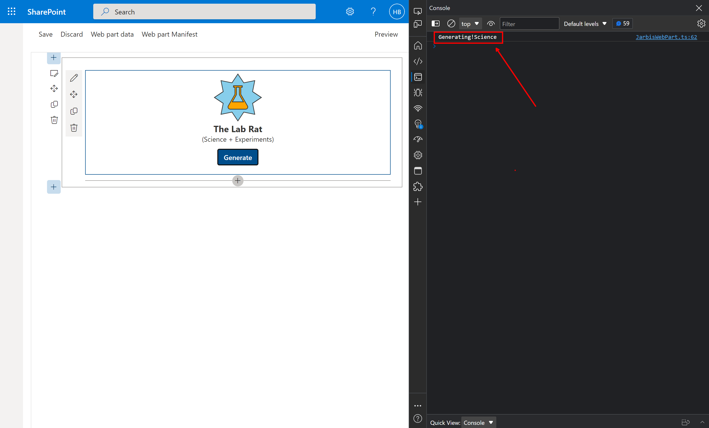

# Lab 7: Adding Event Handlers

In the previous lab, we added a useless button. In this lab, we're wiring up the button event handler to make it more useful!

## Exercise 1

1. In the **JarbisWebPart.module.scss**, add the following code below the `.powers` block:
   
   ```scss
    .generateButton {
        margin: 12px;
        background-color: $ms-color-themePrimary;
        color: $ms-color-white;
        border: none;
        border-radius: 2px;
        height: 32px;
        font-size: 14px;
        padding: 0 12px;
        font-weight: 600;
      
        &:hover {
          background-color: $ms-color-themeDarkAlt;
        }
        &:active {
          background-color: $ms-color-themeDark;
        }
    }
    ```

1. Your finished **JarbisWebPart.module.scss** should look like this:

    ```scss
    @import '~@microsoft/sp-office-ui-fabric-core/dist/sass/SPFabricCore.scss';
    
    .jarbis {
      color: "[theme:bodyText, default: #323130]";
      color: var(--bodyText);
      display: flex;
      flex-direction: column;
      align-items: center;
    
      .logo {
        position: relative;
    
        .background {
          font-size: 96px;
          -webkit-text-stroke: $ms-color-neutralPrimary 1.4px;
        }
    
        .foreground {
          font-size: 48px;
          -webkit-text-stroke: $ms-color-neutralPrimary 1.4px;
          position: absolute;
          top: 24px;
          left: 24px;
        }
      }
    
      .name {
        font-weight: bold;
        font-size: 18px;
      }
    
      .powers {
        color: ms-color-neutralSecondary;
        font-size: 14px;
      }
    
        .generateButton {
          margin: 12px;
          background-color: $ms-color-themePrimary;
          color: $ms-color-white;
          border: none;
          border-radius: 2px;
          height: 32px;
          font-size: 14px;
          padding: 0 12px;
          font-weight: 600;
      
          &:hover {
            background-color: $ms-color-themeDarkAlt;
          }
      
          &:active {
            background-color: $ms-color-themeDark;
          }
        }
    }
    ```

1. In the web part's `render` method, change the `const generateButton` line to look as follows:

    ```typescript
     const generateButton = `<button class="${styles.generateButton}">Generate</button>`;
    ```

1. Refresh your browser and admire the beautiful fancy button.

## Exercise 2

1. In the **JarbisWebPart.ts**, add the following function below the `render` method:
   
   
   ```typescript
    public onGenerateHero = (event: MouseEvent): void => {
        console.log('Generating!' + this.properties.primaryPower);
    
    }
   ```

    The function does nothing useful yet (it only displays a message on the Developer console), but we'll add functionality soon enough!
2. Within the `render` method, add the following code after the last line of code:
   
   ```typescript
   const buttons = this.domElement.getElementsByClassName(styles.generateButton);
    for (let b = 0; b < buttons.length; b++) {
      buttons[b].addEventListener('click', this.onGenerateHero);
    }
   ```

    This code finds all the buttons matching the `generateButton` CSS class name and adds an event handler for the `click` event.
3. At the top of the `render` method -- before all the code -- add the following code:

    ```typescript
    const oldbuttons = this.domElement.getElementsByClassName(styles.generateButton);
    for (let b = 0; b < oldbuttons.length; b++) {
      oldbuttons[b].removeEventListener('click', this.onGenerateHero);
    }
    ```

    Which removes existing event handlers before the web part is rendered; this is to prevent adding duplicate event handlers when the web part is refreshed.
4. Add the following code below the `onGenerateHero` method:

    ```typescript
    protected onDispose(): void {
        const oldbuttons = this.domElement.getElementsByClassName(styles.generateButton);
        for (let b = 0; b < oldbuttons.length; b++) {
          oldbuttons[b].removeEventListener('click', this.onGenerateHero);
        }
    
      }
    ```

    This code will remove event handlers from every button when the web part is being destroyed (or _disposed_).

5. Refresh your browser and try opening the Developer tools in your browser, using <kbd>F12</kbd> or <kbd>CTRL</kbd>+<kbd>SHIFT</kbd>+<kbd>I</kbd> on your keyboard, or by using the **Settings and more** ellipsis icon, then **More tools** > **Developer Tools**.
6. Try hitting the button and see that the `console.log` entries are written in the Developer tools' console.
     
7. Your **JarbisWebPart.ts** code should look like this:

    ```typescript
    import { DisplayMode, Version } from '@microsoft/sp-core-library';
    
    import {
      IPropertyPaneConfiguration,
      PropertyPaneTextField
    } from '@microsoft/sp-property-pane';
    import { BaseClientSideWebPart } from '@microsoft/sp-webpart-base';
    import { escape } from '@microsoft/sp-lodash-subset';
    
    import styles from './JarbisWebPart.module.scss';
    import * as strings from 'JarbisWebPartStrings';
    import { initializeIcons } from '@uifabric/icons';
    import { getIconClassName } from '@uifabric/styling';
    import { css } from '@uifabric/utilities';
    
    initializeIcons();
    
    export interface IJarbisWebPartProps {
      name: string;
      primaryPower: string;
      secondaryPower: string;
      foregroundColor: string;
      backgroundColor: string;
      foregroundIcon: string;
      backgroundIcon: string;
    }
    
    export default class JarbisWebPart extends BaseClientSideWebPart<IJarbisWebPartProps> {
    
      public render(): void {
        const oldbuttons = this.domElement.getElementsByClassName(styles.generateButton);
        for (let b = 0; b < oldbuttons.length; b++) {
          oldbuttons[b].removeEventListener('click', this.onGenerateHero);
        }
    
        const hero = `
          <div class="${styles.logo}">
            <i class="${css(styles.background, getIconClassName(escape(this.properties.backgroundIcon)))}" style="color:${escape(this.properties.backgroundColor)};"></i>
            <i class="${css(styles.foreground, getIconClassName(escape(this.properties.foregroundIcon)))}" style="color:${escape(this.properties.foregroundColor)};"></i>
          </div>
          <div class="${styles.name}">
            The ${escape(this.properties.name)}
          </div>
          <div class="${styles.powers}">
            (${escape(this.properties.primaryPower)} + ${escape(this.properties.secondaryPower)})
          </div>`;
    
        const generateButton = `<button class="${styles.generateButton}">Generate</button>`;
    
        this.domElement.innerHTML = `
          <div class="${styles.jarbis}">
            ${hero}
            ${this.displayMode == DisplayMode.Edit ? generateButton : ""}
          </div>`;
    
        const buttons = this.domElement.getElementsByClassName(styles.generateButton);
        for (let b = 0; b < buttons.length; b++) {
          buttons[b].addEventListener('click', this.onGenerateHero);
        }
      }
    
      public onGenerateHero = (event: MouseEvent): void => {
        console.log('Generating!' + this.properties.primaryPower);
      }
    
      protected get dataVersion(): Version {
        return Version.parse('1.0');
      }
    
      protected onDispose(): void {
        const oldbuttons = this.domElement.getElementsByClassName(styles.generateButton);
        for (let b = 0; b < oldbuttons.length; b++) {
          oldbuttons[b].removeEventListener('click', this.onGenerateHero);
        }
      }
    
      protected getPropertyPaneConfiguration(): IPropertyPaneConfiguration {
        return {
          pages: [
            {
              header: {
                description: strings.PropertyPaneDescription
              },
              groups: [
                {
                  groupName: strings.BasicGroupName,
                  groupFields: [
                    PropertyPaneTextField('foregroundIcon', {
                      label: strings.DescriptionFieldLabel
                    }),
                    PropertyPaneTextField('primaryPower', {
                      label: strings.DescriptionFieldLabel
                    })
                  ]
                }
              ]
            }
          ]
        };
      }
    }
    ```

Go take a break, eat an ice cream, get some coffee. We'll be provisioning lists and adding data to SharePoint next!
