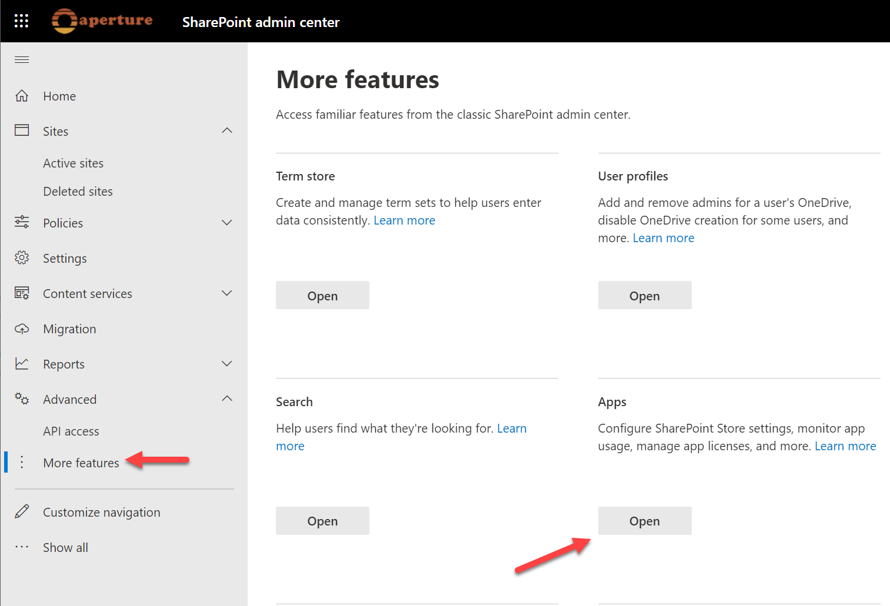
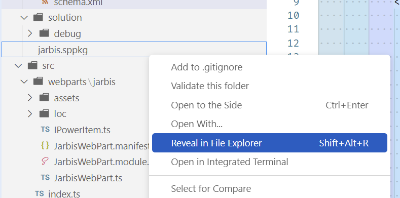
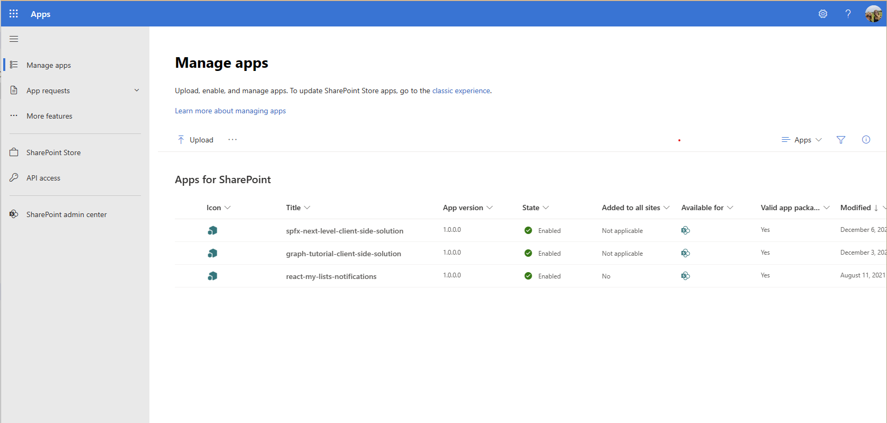
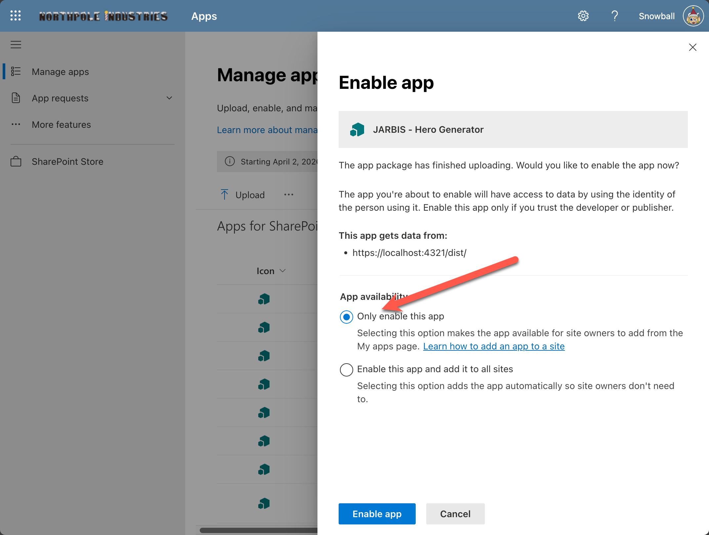
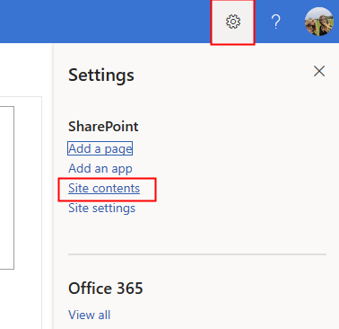
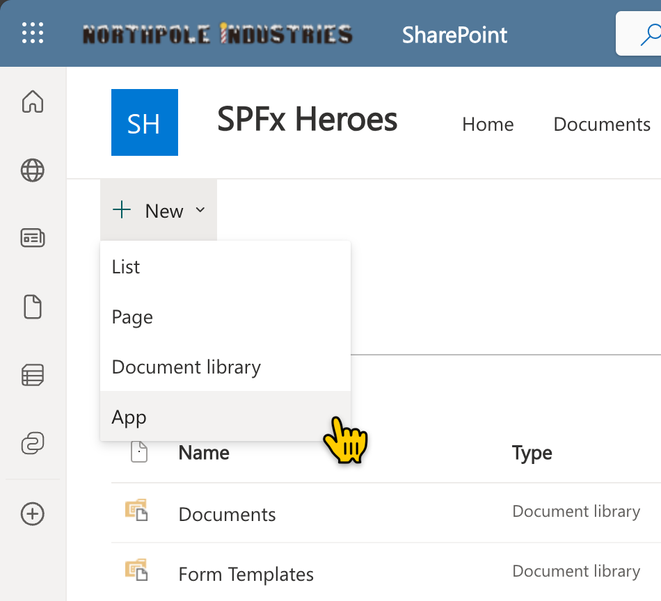
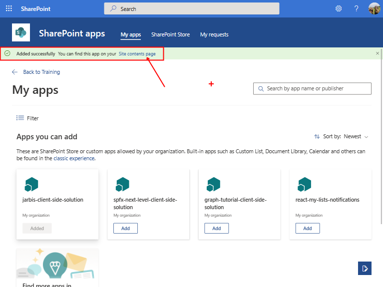

# Lab 7: Provisioning Assets

Our web part currently uses a hardcoded target word. That's not very fun - you can only play the same puzzle over and over! In this lab, we're going to set up a SharePoint list to store our Wordle words. Then in the next lab, we'll read from it!

Sure, we could give you the instructions to create the list and populate it, but that would be boring!

Plus, in the real world, you probably shouldn't expect users to go through complicated instructions just to use your web part!

In this lab, we're going to automatically provision a list of words when our web part is added to a site.

<details>
<summary><b>Legend</b></summary>

|Icon|Meaning|
|---|---|
|:rocket:|Exercise|
|:apple:|Mac specific instructions|
|:shield:|Admin mode required|
|:bulb:|Hot tip!|
|:hedgehog:|Code catch-up|
|:warning:|Caution!|
|:books:|Resources|

</details>

<details>
<summary><b>Exercises</b></summary>

  1. [Add an elements.xml file for SharePoint definitions](#rocket-exercise-1-add-an-elementsxml-file-for-sharepoint-definitions)
  1. [Add a schema.xml file for defining list structure](#rocket-exercise-2-add-a-schemaxml-file-for-defining-list-structure)
  1. [Configure the SharePoint feature](#rocket-exercise-3-configure-the-sharepoint-feature)
  1. [Bundle and package the solution](#rocket-exercise-4-bundle-and-package-the-solution)
  1. [Deploy and provision to a site](#rocket-exercise-5-deploy-and-provision-to-a-site)
</details>

<details>
<summary><b>Starter Code</b></summary>

If you skipped the previous step, or just want to start here, you can find the code ready to go in the [Lab 07 Starter](https://github.com/nicknow/Wordle-Labs/tree/Start-of-Lab-07) branch.

</details>

## :rocket: Exercise 1: Add an elements.xml file for SharePoint definitions

SPFx lets you take advantage of the Feature Framework to provision SharePoint assets with your package. You can provision Fields, Content types, List instances, and List instances with custom schema.

This is done by using a Feature. A feature is a container that includes one or more SharePoint items to provision. A feature is made up of a **Feature.xml** file and one or more element manifest files. You can even include files that handle upgrade previously provisioned assets. Wowee!

1. Using VS Code, at the root of your solution, create a folder called **sharepoint**.

1. Within the **sharepoint** folder, create an **assets** folder

1. In the **assets** folder, create a new file called **elements.xml**

1. Copy the following XML into the newly created file:

    ```xml
    <?xml version="1.0" encoding="utf-8"?>
    <Elements xmlns="http://schemas.microsoft.com/sharepoint/">
        <Field ID="{D5E5C2D8-4E6A-4B7C-9B8A-1C2D3E4F5A6B}" Name="WordCategory" DisplayName="Category" Type="Choice" Required="FALSE" Group="Wordle">
            <CHOICES>
                <CHOICE>Common</CHOICE>
                <CHOICE>Animals</CHOICE>
                <CHOICE>Food</CHOICE>
                <CHOICE>Tech</CHOICE>
                <CHOICE>Nature</CHOICE>
            </CHOICES>
        </Field>
        <ContentType ID="0x0100WORDLE1234567890ABCDEF12345678" Name="WordleWord" Group="Wordle Content Types" Description="A five-letter word for the Wordle game">
            <FieldRefs>
                <FieldRef ID="{D5E5C2D8-4E6A-4B7C-9B8A-1C2D3E4F5A6B}" />
            </FieldRefs>
        </ContentType>
        <ListInstance CustomSchema="schema.xml" FeatureId="00bfea71-de22-43b2-a848-c05709900100" Title="WordleWords" Description="Contains five-letter words for Wordle" TemplateType="100" Url="Lists/WordleWords">
            <Data>
                <Rows>
                    <Row>
                        <Field Name="Title">HELLO</Field>
                        <Field Name="WordCategory">Common</Field>
                    </Row>
                    <Row>
                        <Field Name="Title">WORLD</Field>
                        <Field Name="WordCategory">Common</Field>
                    </Row>
                    <Row>
                        <Field Name="Title">CRANE</Field>
                        <Field Name="WordCategory">Animals</Field>
                    </Row>
                    <Row>
                        <Field Name="Title">HOUSE</Field>
                        <Field Name="WordCategory">Common</Field>
                    </Row>
                    <Row>
                        <Field Name="Title">BRAIN</Field>
                        <Field Name="WordCategory">Common</Field>
                    </Row>
                    <Row>
                        <Field Name="Title">PIZZA</Field>
                        <Field Name="WordCategory">Food</Field>
                    </Row>
                    <Row>
                        <Field Name="Title">TIGER</Field>
                        <Field Name="WordCategory">Animals</Field>
                    </Row>
                    <Row>
                        <Field Name="Title">BEACH</Field>
                        <Field Name="WordCategory">Nature</Field>
                    </Row>
                    <Row>
                        <Field Name="Title">CLOUD</Field>
                        <Field Name="WordCategory">Tech</Field>
                    </Row>
                    <Row>
                        <Field Name="Title">SHARE</Field>
                        <Field Name="WordCategory">Tech</Field>
                    </Row>
                    <Row>
                        <Field Name="Title">POINT</Field>
                        <Field Name="WordCategory">Tech</Field>
                    </Row>
                    <Row>
                        <Field Name="Title">PLANT</Field>
                        <Field Name="WordCategory">Nature</Field>
                    </Row>
                    <Row>
                        <Field Name="Title">APPLE</Field>
                        <Field Name="WordCategory">Food</Field>
                    </Row>
                    <Row>
                        <Field Name="Title">OCEAN</Field>
                        <Field Name="WordCategory">Nature</Field>
                    </Row>
                    <Row>
                        <Field Name="Title">EAGLE</Field>
                        <Field Name="WordCategory">Animals</Field>
                    </Row>
                    <Row>
                        <Field Name="Title">GRAPE</Field>
                        <Field Name="WordCategory">Food</Field>
                    </Row>
                    <Row>
                        <Field Name="Title">HORSE</Field>
                        <Field Name="WordCategory">Animals</Field>
                    </Row>
                    <Row>
                        <Field Name="Title">STORM</Field>
                        <Field Name="WordCategory">Nature</Field>
                    </Row>
                    <Row>
                        <Field Name="Title">SMART</Field>
                        <Field Name="WordCategory">Common</Field>
                    </Row>
                    <Row>
                        <Field Name="Title">REACT</Field>
                        <Field Name="WordCategory">Tech</Field>
                    </Row>
                </Rows>
            </Data>
        </ListInstance>
    </Elements>
    ```

There are a few things to take note of from this XML:

- We're provisioning a field for word categories, a content type, and a list instance with custom schema.
- Definitions use standard Feature Framework schema, which is "well known" to SharePoint developers.
- We use the `CustomSchema` attribute in the `ListInstance` element to define a provisioning-time `schema.xml` file for the list.
- When provisioning list instances using Features, you must provide the `ID` of the Feature associated with the particular list definition.
- In addition to structure, we're also provisioning default list items. This makes our list immediately usable with 20 five-letter words!

#### :books: Resources
- [Provision SharePoint assets (SPFx)](https://learn.microsoft.com/en-us/sharepoint/dev/spfx/toolchain/provision-sharepoint-assets)
- [Using Features in SharePoint Foundation](https://learn.microsoft.com/previous-versions/office/developer/sharepoint-2010/ms460318(v=office.14)?redirectedfrom=MSDN).
- [Element manifest file](https://learn.microsoft.com/en-us/sharepoint/dev/spfx/toolchain/provision-sharepoint-assets#element-manifest-file)

## :rocket: Exercise 2: Add a schema.xml file for defining list structure

In the previous step, we referenced the **schema.xml** file in the `CustomSchema` attribute of the `ListInstance` element, so we need to include that file in our package.

Any supported files that accompany the element manifest (like the **schema.xml** file we're about to create) are called element files.

1. Create a new file called **schema.xml** in the **sharepoint\assets** folder.

1. Copy the following XML into the new **schema.xml** file:

    ```xml
    <List xmlns:ows="Microsoft SharePoint" Title="Basic List" EnableContentTypes="TRUE" FolderCreation="FALSE" Direction="$Resources:Direction;" Url="Lists/Basic List" BaseType="0"
    xmlns="http://schemas.microsoft.com/sharepoint/">
        <MetaData>
            <ContentTypes>
                <ContentTypeRef ID="0x0100WORDLE1234567890ABCDEF12345678" />
            </ContentTypes>
            <Fields></Fields>
            <Views>
                <View BaseViewID="1" Type="HTML" WebPartZoneID="Main" DisplayName="$Resources:core,objectiv_schema_mwsidcamlidC24;" DefaultView="TRUE" MobileView="TRUE" MobileDefaultView="TRUE" SetupPath="pages\viewpage.aspx" ImageUrl="/_layouts/images/generic.png" Url="AllItems.aspx">
                    <XslLink Default="TRUE">main.xsl</XslLink>
                    <JSLink>clienttemplates.js</JSLink>
                    <RowLimit Paged="TRUE">30</RowLimit>
                    <Toolbar Type="Standard" />
                    <ViewFields>
                        <FieldRef Name="Title"></FieldRef>
                        <FieldRef Name="WordCategory"></FieldRef>
                    </ViewFields>
                    <Query>
                        <OrderBy>
                            <FieldRef Name="Title" />
                        </OrderBy>
                    </Query>
                </View>
            </Views>
            <Forms>
                <Form Type="DisplayForm" Url="DispForm.aspx" SetupPath="pages\form.aspx" WebPartZoneID="Main" />
                <Form Type="EditForm" Url="EditForm.aspx" SetupPath="pages\form.aspx" WebPartZoneID="Main" />
                <Form Type="NewForm" Url="NewForm.aspx" SetupPath="pages\form.aspx" WebPartZoneID="Main" />
            </Forms>
        </MetaData>
    </List>
    ```

#### :books: Resources
- [Element files](https://learn.microsoft.com/en-us/sharepoint/dev/spfx/toolchain/provision-sharepoint-assets#element-file)


## :rocket: Exercise 3: Configure the SharePoint feature

At this point, we've created the files for provisioning SharePoint assets using the Feature schema from the solution when it's deployed. The next step is to include them in the SharePoint package ***.sppkg** file that will be created when we package our solution up.

To include the files, we must define the feature configuration in our project. We do this in the **config** > **package-solution.json** file. This file contains the metadata used by the build task (`gulp package-solution`) and determines the contents of the generated ***sppkg** file.

1. Open **package-solution.json** from the **config** folder.

1. In the **features** node, you'll see there's already a feature with a title of `wordle Feature` and we'll be adding our provisioning files as assets to this feature. Add a comma after `"version": "1.0.0.0"` then paste the following:

    ```json
     "assets": {
        "elementManifests": [
          "elements.xml"
        ],
        "elementFiles":[
          "schema.xml"
        ]
      }
    ```

#### :books: Resources
- [Configure the SharePoint feature in SPFx](https://learn.microsoft.com/en-us/sharepoint/dev/spfx/toolchain/provision-sharepoint-assets#configure-the-sharepoint-feature)


## :rocket: Exercise 4: Bundle and package the solution

Now you're ready to deploy the solution to SharePoint. Because we're provisioning assets directly to the SharePoint sites when the solution is installed, you can't test the provisioning capability in the Workbench.

We'll be making a non-production build just to verify our provisioning is correct (and to make the list and its content available while we're developing).

1. If your `gulp serve` is still running in the terminal, hit <kbd>CTRL</kbd>-<kbd>C</kbd> to stop it.

1. In the terminal in VS Code, execute the following command to bundle your client-side solution that contains the web part (combine and minimize your final javascript) to get the basic structure ready for packaging:
   ```bash
   gulp bundle
   ```

1. Once complete, execute the following command to create the solution package:
   ```bash
   gulp package-solution
   ```
   > :bulb: The command creates the **wordle.sppkg** package in the **sharepoint/solution** folder.

   > :warning: You will see a warning message indicating that the solution is not a production build, and another one indicating that Feature.xml elements are not automatically applied unless the solution is explicitly installed on a site; both warnings are expected.

#### :books: Resources
- [Package solutions](https://learn.microsoft.com/en-us/sharepoint/dev/spfx/web-parts/basics/notes-on-solution-packaging)


## :rocket: Exercise 5: Deploy and provision to a site

Now that we've got a package file, we need to deploy it to our app catalog to make it available to be added to our site.

> :warning: We are assuming you are using a development tenant and so deploying a half-baked solution to the primary app catalog is fine. Don't do this on production! If you must use a production tenant, then you should be working in a Site Collection App Catalog. Setting this up is beyond the scope of this lab, but more details can be found in the links below.

1. In the browser, navigate to your tenant's app catalog by heading to the SharePoint Admin center (`https://YOURTENANT-admin.sharepoint.com`) - where `YOURTENANT` is your Microsoft 365 developer tenant name.

1. Using the navigation panel on the left, choose **More features** then click the **Open** button under Apps.

   

1. Find the **wordle.sppkg** package in the **sharepoint/solution** using File Explorer (Tip: right-click on the file from within VSCode and select **Reveal in File Explorer**

   

1. Drag and drop **wordle.sppkg** from **File Explorer** onto the **App Catalog** or select **Upload** from the **Manage apps** page and select the **wordle.sppkg** file from your desktop.

     

1. When prompted to **Enable app**, select **Only enable this app**; this will ensure that we only deploy the solution to our test site.

   

   > :bulb: Notice that the **Enable app** pane indicates **This app gets data from: https://localhost:4321/dist**; this is because the solution that we just bundled is _not_ intended for production and will only run while you debug the web part. We'll fix this in later labs, when we deploy the production web part.

1. Return to your workbench and select the **Settings** gear icon, followed by **Site contents** to view the site content where your workbench is located.

     

1. From the **Site contents** page, select **New**, followed by **App**.

     

1. From the **My apps** page, under **Apps you can add**, find **wordle-client-side-solution** and select **Add**.

     

1. Once the solution has been added, you'll see a notification bar at the top of the page. Select the link to **Site contents page** to view the list that was deployed.

   

1. From the **Site contents** page, look for a list called **WordleWords** and select it

     

1. You'll see a list with several five-letter words. This is good!!!

   

#### :books: Resources
- [Take a closer look](https://zoomquilt.org/)


## :tada: All Done!


If you're up to it, there is also a [bonus lab](../Lab08/BONUS.md) to make that list a lot prettier! It's in no way necessary, but it sure is fun! It also only takes 5-10 minutes and can be completed at any time.

In our next lab, we'll wire up the web part to read words from the list!

# [Previous](../Lab06/README.md) | [Bonus Lab](../Lab08/BONUS.md) | [Next](../Lab08/README.md)
