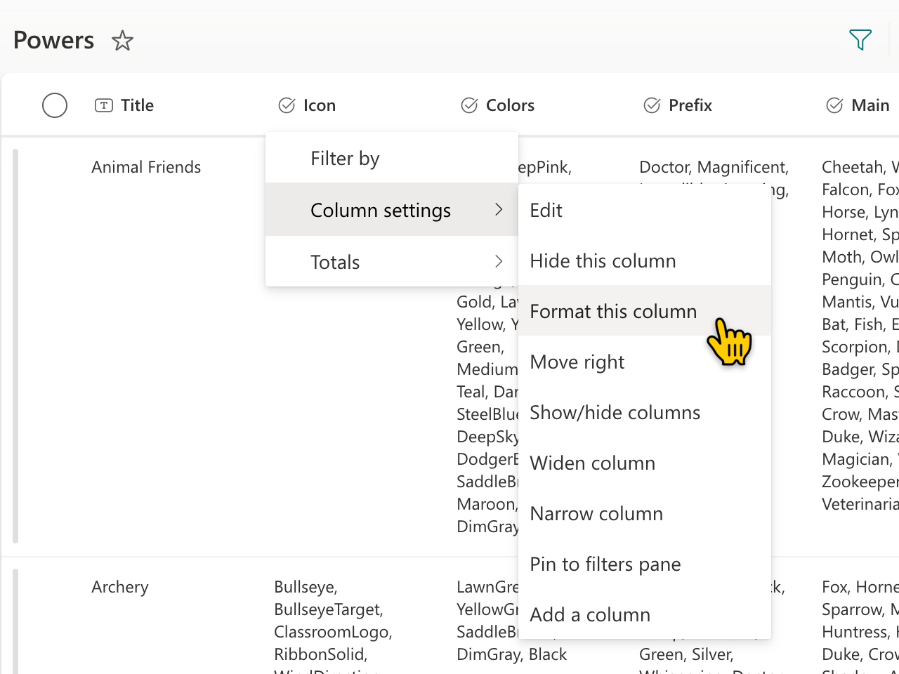
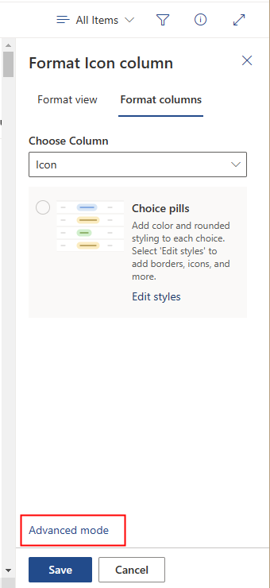
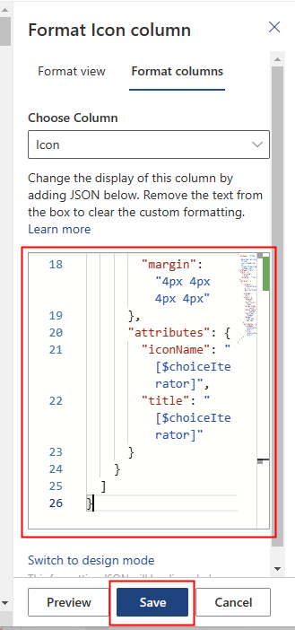
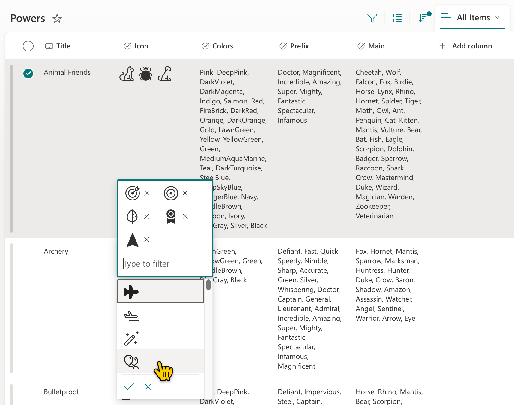
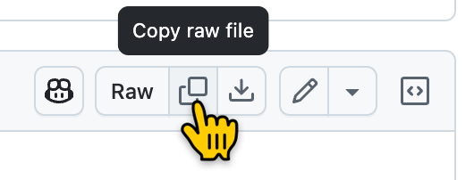

# Bonus Lab: Adding Column Formatting

We've now successfully provisioned our backing list and we've even provisioned starter data ([Lab 08](README.md)). Technically, we're all done!

And yet... that list sure is ugly and ugly lists are harder to use and things that are harder to use are used less and this make our solution less valuable which decreases the benefit from the work we've done which makes us sad and makes them sad and makes our awesome solution less well received which decreases our bonuses which makes our wallets sad which makes our relatives sad which decreases our joy which leads to strife and anger which leads to shouting that leads to fighting leading to conflict which escalates to battle which leads to war which leads to mass suffering which leads to disease and famine and eventually the extinction of all mankind.

So, yeah, this lab is optional. But at what cost?!? Plus, your list will be much prettier!

<details>
<summary><b>Legend</b></summary>

|Icon|Meaning|
|---|---|
|:rocket:|Exercise|
|:apple:|Mac specific instructions|
|:shield:|Admin mode required|
|:bulb:|Hot tip!|
|:hedgehog:|Code catch-up|
|:warning:|Caution!|
|:books:|Resources|

</details>

<details>
<summary><b>Exercises</b></summary>

  1. [Better icon selection](#rocket-exercise-1-better-icon-selection)
  1. [Color previews](#rocket-exercise-2-color-previews)
  1. [Choice pills](#rocket-exercise-3-choice-pills)
</details>

## :rocket: Exercise 1: Better icon selection

1. Using your browser, navigate to the **Powers** list that was provisioned when you deployed the solution. (**Site contents** > **Powers**)

   

1. Using the chevron next to the **Icons** column, select **Column settings**, then **Format this column**

   

1. In the **Format Icon column** pane, select **Advanced mode**
   

1. Replace the formatting `JSON` with the following `JSON` and select **Save**:
   

   ```json
   {
    "$schema": "https://developer.microsoft.com/json-schemas/sp/v2/column-formatting.schema.json",
    "elmType": "div",
    "style": {
      "flex-wrap": "wrap",
      "display": "flex"
    },
    "inlineEditField": "@currentField",
    "children": [
      {
        "forEach": "choiceIterator in @currentField",
        "elmType": "div",
        "style": {
          "display": "flex",
          "font-size": "24px",
          "align-items": "center",
          "white-space": "nowrap",
          "overflow": "hidden",
          "margin": "4px 4px 4px 4px"
        },
        "attributes": {
          "iconName": "[$choiceIterator]",
          "title": "[$choiceIterator]"
        }
      }
    ]
   }
   ```

   Also available as a file: [Icon.json](./formats/Icon.json)

   

   > :bulb: This format takes advantage of the fact we are using the Fluent UI icons and formatting understands those as well! This not only makes it more obvious what the column represents, it makes it far easier for end users to select from as they don't have to worry about their weird names, just how they look. We've also added the `inlineEditField` property to make this field easily editable directly from the view (you'll need to refresh). Fancy!

   

#### :books: Resources
- [List Formatting samples from PnP](https://aka.ms/List-Formatting)
- [Formatting samples using Icons](https://pnp.github.io/List-Formatting/groupings/category/#icons)

## :rocket: Exercise 2: Color previews

The icons look much better and are far easier to use. But the next column is just a list of colors. Choosing colors with black and white text is just unnessarily hard. So, let's make it better by actually showing the color they represent!

1. If the formatting panel is still open, use the **Choose Column** dropdown to pick the **Colors** column. If it's closed, you can reopen it by using the chevron next to the **Colors** column, select **Column settings**, then **Format this column**

1. Select **Advanced Mode** and replace the `JSON` with the following, then hit **Save**:
   

   ```json
   {
      "$schema": "https://developer.microsoft.com/json-schemas/sp/v2/column-formatting.schema.json",
      "elmType": "div",
      "style": {
        "flex-wrap": "wrap",
        "display": "flex"
      },
      "children": [
        {
          "forEach": "choiceIterator in @currentField",
          "elmType": "div",
          "style": {
            "box-sizing": "border-box",
            "padding": "4px 8px 5px 8px",
            "display": "flex",
            "border-radius": "16px",
            "height": "24px",
            "align-items": "center",
            "white-space": "nowrap",
            "overflow": "hidden",
            "margin": "4px 4px 4px 4px",
            "background-color": "[$choiceIterator]"
          },
          "children": [
            {
              "elmType": "span",
              "style": {
                "overflow": "hidden",
                "text-overflow": "ellipsis",
                "padding": "0 3px",
                "color": "white"
              },
              "txtContent": "[$choiceIterator]"
            }
          ]
        }
      ]
    }
   ```

   Also available as a file: [Colors.json](./formats/Colors.json)

   > :bulb: This format takes advantage of the fact that our choices are all CSS named colors so it can use them the same way our web part does! This is especially helpful for those weird ones that don't quite look like you might expect (like Hugo).

#### :books: Resources
- [CSS Named Colors](https://developer.mozilla.org/en-US/docs/Web/CSS/named-color)


## :rocket: Exercise 3: Choice pills

The icons are good, the colors make sense, but is there anything we can do about those massive choice columns? They're hard to read at a glance as they're just a wall of text. Good news, we make them pretty now!

1. If the formatting panel is still open, use the **Choose Column** dropdown to pick the **Prefix** column. If it's closed, you can reopen it by using the chevron next to the **Prefix** column, select **Column settings**, then **Format this column**

1. Select **Advanced Mode** and replace the `JSON` with the contents of the [Prefix.json](./formats/Prefix.json) file, then hit **Save**

   > :bulb: GitHub makes it relatively easy to copy the contents of an entire file. In the upper-right corner of the document panel there's a **Copy raw file** button:

    

   > :bulb: Why is this thing so massive and also look weird? This was created using the Design Mode wizard and has a rule for every possible value. The Design Mode wizards also output formats using AST style expressions which are huge when compared to the Excel style expressions you can see in our first 2 artisanal, hand-crafted formats. It makes the list easier to read, but definitely not the format.

1. Now let's do the **Main** column. Select it in the **Choose Column** dropdown. Select **Advanced Mode** then replace the json with the contents of the [Main.json](./formats/Main.json) file, then hit **Save**

   > :bulb: This thing is even more massiver than the other one because there are just so many more values. Wowee!

#### :books: Resources
- [List formatting samples for Choice columns](https://pnp.github.io/List-Formatting/groupings/columntype/#general-text-choice-calculated)
- [List formatting samples for Multi-Choice columns](https://pnp.github.io/List-Formatting/groupings/columntype/#multi-choice)


## :tada: All Done!

Finally, those columns are pretty narrow so drag them out. Look how pretty!!

   

If you're interested in knowing more about formatting, there's likely a session or 2 during the main conference 😉.

Alright, back to SPFx!

# [Previous](../Lab08/README.md) | [Next](../Lab09/README.md)