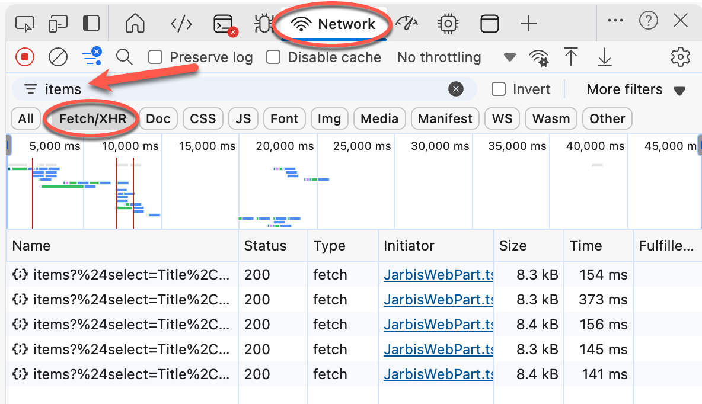

# Lab 8: Retrieving Data

In this lab, we'll retrieve data from the SharePoint list that we provisioned when the solution was deployed to a site.

To make retrieving data easier, we'll use [PnPjs](https://pnp.github.io/pnpjs/) to retrieve the data.

> :bulb: PnPjs is a collection of fluent libraries for consuming SharePoint, Graph, and Office 365 REST APIs in a type-safe way. You can use it within SharePoint Framework, Nodejs, or any JavaScript project.
>
> In fact, we recommend *always* using PnPjs when retrieving data from SharePoint or Graph. Not only does it greatly simplify batching and caching, it can validate your endpoints at build rather than at runtime because you're using a fluent API to access them rather than relying on error-prone string concatenation of endpoints, filters, etc.

<details>
<summary><b>Legend</b></summary>

|Icon|Meaning|
|---|---|
|:rocket:|Exercise|
|:apple:|Mac specific instructions|
|:shield:|Admin mode required|
|:bulb:|Hot tip!|
|:hedgehog:|Code catch-up|
|:warning:|Caution!|
|:books:|Resources|

</details>

<details>
<summary><b>Exercises</b></summary>

  1. [Setup the data model](#rocket-exercise-1-setup-the-data-model)
  1. [Install and configure PnPjs](#rocket-exercise-2-install-and-configure-pnpjs)
  1. [Caching our requests](#rocket-exercise-3-caching-our-requests)
  1. [Adding a status indicator](#rocket-exercise-4-adding-a-status-indicator)
</details>

<details>
<summary><b>Starter Code</b></summary>

If you skipped the previous step, or just want to start here, you can find the code ready to go in the [Lab 08 Starter](https://github.com/nicknow/Wordle-Labs/tree/Start-of-Lab-08) branch.

</details>

## :rocket: Exercise 1: Setup the data model

When we retrieve and work with items from a datasource, in this case SharePoint, we want to be able to work with the results in a strongly typed way. This makes for better code, compile time validation, intellisense integration, etc.

We do this through interfaces

1. In VSCode, add a new file named **IWordItem.ts** in the same folder as **WordleWebPart.ts**
1. Paste the following code into the newly-created file:

    ```typescript
    /**
    * A record from the "WordleWords" SharePoint list.
    *
    * Represents a single record retrieved from the "WordleWords" SharePoint list, with properties for each of the columns in the list.
    *
    * @export
    * @interface IWordItem
    */
    export interface IWordItem {
       /**
       * The word itself.
       *
       * This is the title of the record in the SharePoint list.
       * Must be exactly 5 letters.
       *
       * @type {string}
       * @memberof IWordItem
       */
       Title: string;

       /**
       * The category for the word.
       *
       * This is the category the word belongs to (e.g., "Animal", "Food", "Nature").
       * @type {string}
       * @memberof IWordItem
       */
       Category: string;
    }
    ```

    > You'll notice that we're starting to add comments to our code; this is not only to teach you how the code works as you're using it in the labs, but also to impart some coding best-practices.
    >
    > The weird comment syntax (`/**` and `*/`) we're using follows the [JSDoc](https://www.typescriptlang.org/docs/handbook/jsdoc-supported-types.html) convention, which VSCode recognizes and will use to provide tooltips as you refer to the `IWordItem` interface throughout the code.
    >
    > Neato!!!

1. Back in **WordleWebPart.ts**, add an import to the newly-created `IWordItem` interface by appending the following code at the bottom of all the `import` statements:

   ```TypeScript
   import { IWordItem } from './IWordItem';
   ```

 1. Try to hover your mouse over `IWordItem` in the line you just added; you should see that the comments from the `IWordItem` interface are reflected in the tooltips.

 1. Inside the `WordleWebPart` class, alongside your other class variables (like `guesses`, `currentGuess`, etc.), add a variable to store an array of `IWordItem` after they have been loaded from SharePoint:

    ```TypeScript
    private words: IWordItem[] = [];
    ```

1. In the `IWordleWebPartProps` interface located just under the imports in the **WordleWebPart.ts** file, add a string property called `list`, which will store the name of the list where words will be retrieved from:

   ```TypeScript
   list: string;
   ```

   The full `IWordleWebPartProps` interface should now look as follows:

   ```TypeScript
   export interface IWordleWebPartProps {
     title: string;
     targetWord: string;
     list: string;
   }
   ```

   > :bulb: Notice we're keeping only configuration in properties (`title`, `targetWord`, `list`). Game state like `guesses`, `currentGuess`, `gameStatus`, etc. stays as class variables that reset when the page refreshes!

1. In **WordleWebPart.manifest.json**, add a new default property under `preconfiguredEntries` and `properties`; call it `list` and make the default value `WordleWords`. You can do so by adding the following JSON node (don't forget to add a comma on the line above):

   ```json
   "list": "WordleWords"
   ```

   The complete `properties` node in **WordleWebPart.manifest.json** should look as follows:

   ```json
   "properties": {
     "title": "Wordle",
     "targetWord": "HELLO",
     "list": "WordleWords"
   }
   ```

#### :books: Resources
- [TypeScript Object Types (Interfaces)](https://www.typescriptlang.org/docs/handbook/2/objects.html)
- [JSDoc Reference](https://www.typescriptlang.org/docs/handbook/jsdoc-supported-types.html)


## :rocket: Exercise 2: Install and configure PnPjs

So far we've only been using either what SPFx gave us or what we've coded ourselves. What about external libraries? There are a few different ways to work with external libraries including installing them as packages, referencing them through CDNs, or even dynamically loading them on demand. Even within those there are differences based on the type of modules (or lack of modules) that they support.

We'll be demonstrating integrating packages from PnPjs (v4.x) but there are links below to help you with other libraries (like jQuery).

1. Using the terminal, add the required PnPjs modules to your solution by typing the following command:

    ```bash
    npm install @pnp/sp
    ```

    > :warning: You will have to stop serving your web part in order to run `npm install`
    
    > :bulb: Unlike the previous times we ran the `npm install` command, we omitted the `-g` parameter, because the `-g` parameter means that we want to install the node module _globally_ (i.e.: at the Operating System level); without the `-g` parameter, the node module will be installed _locally_ (i.e.: at the solution-level).
    >
    > This is because we need the `@pnp/sp` module for our solution only, not for all solutions on our system.

1. Add the following `import` statements to the top of **WordleWebPart.ts**, below the `import { IWordItem }` line:

    ```TypeScript
    import { spfi, SPFx } from '@pnp/sp';
    import '@pnp/sp/webs';
    import '@pnp/sp/lists';
    import '@pnp/sp/items';
    ```

    > You may wonder why adding PnPjs requires adding so many imports. The answer is simple: PnPjs provides a _lot_ of functionality, but we don't need to use _every_ single feature provided by PnPjs - otherwise the codebase for your web part would be a lot bigger and could potentially make the SharePoint page where someone added your web part render slowly and appear sluggish and sad.
    >
    > By importing _only_ the features we need (i.e. SharePoint, webs, lists, list items), we help keep the web part code base as small as possible.

1. After the `submitGuess` method, add the following method to retrieve the list of words from SharePoint: 

   ```TypeScript
    /**
    * Gets the list of words from SharePoint
    *
    * @private
    * @memberof WordleWebPart
    */
    private getWords = async (): Promise<void> => {
      const sp = spfi().using(SPFx(this.context));

      // Get the list of words from SharePoint using the name of the library specified in the property pane
      this.words = await sp.web.lists.getByTitle(this.properties.list).items.select('Title', 'Category')();

      console.log("Words", this.words);
    }
   ```
   > :bulb: The first line of this method initializes PnPjs. This ensures that whether our web part is hosted on the home page for a site or on a page nested multiple folders deep, the library can correctly resolve the API locations. If we were making multiple calls we'd probably set this up as a property and configure it in the `onInit` method. Examples of that can be found in the PnPjs documentation.

   > :bulb: Notice that the actual call to the REST endpoint isn't written as a string but it's built with full support for intellisense. The above code is the equivalent to writing something like `"_api/web/lists/getbytitle(${this.properties.list})/items?$top=2000&$select=Title,Category"` and that's relatively straightforward. Imagine needing to add filters, expansions, batching, etc. PnPjs will make all that just as easy as we're seeing here (you'll see).

   > :bulb: Sometimes pasting code makes it look wonky. You can always right-click in VS Code within the editor window and select **Format Document** (or press <kbd>CTRL</kbd>+<kbd>ALT</kbd>+<kbd>F</kbd>) to make it pretty again.

1. Now we've got a method to retrieve list items, but we actually need to call it! Update your `onInit` method to load words when the web part initializes:

   ```TypeScript
   protected onInit(): Promise<void> {
     document.addEventListener('keydown', this.handleKeyDown);
     
     // Load words from SharePoint
     this.getWords().catch((error) => console.error(error));
     
     return Promise.resolve();
   }
   ```

1. In the terminal, run `gulp serve --nobrowser` to reserve your web part. You'll also want to remove and re-add it to the workbench since we changed the manifest and added a new property with a default value.

1. Open the Developer tools in your browser, using <kbd>F12</kbd> or <kbd>CTRL</kbd>+<kbd>SHIFT</kbd>+<kbd>I</kbd> on your keyboard, or by using the **Settings and more** ellipsis icon, then **More tools** > **Developer Tools** then switching to the Console. You should see where we dumped the `words` array and if you expand it you can see the properties are nicely mapped thanks to our `IWordItem` interface. Wowee!

   

   > :bulb: Notice that the filename shown for the source of the message is not our generated bundle js file. SPFx has provided mappings to the browser so that we can see where the message occured in our actual source file! We can even click on it to see the code in the browser and set breakpoints!

#### :books: Resources
- [PnPjs Getting started with the SharePoint Framework](https://pnp.github.io/pnpjs/getting-started/#getting-started-with-sharepoint-framework)
- [Add an external library to your SharePoint client-side web part](https://learn.microsoft.com/en-us/sharepoint/dev/spfx/web-parts/basics/add-an-external-library)
- [Use existing JavaScript libraries in SharePoint Framework client-side web parts](https://learn.microsoft.com/en-us/sharepoint/dev/spfx/web-parts/guidance/use-existing-javascript-libraries)

## :rocket: Exercise 3: Caching our requests

You might notice that refreshing the page repeatedly logs the same words each time. While this works, it's making network calls every time! Let's add caching to be more efficient.

1. Start by testing the web part without caching: using your browser's developer tools, switch to the **Network** tab and filter for **Fetch / XHR** requests -- which are the types of network calls your web part makes when retrieving items from the list. Since we're only dealing with a single endpoint, we can make it even easier by adding the keyword `items` to our Filter:

   

1. Refresh the workbench page

1. Refresh the page several times, making sure to note that the `items` API is called every time. Also, note how much time the call takes every time. Oh my!

1. Return to **WordleWebPart.ts** and add the following import:

   ```Typescript
   import { Caching } from "@pnp/queryable";
   ```
   > :bulb: We didn't have to install the `@pnp/queryable` package because it was marked as a dependency of the `@pnp/sp` package and was added automatically. Yipee!

1. Change the `this.words` line in the `getWords` method to use the following code instead:

   ```TypeScript
   // Get the list of words from SharePoint using the name of the library specified in the property pane
   this.words = await sp.web.lists.getByTitle(this.properties.list).items.select('Title', 'Category').using(Caching())();
   ```

1. Refresh the web part. You may not immediately notice a difference, but the web part only queries the list _once_ -- unless there are changes or the cache has expired.

1. To verify that the cache is used, look for a call to the `items` API in the network calls; the first time you load the web part, you should see a call to it, but refreshing the page should not cause the web part to call the API every subsequent time.

   > :bulb: We didn't specify any configuration and are just using the caching defaults (5 minute timeout). We can adjust this in our overall configuration for PnPjs to apply to all calls or we can specify this as a parameter to the `Caching` function on a per call basis!

#### :books: Resources
- [PnPjs Caching](https://pnp.github.io/pnpjs/queryable/behaviors/#caching)


## :rocket: Exercise 4: Adding a status indicator

While the words load quickly from cache after the first time, the initial load can take a moment. Let's add a loading indicator so users know something is happening!

1. Add a class variable to track whether words have loaded:

   ```typescript
   private wordsLoaded: boolean = false;
   ```

1. Update the `getWords` method to set this flag and re-render when done:

   ```typescript
   private getWords = async (): Promise<void> => {
     const sp = spfi().using(SPFx(this.context));
     this.words = await sp.web.lists.getByTitle(this.properties.list).items.select('Title', 'Category').using(Caching())();
     this.wordsLoaded = true;
     
     console.log("Words loaded:", this.words.length);
     this.render();
   }
   ```

1. At the very beginning of the `render` method, add a check to show a loading indicator:

   ```typescript
   if (!this.wordsLoaded) {
     this.context.statusRenderer.displayLoadingIndicator(this.domElement, 'words');
     return;
   }
   this.context.statusRenderer.clearLoadingIndicator(this.domElement);
   ```

   > :bulb: SPFx provides a nice utility class to show a standard loading indicator so that you don't have to implement that yourself each time. You simply ask it to show and provide the element it should show up in along with the name of what's loading.

1. Refresh the workbench. You should briefly see a loading spinner before the web part renders!

If you run into any trouble or don't really want to do the steps above, you can just replace the entire contents of the **WordleWebPart.ts** file with the following:

<details>
<summary>:hedgehog: WordleWebPart.ts</summary>

```TypeScript
import { Version } from '@microsoft/sp-core-library';
import {
  type IPropertyPaneConfiguration,
  PropertyPaneTextField
} from '@microsoft/sp-property-pane';
import { BaseClientSideWebPart } from '@microsoft/sp-webpart-base';
import type { IReadonlyTheme } from '@microsoft/sp-component-base';

import styles from './WordleWebPart.module.scss';
import * as strings from 'WordleWebPartStrings';
import { escape } from '@microsoft/sp-lodash-subset';

import { IWordItem } from './IWordItem';
import { spfi, SPFx } from '@pnp/sp';
import '@pnp/sp/webs';
import '@pnp/sp/lists';
import '@pnp/sp/items';
import { Caching } from "@pnp/queryable";

export interface IWordleWebPartProps {
  title: string;
  targetWord: string;
  list: string;
}

export default class WordleWebPart extends BaseClientSideWebPart<IWordleWebPartProps> {
  // Game state - stored in memory (resets on page refresh)
  private guesses: string[] = [];
  private currentGuess: string = '';
  private maxGuesses: number = 6;
  private gameStatus: string = 'playing'; // 'playing', 'won', or 'lost'
  
  // Data from SharePoint
  private words: IWordItem[] = [];
  private wordsLoaded: boolean = false;

  private renderGrid(): string {
    let gridHtml = '';
    
    for (let row = 0; row < this.maxGuesses; row++) {
      gridHtml += `<div class="${styles.row}">`;
      
      const guess = this.guesses[row] || '';
      const isCurrentRow = row === this.guesses.length;
      const displayGuess = isCurrentRow ? this.currentGuess : guess;
      
      for (let col = 0; col < 5; col++) {
        const letter = displayGuess[col] || '';
        const stateClass = guess ? this.getTileState(guess, col, this.properties.targetWord) : (letter ? styles.filled : '');
        gridHtml += `<div class="${styles.tile} ${stateClass}">${escape(letter)}</div>`;
      }
      
      gridHtml += '</div>';
    }
    
    return gridHtml;
  }

  private getTileState(guess: string, index: number, targetWord: string): string {
    const letter = guess[index];
    const target = targetWord.toUpperCase();
    
    if (letter === target[index]) {
      return styles.correct;
    } else if (target.indexOf(letter) >= 0) {
      return styles.present;
    } else {
      return styles.absent;
    }
  }

  private handleKeyDown = (event: KeyboardEvent): void => {
    if (this.gameStatus !== 'playing') {
      return;
    }

    const key = event.key.toUpperCase();

    if (key === 'BACKSPACE') {
      this.currentGuess = this.currentGuess.slice(0, -1);
      this.render();
    } else if (key === 'ENTER') {
      this.submitGuess();
    } else if (key.length === 1 && key >= 'A' && key <= 'Z') {
      if (this.currentGuess.length < 5) {
        this.currentGuess += key;
        this.render();
      }
    }
  }

  private submitGuess(): void {
    if (this.currentGuess.length !== 5) {
      return;
    }

    this.guesses.push(this.currentGuess);

    if (this.currentGuess === this.properties.targetWord.toUpperCase()) {
      this.gameStatus = 'won';
    } else if (this.guesses.length >= this.maxGuesses) {
      this.gameStatus = 'lost';
    }

    this.currentGuess = '';
    this.render();
  }

  private getWords = async (): Promise<void> => {
    const sp = spfi().using(SPFx(this.context));
    this.words = await sp.web.lists.getByTitle(this.properties.list).items.select('Title', 'Category').using(Caching())();
    this.wordsLoaded = true;
    
    console.log("Words loaded:", this.words.length);
    this.render();
  }

  public render(): void {
    if (!this.wordsLoaded) {
      this.context.statusRenderer.displayLoadingIndicator(this.domElement, 'words');
      return;
    }
    this.context.statusRenderer.clearLoadingIndicator(this.domElement);

    // Build the title with status emoji
    let titleText = escape(this.properties.title);
    if (this.gameStatus === 'won') {
      titleText += ' 🎉';
    } else if (this.gameStatus === 'lost') {
      titleText += ' 😢 (It was ' + escape(this.properties.targetWord.toUpperCase()) + ')';
    }

    this.domElement.innerHTML = `
      <div class="${styles.wordle}">
        <div class="${styles.title}">
          ${titleText}
        </div>
        <div class="${styles.grid}">
          ${this.renderGrid()}
        </div>
      </div>`;
  }

  protected onInit(): Promise<void> {
    document.addEventListener('keydown', this.handleKeyDown);
    this.getWords().catch((error) => console.error(error));
    return Promise.resolve();
  }

  protected onDispose(): void {
    document.removeEventListener('keydown', this.handleKeyDown);
  }

  protected onThemeChanged(currentTheme: IReadonlyTheme | undefined): void {
    if (!currentTheme) {
      return;
    }
    const { semanticColors } = currentTheme;

    if (semanticColors) {
      this.domElement.style.setProperty('--bodyText', semanticColors.bodyText || null);
      this.domElement.style.setProperty('--link', semanticColors.link || null);
      this.domElement.style.setProperty('--linkHovered', semanticColors.linkHovered || null);
    }
  }

  protected get dataVersion(): Version {
    return Version.parse('1.0');
  }

  protected getPropertyPaneConfiguration(): IPropertyPaneConfiguration {
    return {
      pages: [
        {
          header: {
            description: strings.PropertyPaneDescription
          },
          groups: [
            {
              groupName: strings.BasicGroupName,
              groupFields: [
                PropertyPaneTextField('title', {
                  label: "Game Title"
                }),
                PropertyPaneTextField('targetWord', {
                  label: "Secret Word (5 letters)"
                }),
                PropertyPaneTextField('list', {
                  label: "Word List Name"
                })
              ]
            }
          ]
        }
      ]
    };
  }
}
```

</details>

#### :books: Resources
- [SPFx StatusRenderer](https://learn.microsoft.com/en-us/javascript/api/sp-webpart-base/iclientsidewebpartstatusrenderer?view=sp-typescript-latest)

## :tada: All Done!


We're now pulling data from a list and we've improved performance with caching. But wait... we're not actually USING that data yet! Our game still uses the hardcoded `targetWord` from the properties.

In the next lab, we'll pick a random word from our list when the game loads. Refresh the page = new game!

# [Previous](../Lab07/README.md) | [Next](../Lab09/README.md)
