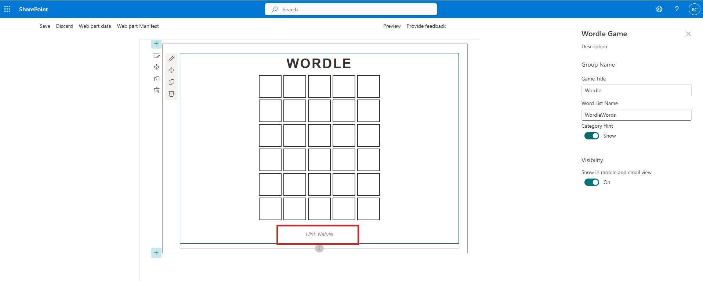
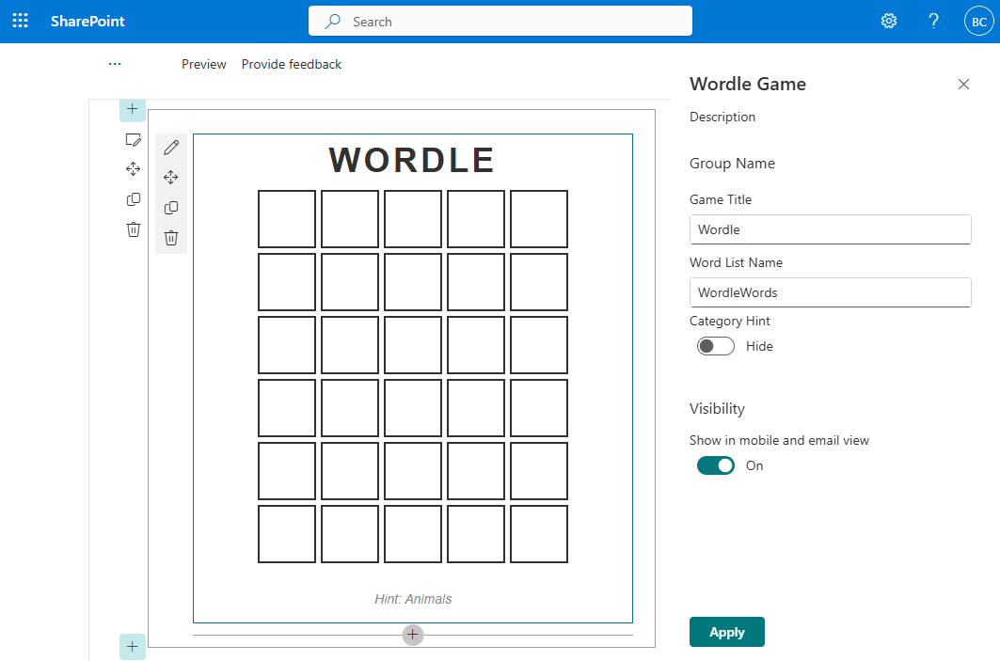

# Lab 10: Customizing the Game Experience

In this lab, we'll customize the game experience by adding a category hint feature that users can toggle on or off through the property pane!

<details>
<summary><b>Legend</b></summary>

|Icon|Meaning|
|---|---|
|:rocket:|Exercise|
|:apple:|Mac specific instructions|
|:shield:|Admin mode required|
|:bulb:|Hot tip!|
|:hedgehog:|Code catch-up|
|:warning:|Caution!|
|:books:|Resources|

</details>

<details>
<summary><b>Exercises</b></summary>

  1. [Add a category hint feature](#rocket-exercise-1-add-a-category-hint-feature)
  1. [Reactive vs nonreactive](#rocket-exercise-2-reactive-vs-nonreactive)
</details>


## :rocket: Exercise 1: Add a category hint feature

Some users have requested we give them the option to show a category hint for the word (nobody actually requested anything, we're just pretending. But it's fun!). So, let's make that configurable!

1. In your **WordleWebPart.ts** file, add a new property to the `IWordleWebPartProps` interface:

   ```TypeScript
   showHint: boolean;
   ```

   > :bulb: We're using a `boolean` type here because this is a simple on/off setting - either the user wants to see the hint or they don't. Later, we'll wire this up to a toggle in the property pane so site editors can flip it on or off without touching any code.

   The full `IWordleWebPartProps` interface should now look as follows:

   ```TypeScript
   export interface IWordleWebPartProps {
     title: string;
     list: string;
     showHint: boolean;
   }
   ```

1. We also need a class variable to track the current word's category. Add it alongside your other game state variables:

   ```TypeScript
   private currentCategory: string = '';
   ```

   > :bulb: Why a class variable and not a property? Properties (`IWordleWebPartProps`) are for things the *user configures* through the property pane - they persist and are saved with the web part. Class variables are for *runtime state* that the code manages on its own. The category changes every time a random word is picked, so it belongs as a class variable, not a user-facing setting.

1. In **WordleWebPart.manifest.json**, add a new default property:

   ```json
   "showHint": false
   ```

   The complete `properties` node should look as follows:

   ```json
   "properties": {
     "title": "Wordle",
     "list": "WordleWords",
     "showHint": false
   }
   ```

   > :bulb: Setting the default to `false` means the hint is hidden out of the box - a good default for a word-guessing game! Site editors can always turn it on through the property pane if they want an easier experience for their users.

1. Update the `getWords` method to also store the category when picking a random word. Since we need both the word *and* its category from the same item, we'll select the random word right here and grab both values at once:

   ```typescript
   private getWords = async (): Promise<void> => {
      const sp = spfi().using(SPFx(this.context));
      this.words = await sp.web.lists.getByTitle(this.properties.list).items.select('Title', 'WordCategory')();
      
      if (this.words.length === 0) {
        console.warn("No words found in the list!");
        return;
      }

      this.wordsLoaded = true;
      
      // Pick a random word for this game
      const randomIndex = Math.floor(Math.random() * this.words.length);
      const wordItem = this.words[randomIndex];
      this.targetWord = wordItem.Title.toUpperCase();
      this.currentCategory = wordItem.WordCategory;
      
      console.log("Words loaded:", this.words.length, "Target:", this.targetWord, "Category:", this.currentCategory);
      this.render();
   }
   ```

   > :bulb: Notice we grab the full `wordItem` object first, then pull `.Title` and `.WordCategory` from it separately. This avoids picking a random index twice and accidentally getting mismatched data. We also added an early return if the list is empty to prevent errors.

1. In the `render` method, add the hint HTML. Add this right before the `this.domElement.innerHTML` assignment:

   ```TypeScript
   const hint = `
     <div class="${styles.hint}">
       Hint: ${escape(this.currentCategory)}
     </div>`;
   ```

1. Update the innerHTML to conditionally show the hint:

   ```TypeScript
   this.domElement.innerHTML = `
     <div class="${styles.wordle}">
       <div class="${styles.title}">
         ${titleText}
       </div>
       <div class="${styles.grid}">
         ${this.renderGrid()}
       </div>
       ${this.properties.showHint && this.currentCategory ? hint : ""}
     </div>`;
   ```

   > :bulb: The expression `${this.properties.showHint && this.currentCategory ? hint : ""}` does two checks: first, is the toggle turned on? Second, do we actually have a category to show? If either is false, we render an empty string instead. This prevents showing an empty "Hint:" label if a word doesn't have a category assigned in the SharePoint list.

1. At the top of **WordleWebPart.ts**, update the import to include `PropertyPaneToggle`:

   ```TypeScript
   import {
     type IPropertyPaneConfiguration,
     PropertyPaneTextField,
     PropertyPaneToggle
   } from '@microsoft/sp-property-pane';
   ```

   > :bulb: SPFx provides several built-in property pane controls beyond `PropertyPaneTextField`. `PropertyPaneToggle` gives us a nice switch UI. Others include `PropertyPaneCheckbox`, `PropertyPaneDropdown`, `PropertyPaneSlider`, and more. You can even build [custom property pane controls](https://learn.microsoft.com/en-us/sharepoint/dev/spfx/web-parts/guidance/build-custom-property-pane-controls) if the built-in ones don't fit your needs!

1. Update the `getPropertyPaneConfiguration` method to include the toggle:

   ```TypeScript
   protected getPropertyPaneConfiguration(): IPropertyPaneConfiguration {
     return {
       pages: [
         {
           header: {
             description: strings.PropertyPaneDescription
           },
           groups: [
             {
               groupName: strings.BasicGroupName,
               groupFields: [
                 PropertyPaneTextField('title', {
                   label: "Game Title"
                 }),
                 PropertyPaneTextField('list', {
                   label: "Word List Name"
                 }),
                 PropertyPaneToggle('showHint', {
                   label: "Category Hint",
                   onText: "Show",
                   offText: "Hide"
                 })
               ]
             }
           ]
         }
       ]
     };
   }
   ```

   > :bulb: The `onText` and `offText` options customize the labels shown next to the toggle in each state. Without them, users would just see a generic toggle with no indication of what "on" and "off" mean. "Show" and "Hide" make the intent crystal clear.

1. Add a `.hint` style to your **WordleWebPart.module.scss** file inside the `.wordle` block:

   ```scss
   .hint {
     font-size: 14px;
     color: #888;
     margin: 10px 0;
     font-style: italic;
   }
   ```

1. Try configuring the web part to hide and show the category hint by opening the property pane!

   

If you run into any trouble, you can just replace the entire contents of the **WordleWebPart.ts** file with the following:

<details>
<summary>:hedgehog: WordleWebPart.ts</summary>

```TypeScript
import { Version } from '@microsoft/sp-core-library';
import {
  type IPropertyPaneConfiguration,
  PropertyPaneTextField,
  PropertyPaneToggle
} from '@microsoft/sp-property-pane';
import { BaseClientSideWebPart } from '@microsoft/sp-webpart-base';
import type { IReadonlyTheme } from '@microsoft/sp-component-base';

import styles from './WordleWebPart.module.scss';
import * as strings from 'WordleWebPartStrings';
import { escape } from '@microsoft/sp-lodash-subset';
import { IWordItem } from './IWordItem';
import { spfi, SPFx } from '@pnp/sp';
import '@pnp/sp/webs';
import '@pnp/sp/lists';
import '@pnp/sp/items';

export interface IWordleWebPartProps {
  title: string;
  list: string;
  showHint: boolean;
}

export default class WordleWebPart extends BaseClientSideWebPart<IWordleWebPartProps> {

  // Game state - stored in memory (resets on page refresh)
  private guesses: string[] = [];
  private currentGuess: string = '';
  private maxGuesses: number = 6;
  private gameStatus: string = 'playing'; // 'playing', 'won', or 'lost'
  private targetWord: string = '';
  private currentCategory: string = '';

  private words: IWordItem[] = [];
  private wordsLoaded: boolean = false;


  private renderGrid(): string {
    let gridHtml = '';

    for (let row = 0; row < this.maxGuesses; row++) {
      gridHtml += `<div class="${styles.row}">`;

      const guess = this.guesses[row] || '';
      const isCurrentRow = row === this.guesses.length;
      const displayGuess = isCurrentRow ? this.currentGuess : guess;

      for (let col = 0; col < 5; col++) {
        const letter = displayGuess[col] || '';
        const stateClass = guess ? this.getTileState(guess, col, this.targetWord) : (letter ? styles.filled : '');
        gridHtml += `<div class="${styles.tile} ${stateClass}">${escape(letter)}</div>`;
      }

      gridHtml += '</div>';
    }

    return gridHtml;
  }

  private getTileState(guess: string, index: number, targetWord: string): string {
    const letter = guess[index];
    
    if (letter === targetWord[index]) {
      return styles.correct;
    } else if (targetWord.indexOf(letter) >= 0) {
      return styles.present;
    } else {
      return styles.absent;
    }
  }

  private handleKeyDown = (event: KeyboardEvent): void => {
    // Don't do anything if game is over
    if (this.gameStatus !== 'playing') {
      return;
    }

    const key = event.key.toUpperCase();

    if (key === 'BACKSPACE') {
      // Remove last letter from current guess
      this.currentGuess = this.currentGuess.slice(0, -1);
      this.render();
    } else if (key === 'ENTER') {
      // Submit the guess (we'll implement this next)
      this.submitGuess();
    } else if (key.length === 1 && key >= 'A' && key <= 'Z') {
      // Add letter if we haven't reached 5 letters yet
      if (this.currentGuess.length < 5) {
        this.currentGuess += key;
        this.render();
      }
    }
  }
  private submitGuess(): void {
    // Must be exactly 5 letters
    if (this.currentGuess.length !== 5) {
      return;
    }

    // Add to guesses array
    this.guesses.push(this.currentGuess);

    // Check if they won
    if (this.currentGuess === this.targetWord.toUpperCase()) {
      this.gameStatus = 'won';
    }
    // Check if they lost (used all guesses)
    else if (this.guesses.length >= this.maxGuesses) {
      this.gameStatus = 'lost';
    }

    // Clear current guess for next round
    this.currentGuess = '';

    // Re-render to show the results
    this.render();
  }

  /**
* Gets the list of words from SharePoint
*
* @private
* @memberof WordleWebPart
*/
  private getWords = async (): Promise<void> => {
    const sp = spfi().using(SPFx(this.context));
    this.words = await sp.web.lists.getByTitle(this.properties.list).items.select('Title', 'WordCategory')();

    if (this.words.length === 0) {
      console.warn("No words found in the list!");
      return;
    }
    
    this.wordsLoaded = true;
    
    // Pick a random word for this game
    const randomIndex = Math.floor(Math.random() * this.words.length);
    const wordItem = this.words[randomIndex];
    this.targetWord = wordItem.Title.toUpperCase();
    this.currentCategory = wordItem.WordCategory;
    
    console.log("Words loaded:", this.words.length, "Target:", this.targetWord, "Category:", this.currentCategory);
    this.render();
  }

  protected onInit(): Promise<void> {
    document.addEventListener('keydown', this.handleKeyDown);

    // Load words from SharePoint
    this.getWords().catch((error) => console.error(error));

    return Promise.resolve();
  }

  protected onDispose(): void {
    document.removeEventListener('keydown', this.handleKeyDown);
  }

  public render(): void {
    if (!this.wordsLoaded) {
      this.context.statusRenderer.displayLoadingIndicator(this.domElement, 'words');
      return;
    }
    this.context.statusRenderer.clearLoadingIndicator(this.domElement);

    // Build the title with status emoji
    let titleText = escape(this.properties.title);
    if (this.gameStatus === 'won') {
      titleText += ' 🎉';
    } else if (this.gameStatus === 'lost') {
      titleText += ' 😢 (It was ' + escape(this.targetWord) + ')';
    }

    const hint = `
    <div class="${styles.hint}">
      Hint: ${escape(this.currentCategory)}
    </div>`;
    
    this.domElement.innerHTML = `
      <div class="${styles.wordle}">
        <div class="${styles.title}">
          ${titleText}
        </div>
        <div class="${styles.grid}">
          ${this.renderGrid()}
        </div>
        ${this.properties.showHint && this.currentCategory ? hint : ""}
      </div>`;
  }

  protected onThemeChanged(currentTheme: IReadonlyTheme | undefined): void {
    if (!currentTheme) {
      return;
    }

    const {
      semanticColors
    } = currentTheme;

    if (semanticColors) {
      this.domElement.style.setProperty('--bodyText', semanticColors.bodyText || null);
      this.domElement.style.setProperty('--link', semanticColors.link || null);
      this.domElement.style.setProperty('--linkHovered', semanticColors.linkHovered || null);
    }

  }

  protected get dataVersion(): Version {
    return Version.parse('1.0');
  }

  protected getPropertyPaneConfiguration(): IPropertyPaneConfiguration {
    return {
      pages: [
        {
          header: {
            description: strings.PropertyPaneDescription
          },
          groups: [
            {
              groupName: strings.BasicGroupName,
              groupFields: [
                PropertyPaneTextField('title', {
                  label: "Game Title"
                }),
                 PropertyPaneTextField('list', {
                  label: "Word List Name"
                }),
                PropertyPaneToggle('showHint', {
                  label: "Category Hint",
                  onText: "Show",
                  offText: "Hide"
                })
              ]
            }
          ]
        }
      ]
    };
  }
}

```

</details>

<details>
<summary>:hedgehog: WordleWebPart.module.scss</summary>

```scss
@import '~@microsoft/sp-office-ui-fabric-core/dist/sass/SPFabricCore.scss';

.wordle {
    color: "[theme:bodyText, default: #323130]";
    color: var(--bodyText);
    display: flex;
    flex-direction: column;
    align-items: center;
    font-family: 'Clear Sans', 'Helvetica Neue', Arial, sans-serif;

  .title {
    font-weight: bold;
    font-size: 36px;
    letter-spacing: 0.2rem;
    text-transform: uppercase;
    margin-bottom: 10px;
  }

  .grid {
     display: flex;
    flex-direction: column;
    gap: 5px;
    margin-bottom: 20px;
  }

    .row {
      display: flex;
      gap: 5px;
    }
    
    .tile {
      width: 62px;
      height: 62px;
      border: 2px solid "[theme:neutralTertiaryAlt, default: #c8c6c4]";
      display: flex;
      justify-content: center;
      align-items: center;
      font-size: 32px;
      font-weight: bold;
      text-transform: uppercase;
      box-sizing: border-box;
    }

    .correct {
      background-color: #6aaa64;
      border-color: #6aaa64;
      color: white;
    }

    .present {
      background-color: #c9b458;
      border-color: #c9b458;
      color: white;
    }

    .absent {
      background-color: #787c7e;
      border-color: #787c7e;
      color: white;
    }

    .filled {
      border-color: "[theme:neutralPrimary, default: #333333]";
    }
    .hint {
      font-size: 14px;
      color: #888;
      margin: 10px 0;
      font-style: italic;
    }
}
```

</details>

#### :books: Resources
- [SPFx property pane overview](https://learn.microsoft.com/en-us/sharepoint/dev/spfx/web-parts/guidance/integrate-web-part-properties-with-sharepoint)
- [PnP SPFx Property Controls](https://pnp.github.io/sp-dev-fx-property-controls/)


## :rocket: Exercise 2: Reactive vs nonreactive

You may have noticed that changes to the property pane are immediately reflected in the web part. This is because SPFx web parts are Reactive by default. However, there may be times when you may not wish to automatically re-render the web part.

To disable reactive property panes, you simply need to add the following code above the `getPropertyPaneConfiguration` method:

  ```TypeScript
  protected get disableReactivePropertyChanges(): boolean { 
    return true; 
  }
  ```

1. Test your web part again: you should see a new **Apply** button at the bottom of the property pane.

   

1. Having our Wordle game be nonreactive for a single toggle doesn't make a lot of sense. We just wanted you to be aware of how to do it. So, when you're done testing, remove the `disableReactivePropertyChanges` code.

1. Do a dance 💃

#### :books: Resources
- [Reactive and nonreactive SharePoint web parts](https://learn.microsoft.com/en-us/sharepoint/dev/design/reactive-and-nonreactive-web-parts)


## :tada: All Done!


Your web part is now fully configurable! In the next lab, we'll publish it to SharePoint for real!

# [Previous](../Lab09/README.md) | [Next](../Lab11/README.md)