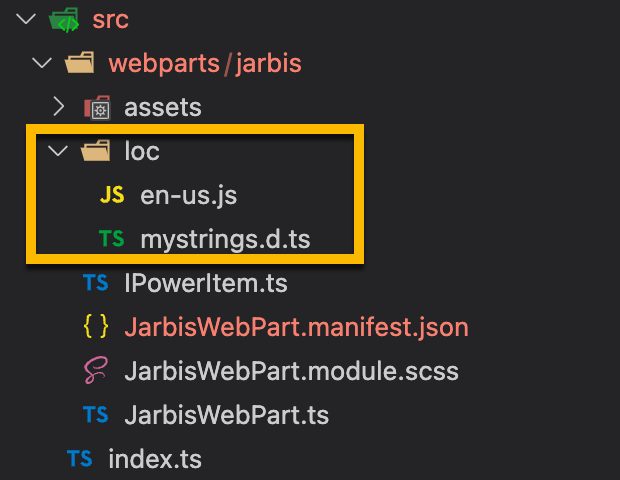
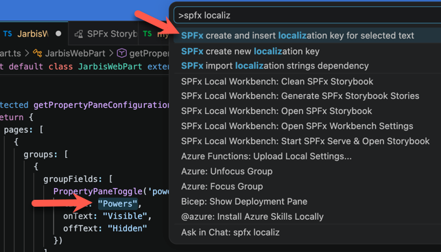
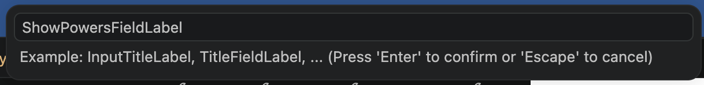
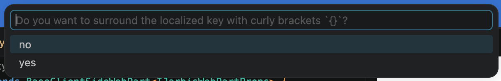
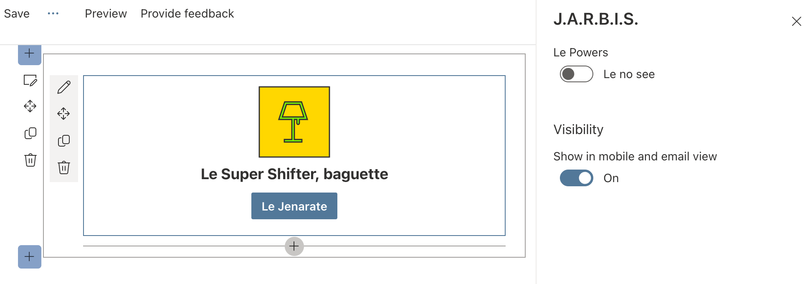
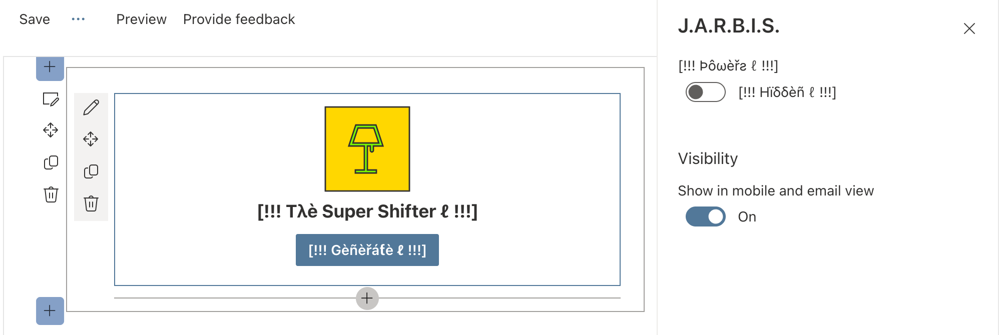

# Lab 12: Localization

You may have noticed that, throughout our code, we have some hard-coded text values; while it may be acceptable to hard-code text literals in your code when building a test application, we strongly recommend avoiding doing so for production solutions -- even if you're not planning to support multiple languages.

Imagine this scenario: you have been working on a web part solution for weeks (or maybe months); it has been reviewed by stakeholders, tested, and thoroughly reviewed by everyone. The day before deploying your web part, some _genius_ finds a typo in the company name -- something that can't be ignored -- and the name is used throughout the application.

"Easy", you may think, "I'll just search and replace the company name throughout". But changing _any_ code in an application invalidates any testing that was done, and introduces chances for new bugs -- the last thing to do when you want something to be stable is to change it (that's why Hugo always annoyingly says "Don't shake the jell-o!").

But what if you could separate string literals (i.e. the hard-coded text you show on the screen) from the rest of the code? Fixing a typo (or any such changes) would be limited to a single location -- it would still require testing, but it would significantly reduce the potential for introducing bugs.

And when another _genius_ stakeholder announces "Good news, we're expanding to the [insert foreign language here] market!", the effort required to support another language is nominal (mostly).

Let's go add support for [insert foreign language here]!

<details>
<summary><b>Legend</b></summary>

|Icon|Meaning|
|---|---|
|:rocket:|Exercise|
|:apple:|Mac specific instructions|
|:shield:|Admin mode required|
|:bulb:|Hot tip!|
|:hedgehog:|Code catch-up|
|:warning:|Caution!|
|:books:|Resources|

</details>

<details>
<summary><b>Exercises</b></summary>

  1. [Understanding localization in SPFx](#rocket-exercise-1-understanding-localization-in-spfx)
  1. [Localizing our strings](#rocket-exercise-2-localizing-our-strings)
  1. [Use the SPFx Localization extension](#rocket-exercise-3-use-the-spfx-localization-extension)
  1. [Localizing entire sentences](#rocket-exercise-4-localizing-entire-sentences)
  1. [Testing localizations](#rocket-exercise-5-testing-localizations)
  1. [Utilizing psuedolocales](#rocket-exercise-6-utilizing-pseudolocales)
</details>

<details>
<summary><b>Starter Code</b></summary>

If you skipped the previous step, or just want to start here, you can find the code ready to go in the [Lab 12 Starter](https://github.com/SPFxHeroes/JARBIS/tree/Start-of-Lab-12) branch.

</details>

## :rocket: Exercise 1: Understanding localization in SPFx

Each component you add to an SPFx solution will also have a **loc** folder added. Inside that folder is a **mystrings.d.ts** file and a default localized strings file for US English called **en-us.js**.

   

   > :bulb: You may have noticed that here we use `.js` and `.d.ts` files, unlike the rest of the web part code, which seems to favor `.ts` code. `
   >
   > `.d.ts` files are _declaration_ files; they help create libraries with no types to be used by TypeScript and JavaScript code.
   >
   > At runtime, the SharePoint framework will detect the user's preferred browser locale and try to find and load a matching `.js` file. Since browsers don't understand `.ts` files (at least, not yet), we need the localization files like **en-us.js** to be in JavaScript, but we also need our TypeScript code to understand it as we're writing our code -- hence the use of a  **mystrings.d.ts** declaration file

Generally, you'll have one set of localized strings per component, though it is possible to break these up into multiple files each with their own set of localized values by configuring them in your **config** > **config.json** file under `localizedResources`. This is an advanced scenario and unlikely to come up much if at all.

At the risk of oversimplifying, here's how it works:

- Every string you show to the end user should have an entry in ALL files in the **loc** folder
- You add the name of the string to the interface in **mystrings.d.ts** and this makes your web part code aware of it so you can easily use it
- You add the English value of the string using the name used above as the key in **en-us.js**
- Add any additional locales you want to support by naming them **[locale].js** and ensuring they have all the same values
- SharePoint will automatically load the correct locale.js file along with your web part's bundle and will use the correct values for your text

#### :books: Resources
- [Localize web parts](https://learn.microsoft.com/en-us/sharepoint/dev/spfx/web-parts/guidance/localize-web-parts)


## :rocket: Exercise 2: Localizing our strings

Fortunately, we don't have many strings so going back and localizing our web part won't be too hard. However, this is the kind of thing that can get tough if you wait on it.

We recommend using string literals during the early stages of development where you're just trying to get some of the design nailed down. But you should be regularly testing with pseudolocales (more on that soon) and building in the wiring for localization (even if the localized values will come much later and be provided by someone else) as you progress.

1. Open **mystrings.d.ts** in the **loc** folder within your web part's directory

1. This is just an interface that describes what strings are available. The second part is the export code and we wont need to touch it.

1. We're no longer using any of these (they came from the sample code SPFx generated), so let's remove those and add a value for our generate button's label. Make your **mystrings.d.ts** file look like this:
   ```TypeScript
   declare interface IJarbisWebPartStrings {
     /**
      * The label for the generate button
      */
     GenerateButtonLabel: string;
   }
    
   declare module 'JarbisWebPartStrings' {
     const strings: IJarbisWebPartStrings;
     export = strings;
   }

   ```

1. Now let's open **en-us.js**. You'll see those same keys from before with English values for them. We can remove all of these and instead add a value using the same key we used above. Your **en-us.js** file should look like this"
   ```JavaScript
   define([], function() {
     return {
       GenerateButtonLabel: "Generate",
     }
   });

   ```

1. We've got the initial plumbing for this value in place, now let's go utilize it in our code! Back in **JarbisWebPart.ts** we prevously commented out our strings import. Let's uncomment that now so that it looks like this:
   ```TypeScript
   import * as strings from 'JarbisWebPartStrings';
   ```

1. Head down to the **render** method and update the line:
   ```TypeScript
   const generateButton = `<button class=${styles.generateButton}>Generate</button>`;
   ```

   To this:
   ```TypeScript
   const generateButton = `<button class=${styles.generateButton}>${strings.GenerateButtonLabel}</button>`;
   ```

   > :bulb: Did you notice the extra benefit of using strongly-typed string literals (because of the declaration file)? You don't have to worry about bugs due to typos in your code, because as soon as you start typing `${strings.` in VSCode, it will automatically suggest `GenerateButtonLabel` as the only possible choice.

1. This isn't our only string literal we need to take care of. Head down to the **getPropertyPaneConfiguration** method and you'll see that we're currently using 3 literal values for our show powers toggle (`label`, `onText`, and `offText`). You can repeat the steps above for each of these if you'd like or you can continue on and use one of the VSCode extensions we recommended in lab 1 to make this far less tedious!

#### :books: Resources
- [Localize web part contents](https://learn.microsoft.com/en-us/sharepoint/dev/spfx/web-parts/guidance/localize-web-parts#localize-web-part-contents)

## :rocket: Exercise 3: Use the SPFx Localization extension

If you installed the VSCode extensions we recommended at the start of this course, you already have an extension ([SPFx Localization](https://marketplace.visualstudio.com/items?itemName=eliostruyf.vscode-spfx-localization), by Elio Struyf) that automatically creates the localization key and inserts it into your code for you.
   > :bulb: It's not too late! If you didn't install it then, why not install it now?

1. In the **getPropertyPaneConfiguration** method at the bottom of the **JarbisWebPart.ts** file, select the word `"Powers"` (quotes included) then use the VSCode command palette (<kbd>F1</kbd> or <kbd>CTRL</kbd>+<kbd>SHIFT</kbd>+<kbd>P</kbd>), and type **SPFx create and insert localization key for selected text**:
   
   
   When prompted to **Specify the key to create**, type `ShowPowersFieldLabel`
   
   
   
   When prompted to **surround the localized key with curly brackets**, select **no**
   
     

1. Repeat the previous steps to replace the word `"Visible"` using the key `ShowPowersToggleOnText` and the word `"Hidden"` using the key `ShowPowersToggleOffText`. The final `getPropertyPaneConfiguration` method should look like this:

   ```TypeScript
   protected getPropertyPaneConfiguration(): IPropertyPaneConfiguration {
    return {
      pages: [
        {
          groups: [
            {
              groupFields: [
                PropertyPaneToggle('powersVisible', {
                  label: strings.ShowPowersFieldLabel,
                  onText: strings.ShowPowersToggleOnText,
                  offText: strings.ShowPowersToggleOffText
                })
              ]
            }
          ]
        }
      ]
    };
   }
   ```

1. If you check **en-us.js** you'll see our key's and the values we were previously using have been added for us!
   > :bulb: If the formatting looks off, right-click in the editor and choose **Format Document**

  The content of **en-us.js** should look like this:

  ```TypeScript
  define([], function () {
    return {
      GenerateButtonLabel: "Generate",
      ShowPowersFieldLabel: "Powers",
      ShowPowersToggleOffText: "Hidden",
      ShowPowersToggleOnText: "Visible",
    }
  });
  ```

1. Similarly, when you open **mystrings.d.ts** you'll see the keys added as expected.

    The content of **mystrings.d.ts** should look like this (add the JSDoc comments manually):

    ```typescript
    declare interface IJarbisWebPartStrings {

      /**
       * The label for the generate button
       */
      GenerateButtonLabel: string;
    
      /**
       * The label for the "Show Powers" property field in the web part properties
       */
      ShowPowersFieldLabel: string;
    
      /*
       * The label for the "Show Powers" toggle when it is off
       */
      ShowPowersToggleOffText: string;
    
      /*
       * The label for the "Show Powers" toggle when it is on
       */
      ShowPowersToggleOnText: string;
    }
    
    declare module 'JarbisWebPartStrings' {
      const strings: IJarbisWebPartStrings;
      export = strings;
    }
    ```

#### :books: Resources
- [SPFx Localization VSCode extension](https://marketplace.visualstudio.com/items?itemName=eliostruyf.vscode-spfx-localization)

## :rocket: Exercise 4: Localizing entire sentences

Sometimes, you need to create localizable sentences -- not just words -- which may require the order of the words to be different in different languages.

For example, if you wanted your web part to say "Today is **month name** **day of the month**" (and you didn't want to use date formatting functions), you might be tempted to write the following interpolated string:

```typescript
`Today is ${monthName} ${monthDay}`
```

...but the same sentence in French would need to be:

```typescript
`Aujourd'hui, c'est le ${monthDay} de ${monthName}`
```

...which requires `monthDay` and `monthName` to appear in different order in the string literal.

To solve issues like these, our favorite way is to store a localized sentence with placeholders (like `{0}` and `{1}` or `{monthDay}` and `{monthName}`) and replace the placeholders at runtime.

In our code, we use `The ${escape(this.properties.name)}` to display the hero name, but some languages may require the word "The" to appear _after_ the hero name (or not at all).

Let's replace the hero description to use a localized sentence!

1. In **mystrings.d.ts**, add a new `HeroDescription` string property:

  ```TypeScript
  /**
   * The description for the hero (e.g. The Mighty Coder)
   */
  HeroDescription: string;
  ```

1. In **en-us.js**, add a `HeroDescription` literal value:

  ```javascript
  HeroDescription: "The {0}",
  ```

1. In the `render` method in the **JarbisWebPart.ts** file, find `The ${escape(this.properties.name)}` and replace it with:

   ```TypeScript
   ${strings.HeroDescription.replace("{0}", escape(this.properties.name))}
   ```

   Which, at runtime will load the localized string literal and replace the `{0}` placeholder with the `name` property.

   > :bulb: In the real world, we would most likely retrieve localized data from the list rather than just retrieving English values... but we're not going to go into that in the scope of this workshop.

> :bulb: You might have noticed that each time you save one of these files, things rebuild. This can be annoying when making several small udates to multiple files. Fortunately, you can use VSCode's Save All feature (in the File menu or by pressing <kbd>CTRL</kbd>+<kbd>K</kbd> then pressing <kbd>S</kbd> (<kbd>CMD</kbd>+<kbd>Alt</kbd>+<kbd>S</kbd> on a :apple: mac) - you can also customize that shortcut to something less annoying)

#### :books: Resources
- [Vent your frustration](http://www.omglasergunspewpewpew.com/)

## :rocket: Exercise 5: Testing localizations

We've only got the one localization, but we can tell things are working because they look exactly the same meaning the English values are getting mapped correctly. But it sure would be easier to understand things if we had another localization and a way to test it.

1. Just to anger Hugo, we're going to create a French localization using my cartoon level of understanding of the French language!
   

1. Add a new file to the **loc** folder called **fr-fr.js**. Here's the contents we'll use:
   ```TypeScript
   define([], function () {
     return {
       GenerateButtonLabel: "Le Jenarate",
       ShowPowersFieldLabel: "Le Powers",
       ShowPowersToggleOffText: "Le no see",
       ShowPowersToggleOnText: "Le see",
       HeroDescription: "Le {0}, baguette",
     }
   });
   ```
   > :warning: If you find this offensive, then David wrote this

1. To test a locale, we can add a `--locale` parameter to our gulp serve. Re-serve your project using this command:
   ```bash
   gulp serve --nobrowser --locale=fr-fr
   ```

   

   Wow, that's definitely French!

#### :books: Resources
- [Locales](https://saimana.com/list-of-country-locale-code/)
- [Learn French](https://www.duolingo.com/course/fr/en/Learn-French)


## :rocket: Exercise 6: Utilizing pseudolocales

Using localization when building web parts offers clear benefits but is also something that developers overlook easily. Often, translations to other locales are provided later in the project and it's difficult for testers to verify that all code properly supports the different locales.

The same words in different locales have different lengths. For example, the same sentence translated from English to German or Dutch can become 35% longer. Without all translations available upfront, it's difficult for developers and designers to ensure that the user interface can properly accommodate longer strings.

Some languages use special characters beyond the standard ASCII character set. If designers use a non-standard font, its possible that the font doesn't properly support some special characters.

Finding out about all these issues late in the project will likely lead to delays and costly fixes. This will make you cry.

To avoid running into such issues, we recommend using a _pseudo-locale_. Pseudo-locales are locales designed to test software for proper support of the different aspects of the localization process, such as support for special characters, right-to-left languages, or accommodating longer strings in the user interface.

To add a localized resources, add a `.js` file with the locale code in the **src/webparts/jarbis/loc**. For example, to add French support, you'd add a file called **fr-fr.js**, to add support for Dutch, you'd add a file called **nl-nl.js**, for Spanish (Mexico), **es-mx.js**, and so on.

In this lab, we'll add a pseudo-locale, but you can use [any other locale](https://saimana.com/list-of-country-locale-code/) you want.

> To generate your pseudo-locale resources, use [this site](http://www.pseudolocalize.com/).

1. In the **src/webparts/jarbis/loc**, add a file called **qps-ploc.js**

  > :bulb: The `qps-ploc` name isn't something we made up. It's a standard pseudo-locale name used in Windows and is often used for exactly what we're testing (spacing). What the heck is that name though? Well, `qps` was chosen because it isn't reserved for any existing locales. It doesn't stand for anything. The `ploc` part, however, is likely shorthand for "psuedo localization".
  >
  > There are even other standard pseduo-locales like `qps-ploca` used for East Asian character testing and `qps-plocm` used for testing mirrored (right-to-left) locales. Wowee!

1. Paste the following code in the new file you created:

    ```javascript
    define([], function () {
      return {
        GenerateButtonLabel: "[!!! Gèñèřáƭè ℓ !!!]",
        HeroDescription: "[!!! Tλè {0} ℓ !!!]",
        ShowPowersFieldLabel: "[!!! Þôωèřƨ ℓ !!!]",
        ShowPowersToggleOffText: "[!!! Hïδδèñ ℓ !!!]",
        ShowPowersToggleOnText: "[!!! Vïƨïβℓè ℓ !!!]",
      }
    });
    ```

1. Re-serve your solution using this command:

   ```bash
   gulp serve --nobrowser --locale=qps-ploc
   ```

  

   > :warning: Don't forget to remove the `--locale` parameter next time you're using `gulp serve`

Make it a habit to routinely review your string literals to ensure they're represented in your localization files. You should also routinely test with an oversized locale like `qps-ploc` when implementing new UI changes. CSS is hard enough as it is without having to try and adjust a specific style after the fact.

Also, keep in mind that while we've been forcing the locale during testing using the `--locale` parameter, the actual resource string swapping and localization detection is handled for you by the SharePoint Framework.

#### :books: Resources
- [Pseudolocalize.com](http://www.pseudolocalize.com/)
- [Pseudo Locales in SPFx](https://learn.microsoft.com/en-us/sharepoint/dev/spfx/web-parts/guidance/localize-web-parts#improve-globalizing-and-localizing-web-parts-by-using-pseudo-locales)


## :tada: All Done!


Our web part is basically complete. In our next lab we're going to get it deployed!

# [Previous](../Lab11/README.md) | [Next](../Lab13/README.md)