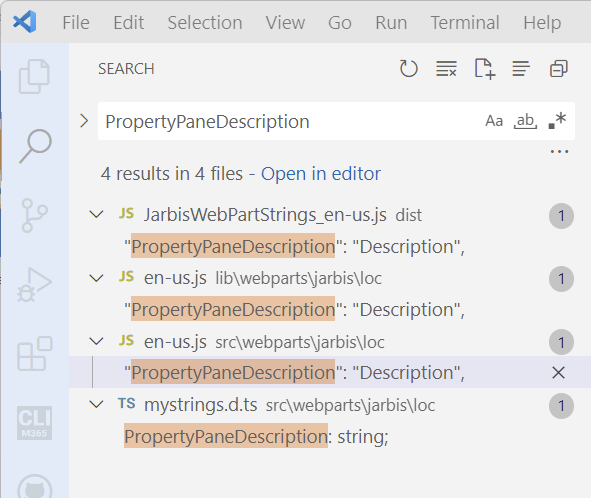
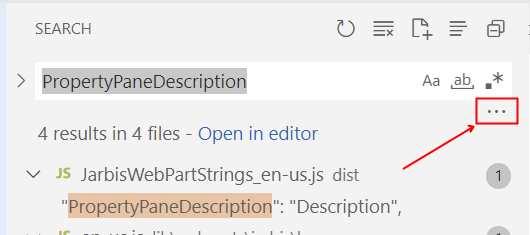

# Lab 12: Localization

You may have noticed that, throughout our code, we have some hard-coded text values; while it may be acceptable to hard-code text literals in your code when building a test application, we strongly recommend avoiding doing so for production solutions -- even if you're not planning to support multiple languages.

Imagine this scenario: you have been working on a web part solution for weeks (months); it has been reviewed by stakeholders, tested, and thoroughly reviewed by everyone. The day before deploying your web part, some _genius_ finds a typo in the company name -- something that can't be ignored -- and the name is used throughout the application.

"Easy", you may think, "I'll just search and replace the company name throughout". But changing _any_ code in an application invalidates any testing that was done, and introduces chances for new bugs -- the last thing to do when you want something to be stable is to change it (that's why Hugo always annoyingly says "Don't shake the jell-o!").

But what if you could separate string literals (i.e. the hard-coded text you show on the screen) from the rest of the code? Fixing a typo (or any such changes) would be limited to a single location -- it would still require testing, but it would significantly reduce the potential for introducing bugs.

And when another _genius_ stakeholder announces "Good news, we're expanding to the [insert foreign language here] market!", the effort required to support another language is nominal (mostly).

Let's go add support for [insert foreign language here]!

## Exercise 1

Let's start by cleaning up all the location code that was generated when we scaffolded the web part.

1. In VSCode, look for the **loc** folder under the **webparts\jarbis** folder.
1. Open the **en-us.js** file
1. Notice all the string literals (e.g. "Group Name", "Description Field", etc.)
1. Select `PropertyPaneDescription` and hit <kbd>CTRL</kbd>+<kbd>SHIFT</kbd>+<kbd>F</kbd> to find the selected keyword in all files.
1. You should find a few instances of it across multiple files

   

1. The search results seem to be including items from the **dist** and **lib** folders, which are interim folders used for building and packaging the web part. Let's exclude results from such folders by selecting the **...** just below the search box.

     
1. Under **files to exclude**, type `dist/**, lib/**`; the search results should immediately exclude anything (`**`) below the **dist** and **lib** folders. There should only be 2 matching results.

   > **Pro tip:**
   > 
   > My default **files to exclude** filter when working with SPFx solutions is `dist/**, lib/**, release/**, temp/**, node_modules/**`

   
1. Based on the search results, the `PropertyPaneDescription` literal isn't in use. Remove it from  the **en-us.js** by removing the line that says `"PropertyPaneDescription": "Description",`
1. In **mystrings.d.ts**, remove the line that declares `PropertyPaneDescription: string;` from the `IJarbisWebPartStrings` interface.
   > You may have noticed that here we use `.js` and `.d.ts` files, unlike the rest of the web part code, which seems to favor `.ts` code. `
   >
   > `.d.ts` files are _declaration_ files; they help create libraries with no types to be used by TypeScript and JavaScript code.
   >
   > At runtime, the SharePoint framework will detect the user's preferred browser locale and try to find and load a matching `.js` file. Since browsers don't understand `.ts` files (at least, not yet), we need the localization files like **en-us.js** to be in JavaScript, but we also need our TypeScript code to understand it as we're writing our code -- hence the use of a  **mystrings.d.ts** declaration file

1. Repeat the previous steps with `BasicGroupName`, `DescriptionFieldLabel`, `AppLocalEnvironmentSharePoint`, `AppLocalEnvironmentTeams`, `AppSharePointEnvironment`, and `AppTeamsTabEnvironment`, until the ``IJarbisWebPartStrings` and **en-us.js** no longer have unused literals.
1. In **mystrings.d.ts**, add a new string property called `GenerateButtonLabel` to the `IJarbisWebPartStrings` interface. The full content of the **mystrings.d.ts** should look as follows:

   ```typescript
   declare interface IJarbisWebPartStrings {
        /**
        * The label for the generate button
        */
        GenerateButtonLabel: string;
    }
    
    declare module 'JarbisWebPartStrings' {
      const strings: IJarbisWebPartStrings;
      export = strings;
    }
    ```

1. In **en-us.js**, add a `GenerateButtonLabel` return value, and make it equal to the text `Generate`. The whole content of **en-us.js** should look like this:

   ```JavaScript
   define([], function() {
      return {
        GenerateButtonLabel: "Generate",
      }
    });
   ```

1. Back in **JarbisWebPart.ts**, find the word `Generate` in the `render` method and replace it for `${strings.GenerateButtonLabel}`

   > Did you notice the extra benefit of using strongly-typed string literals (because of the declaration file)? You don't have to worry about bugs due to typos in your code, because as soon as you start typing `${strings.` in VSCode, it will automatically suggest `GenerateButtonLabel` as the only possible choice.

## Exercise 2

1. Find the `Powers` literal in the `getPropertyPaneConfiguration` method and repeat the previous steps to create a new string resource called `ShowPowersFieldLabel`.

   > There is a faster way to do this!
   > 
   > If you installed the VSCode extensions we recommended at the start of this course, you already have an extension ([SPFx Localization](https://marketplace.visualstudio.com/items?itemName=eliostruyf.vscode-spfx-localization), by Elio Struyf) that automatically creates the localization key and insert it in your code for you.
   >
   > Select the word `"Powers"` (quotes included) then use the VSCode command palette (<kbd>F1</kbd> or <kbd>CTRL</kbd>+<kbd>SHIFT</kbd>+<kbd>P</kbd>), and type **SPFx create and insert localization key for selected text**.
   >
   > 
   >
   > When prompted the **Specify the key to create**, type `ShowPowersFieldLabel`
   >
   > 
   >
   > When prompted to **surround the localized key with curly brackets**, select **no**
   >
   >   

1. Repeat the previous steps to replace the word `"Visible"` for `ShowPowersToggleOnText` and the word `"Hidden"` for `ShowPowersToggleOffText`. The final `getPropertyPaneConfiguration` method should look like this:

   ```typescript
      protected getPropertyPaneConfiguration(): IPropertyPaneConfiguration {
        return {
          pages: [
            {
              groups: [
                {
                  groupFields: [
                    PropertyPaneToggle('powersVisible', {
                      label: strings.ShowPowersFieldLabel,
                      onText: strings.ShowPowersToggleOnText,
                      offText: strings.ShowPowersToggleOffText
                    })
                  ]
                }
              ]
            }
          ]
        };
      }
   ```

    The content of **mystrings.d.ts** should look like this:

    ```typescript
    declare interface IJarbisWebPartStrings {

      /**
       * The label for the generate button
       */
      GenerateButtonLabel: string;
    
      /**
       * The label for the "Show Powers" property field in the web part properties
       */
      ShowPowersFieldLabel: string;
    
      /*
       * The label for the "Show Powers" toggle when it is off
       */
      ShowPowersToggleOffText: string;
    
      /*
       * The label for the "Show Powers" toggle when it is off
       */
      ShowPowersToggleOnText: string;
    }
    
    declare module 'JarbisWebPartStrings' {
      const strings: IJarbisWebPartStrings;
      export = strings;
    }
    ```

    And the content of **en-us.js** should look like this:

    ```typescript
    define([], function () {
      return {
        GenerateButtonLabel: "Generate",
        ShowPowersFieldLabel: "Powers",
        ShowPowersToggleOffText: "Hidden",
        ShowPowersToggleOnText: "Visible",
      }
    });
    ```

## Exercise 3

Sometimes, you need to create localizable sentences -- not just words -- which may require the order of the words to be different in different languages.

For example, if you wanted your web part to say "Today is **month name** **day of the month**" (and you didn't want to use date formatting functions), you might be tempted to write the following interpolated string:

```typescript
`Today is ${monthName} ${monthDay}`
```

...but the same sentence in French would need to be:

```typescript
`Aujourd'hui, c'est le ${monthDay} de ${monthName}`
```

...which requires `monthDay` and `monthName` to appear in different order in the string literal.

To solve issues like these, our favorite way is to store a localized sentence with placeholders (like `{0}` and `{1}` or `{monthDay}` and `{monthName}`) and replace the placeholders at runtime.

In our code, we use `The ${escape(this.properties.name)}` to display the hero name, but some languages may require the word "The" to appear _after_ the hero name (or not at all).

Let's replace the hero description to use a localized sentence!

1. In **mystrings.d.ts**, add a new `HeroDescription` string property:

   ```typescript
     /**
       * The description for the hero (e.g. The Mighty Coder)
       */
      HeroDescription: string;
   ```

1. In **en-us.js**, add a `HeroDescription` literal value:

   ```javascript
   HeroDescription: "The {0}",
   ```

1. In the `render` method, find `The ${escape(this.properties.name)}` and replace it with:

    ```typescript
    ${strings.HeroDescription.replace("{0}", escape(this.properties.name))}
    ```

    Which, at runtime will load the localized string literal and replace the `{0}` placeholder with the `name` property.

> **Note**
>
> In the real world, we would most likely retrieve localized data from the list rather than just retrieving English values... but we're not going to go into that in the scope of this workshop.

## Exercise 4

Using localization when building web parts offers clear benefits but is also something that developers overlook easily. Often, translations to other locales are provided later in the project and it's difficult for testers to verify that all code properly supports the different locales.

The same words in different locales have different lengths. For example, the same sentence translated from English to German or Dutch can become 35% longer. Without all translations available upfront, it's difficult for developers and designers to ensure that the user interface can properly accommodate longer strings.

Some languages use special characters beyond the standard ASCII character set. If designers use a non-standard font, its possible that the font doesn't properly support some special characters.

Finding out about all these issues late in the project will likely lead to delays and costly fixes. 

To avoid running into such issues, we recommend using a _pseudo-locale_. Pseudo-locales are locales designed to test software for proper support of the different aspects of the localization process, such as support for special characters, right-to-left languages, or accommodating longer strings in the user interface.

To add a localized resources, add a `.js` file with the locale code in the **src/webparts/jarbis/loc**. For example, to add French support, you'd add a file called **fr-fr.js**, to add support for Dutch, you'd add a file called **nl-nl.js**, for Spanish (Mexico), **es-mx.js**, and so on.

In this lab, we'll add a pseudo-locale, but you can use [any other locale](https://saimana.com/list-of-country-locale-code/) you want.

> To generate your pseudo-locale resources, use [this site](http://www.pseudolocalize.com/).

1. In the **src/webparts/jarbis/loc**, add a file called **qps-ploc.js**
1. Paste the following code in the new file you created:

   ```javascript
    define([], function () {
      return {
        GenerateButtonLabel: "[!!! Gèñèřáƭè ℓ !!!]",
        HeroDescription: "[!!! Tλè {0} ℓ !!!]",
        ShowPowersFieldLabel: "[!!! Þôωèřƨ ℓ !!!]",
        ShowPowersToggleOffText: "[!!! Hïδδèñ ℓ !!!]",
        ShowPowersToggleOnText: "[!!! Vïƨïβℓè ℓ !!!]",
      }
    });
   ```

1. For extra fun, add another file called **fr-fr.js** and paste the following code:

   ```javascript
   
   ```

1. To test the web part in a different locale, add `--locale=` followed by the locale code. For our test, you'll type the following command in your terminal:

   ```bash
   gulp serve --nobrowser --locale=qps-ploc
   ```

1. Try changing the `--locale` parameter to `fr-fr` and test the French version of the web part.

Don't forget to remove the `--locale` parameter next time you're using `gulp serve`
