# Lab 12: Publishing Your App

So far, we have been testing our web part using the workbench and bundling the solution in debug mode.

In this lab, we'll show you how to prepare your app for release to production, and how to deploy and upgrade your app.

<details>
<summary><b>Legend</b></summary>

|Icon|Meaning|
|---|---|
|:rocket:|Exercise|
|:apple:|Mac specific instructions|
|:shield:|Admin mode required|
|:bulb:|Hot tip!|
|:hedgehog:|Code catch-up|
|:warning:|Caution!|
|:books:|Resources|

</details>

<details>
<summary><b>Exercises</b></summary>

  1. [Testing outside the workbench](#rocket-exercise-1-testing-outside-the-workbench)
  1. [Updating solution metadata](#rocket-exercise-2-updating-solution-metadata)
  1. [Updating web part metadata](#rocket-exercise-3-updating-web-part-metadata)
  1. [Packaging and deploying](#rocket-exercise-4-packaging-and-deploying)
</details>

<details>
<summary><b>Starter Code</b></summary>

If you skipped the previous step, or just want to start here, you can find the code ready to go in the [Lab 12 Starter](https://github.com/nicknow/Wordle-Labs/tree/Start-of-Lab-12) branch.

</details>

## :rocket: Exercise 1: Testing outside the workbench

Before you package your app, you should probably test your web part outside of the workbench.

Thankfully, you can debug web parts in regular SharePoint pages by following these instructions:

1. Using the terminal in VSCode, run `gulp serve --nobrowser` as usual
1. Wait for the terminal to say **[spfx-serve] To load your scripts, use this query string:**, followed by a query string
1. Copy the query string provided 
   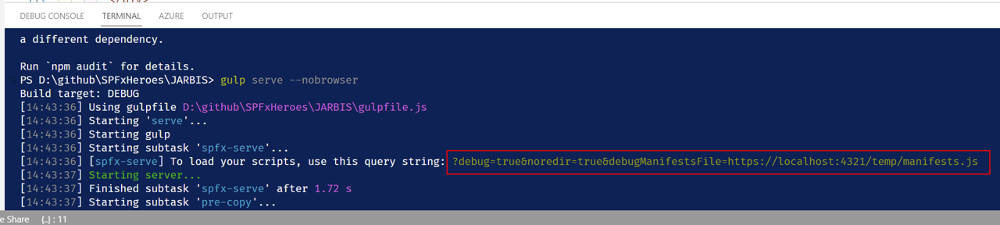
1. Using your dev tenant, go to a SharePoint page (in the same site as your workbench, so you don't have to deploy the WordleWords list)
1. While on the page, append the query string you copied in the earlier step and append it to the page URL.
1. When prompted to **Allow debug scripts?**, select **Load debug scripts**
1. You can now edit the page and insert the **Wordle** web part on the page.
1. When you're done testing the web part, you can stop `gulp serve`.


## :rocket: Exercise 2: Updating solution metadata

The solution's metadata controls how the app will appear in the App store. You can (and should!) change the solution's metadata by changing the **package-solution.json**.

1. Open the **package-solution.json** under the **config** folder.
1. In the `solution` node, change the `name` property to `Wordle`.

   > In your app name, don't use words matching features in Microsoft Teams or SharePoint, such as **Chat, Contacts, Calendar, Calls, Files, Meeting, Activity, Teams, Apps, Help, SharePoint, List, Page**, etc. as these names could be confused with the standard functionality in Teams and SharePoint.
   >
   > If your app is named after a common word, such as **Orders**, you should include your company name as well to clearly differentiate it from other apps, for example, **Contoso Orders**.
   >
   > Wordle is a well-known game, so people will recognize it :-)

1. Below the `name` property, add a `title` property using the following JSON:

   ```json
   "title": "Wordle Game",
   ```

1. In the solution's **sharepoint** folder, add a folder called **images**
1. From VSCode, right-click on the new folder and select **Copy path**
1. Using your browser, right-click on the following image and select **Save image as...**; save the file as **wordle.png** in the path you just copied.

   

   > Your app icon can be any `.png` image, but it must be 96 pixels wide by 96 pixels high.

1. Back in the **package-solution.json** file, add the following line of JSON below the `title` line:

   ```json
   "iconPath": "images/wordle.png",
   ```

   > The `iconPath` should be relative path, starting from the **sharepoint** folder.

1. In the `metadata` node, change the `shortDescription`'s `default` to `Contains the Wordle web part and the WordleWords list`

   > The description should always clearly describe what different components (web parts, application customizers, etc.) are included in the package to manage user expectations and help them understand the impact of using your application.
   >
   > The `shortDescription` is what will be displayed on the **Add an app** page.

1. Change the `longDescription` to `A word guessing game for SharePoint.\n\nContains the following:\n- Wordle web part for playing the word game\n- The WordleWords list, which contains a list of five-letter words and their categories used for the game.`

   > The `longDescription` will be displayed on your app's **About** page. According to the documentation, you _should_ be able to use `HTML` in the `longDescription` (but we haven't had any luck doing so... yet).

1. Change the `version` property to `1.0.0.1`

   > You should increment the version number any time you bundle and package your app and make changes; this will signal any sites where your app has been deployed that an update is available

1. Add above `metadata` and after `developer` or if exists, change the `supportedLocales` property with the following values:

   ```json
   "supportedLocales": [
     "en-us",
     "fr-fr"
   ],
   ```

   > You may have noticed that we're not listing the pseudo-locale as a supported locale, even though we provided localized resources for it; that's because the pseudo-locale is not really a locale that we want to support -- it is used for testing only. We only want to support English (U.S.) and French (France).

1. Save the following image as **shot1.png** in the **sharepoint\images** folder.

   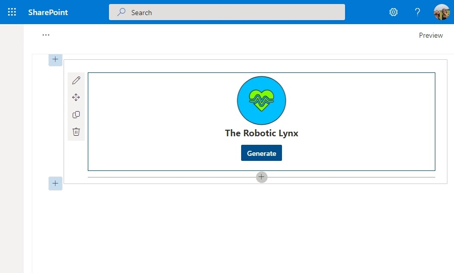

1. Save the following image as **shot2.png** in the **sharepoint\images** folder.

   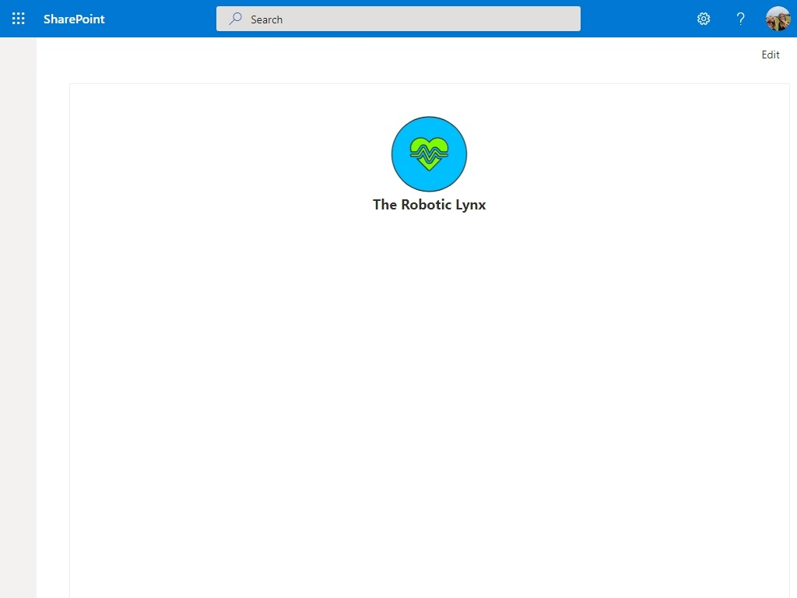

1. Save the following image as **shot3.png** in the **sharepoint\images** folder.

   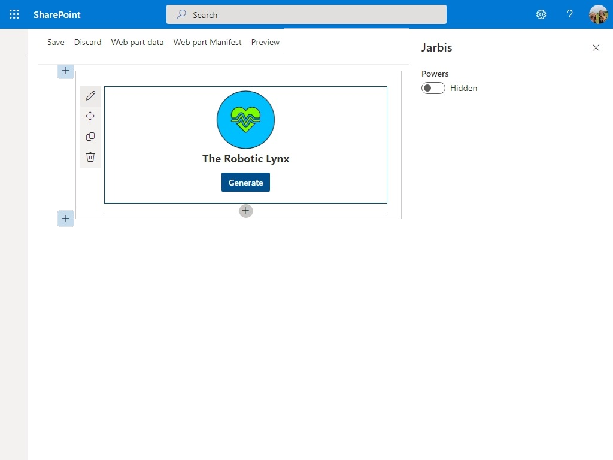

1. Save the following image as **shot4.png** in the **sharepoint\images** folder.

   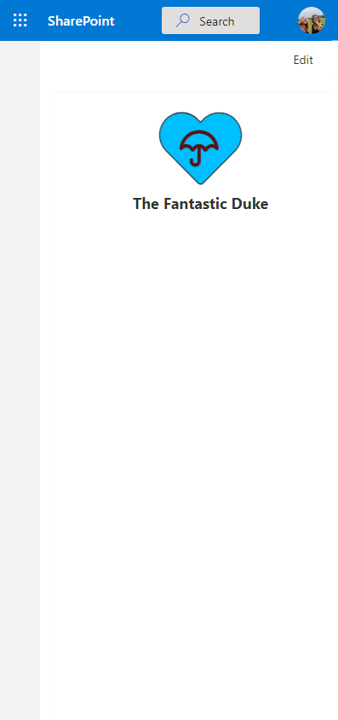

1. Update the `screenshotPaths` property with the following code:

   ```json
   "screenshotPaths": [
     "images/shot1.png",
     "images/shot2.png",
     "images/shot3.png",
     "images/shot4.png",
     "https://github.com/nicknow/Wordle-Labs/raw/main/assets/wordlepreview.gif"
   ],
   ```

   > You can have up to 5 screenshots, which can be stored as a relative path or as an absolute URL

1. Set the `videoUrl` as follows:

   ```json
   "videoUrl": "https://youtu.be/xfr64zoBTAQ",
   ```

1. Set the `categories` property as follows:

   ```json
   "categories": [
     "Productivity"
   ]
   ```

   > You can use up to 3 categories; the valid choices are:
   >
   > - Accounting + Finance
   > - Collaboration
   > - Content management
   > - CRM
   > - Data+Analytics
   > - File managers
   > - IT/admin
   > - Legal + HR
   > - News + Weather
   > - Productivity
   > - Project management
   > - Reference
   > - Sales + Marketing
   > - Site Design
   > - Social
   > - Workflow & Process Management

1. Finally, replace the `developer` section as follows:

   ```json
   "developer": {
     "name": "SPFx Wordle Workshop",
     "websiteUrl": "https://github.com/nicknow/Wordle-Labs",
     "privacyUrl": "https://github.com/nicknow/Wordle-Labs#privacy",
     "termsOfUseUrl": "https://github.com/nicknow/Wordle-Labs#terms-of-use",
     "mpnId": ""
   },
   ```

   > The `developer` section is how you can identify who wrote the app. It is used by the **SharePoint Store**, where you can publish and sell your web parts to other organizations.
   >
   > Even if you only plan to promote your web parts within your organization, we recommend that you always take the time to update the `developer` property.


## :rocket: Exercise 3: Updating web part metadata

A solution can contain more than 1 web part (you can add another web part by re-running the Yeoman generator from within an existing SPFx project). Because of this, SPFx keeps the metadata about the solution separately from the web part metadata.

In the previous exercise, we worked on the solution metadata; in this exercise, we'll update our web part's metadata.

1. In the **WordleWebPart.manifest.json**, change the `supportedHosts` property using the following code:

   ```json
   "supportedHosts": [
     "SharePointWebPart"
   ],
   ```

   > The `supportedHosts` property tells SharePoint and Teams where you can run your web part.
   >
   > The accepted choices can be any combination of the following hosts:
   >
   > - `SharePointFullPage`
   > - `SharePointWebPart`
   > - `TeamsTab`
   > - `TeamsPersonalApp`
   > - `TeamsMeetingApp`
   >
   > If you don't specify this property, SharePoint will assume that your web part is intended to run as a `SharePointFullPage` app.
   >
   > Due to time constraints, we'll only cover the `SharePointWebPart` host in the workshop.

1. The `preconfiguredEntries` section defines how the web part will appear in the **Add a web part** toolbox, and what default settings the web part should use when you add it to a page. Change the `groupId` to `cf066440-0614-43d6-98ae-0b31cf14c7c3`.

   > The `groupId` will specify which group to list your web part in the **Add a web part** toolbox. You can use any one of the following values:
   >
   > Value | Group
   > ---|---
   > cf066440-0614-43d6-98ae-0b31cf14c7c3 | Text, media, and content
   > 1edbd9a8-0bfb-4aa2-9afd-14b8c45dd489 | Documents, lists, and libraries
   > 75e22ed5-fa14-4829-850a-c890608aca2d | Feeds
   > 1bc7927e-4a5e-4520-b540-71305c79c20a | News, people and events
   > 4aca9e90-eff5-4fa1-bac7-728f5f157b66 | Data Analysis
   > cfc8bda5-cb9b-49e3-8526-2ee6e52b256a | Regional information
   > 5c03119e-3074-46fd-976b-c60198311f70 | Advanced
   >
   > The initial value is `5c03119e-3074-46fd-976b-c60198311f70`, but if you don't specify one (or you use an incorrect value), your web part will appear under **Other**

1. The `group` property is only used by Classic SharePoint pages. We can ignore it for this workshop.

1. Under the `group` property, add a new string array property called `tags` using the following code:

   ```json
   "tags": [
     "wordle",
     "game",
     "puzzle",
     "words",
     "guessing"
   ],
   ```

   > This field is used to tag a web part with keywords that are different from the web part group name. Tags can be used for categorization and searching of web parts. For example, in the web part toolbox.

1. Change the `default` value under `title` to `Wordle`

1. Add a new French title under the `default` value (but within the `title` property) and set the value to `Wordle`. Your final `title` property should look as follows:

   ```json
   "title": {
     "default": "Wordle",
     "fr-fr": "Wordle"
   },
   ```

1. Change the `default` property under the `description` property to `A word guessing game where you try to guess a five-letter word in six attempts`.

1. Add a French description, and set the value to `Un jeu de devinette de mots où vous essayez de deviner un mot de cinq lettres en six tentatives`. Your final `description` property should look as follows:

   ```json
   "description": {
     "default": "A word guessing game where you try to guess a five-letter word in six attempts",
     "fr-fr": "Un jeu de devinette de mots où vous essayez de deviner un mot de cinq lettres en six tentatives"
   },
   ```

1. By default, your web part only allows you to use Office Fabric icon names -- using the `officeFabricIconFontName`, but you can use custom SVG icons if you know this little trick: right-click the SVG image below and select **Save image as...**

   

   > You can use almost any square SVG that has `width` and `height` attributes

1. Using **File** > **Open File...** from within VSCode, open the `.svg` file you just saved.

1. Copy the entire content of the `.svg` file to your clipboard (<kbd>CTRL</kbd>+<kbd>A</kbd>, followed by <kbd>CTRL</kbd>+<kbd>C</kbd>)

1. Browse to <https://tahoeninja.blog/posts/fixing-base64-svg-icons-in-spfx/>

1. Skip all the boring blah blah blah and scroll to **Customize this article**.

1. On the **Original SVG** row, paste the SVG in the **Value** textbox

   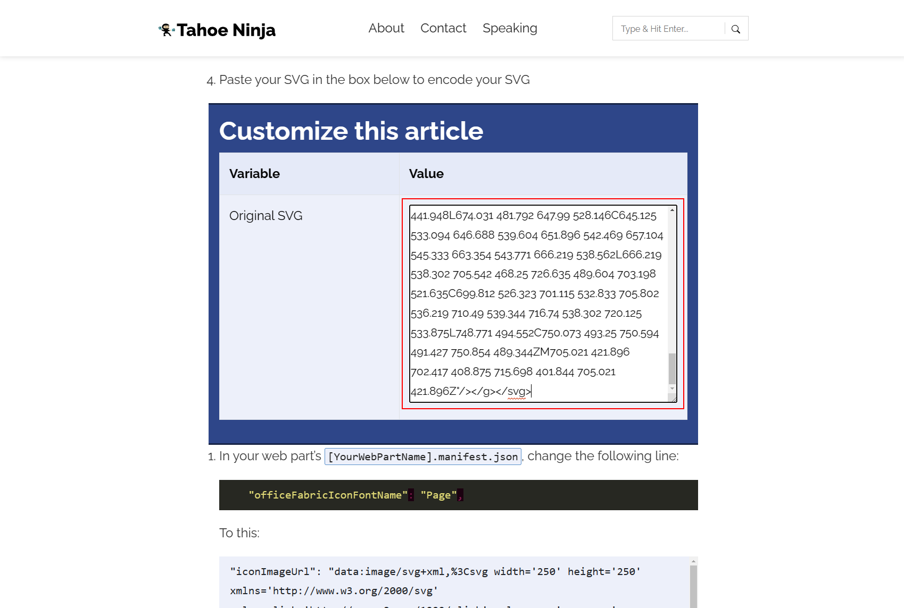  

1. Scroll a little further down and select **Copy to clipboard**

   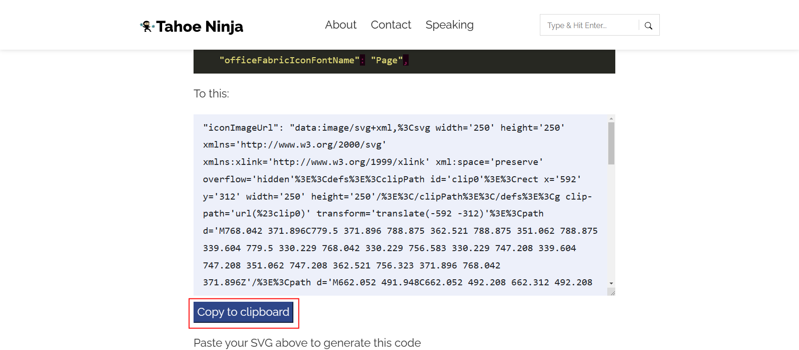

1. Back to **WordleWebPart.manifest.json**, replace the `officeFabricFontName` line by pasting the code you copied from that super-awesome-fantastic blog post.

   > This is not witchcraft: we simply _Base64_-encoded an SVG file and converted in to a _data URI_ value.
   > If you want to use any other types of images, you can also specify any other absolute image URL, as long as your image is 38px by 38px, but any size SVG will do -- provided they are square.
   >
   > Remember to _remove_ the `officeFabricFontName` property from your manifest, or SharePoint will simply ignore your fancy new SVG icon.


## :rocket: Exercise 4: Packaging and deploying

Let's finally package your app for production!!!

> Note: you should usually test your changes before pushing to production, but we're skipping those steps for brevity. Feel free to test with `gulp bundle` and `gulp package-solution` first, if you wish, then perform the steps below. 
>
> But, let's face it, you know your app is already _perfect_, don't you?!

1. If you're still running `gulp serve`, you can stop it now.

1. From the terminal, run the following command:

   ```bash
   gulp bundle --ship
   ```

1. Run the following command:

   ```bash
   gulp package-solution --ship
   ```

1. Find the **wordle.sppkg** file and drag and drop it to your tenant's app store.

1. If prompted to replace the existing file, select **Replace**

   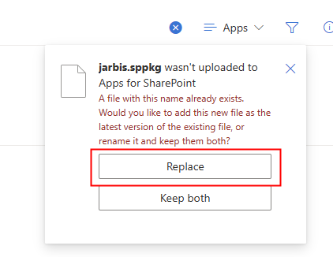

1. When prompted to **Enable App**, make sure that the text under **This app gets data from:** says **SharePoint**

   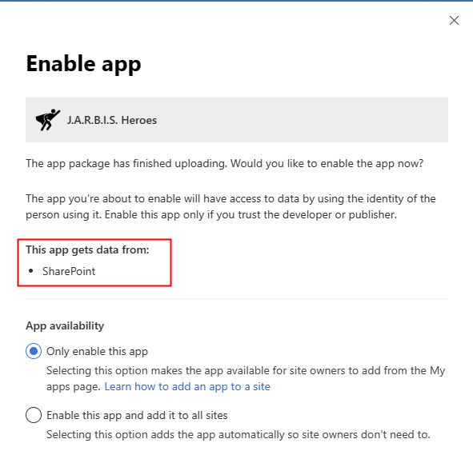

1. Under **App availability**, select **Only enable this app** and select **Enable app** at the bottom of the pane.

   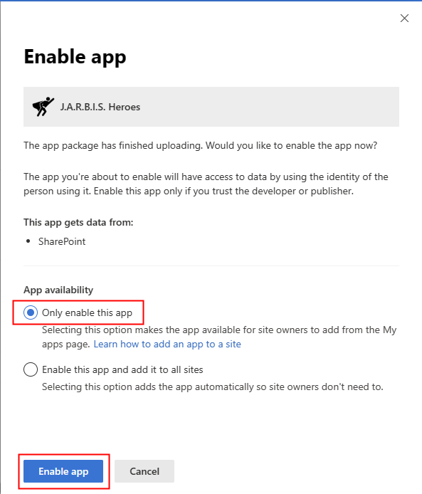

1. Your new web part is now published in production! Make sure that your new app has the correct **Icon**, **Title**, and that the state is **Enabled** and the **Available for** column shows a SharePoint logo.

   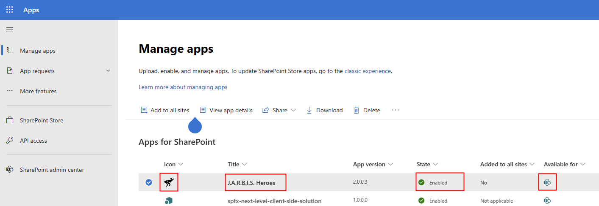

1. Go to a new SharePoint site (where you did not already deploy your web part in previous labs)

1. Navigate to a page and select **New** followed by **App**

   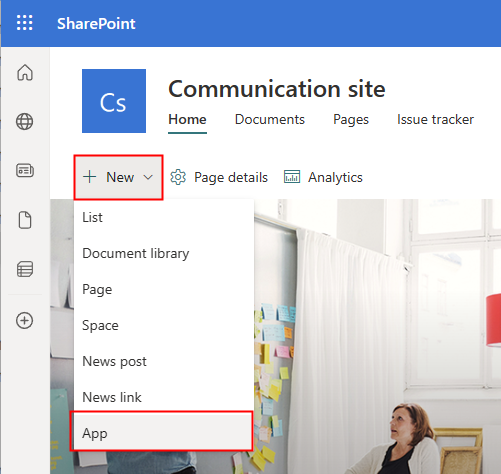

1. In the **Manage apps** page, under **Apps you can add**, select the **Add** button for the **Wordle Game**

   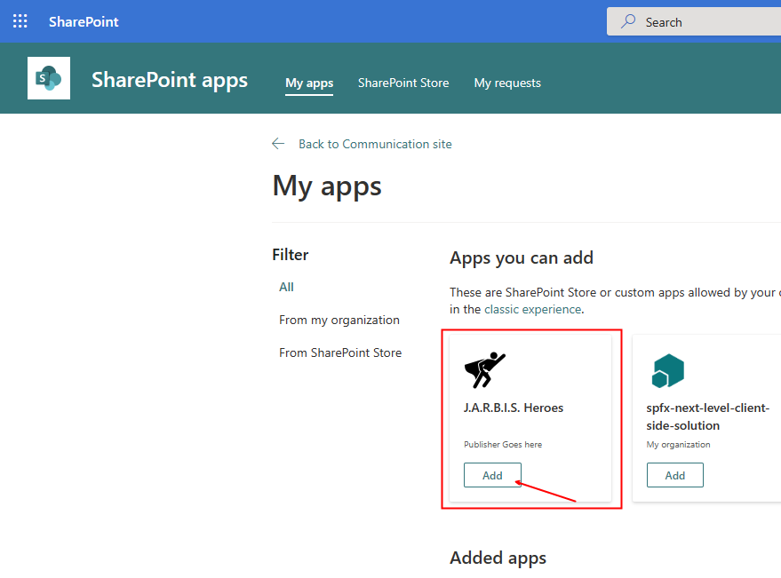

1. Go back to your new page, select **Edit** and add your **Wordle** web part to the page

   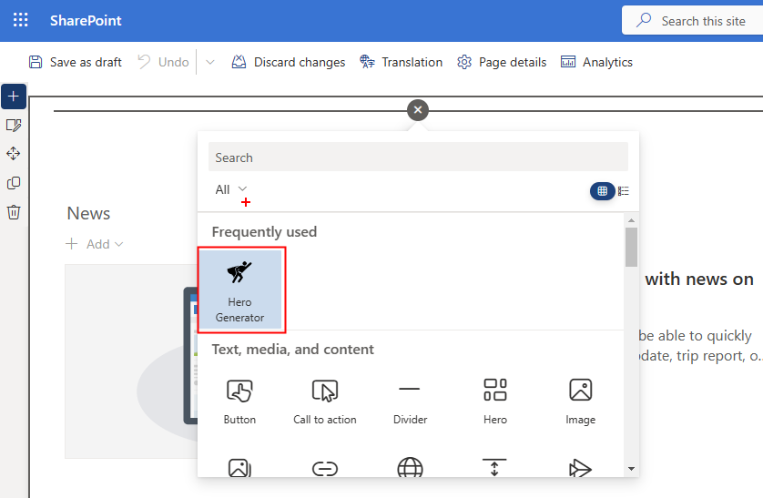


## :tada: All Done!


Congratulations! You have successfully completed this workshop. You've built a fully functional Wordle game as a SharePoint web part!

You learned how to:
- 🛠️ Scaffold and configure an SPFx project
- 🎨 Style your web part with SCSS
- 🎮 Handle user input and game logic
- 📦 Provision and retrieve data from SharePoint lists
- 🎲 Implement random word selection
- ⚙️ Make your web part configurable
- 🌍 Localize your web part for multiple languages
- 🚀 Package and deploy your app to production

Now go challenge your coworkers to a Wordle battle! 🎉

# [Previous](../Lab11/README.md)