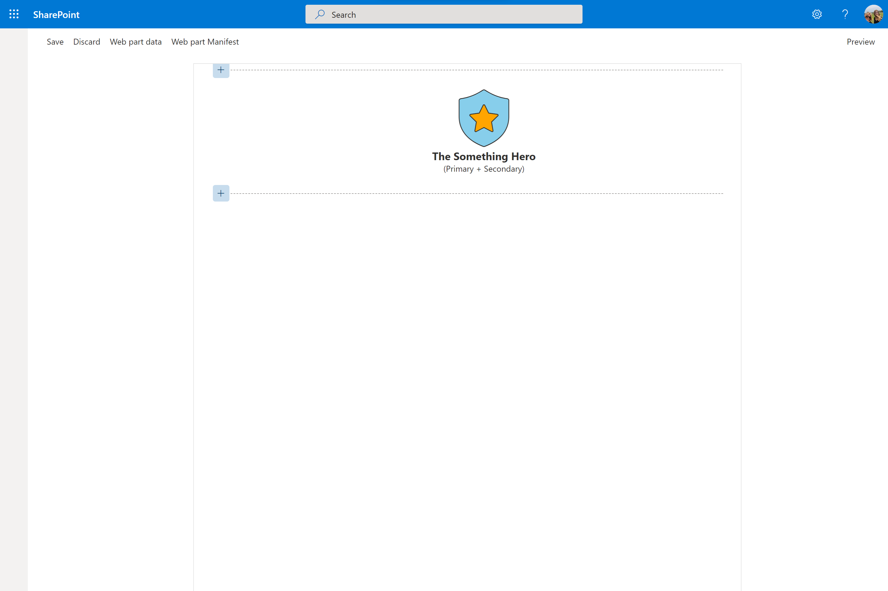

# Lab 4: Static Data (M365 Conference)

## Exercise 1

1. In the `JarbisWebPart.ts`, replace the word `Logo` inside `<div class="${styles.logo}">` with the following code:

    ```typescript
    <i class=""></i>
    <i class=""></i>
    ```

2. add the following `import` statements below `import * as strings from 'JarbisWebPartStrings';`, and above `export interface IJarbisWebPartProps`:

    ```typescript
    import { initializeIcons } from '@uifabric/icons';
    import { getIconClassName } from '@uifabric/styling';
    import { css } from '@uifabric/utilities';
    ```

3. Below the `import` statements you just inserted, add the following code: 

    ```typescript
    initializeIcons();
    ```

4. In the first element you just inserted, set the `class` attribute to `${getIconClassName('ShieldSolid')}`
5. In the second element, set the `class` attribute to `${getIconClassName('FavoriteStarFill')}`. Your `render` method should look as follows:
   
   ```typescript
   public render(): void {
    this.domElement.innerHTML = `
              <div class="${styles.jarbis}">
                <div class="${styles.logo}">
                  <i class="${getIconClassName('ShieldSolid')}"></i>
                  <i class="${getIconClassName('FavoriteStarFill')}"></i>
                </div>
                <div class="${styles.name}">
                  The Something Hero
                </div>
                <div class="${styles.powers}">
                  (Primary + Secondary)
                </div>
              </div>`;
      }
   ```

6. Refresh the browser

## Exercise 2

1. Working with the same elements as before, add a `style` element to the first one, and set the style to: `style="color:skyblue;"`
1. Set the style of the second element `style="color:orange;"`
1. Refresh the browser

## Exercise 3

1. Open the `JarvisWebPart.module.scss` and replace the styles for `.logo` class with:

    ```scss
    position: relative;
    
    .background {
      font-size: 96px;
      -webkit-text-stroke: $ms-color-neutralPrimary 1.4px;
    }
    
    .foreground {
      font-size: 48px;
      -webkit-text-stroke: $ms-color-neutralPrimary 1.4px;
      position: absolute;
      top: 24px;
      left: 24px;
    }
    ```

1. Back in the `JarbisWebPart.ts` file, working the same two `i` elements -- again
1. In the first element, set the `class` attribute to `${css(styles.background, getIconClassName('ShieldSolid'))}`
1. In the second element, set the `class` attribute to `${css(styles.foreground, getIconClassName('FavoriteStarFill'))}`
1. Refresh the browser

## Exercise 4

Let's make sure that your code is up to date with our lab!

Your `JarbisWebPart.ts` class should look like this (feel free to copy and paste over your existing code):

```typescript
import { Version } from '@microsoft/sp-core-library';
import {
  IPropertyPaneConfiguration,
  PropertyPaneTextField
} from '@microsoft/sp-property-pane';
import { BaseClientSideWebPart } from '@microsoft/sp-webpart-base';
import { escape } from '@microsoft/sp-lodash-subset';

import styles from './JarbisWebPart.module.scss';
import * as strings from 'JarbisWebPartStrings';
import { initializeIcons } from '@uifabric/icons';
import { getIconClassName } from '@uifabric/styling';
import { css } from '@uifabric/utilities';

initializeIcons();

export interface IJarbisWebPartProps {
  description: string;
}

export default class JarbisWebPart extends BaseClientSideWebPart<IJarbisWebPartProps> {

  public render(): void {
    this.domElement.innerHTML = `
      <div class="${styles.jarbis}">
        <div class="${styles.logo}">
          <i class="${css(styles.background, getIconClassName('ShieldSolid'))}" style="color:skyblue;"></i>
          <i class="${css(styles.foreground, getIconClassName('FavoriteStarFill'))}" style="color:orange;"></i>
        </div>
        <div class="${styles.name}">
          The Something Hero
        </div>
        <div class="${styles.powers}">
          (Primary + Secondary)
        </div>
      </div>`;
  }

  protected get dataVersion(): Version {
    return Version.parse('1.0');
  }

  protected getPropertyPaneConfiguration(): IPropertyPaneConfiguration {
    return {
      pages: [
        {
          header: {
            description: strings.PropertyPaneDescription
          },
          groups: [
            {
              groupName: strings.BasicGroupName,
              groupFields: [
                PropertyPaneTextField('description', {
                  label: strings.DescriptionFieldLabel
                })
              ]
            }
          ]
        }
      ]
    };
  }
}
```

And your `JarbisWebPart.module.scss` should match the following code:

```css
@import '~@microsoft/sp-office-ui-fabric-core/dist/sass/SPFabricCore.scss';

.jarbis {
  color: "[theme:bodyText, default: #323130]";
  color: var(--bodyText);
  display: flex;
  flex-direction: column;
  align-items: center;

  .logo {
    position: relative;
    
    .background {
      font-size: 96px;
      -webkit-text-stroke: $ms-color-neutralPrimary 1.4px;
    }
    
    .foreground {
      font-size: 48px;
      -webkit-text-stroke: $ms-color-neutralPrimary 1.4px;
      position: absolute;
      top: 24px;
      left: 24px;
    }
  }
  
  .name {
    font-weight: bold;
    font-size: 18px;
  }
  
  .powers {
    color: ms-color-neutralSecondary;
    font-size: 14px;
  }
}
```

Your web part should look as follows:

